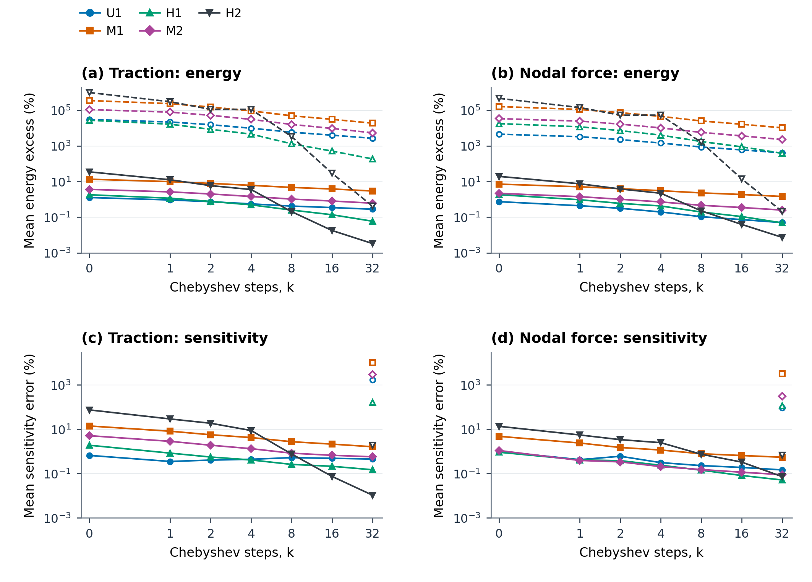
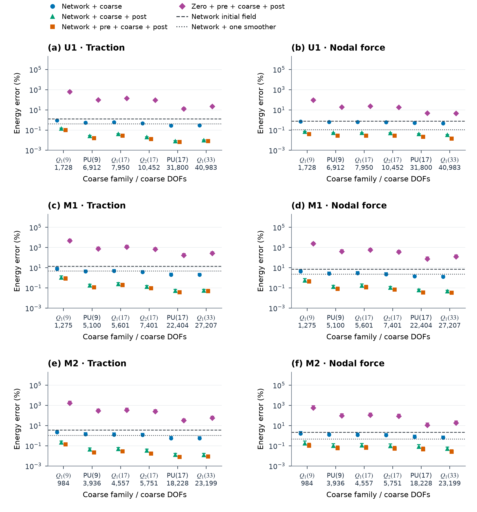
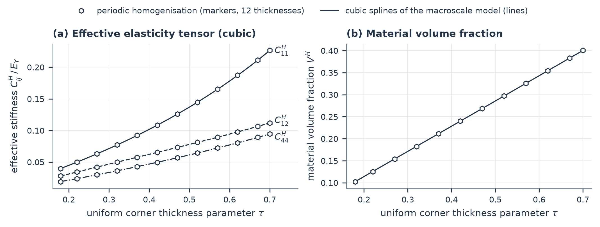

# Figures

Index of the figures in the manuscript and the supplementary material (generated by latex/gen_figures_md.py; captions as in the text). Each figure is available as PNG and PDF in `figures/`.

## Main text

### Figure 1

**Figure 1. Representative validation geometries.** The same unit-box scale and viewing direction are used for (a) uncut U1, (b) moderately cut M1, and (c,d) heavily cut H1 and H2. Blue denotes the material surface and orange the section on the cut plane. Percentages indicate the box volume remaining after the cut, relative to the unit box, before intersection with the thin-wall material. Surfaces are reconstructed from Eq. (1) (Supplementary Note S1).

[PNG](figures/F08_geometry.png) · [PDF](figures/F08_geometry.pdf)

### Figure 2

**Figure 2. Learned displacement extension, equilibrium correction and variational assembly.** (a) Rigid-body motion is separated from the retained displacement before the deformation is extended by the network. The rigid field is reconstructed and the prescribed retained values are restored; the correction \(\mathcal W\) then reduces interior imbalance at fixed retained displacement, and applying the local stiffness and the transpose \(F^T\) of the complete extension gives the work-conjugate retained force. (b) The cell operators are assembled on the shared box-face DOFs and the assembled system is solved; the assembled solution supplies the inputs for local field recovery, the compliance and the field-based thickness sensitivity. A design iteration updates the corner thickness parameters and so regenerates every cell's geometry; the network parameters stay the same and the coefficients of \(\mathcal W\) are recomputed. The neural extension is detailed in Figure 3 and Section 4.4; Sections 4.2 and 4.3 define the correction \(\mathcal W\).

[PNG](figures/F01_method_overview.png) · [PDF](figures/F01_method_overview.pdf)

### Figure 3

**Figure 3. Geometry-conditioned neural displacement architecture.** (a) Element and node encoders produce 64-channel geometry feature vectors, followed by two rounds of residual exchange; coefficient heads condition the local interactions, grid transfers and convolutions. (b) The displacement branch propagates the nonrigid retained input through four local interaction pairs, the multilevel block, four further local pairs and four pairs on weakly supported stencils; linear maps connect the three displacement components to 32 latent channels, and deterministic bypasses reconstruct rigid-body motion and restore the retained values. (c) Restriction and prolongation connect grids with 65, 33, 17 and 9 background positions per axis; each coarse level has two residual convolutions on each pass. (d) A local interaction uses geometry-weighted gathering, four channel-mixing heads and scattering, followed by residual addition and retained-value restoration. E and G denote element and ghost-face interactions. Blue dashed arrows carry geometry-dependent coefficients; solid arrows carry features or displacement states. For fixed geometry, the complete displacement path is linear.

[PNG](figures/F11_network_architecture.png) · [PDF](figures/F11_network_architecture.pdf)

### Figure 4

**Figure 4. Supports and loading of the two-cell examples.** (a) Configuration x: the neighbour is translated by \((-1,0,0)\), the face \(x=-1\) is clamped, and face tractions act at \(y=0\). (b) Configuration y: the translation is \((0,-1,0)\), the face \(y=-1\) is clamped, and tractions act at \(x=0\). Each target (T) and neighbour (N) face carries separate x-, y- and z-directed consistent-traction loads. Coincident box-node DOFs are shared across the interface; non-box cut-band DOFs remain local. Cut targets also receive three cut-surface tractions, analysed separately.

[PNG](figures/F09_assembly_loads.png) · [PDF](figures/F09_assembly_loads.pdf)

### Figure 5

**Figure 5. Directional energy error of the learned substructures on the 80 validation geometries.** Each observation is a geometry's mean directional energy error \(q^T(\widehat S-S)q/(q^TSq)\) over the validation directions of a loading class. (a) Consistent tractions, 20 geometries per cut stratum: markers give the mean over geometries and bars the range from the 10th percentile to the maximum. (b) Geometry means of the base network and of NICE under consistent tractions, open markers for uncut and filled markers for cut geometries; the dotted line denotes equality. (c) Neighbour-induced retained displacements, stiffness-scaled spring supports, single-face consistent tractions and equal nodal forces (75 geometries for the first two classes, 80 for the others); the asterisk marks the nodal-force stress test. Twenty geometries (6 uncut, 14 cut) were used for model selection. Variants as in Table 2 and the note below it; 'Base network, corrected' is the base network with the correction applied at deployment.

[PNG](figures/F02_validation.png) · [PDF](figures/F02_validation.pdf)

### Figure 6

**Figure 6. Spectral distribution of the base network's extension error.** Panels show U1, M1, M2 and H2 for the base network. Modes solve \(Av=\lambda Dv\), with \(D=\operatorname{diag}(A)\), ordered by increasing eigenvalue. Filled orange markers represent the extension error and open grey markers the exact interior field; solid circles correspond to consistent tractions and dashed triangles to nodal forces. Curves are directional means; bands give the 10th–90th directional percentiles under consistent tractions. Each cumulative fraction uses the total interior energy of its own field or error.

[PNG](figures/F03_spectrum.png) · [PDF](figures/F03_spectrum.pdf)

### Figure 7

**Figure 7. Retained DOFs and spatial distribution of the extension error in M1.** (a) Retained box-face DOFs, retained cut-band DOFs and interior DOFs. (b) Bulk element energies of the exact field under one consistent-traction direction, relative to its total. (c,d) Bulk element energies of the error of the base network and of NICE for the same retained displacement, relative to the total energy of the exact field in (b), on a common colour scale. Cut-band elements carry no error because their DOFs are retained.

[PNG](figures/F12_field_error_M1.png) · [PDF](figures/F12_field_error_M1.pdf)

### Figure 8

**Figure 8. Accuracy gained by correcting the base network at fixed network parameters.** (a,b) Mean directional energy error and field-based sensitivity error during Chebyshev smoothing on five cells. (c) M1 with no correction, eight smoothing steps, coarse-grid correction followed by eight steps, and eight steps on each side of the coarse-grid correction; dots show means and caps the 90th percentile. (d) M1: mean energy error against the number \(k\) of steps per smoothing stage, for one smoothing stage alone and for \(k\) pre-smoothing steps, the \(Q_1(17)\) coarse-grid correction and \(k\) post-smoothing steps. All panels use consistent tractions, fixed retained displacements and \(a=b/30\); in (a,b) the step axis is linear from zero to one and logarithmic thereafter.

[PNG](figures/F04_correction.png) · [PDF](figures/F04_correction.pdf)

### Figure 9

**Figure 9. Compliance and thickness sensitivity in assembled cell pairs.** The target cell is represented by a learned substructure and the neighbour by exact condensation. (a,b) Maximum errors over the six face loads in each configuration; the sensitivity error is also maximised over both cells. (c,d) Compliance and target-cell sensitivity errors of the individual face loads on M1/x and U1/x; filled markers denote target-face loads and open markers neighbour-face loads. Dashed lines mark the 3% reference. The base network is not shown, and not every variant was evaluated on every configuration; all results are in Table ST09. Variants as in Table 2; 'Base network, corrected' is the base network with the correction applied at deployment, without retraining.

[PNG](figures/F05_assembly.png) · [PDF](figures/F05_assembly.pdf)

### Figure 10

**Figure 10. Share-weighted compliance error and local sensitivity.** Each point is one load of one variant–configuration combination of Table ST09 other than L1. Filled markers denote face loads and open markers cut-surface loads. (a) Compliance error against \(\beta=\sum_mw_m\varepsilon_m\), with the energy shares \(w_m=q_m^TS_mq_m/C\) and energy errors \(\varepsilon_m=q_m^T(\widehat S_m-S_m)q_m/(q_m^TS_mq_m)\), evaluated at the exact assembled retained displacement; only the learned target contributes to \(\beta\). (b) Compliance and target-cell sensitivity errors under the same loads; the annotation identifies the base network on U1/x under the neighbour-z load. Dashed lines denote equality. (c,d) The two response errors versus the target's exact energy share. Variants as in Table 2 and Figure 9.

[PNG](figures/F10_energy_share.png) · [PDF](figures/F10_energy_share.pdf)

### Figure 11

**Figure 11. Response errors caused by restricting box-face displacements.** Both cells of H1/x use exact operators and Bernstein degree \(r\) on every box face, with unrestricted non-box cut-band DOFs. (a) Number of retained DOFs; the dashed line denotes the 32,991 DOFs of the full representation. (b,c) Maximum compliance and target-cell sensitivity errors over the three target-face loads or all six target- and neighbour-face loads; cut-surface tractions are excluded. Errors are relative to the full retained-space solution; horizontal lines mark 3%.

[PNG](figures/F06_bernstein.png) · [PDF](figures/F06_bernstein.pdf)

### Figure 12

**Figure 12. Thickness optimisation with NICE.** (a) Case A: compliance histories of the NICE optimisation and of the twin optimisation with exact condensation, with the exact compliance of the NICE designs at iterations 0, 12 and 23 (open circles); the compliance first rises while the volume is reduced from \(1.25V^*\) to \(V^*\) (shading, iterations 0–3). Lower strip: NICE compliance relative to the twin run at the same design iteration (line; the designs of the two runs coincide at iterations 0–4 and differ afterwards) and to the exact compliance of the same design (circles: −0.011%, −0.018%, −0.028%); at iterations 16 and 19 (labelled 'perturbed designs') the geometry-generation fallback had perturbed the NICE design (Supplementary Note S9.4, Table ST24a). (b) Plates B1 (in-plane load, left) and B2 (bending, right): compliance divided by \(C_0\), the initial NICE compliance of B1 or B2 at the uniform start (94.34 and 1,467.7). The homogenisation designs Hom-\(y\) and Hom-\(z\) evaluated with NICE (stars) and the NICE continuations X-\(y\) and X-\(z\) started from them are divided by the same \(C_0\) and drawn over their own design iterations. Shading: design iterations with \(V>V^*\) of the runs from the uniform start; the continuations start within 0.05% of \(V^*\). Lower strips: the range marked by the bracket, enlarged.

[PNG](figures/F13_optimisation.png) · [PDF](figures/F13_optimisation.pdf)

### Figure 13

**Figure 13. Final plate designs and scale demonstration.** (a,b) Corner thickness parameters of the final designs B2 and X-\(z\), drawn with the long side horizontal, layer \(z=0\); circles: design variables; squares: vertices in the plane of the loaded face, held fixed; vertices drawn in the removed region are corners of cut cells. ⊗: load face, traction normal to the plate. (c) Scale demonstration on plates with the geometry and load of B1: time per design iteration (mean; bars: range over the timed iterations), peak CPU memory of the main process and peak GPU memory in use, against the number of cells. Plate compliances are NICE values; exact checks of the plate designs in Table 6 and Table ST27.

[PNG](figures/F14_designs_scale.png) · [PDF](figures/F14_designs_scale.pdf)

## Supplementary material

### Figure S01

**Figure S01. Verification of the CutFEM reference.** Single cells U1, M1, M2 and H1, clamped on one box face and loaded by unit consistent tractions on another face in the three Cartesian directions. (a) Largest relative change over the three loads of compliance (filled, solid) and thickness sensitivity (open, dashed) against the finest background resolution (\(n=40\) for U1, 48 otherwise); the reference used throughout has \(n=32\). On H1 the successive compliance increments do not yet decrease between \(n=40\) and 48; refinement to \(n=64\) (Table ST14) shows that H1 does not converge monotonically, so the difference from \(n=48\) is not an estimate of the \(n=32\) error. (b) The same quantities when the ghost-penalty coefficient is changed from the value \(10^{-4}\) used throughout. (c) Largest relative change of the sensitivity when the finite-difference step of the moment derivatives is changed from the value \(h_c=10^{-5}\tau_c\) used throughout (filled), and largest relative difference between central compliance differences and the sensitivity at that step (open). The relative change is at most \(2.6\times10^{-5}\)% at \(10^{-3}\tau_c\) and falls a hundredfold from \(10^{-3}\tau_c\) to \(10^{-4}\tau_c\). Refinement to \(n=64\) of H1, H2 and two further validation cells: Table ST14.

[PNG](figures/S06_reference_verification.png) · [PDF](figures/S06_reference_verification.pdf)

### Figure S02

**Figure S02. Distributions of geometry-level directional energy errors.** Each point is one validation geometry's mean directional energy error in the identity orientation; horizontal bars are population medians. The nodal-force, spring-support, single-face-force, polynomial, multiscale, consistent-traction and single-face consistent-traction classes contain 80 geometries, and the stiffness-scaled support and neighbour-induced displacement classes 75, the same populations as Table ST03. The five variants of Table ST03 (base network, Uncorrected, Smoothing-trained, base network with the correction applied at deployment, NICE) use the markers and colours of the main-text figures; deterministic horizontal offsets separate overlapping observations. All panels share the logarithmic error axis.

[PNG](figures/S01_distributions.png) · [PDF](figures/S01_distributions.pdf)

### Figure S03

**Figure S03. Field-based sensitivity-error diagnostics.** (a) Paired mean energy and sensitivity errors for consistent-traction and nodal-force responses, using six cells of the base network and five of Uncorrected. (b) Consistent-traction linear-term norm share \(\|D_1\|_F/(\|D_1\|_F+\|D_2\|_F)\), where \(D_1+D_2\) is the sensitivity-error matrix over all eight design components and evaluated directions. (c,d) Shares of absolute elementwise sensitivity-error contributions and element counts in four mutually exclusive material-volume-fraction groups for the base network under consistent tractions. Each error group sums absolute contributions over its elements, design components and directions before normalisation by the total. Filled markers identify the base network and open markers and hatched bars in (a,b) Uncorrected; Uncorrected is shown for U1, U2, M1, H1 and M2 (Table ST05).

[PNG](figures/S03_sensitivity_diagnostics.png) · [PDF](figures/S03_sensitivity_diagnostics.pdf)

### Figure S04

**Figure S04. Smoothing from learned and zero interior fields.** (a,b) Mean directional energy error for consistent-traction and nodal-force responses; (c,d) corresponding field-based sensitivity errors. Both initialisations prescribe the same retained displacement. Solid curves with filled markers start from the base network; dashed curves with open markers start from zero interior displacement. Zero-start sensitivity is recorded only at 32 steps. All corrections use \(a=b/30\). The step axis is linear between zero and one and logarithmic thereafter.

[PNG](figures/S02A_smoothing.png) · [PDF](figures/S02A_smoothing.pdf)

### Figure S05

**Figure S05. Coarse representations and correction sequences.** Rows correspond to U1, M1 and M2; columns use consistent-traction and nodal-force responses. "Network" denotes the base network. Six coarse representations are compared under four initialisation and smoothing sequences, with eight steps in each pre- or post-smoothing stage. Dots indicate directional means and caps the 90th percentile. Dashed and dotted references denote the base network alone and the base network followed by one smoothing stage. \(Q_1\), \(Q_2\) and PU denote trilinear, quadratic and linearly enriched partition-of-unity generating families. The first label number identifies grid resolution and the lower number counts columns after restriction to the interior DOFs and screening. Appendix F.1 and Supplementary Note S3 explain the rank and solve conditions; Table ST07 gives all statistics. Coarse-grid corrections preserve every retained DOF.

[PNG](figures/S02B_coarse_spaces.png) · [PDF](figures/S02B_coarse_spaces.pdf)

### Figure S06

**Figure S06. Homogenised law of the uniform-thickness cell.** (a) Effective elasticity tensor \(C^H_{11}\), \(C^H_{12}\), \(C^H_{44}\) (Voigt notation, engineering shear strains, \(E_Y=1\), \(\nu=0.3\)), cubic to \(3.1\times10^{-13}\); (b) material volume fraction \(V^H\), the material volume of the unit cell from the zeroth element moments. Markers: periodic homogenisation on the discrete model (\(n=32\), Q2 elements, ghost penalty) at 12 thicknesses from 0.18 to 0.70 (Table ST23b); lines: the cubic splines in \(\tau\) used by the macroscale model. Data: Table ST23b.

[PNG](figures/S06_homogenised_law.png) · [PDF](figures/S06_homogenised_law.pdf)
