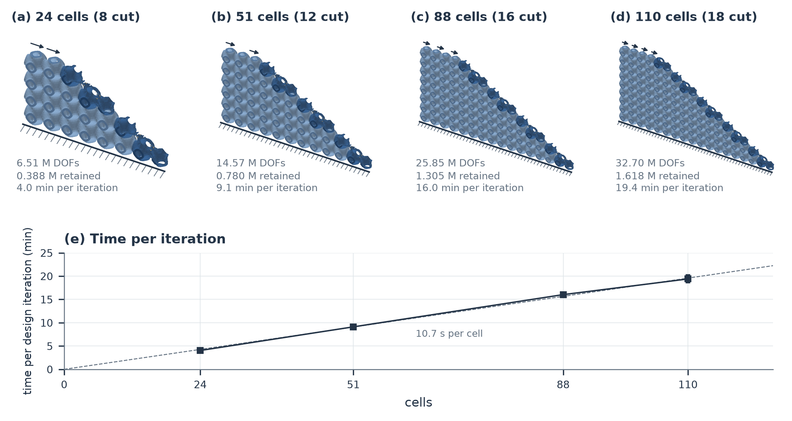
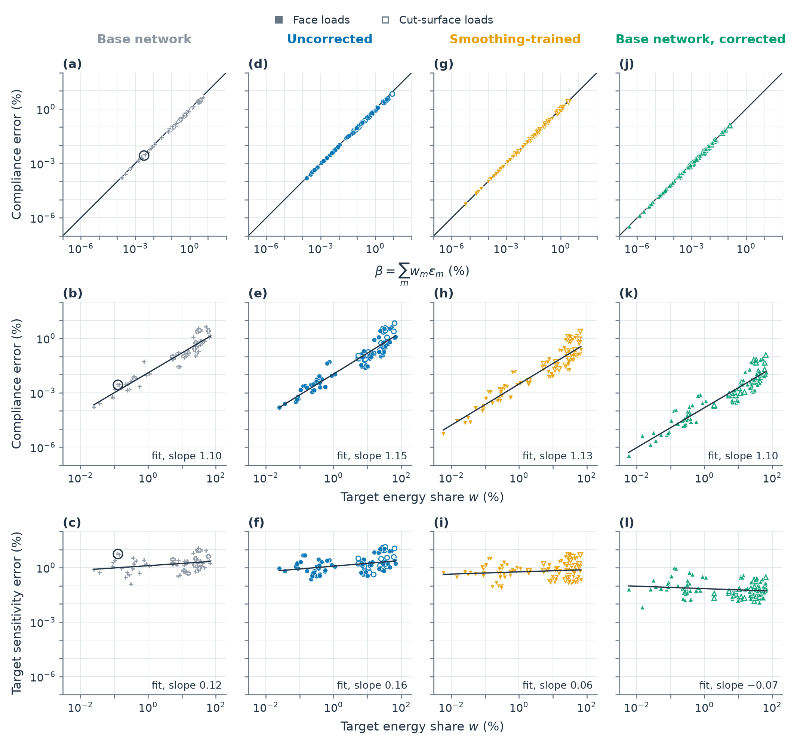

# Figures

Index of the figures in the manuscript and the supplementary material (generated by latex/gen_figures_md.py; captions as in the text). Each figure is available as PNG and PDF in `figures/`.

## Main text

### Figure 1

**Figure 1. A lattice trimmed to the shape of a part, whose cut cells carry the support.** (a) Plan view of a single layer of \(8\times4\) Schwarz-P cells (Eq. (1), uniform \(\tau=0.40\)) trimmed by a plane. The layer has 16 uncut cells (light) and eight cut cells (dark); the part removed by the cut is drawn pale with a dashed outline. The plate is clamped at its cut: every degree of freedom of the cut-plane elements of every cut cell is fixed (hatched line). The end face carries an in-plane traction load of unit resultant (arrows). (b) The cut cell outlined in (a), with translucent walls and the cut plane. Of the 72,631 nodes of its \(Q_2\) model, the 9,674 nodes on the cell faces (blue) and in the cut-plane elements (sand) are retained. All other nodes are interior and are eliminated by static condensation. The surfaces are reconstructed from Eq. (1) for visualisation only.

[PNG](figures/F00_problem.png) · [PDF](figures/F00_problem.pdf)

### Figure 2

**Figure 2. Overview of NICE: condensed stiffness of one cell, assembly and design.** (a) The rigid-body part of the retained displacements is separated before the network predicts the interior displacements, so that the network acts only on the deformation. The rigid-body field is then added back and the prescribed retained displacements are restored, which gives \(\widehat Eq\). The two-grid correction \(\mathcal W\) reduces the interior force imbalance with the retained displacements held fixed, which gives \(\widehat u=Fq\). Applying the cell stiffness \(K\) and then the transpose \(F^T\) gives the corresponding nodal forces on the retained DOFs, \(\widehat Sq\). The ordering \(S\preceq\widehat S\preceq\widehat S_{\rm net}\) in (a), where \(\widehat S_{\rm net}\) is the condensed stiffness without correction, is that of Proposition 2. This ordering concerns the energy error and does not apply to the sensitivity error. (b) The condensed stiffness matrices of the cells are assembled on the shared cell-face DOFs, and the assembled system is solved. The displacements of every cell are recovered from the assembled solution, and the compliance and the thickness sensitivity are computed. A design iteration updates the corner thickness parameters and therefore changes the geometry of every cell. The network parameters stay the same, and the coefficients of \(\mathcal W\) are recomputed.

[PNG](figures/F01_method_overview.png) · [PDF](figures/F01_method_overview.pdf)

### Figure 3

**Figure 3. Architecture of the network for the interior displacements.** (a) Geometry branch. Element and node encoders produce geometry feature vectors with 64 channels, which then exchange information in two residual rounds. Coefficient heads compute from these vectors the coefficients of the local interactions, the grid transfers and the convolutions. The heads of the local interactions also receive a position embedding, which identifies the local node position within a stencil (Appendix G.1). (b) Displacement branch. The retained displacements, with their rigid-body part removed, pass through four pairs of local interactions, the grid hierarchy, four further pairs and four pairs on stencils that contain weakly connected nodes (labelled 'Weak'). Linear maps convert the three displacement components to 32 feature channels at the input and back at the output. Bypass paths without learned parameters reconstruct the rigid-body motion and restore the prescribed retained displacements. (c) Multiscale displacement propagation. Restriction \(\mathcal R\) and prolongation \(\mathcal I\) connect the grids of the hierarchy, which have 65, 33, 17 and 9 background positions per axis. Each coarse grid applies two residual convolutions on the downward pass and two on the upward pass. (d) Local interaction. The features at the 27 local nodes of a stencil are gathered with geometry-dependent weights into four heads, and the channels are mixed within each head. The result is scattered back to the nodes and added to the incoming features, and the retained features are then restored. E and G denote element and ghost-face interactions. Blue dashed arrows carry geometry-dependent coefficients, and solid arrows carry features or displacements. For fixed geometry, the complete displacement path is linear.

[PNG](figures/F11_network_architecture.png) · [PDF](figures/F11_network_architecture.pdf)

### Figure 4

**Figure 4. Representative validation geometries.** (a) Uncut cell U1, (b) moderately cut cell M1 and (c,d) heavily cut cells H1 and H2, shown at the same unit-box scale and from the same viewing direction. Light blue shows the material surface, dark blue the wall section on the cell faces and sand the section on the cut plane. The part removed by the cut is drawn in translucent grey, and the cells are viewed from the side of the cut. The percentages give the box volume that remains after the cut, relative to the unit box, before the intersection with the thin-wall material. The surfaces are reconstructed from Eq. (1) on a grid of 129 points per axis and serve only for visualisation.

[PNG](figures/F08_geometry.png) · [PDF](figures/F08_geometry.pdf)

### Figure 5

**Figure 5. Energy error of the base network, the base network + correction and NICE on the 80 validation geometries.** Each observation is the mean energy error \(q^T(\widehat S-S)q/(q^TSq)\) of one geometry over the validation test displacements of one load class. (a) Traction loads, 20 geometries per cut-severity group. Markers give the mean over the geometries, and bars give the range from the 10th percentile to the maximum. (b) Single-geometry means of the base network and of NICE under traction loads. Open markers denote uncut geometries and filled markers cut geometries; the dotted line denotes equality. (c) Displacements imposed by a neighbouring cell, stiffness-scaled spring supports, traction loads on a single face and equal nodal point loads. The first two classes use 75 geometries and the other two use 80. The asterisk marks the stress test with nodal point loads. Twenty geometries (6 uncut, 14 cut) were used for checkpoint selection. Variants as in Table 2; 'Base network + correction' is the base network with the correction applied at deployment, without retraining.

[PNG](figures/F02_validation.png) · [PDF](figures/F02_validation.pdf)

### Figure 6

**Figure 6. Spectral distribution of the interior displacement error of the base network.** Panels show U1, M1, M2 and H2. The modes solve \(Av=\lambda Dv\), with \(D=\operatorname{diag}(A)\), and are ordered by increasing eigenvalue. Filled dark markers denote the error and open light-grey markers the exact interior field. Solid lines with circles denote traction loads and dashed lines with triangles nodal point loads. Curves are means over the test displacements. Bands give the 10th to 90th percentiles over the test displacements under traction loads. Each cumulative fraction is normalised by the total interior energy of its own field or error.

[PNG](figures/F03_spectrum.png) · [PDF](figures/F03_spectrum.pdf)

### Figure 7

**Figure 7. Retained DOFs and spatial distribution of the interior displacement error in M1.** (a) Retained DOFs on the cell faces, retained DOFs of the cut-plane elements, and interior DOFs. (b) Bulk element energies of the exact field for one traction-load test displacement, relative to its total energy. (c,d) Bulk element energies of the error of the base network and of NICE for the same retained displacements, relative to the total energy of the exact field in (b), on a common colour scale. The cut-plane elements carry no error because their DOFs are retained.

[PNG](figures/F12_field_error_M1.png) · [PDF](figures/F12_field_error_M1.pdf)

### Figure 8

**Figure 8. Correction of the base network with fixed network parameters.** (a,b) Mean energy error and sensitivity error during Chebyshev smoothing on five cells. (c) M1 without correction, with eight smoothing steps, with a coarse-grid correction followed by eight steps, and with eight steps on each side of the coarse-grid correction; dots show means and caps the 90th percentile. (d) M1: mean energy error against the number \(k\) of steps per smoothing stage, for a single smoothing stage and for the cycle of \(k\) pre-smoothing steps, the \(Q_1(17)\) coarse-grid correction and \(k\) post-smoothing steps. All panels use traction loads, fixed retained displacements and \(a=b/30\). In (a,b) the step axis is linear from zero to one and logarithmic thereafter.

[PNG](figures/F04_correction.png) · [PDF](figures/F04_correction.pdf)

### Figure 9

**Figure 9. Supports and loads of the two-cell assemblies.** (a) Configuration x: the neighbouring cell is translated by \((-1,0,0)\), the face \(x=-1\) is clamped, and the traction loads act on the faces at \(y=0\). (b) Configuration y: the translation is \((0,-1,0)\), the face \(y=-1\) is clamped, and the traction loads act on the faces at \(x=0\). The loaded faces of the test cell (T) and of the neighbouring cell (N) each carry separate traction loads in the x, y and z directions. The coincident DOFs of the cell-face nodes are shared across the interface, and the DOFs of cut-plane elements that do not lie on the cell faces remain local to their cell. Cut test cells also carry three traction loads on the cut surface, which are analysed separately.

[PNG](figures/F09_assembly_loads.png) · [PDF](figures/F09_assembly_loads.pdf)

### Figure 10

**Figure 10. Compliance and thickness sensitivity in two-cell assemblies.** The test cell is represented by a learned substructure and the neighbouring cell by exact static condensation. The figure shows NICE and Base network + correction, which is the base network with the correction applied at deployment, without retraining. (a,b) Maximum errors over the six face loads in each configuration; the sensitivity error is also maximised over both cells. (c,d) Compliance error and test-cell sensitivity error under each face load on M1/x and U1/x. Filled markers denote loads on the face of the test cell, and open markers loads on the face of the neighbouring cell. Dashed lines mark 3%. Supplementary Table ST08 gives all results. It also includes the base network and the two variants of Supplementary Note S8, which were not evaluated in every configuration.

[PNG](figures/F05_assembly.png) · [PDF](figures/F05_assembly.pdf)

### Figure 11

**Figure 11. The energy fraction of the test cell scales down the compliance error but not the sensitivity error.** Results of NICE in the fourteen configurations of the seven test cells, one point per load: 84 face loads (filled markers) and 30 cut-surface loads (open markers). Supplementary Tables ST08 and ST09 give the maxima over the loads. (a) Compliance error against \(\beta=\sum_mw_m\varepsilon_m\), with the energy fractions \(w_m=q_m^TS_mq_m/C\) and the energy errors \(\varepsilon_m=q_m^T(\widehat S_m-S_m)q_m/(q_m^TS_mq_m)\) evaluated at the exact assembled retained displacements. Only the learned test cell contributes to \(\beta\). The line denotes equality. For every load, the compliance error lies between 0.963 and 1.004 times \(\beta\). The five ratios above 1 correspond to an excess of at most \(7.8\times10^{-10}\) of the compliance, whereas the residual work of the pair solves reaches \(1.8\times10^{-8}\) of the compliance (Supplementary Note S4.3). (b) Compliance error and (c) test-cell sensitivity error against the exact energy fraction \(w\) of the test cell; solid lines are least-squares fits in logarithmic coordinates. The circled point is U1/x under the z traction load on the neighbour face. Figure S04 shows the corresponding results of the other variants.

[PNG](figures/F10_energy_share.png) · [PDF](figures/F10_energy_share.pdf)

### Figure 12

**Figure 12. Response errors caused by restricting the cell-face displacements.** Both cells of H1/x use their exact condensed stiffness and Bernstein polynomials of degree \(r\) on every cell face. The DOFs of the cut-plane elements that do not lie on the cell faces remain unrestricted. (a) Number of retained DOFs; the dashed line marks the 32,991 DOFs of the full representation. (b,c) Maximum compliance error and maximum test-cell sensitivity error, over the three loads on the test-cell face or over all six loads on the test-cell and neighbour faces. Traction loads on the cut surface are excluded. Errors are relative to the solution with all retained DOFs, and the horizontal lines mark 3%.

[PNG](figures/F06_bernstein.png) · [PDF](figures/F06_bernstein.pdf)

### Figure 13

**Figure 13. Thickness design of the plate supported on its cut.** (a) Final NICE design, with the walls coloured by the local thickness parameter, and the NICE and exact compliances (Supplementary Table ST21). (b) Change from the uniform start, \(\tau-0.40\). Material moves into the cells next to the support near the loaded end (up to \(+0.29\)), and the cells far from the load are thinned (down to \(-0.22\)). (c) The cut cell of Figure 1b at the final design under the design load. The panel shows the displacement magnitude on the walls from the NICE recovered field \(F_mB_m\widehat U\) and from exact static condensation \(E_mB_mU\) on a common scale, and their difference on a separate scale. The two fields differ by 1.04% in the energy norm of the cell and by 0.76% in the Euclidean norm of the nodal displacements. Applying the same recovery operator to the exact retained displacements also gives 1.04%, so the difference comes from the displacement recovery within the cell. Over the plate, the difference in the energy norm is 1.72%; its square equals the relative compliance difference of \(2.96\times10^{-4}\) (Eq. (14)).

[PNG](figures/F14_plate_design3d.png) · [PDF](figures/F14_plate_design3d.pdf)

### Figure 14

**Figure 14. Thickness optimisation with NICE.** (a) Case A: compliance histories of the NICE optimisation and of the twin optimisation with exact static condensation. Open circles give the exact compliance of the NICE designs at iterations 0, 12 and 23. The compliance first rises while the volume is reduced from \(1.25V^*\) to \(V^*\) (shading, iterations 0–3). Lower strip: NICE compliance relative to the twin run at the same design iteration (line) and relative to the exact compliance of the same design (circles: −0.011%, −0.018%, −0.028%). The designs of the two runs coincide at iterations 0–4 and differ afterwards. At iterations 16 and 19, labelled 'perturbed designs', the NICE design had been perturbed by the fallback of the geometry generator (Supplementary Table ST19a). (b) Plate supported on its cut. The curves show the NICE compliance from the uniform start and the compliance of the homogenised macroscale model along its own optimisation (dashed line). The star marks the homogenisation design analysed with NICE on the cut geometry, placed at the last macroscale iteration. Open circles give the exact compliance of the uniform start, the final NICE design and the homogenisation design. Shading: design iterations with \(V>V^*\). Lower strip: the range marked by the bracket, enlarged, from iteration 15.

[PNG](figures/F13_optimisation.png) · [PDF](figures/F13_optimisation.pdf)

### Figure 15

**Figure 15. Designs of the plate supported on its cut.** (a,b) Corner thickness parameters of the final NICE design and of the homogenisation design in the layer \(z=0\), drawn with the long side horizontal. Circles denote design variables, and squares denote the fixed vertices in the plane of the loaded face. Vertices drawn in the removed region are corners of cut cells. The thick hatched line marks the clamped cut-plane elements, and the arrows mark the loaded face and the direction of the in-plane traction. The compliances in (a,b) are the NICE and exact values of the same design (Supplementary Table ST21).

[PNG](figures/F14_designs_scale.png) · [PDF](figures/F14_designs_scale.pdf)

### Figure 16

**Figure 16. Plates of the scale demonstration.** (a–d) Plates of 24, 51, 88 and 110 cells with the proportions and cut of the plate in Figure 15, at the uniform start \(\tau=0.40\), drawn to the same scale. Each plate stands on its clamped long side (hatched), and the opposite face carries an in-plane traction along the long side (arrows). Light: uncut cells; dark: cut cells. Each panel gives the DOFs of the cut finite-element model, the free retained DOFs and the mean time per design iteration. (e) Time per design iteration against the number of cells (squares: mean; bars: range over the timed iterations). The dashed line is proportional to the number of cells, with the mean time of 10.7 s per cell. Memory use is given in Supplementary Table ST20.

[PNG](figures/F16_scale_plates.png) · [PDF](figures/F16_scale_plates.pdf)

## Supplementary material

### Figure S01

**Figure S01. Verification of the CutFEM reference.** Single cells clamped on one cell face and loaded by unit traction loads on another face in the three Cartesian directions. In (a), (b) and (d), solid lines with filled markers give the compliance and dashed lines with open markers the thickness sensitivity, each as the largest relative change over the three loads. (a) Change against the finest background resolution computed for U1 (\(n=40\)) and for M1 and M2 (\(n=48\)); the reference used throughout has \(n=32\). (b) Change when the ghost-penalty coefficient is varied from the value \(10^{-4}\) used throughout. (c) Filled: largest relative change of the sensitivity when the finite-difference step of the moment derivatives is varied from the value \(h_c=10^{-5}\tau_c\) used throughout, at most \(2.6\times10^{-5}\)% at \(10^{-3}\tau_c\) and a hundredfold smaller at \(10^{-4}\tau_c\); open: largest relative difference between central compliance differences and the sensitivity at the step used. (d) Refinement to \(n=64\) of H1, H2 and the validation cells with the largest NICE error (W1) and the thinnest walls (W3), the data of Table ST10; H2 has no \(n=56\) solution.

[PNG](figures/S06_reference_verification.png) · [PDF](figures/S06_reference_verification.pdf)

### Figure S02

**Figure S02. Distributions of geometry-level energy errors.** Each point is one validation geometry's mean energy error in the identity orientation; horizontal bars are population medians. The classes with nodal point loads, spring supports, single-face nodal point loads, polynomial displacements, multiscale displacements, traction loads and single-face traction loads contain 80 geometries. The class with stiffness-scaled supports and the class with displacements imposed by a neighbouring cell contain 75, the same populations as Table ST03. The five variants of Table ST03 (Base network, Uncorrected continuation, Smoothing-trained, Base network + correction and NICE) use the markers and colours of the main-text figures; Base network + correction applies the correction to the base network at deployment. Deterministic horizontal offsets separate overlapping observations. All panels share the logarithmic error axis.

[PNG](figures/S01_distributions.png) · [PDF](figures/S01_distributions.pdf)

### Figure S03

**Figure S03. Sensitivity-error diagnostics.** (a) Paired mean energy and sensitivity errors for responses to traction loads and nodal point loads, using six cells of the base network and five of the Uncorrected continuation. (b) Linear-term norm fraction \(\|D_1\|_F/(\|D_1\|_F+\|D_2\|_F)\) under traction loads, where \(D_1+D_2\) is the sensitivity-error matrix over all eight design components and evaluated test displacements. (c,d) Fractions of absolute elementwise sensitivity-error contributions and of element counts in four mutually exclusive material-volume-fraction groups for the base network under traction loads. Each error group sums absolute contributions over its elements, design components and test displacements before normalisation by the total. Filled markers identify the base network. In (a,b), open markers and hatched bars identify the Uncorrected continuation, which is shown for U1, U2, M1, H1 and M2 (Table ST05a).

[PNG](figures/S03_sensitivity_diagnostics.png) · [PDF](figures/S03_sensitivity_diagnostics.pdf)

### Figure S04

**Figure S04. The other four variants follow the relations of Figure 11.** The counterpart of Figure 11 for (a–c) the base network, (d–f) the Uncorrected continuation, (g–i) the Smoothing-trained variant and (j–l) Base network + correction, which applies the correction at deployment. One point per load in the configurations evaluated for each variant (54, 87, 96 and 114 loads; Tables ST08 and ST09); filled markers denote face loads and open markers cut-surface loads. Top row: compliance error against \(\beta\); lines denote equality. The ratio of compliance error to \(\beta\) lies between 0.80 and 0.98, 0.79 and 0.99, 0.92 and 0.99, and 0.96 and 1.006 for the four variants; the six ratios above 1 correspond to at most \(1.3\times10^{-9}\) of the compliance. Middle and bottom rows: compliance error and test-cell sensitivity error against the exact energy fraction \(w\) of the test cell; lines are least-squares fits in logarithmic coordinates, with the slope given in each panel. All panels share the error axis. The circled load in (a–c) is U1/x under the z traction load on the face of the neighbouring cell; its values are given in the note to Table ST08.

[PNG](figures/S07_energy_share_variants.png) · [PDF](figures/S07_energy_share_variants.pdf)
