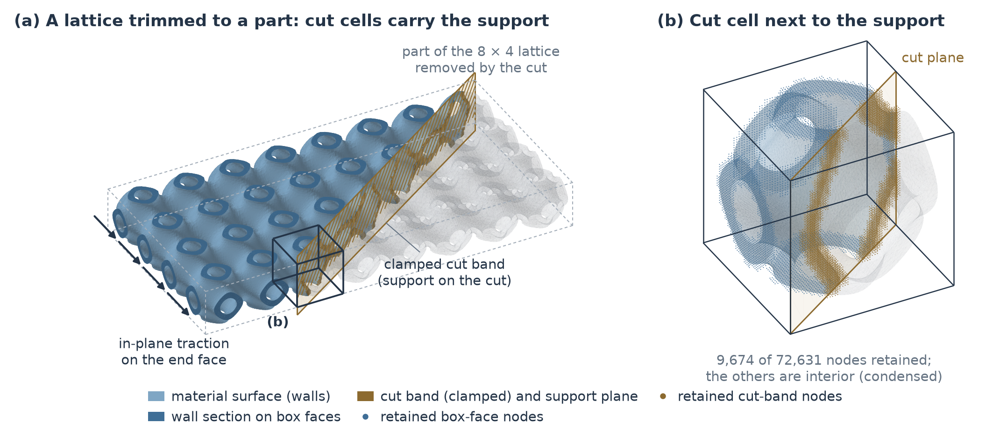
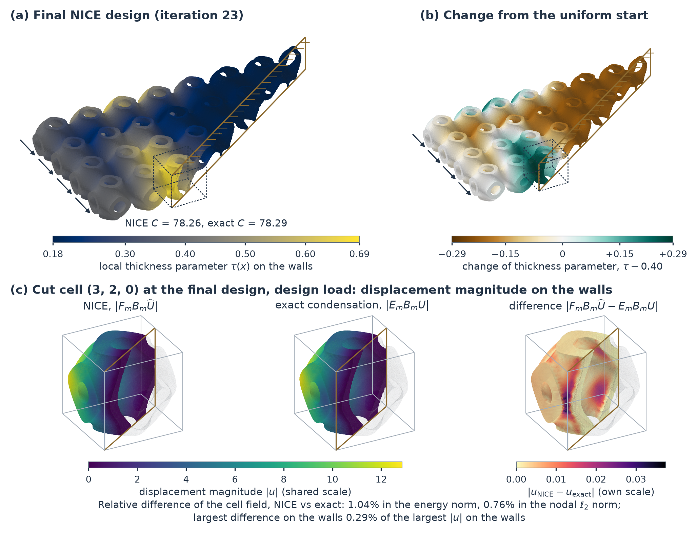

# NICE：带平衡校正的神经初始化静力凝聚及其在切割 TPMS 点阵厚度设计中的应用

## 摘要

当点阵按零件形状修剪时，被边界切割的胞元可能承受零件的支撑与载荷，且每个胞元的几何各不相同。若解析每一面壁，每次设计迭代都是对整个结构的一次细尺度分析；而均匀化在尺度不分离处失去精度，对在切割处固支的 24 胞元单层，其柔度低估达 27%。静力凝聚在每个胞元内保留细尺度，但需对每种几何做一次内部分解，而几何的离散空间随切割而变。带平衡校正的神经初始化静力凝聚（NICE）转而对凝聚进行分工：几何条件化网络提供内部场，能量形式提供结构，固定的两重网格校正提供可改进性。该网络对保留位移精确线性、由构造满足容许性，保留全部胞元边界面与切割带自由度（每个胞元数万个），且不形成任何矩阵。凝聚刚度是 Ritz 近似，以精确 Schur 补为下界，误差是内部误差的二次量；在该能量下非扩张的校正不会增大这一误差。柔度准确并不意味着灵敏度准确，因此 NICE 对二者分别训练与检验。对于切割 Schwarz-P 胞元，80 个验证几何上的平均能量误差为 0.074%，含灵敏度的八胞元分析比直接求解快约十倍。厚度优化复现了八胞元点阵的精确凝聚设计；在该固支单层上，柔度与梯度和精确凝聚的偏差分别在 0.03% 和 0.3% 以内。

**关键词：** 学习子结构；静力凝聚；Schur 补；Ritz 近似；切割有限元；TPMS 点阵；厚度优化。

## 1. 引言

许多工程结构由大量同类但几何各异的组件装配而成：胞元壁厚度变化的梯度点阵 [Yu et al. (2019)](https://doi.org/10.1016/j.matdes.2019.108021)、按零件形状修剪的构筑材料，以及沿切割边界受支撑和受载的多孔芯材。对这类结构的分析，尤其是其设计，必须调和两种相互对立的需求。结构整体规模很大，而每次设计变更都要求对其重新分析，这促使以更廉价的模型替代每个组件；然而驱动设计的量（如靠近支撑的切割胞元的刚度，或对壁厚的灵敏度）是局部的，这又要求保留每个组件的细节。均匀化以经济性为先化解这一矛盾，梯度点阵的设计通常也以其为基础 [Li et al. (2018)](https://doi.org/10.1016/j.cad.2018.06.003), [Wu et al. (2021)](https://doi.org/10.1007/s00158-021-02881-8)。当胞元尺寸相对于场的变化较小时，均匀化是精确的；反之则失去精度，例如在支撑处、载荷处以及被边界切割的胞元中。对于第 5.10 节中经切割带固支的单层板（图 1），该节所考察的均匀化模型将柔度低估了 27%。完整求解每个胞元的每一面壁则以保真度为先化解这一矛盾；借助大规模并行求解器这是可行的 [Aage et al. (2017)](https://doi.org/10.1038/nature23911)，但其代价在每次设计迭代中都要全额重新支付，因为每次迭代都会改变所有胞元（第 5.9 节）。子结构法采取折中路线。每个组件被凝聚到与其周围共享的自由度上，并返回与这些自由度位移共轭的力，从而可以装配整体结构；用于计算局部设计量的内部场则在之后恢复。静力凝聚可以精确地做到这一点 [Guyan (1965)](https://doi.org/10.2514/3.2874), [Irons (1965)](https://doi.org/10.2514/3.3027)，但代价是对每一种几何都要进行一次内部分解。学习组件模型试图消除这一代价：有的模型直接将节点位移映射为力 [Capuano & Rimoli (2019)](https://doi.org/10.1016/j.cma.2018.10.046)，而学习子结构则以能量形式计算学习得到的形函数，并像有限元一样进行装配 [Huang et al. (2023)](https://doi.org/10.1016/j.eml.2023.102041), [Guo et al. (2026a)](https://doi.org/10.1016/j.cma.2026.118955)。

**图 1. 修剪为零件形状的点阵，其切割胞元承担支撑。** (a) 由 \(8\times4\) 个 Schwarz-P 胞元（式 (1)，均匀 \(\tau=0.40\)）组成的单层被一个平面修剪，剩下 16 个未切割胞元和 8 个切割胞元；被切去的部分以浅色绘出。板经切割处固支：每个切割胞元切割带的全部自由度均被固定（砂色；阴影平面表示支撑）。端面承受合力为单位值的面内面力（箭头）。(b) (a) 中框出的切割胞元：其 \(Q_2\) 模型的 72,631 个节点中，胞元边界面上（蓝色）和切割带中（砂色）的 9,674 个节点被保留，其余均为内部节点，经凝聚消去。曲面由式 (1) 重构，仅用于显示。

静力凝聚之所以适用于分析与设计，是因为其凝聚刚度对称半正定且以刚体模态为核，因而可以像有限元一样装配。学习组件模型若要取代它，最好能保持这一结构；无需内部分解即可用于每一种新几何，即使切割改变了离散空间；其误差可以追溯到柔度以及设计所用的局部灵敏度；并且部署时无需重新训练即可改进。本文表明，学习组件模型可以在保留胞元各边界面上以及被边界切割的单元带（切割带）上全部自由度的同时具备这四项性质。它通过近似所处的位置及凝聚刚度的构成方式获得静力凝聚的结构，并通过对其内部场的固定校正获得可改进性。

对于切割薄壁胞元，保留空间很大：胞元边界面自由度承载外部载荷和胞元间耦合，切割带自由度承载切割面上的虚功，因此这里每个胞元保留的自由度中位数为 \(2.4\times10^4\)（在 80 个验证几何上为 2,679 至 45,900）。显式形成 Schur 补需要对每个保留自由度进行一次内部求解，而施加它则需要对每一种几何进行一次内部分解。近似可以缩减保留集，也可以近似内部延拓。缩减保留自由度（如端口约化 [Eftang & Patera (2013)](https://doi.org/10.1002/nme.4543), [Smetana & Patera (2016)](https://doi.org/10.1137/15m1009603), [Ballani et al. (2018)](https://doi.org/10.1016/j.cma.2017.09.014) 以及学习子结构中的做法）会限制子结构之间可交换的位移模式，并留下内部的任何改进都无法消除的边界模型误差。在完整保留空间上近似内部延拓（如 [Huynh et al. (2013)](https://doi.org/10.1051/m2an/2012022)）只改变对每种模式的内部响应。我们将近似置于内部延拓中，该延拓通过学习得到并以每个胞元的几何为条件，同时保留全部胞元边界面自由度和整个切割带。保留切割带也使切割面上的载荷和支撑得以施加：第 5.10 节中的板无需重新训练即可经其切割带固支。

内部误差以胞元所承载的能量为权重进入柔度，但经由刚度导数进入厚度灵敏度，因此能量份额较小的胞元可能使柔度保持精确，而其灵敏度仍不精确。在拓扑优化的近似重分析和非精确求解中已观察到这一现象 [Amir et al. (2009)](https://doi.org/10.1002/nme.2536), [Amir et al. (2010)](https://doi.org/10.1007/s00158-009-0463-4), [Gogu (2015)](https://doi.org/10.1002/nme.4797)。我们针对学习子结构对其进行了量化，并采用柔度与局部灵敏度的联合精度作为设计应用的判据。

本文的核心思想是在静力凝聚内部进行分工：学习提供试探场，变分形式提供结构，固定校正提供可改进性。近似放在内部延拓上；延拓由一个对保留位移精确线性、由构造满足容许性的网络给出，因此其能量定义了凝聚刚度的 Ritz 近似；该能量内部的固定平衡校正消除网络留下的大部分误差；剩余误差则经由能量份额和刚度导数追踪到柔度与设计灵敏度。在这种分工下，网络只需要准确，而无需自己保持结构：只要它给出的延拓是容许的并能再现刚体运动，能量形式就保证凝聚刚度对称半正定、以刚体模态为零空间、以精确 Schur 补为下界，且误差是内部误差的二次量；精确静力凝聚正是延拓精确时的特例。同一 Ritz 性质也是静力凝聚本身 [Toselli & Widlund (2005)](https://doi.org/10.1007/b137868)、多尺度有限元 [Hou & Wu (1997)](https://doi.org/10.1006/jcph.1997.5682)、组件约化基方法 [Huynh et al. (2013)](https://doi.org/10.1051/m2an/2012022) 以及按 \(N^TKN\) 计算的学习形函数 [Huang et al. (2023)](https://doi.org/10.1016/j.eml.2023.102041) 的基础；在本文中，它承载的是定义在随切割变化的保留空间上的学习延拓。

学习提供试探场，其方式受三个障碍制约。为每一种几何形成延拓矩阵需要对每个保留自由度进行一次内部求解。像学习形函数那样对每个保留自由度各设一个输出的网络，相当于逐列计算这一矩阵，其输出维数由所针对的保留集固定。而大多数神经算子所学习的、对输入非线性的解映射，会失去叠加性，也就失去了结构所依赖的二次凝聚能量。因此，一个对几何非线性、对保留位移精确线性的几何条件化网络，通过局部相互作用和多层潜空间层级来计算每个胞元的内部场，其权重作用于模板、通道和网格层级，而非单个自由度。其规模约为 \(6\times10^5\) 个参数，不随保留自由度数目增长；同一个网络服务于保留集各不相同的胞元；延拓和凝聚矩阵都从不显式形成。

固定校正提供可改进性：每种几何一次对称的两重网格循环，由 Chebyshev 光滑和粗网格 Galerkin 校正组成 [Xu (1992)](https://doi.org/10.1137/1034116)，在保留位移固定时减小内部平衡残差，这与光滑聚集多重网格中光滑改进试探插值算子的方式颇为相似 [Vaněk et al. (1996)](https://doi.org/10.1007/BF02238511)。由于该校正是凝聚能量内部的固定线性映射，校正后的凝聚刚度保持上述全部性质。在关于粗求解与光滑区间的条件下（命题 4），其误差不会超过未校正凝聚刚度的误差 [Golub & Varga (1961)](https://doi.org/10.1007/BF01386013), [Xu & Zikatanov (2002)](https://doi.org/10.1090/S0894-0347-02-00398-3)；并且完整校正延拓的转置返回与该能量共轭的力。网络经由校正进行训练，二者相互补充：在相同校正下，确定性的调和初值留下的误差是 NICE 的 5.4 至 265 倍（第 5.5 节）。我们将该构造称为带平衡校正的神经初始化静力凝聚（NICE）。

学习型与约化型组件模型的区别在于三项选择：组件与相邻胞元交换什么，内部响应如何表示，近似在何处改进。边界自由度很少的方法以受限的位移模式进行交换，换来较小的装配系统；组件约化基方法保留完整界面，但在参数族共享的离散上表示内部；非精确子结构方法则在预条件子内部改进近似的局部求解。NICE 保留随切割变化的完整保留空间，以几何条件化网络表示内部，并在被装配的凝聚算子内部改进近似。第 1.1 节逐一说明它与各类方法的关系。

本文的贡献与上述分工一一对应。

- **(i) 在完整且随几何变化的保留空间上进行凝聚。** 保留胞元与相邻胞元、支撑和载荷交换位移所经由的全部自由度，近似仅限于内部响应；因此，尽管这些自由度随几何变化，切割面上的支撑与载荷仍作用于原有自由度，无需重新训练（第 2、5.7 和 5.10 节）。
- **(ii) 规模与保留集无关的学习延拓。** 网络仅对几何非线性、对保留位移精确线性，保留值与刚体运动由构造施加，因而第 3 节的关系直接适用于它，其转置给出功共轭力。约 \(6\times10^5\) 个参数的同一个网络服务于 2,679 至 45,900 个自由度的保留集，且不形成任何矩阵（第 4.2 和 4.6 节）。
- **(iii) 无需重新训练即可改进已部署网络的校正。** 凝聚能量内部的一次固定两重网格循环，对任何刚度对称半正定且内部块正定的离散模型都保持静力凝聚的性质，并在命题 4 的条件下不会增大误差（第 4.3、4.4 和 5.5 节）。
- **(iv) 将柔度与灵敏度作为两项独立的检验标准。** 内部误差以各胞元的能量份额为权重进入柔度，却以一个关于该误差的线性项进入厚度灵敏度，而能量误差只能在其平方根阶上界定这一项。因此 NICE 对二者分别训练与检验，其设计均与精确凝聚核对（命题 2 和 3；第 5.6、5.8 和 5.10 节）。

第 2 节陈述胞元的切割有限元模型、精确凝聚、设计问题以及近似凝聚刚度应具备的性质。第 3 节以命题 1–3 陈述对任意容许延拓成立的误差关系：Ritz 恒等式、按能量份额加权的柔度界以及厚度灵敏度的误差。第 4 节构造 NICE：变分凝聚刚度、提供延拓的几何条件化网络、两重网格校正及其排序（命题 4）、经由校正的训练，以及不形成矩阵的算子施加。第 5 节针对稳定化切割有限元模型中的切割薄壁 Schwarz-P 胞元实现 NICE，并进行如下验证：在 80 个验证几何及其两胞元装配上验证；在由训练和检查点选择中未见过的胞元构成的八胞元点阵上验证；通过保留表示的消融验证；在成本上与整体点阵直接求解和常规精确凝聚比较；以及在厚度优化中与精确凝聚进行核对并与均匀化模型比较。第 6 节讨论结果并说明局限性；第 7 节给出结论。

### 1.1. 相关工作

学习子结构发展得最为深入的形式是问题无关机器学习（PIML），它为少量边界自由度预测子结构形函数，施加刚体运动约束，并在其自洽形式中按 \(N^TKN\) 计算刚度 [Huang et al. (2022)](https://doi.org/10.1016/j.eml.2022.101887), [Huang et al. (2023)](https://doi.org/10.1016/j.eml.2023.102041)。其各种变体或通过最小势能原理在无标注形函数的情况下训练 [Huang et al. (2024)](https://doi.org/10.1016/j.jmps.2024.105893)，或以 Bézier 函数丰富边界 [Guo et al. (2026a)](https://doi.org/10.1016/j.cma.2026.118955)，或以重叠单位分解连接过采样基，并在全局平衡方程上通过少量 Jacobi 预条件共轭梯度迭代校正重构的细尺度场 [Guo et al. (2026b)](https://arxiv.org/abs/2607.22019v1)，或施加对称等变性 [Jiang, C. et al. (2026)](https://doi.org/10.1016/j.compstruct.2026.120865)，或处理等参子结构 [Zhang, L. et al. (2024)](https://doi.org/10.1016/j.eml.2024.102237)，或将其迁移到复杂三维设计域 [Zhang et al. (2026)](https://doi.org/10.1016/j.ijmecsci.2026.112007)，或用于点阵优化 [Xu et al. (2025)](https://doi.org/10.1016/j.compstruct.2025.119330)。每个子结构仅有少量边界自由度，使粗模型足够小，可用于超大型结构，而边界模型误差则通过细化划分、丰富插值或过采样加以控制。NICE 处在这一取舍的另一端：它保留胞元的全部保留自由度，因而不产生边界模型误差，代价是装配模型更大；它学习的是离散空间随切割变化的几何族中每种几何的内部延拓，而不是固定边界自由度集上的形函数。

与本构造最接近的是保持力学结构的组件模型。它们与 NICE 的区别在于保留空间、组件的表示方式以及近似的改进位置。在保留空间方面，组件约化基方法在其凝聚中保留完整界面，并离线构造内部约化基 [Huynh et al. (2013)](https://doi.org/10.1051/m2an/2012022)；对于点阵，这类分量式模型已在设计优化中复用，并给出位移、柔度及其灵敏度的误差界 [McBane & Choi (2021)](https://doi.org/10.1016/j.cma.2021.113813)；它们建立在参数族共享的离散空间之上，对于非贴体离散，激活集变化时的解在降阶之前已被延拓到公共背景空间 [Chasapi et al. (2023)](https://doi.org/10.1016/j.cma.2023.115997)。NICE 保留完整的保留空间，尽管该空间本身随切割变化，因此其网络以每个胞元的离散几何为条件，而非以共享离散的参数为条件。

在组件的表示方面，点阵方法曾将胞元凝聚为超单元，其刚度由降阶代理模型在密度参数上插值，从而在无尺度分离的情况下为优化提供显式刚度导数 [Wu et al. (2019)](https://doi.org/10.1016/j.cma.2018.11.003)；曾针对由样条复合构建的点阵，以降阶胞元算子替代非精确对偶-原始有限元撕裂互联（FETI-DP）方法中的逐胞元局部求解 [Hirschler et al. (2024)](https://doi.org/10.1002/nme.7419)；对于非贴体二维点阵，还曾将约束平衡区域分解（BDDC）与完整胞元刚度矩阵相结合，其中修剪胞元的积分由矩阵离散经验插值近似 [Bonilla Moreno et al. (2027)](https://doi.org/10.1016/j.cma.2026.119304)。这些方法均在各胞元之间保持同一种离散：分别为公共点阵模式、复合参数胞元以及每胞元一个高阶非贴体单元。对于非贴体粗单元，数值形函数也曾针对小切割进行条件化处理 [Chen & Li (2026)](https://doi.org/10.1016/j.cad.2026.104038)。学习单元将嵌入的内部域凝聚为对称半正定的界面刚度 [Parish et al. (2024)](https://doi.org/10.1007/s00466-024-02481-5)，而凸神经能量单元则从 Schur 补目标中学习边界能量，并通过精确提升恢复内部场 [Jiang, H. et al. (2026)](https://arxiv.org/abs/2608.02036v1)。在 NICE 中，学习的对象是内部延拓本身：一个校正延拓，无需内部分解即可构建，无需形成矩阵即可施加，它同时定义了装配算子、恢复场以及厚度灵敏度。

近似的改进位置也有所不同。非精确子结构方法 [Dohrmann (2007)](https://doi.org/10.1002/nla.514), [Li & Widlund (2007)](https://doi.org/10.1016/j.cma.2006.03.011), [Klawonn & Rheinbach (2007)](https://doi.org/10.1002/nme.1758) 在预条件子内部改进近似的子域求解和粗求解，其迭代收敛到精确离散解（第 6.2 节）。凸神经能量单元在一个非线性算例中通过 Newton 步细化精确提升，并对这些步进行微分 [Jiang, H. et al. (2026)](https://arxiv.org/abs/2608.02036v1)。组件约化基方法对组件解或装配解的误差给出后验界 [Huynh et al. (2013)](https://doi.org/10.1051/m2an/2012022)，而 NICE 提供的是可计算的残差（式 (5)），而非认证界。NICE 在保留位移固定时、在凝聚能量内部校正每个组件的内部场，因此该校正改变的是被装配的算子。

学习也已与多层求解器和区域分解求解器相结合，途径包括学习的多重网格插值算子 [Greenfeld et al. (2019)](https://proceedings.mlr.press/v97/greenfeld19a.html), [Luz et al. (2020)](https://proceedings.mlr.press/v119/luz20a.html)、机器学习辅助的自适应 FETI-DP 粗空间 [Heinlein et al. (2021)](https://doi.org/10.1137/20M1344913)、将学习预测与松弛、学习的逆作用或粗空间相结合的混合神经求解器 [Zhang, E. et al. (2024)](https://doi.org/10.1038/s42256-024-00910-x), [Kopaničáková & Karniadakis (2025)](https://doi.org/10.1137/24m162861x), [Xing et al. (2026)](https://doi.org/10.1145/3811333)，以及通过求解器训练的网络 [Um et al. (2020)](https://proceedings.neurips.cc/paper/2020/hash/43e4e6a6f341e00671e123714de019a8-Abstract.html)。几何感知神经算子和图网络 [Li et al. (2023a)](https://www.jmlr.org/papers/v24/23-0064.html), [Li et al. (2023b)](https://doi.org/10.52202/075280-1556), [Pfaff et al. (2021)](https://openreview.net/forum?id=roNqYL0_XP)、多重网格结构算子 [He et al. (2024)](https://proceedings.iclr.cc/paper_files/paper/2024/hash/eb3c8135137c8a60425a0320869ad87e-Abstract-Conference.html)、学习的 Green 函数 [Boullé & Townsend (2023)](https://doi.org/10.1007/s10208-022-09556-w) 以及 Ritz 型训练 [E & Yu (2018)](https://doi.org/10.1007/s40304-018-0127-z) 则学习整个问题的解映射。谱多尺度粗基 [Efendiev et al. (2013)](https://doi.org/10.1016/j.jcp.2013.04.045) 同样曾在无尺度分离的优化中用作完全求解问题的两层预条件子的粗空间 [Alexandersen & Lazarov (2015)](https://doi.org/10.1016/j.cma.2015.02.028)。这些方法加速全局求解或近似整个问题的解；而在本文中，学习的映射是逐胞元的延拓，其能量定义了一个可装配、可微分、可改进的凝聚算子。校正后的延拓 \(F\) 实际上是一个由几何条件化的、从保留自由度到激活自由度的插值算子，\(\widehat S=F^TKF\) 是它的 Galerkin 算子；学习的多重网格插值算子 [Greenfeld et al. (2019)](https://proceedings.mlr.press/v97/greenfeld19a.html), [Luz et al. (2020)](https://proceedings.mlr.press/v119/luz20a.html) 同样对算子非线性、对其作用的向量线性，但它们是求解器的一部分，而 \(F\) 是一个组件模型：它服务于随切割变化的保留集，其 Galerkin 算子被装配进点阵，并在设计中求导。

## 2. 离散子结构与静力凝聚

胞元采用稳定化切割有限元方法（CutFEM）[Burman et al. (2015)](https://doi.org/10.1002/nme.4823) 在固定的笛卡尔背景网格上离散。壁面和切割面不需要划分网格：它们只决定哪些背景单元被激活，并通过各单元材料部分上的积分进入刚度。因此，壁厚或切割改变时无需重新划分网格，厚度灵敏度由这些积分的导数得到（附录 H），所有胞元也都位于同一背景网格上，第 4.2 节网络的固定潜空间网格正是建立在这一网格之上。代价是激活单元以及随之而来的保留集随几何变化，这正是第 3、4 节必须处理的；它们的关系只用到所得刚度的对称半正定性及其内部块的正定性。

### 2.1. 几何与离散弹性问题

我们考虑参考立方体 \(\mathcal B=[0,1]^3\) 中的三维薄壁 TPMS 胞元。其材料域由 Schwarz-P 型三角函数水平集场、空间变化的带参数以及可选的平面切割定义：

\[
\begin{aligned}
&\phi(x)=\sum_{a=1}^{3}\cos(2\pi x_a),\qquad
\tau(x)=\sum_{c\in\{0,1\}^{3}}N_c^{Q_1}(x)\tau_c,\\
&\Omega(\eta)=\{x\in\mathcal B:|\phi(x)|\le\tau(x),\ \boldsymbol n\cdot x\le b_{\rm cut}\}.
\end{aligned}
\tag{1}
\]

八个参数 \(\tau_c\) 经三线性函数 \(N_c^{Q_1}\) 插值，决定隐式带宽，从而决定壁厚与材料分布；我们称之为角点厚度参数，并称对它们的导数为厚度灵敏度。当八个角点值汇集为向量（如 \(\boldsymbol\tau\) 或灵敏度向量 \(\boldsymbol s\)）时，角点编号为 \(c=1,\ldots,8\)。切割平面 \(\boldsymbol n\cdot x=b_{\rm cut}\) 的单位法向 \(\boldsymbol n\) 背离保留材料，偏移量为 \(b_{\rm cut}\)；对未切割胞元省略半空间约束，\(\eta\) 汇集几何、材料与离散参数。

弹性问题在笛卡尔背景网格上采用连续张量积 \(Q_2\) 位移函数。若背景单元与 \(\Omega(\eta)\) 的交集具有正测度，则该单元为激活单元，这一点由水平集函数与带函数在单元上的区间包络加以认证（附录 A.1）；激活单元节点的位移自由度即为激活自由度。在材料域上积分给出体刚度，ghost 罚项稳定化 [Burman (2010)](https://doi.org/10.1016/j.crma.2010.10.006) 耦合相邻激活单元，以控制小切割效应 [Burman et al. (2015)](https://doi.org/10.1002/nme.4823)。对称矩阵 \(K\) 定义稳定化离散能量 \(\tfrac12u^TKu\)，本文的参考解即该离散系统的平衡解：所有误差均相对于它度量，而非相对于连续问题。图 1 给出一个切割点阵及其中一个切割胞元；表 1（第 5.1 节）列出各算例的设置，附录 A 给出积分与装配细节。

### 2.2. 保留自由度与平衡延拓

对每个胞元，保留自由度汇集于集合 \(P\)，包括胞元各边界面上每个正面积材料片的胞元边界面节点的自由度，以及所有带有正面积切割表面片的激活单元的全部位移自由度（附录 A.1）。这些单元，即被切割平面穿过的激活单元层，构成切割带：尽管其部分节点远离切割平面，它们的基函数仍对该平面上的位移和虚功有贡献。这一完整的保留空间同时包含胞元间自由度与外边界自由度，在预测与装配中始终使用。

记 \(I\) 为其余的内部自由度，\(p=|P|\)，\(i=|I|\)，\(n_a=p+i\)。选择算子 \(J_P\) 和 \(J_I\) 从激活位移向量中提取这两个集合，\(q=J_Pu\) 为保留位移。边界载荷通过 \(q\) 作用；内部体载荷为零。按所示的 \((P,I)\) 排序，静力凝聚给出

\[
\begin{aligned}
&K=\begin{bmatrix}K_{PP}&K_{PI}\\K_{IP}&A\end{bmatrix},\qquad
A=K_{II},\qquad
E=\begin{bmatrix}I_p\\-A^{-1}K_{IP}\end{bmatrix},\\
&S=K_{PP}-K_{PI}A^{-1}K_{IP}=E^TKE.
\end{aligned}
\tag{2}
\]

刚度 \(K\) 对称半正定，其零空间由六个刚体模态构成，即 \(R\in\mathbb R^{n_a\times6}\) 的各列，且其限制 \(R_P=J_PR\) 的秩为六：几何生成器只接受激活单元构成单一面连通集合的胞元，仅通过部分填充单元相连的材料借助共享基函数和 ghost 罚项耦合（附录 A.1）。于是内部块 \(A\) 正定，因为零能量的内部场只能是在保留自由度上为零的刚体运动；给定 \(q\) 即消除了所有内部零能运动。平衡位移延拓 \(u=Eq\) 在 \(J_Pu=q\) 上唯一地使离散能量最小，\(Sq\) 为其功共轭的保留力。

### 2.3. 装配与响应度量

对子结构 \(m\)，布尔装配映射 \(B_m\) 从自由的全局保留位移 \(U\) 中提取 \(q_m=B_mU\)。由背景网格位置识别的重合胞元边界面自由度是共享的；胞元边界面以外的保留切割带自由度仍局限于其所属子结构。由于共享面上的厚度场仅取决于该面的四个角点值，且 \(\phi\) 是周期的，两个相邻胞元的材料片在每个未被切割穿过的面上重合；当切割仅从一侧移除材料时，不匹配的面自由度仍属于承载它们的胞元。固定齐次支撑并入 \(B_m\)。参考装配系统与近似装配系统使用相同的映射 \(B_m\)，分别为

\[
\mathbb K=\sum_mB_m^TS_mB_m,\qquad
\widehat{\mathbb K}=\sum_mB_m^T\widehat S_mB_m,
\qquad
\mathbb K U=f_g,\quad\widehat{\mathbb K}\widehat U=f_g.
\tag{3}
\]

其中 \(\widehat S_m\) 为第 4 节的近似凝聚刚度，\(f_g\) 为作用于自由保留自由度上的给定力。由于各内部集互不相交，局部凝聚与装配可交换次序，并假设带支撑的参考矩阵 \(\mathbb K\) 正定。

柔度为 \(C=f_g^TU\)，相应有 \(\widehat C=f_g^T\widehat U\) 及相对误差 \(e_C=|\widehat C/C-1|\)。凝聚刚度的局部精度由第 3.1 节的相对方向能量误差度量。厚度灵敏度采用第 3.3 节的八分量向量，其相对欧几里得误差为 \(e_s=\|\widetilde{\boldsymbol s}-\boldsymbol s\|_2/\|\boldsymbol s\|_2\)。

在设计中，位于点阵顶点的角点厚度参数汇集于 \(\boldsymbol\tau_g\) 中，并通过 \(\boldsymbol\tau_m=\boldsymbol\tau_m(\boldsymbol\tau_g)\) 映射到各胞元的角点，其设计问题为

\[
\min_{\boldsymbol\tau_g}\;C(\boldsymbol\tau_g)\quad\text{s.t.}\quad V(\boldsymbol\tau_g)\le V^*,\qquad \tau_{\min}\le\tau\le\tau_{\max},
\]

其中 \(V\) 为离散模型的材料体积；此外还对每个胞元的角点跨度和梯度范数设限，使胞元保持在训练域内（第 5.10 节）。其梯度在每个顶点处汇集各胞元的灵敏度，\(\partial C/\partial\boldsymbol\tau_g=\sum_m(\partial\boldsymbol\tau_m/\partial\boldsymbol\tau_g)^T\boldsymbol s_m\)，其中 \(\boldsymbol s_m\) 为胞元 \(m\) 的八分量灵敏度向量（第 3.3 节）。

第 1 节所述的四项性质中，有两项现在可以精确表述。\(\widehat S_m\) 必须对称半正定，且其零空间仅由保留刚体模态构成，并且式 (3) 中带支撑的 \(\widehat{\mathbb K}\) 必须正定，这由 \(\widehat S_m\succeq S_m\) 与 \(\mathbb K\succ0\) 得到（附录 B.2）；此外，其误差必须能够追溯到 \(e_C\) 和 \(e_s\)，而二者对该误差的加权方式不同。第 3 节推导任意容许延拓在这两方面能给出什么；第 4 节构造一个具备全部四项性质的凝聚刚度。

## 3. 近似延拓在分析与设计中的误差

在保留自由度固定的情况下，局部近似体现在内部场上。本节追踪任意容许线性延拓的误差：从凝聚刚度出发，一直到设计所用的两个量，并得到三个结论。第一，凝聚刚度超出精确 Schur 补的部分恰为内部误差的能量：误差是单侧的、二次的，并可由内部残差计算（第 3.1 节）。第二，该误差以各胞元所承载的能量份额为权重进入装配柔度（第 3.2 节）。第三，它经由刚度导数进入厚度灵敏度，其中含有一个关于内部误差的线性项，因此柔度准确并不意味着局部灵敏度准确（第 3.3 节）。这些关系针对单个子结构陈述，并适用于装配中的每个胞元。Ritz 恒等式、残差形式以及自伴柔度灵敏度均为经典结果 [Fraeijs de Veubeke (1965)](https://doi.org/10.1002/nme.339), [Toselli & Widlund (2005)](https://doi.org/10.1007/b137868), [Becker & Rannacher (2001)](https://doi.org/10.1017/S0962492901000010), [Haftka & Gürdal (1992)](https://doi.org/10.1007/978-94-011-2550-5), [Bendsøe & Sigmund (2004)](https://doi.org/10.1007/978-3-662-05086-6)；按份额加权的界与灵敏度关系是本文针对近似延拓推导的。

以下结果以命题 1–3 的形式陈述，所依据的假设如下（附录 B.1 给出完整陈述）。

- (A1) 胞元刚度 \(K\) 对称半正定，其零空间由刚体模态组成，\(A=K_{II}\succ0\)，且内部体载荷为零（第 2.2 节）。
- (A2) 延拓 \(F\) 线性且容许，\(J_PF=I_p\)，并再现刚体运动，\(FR_P=R\)。
- (A3) 胞元之间只共享保留自由度，带支撑的装配刚度 \(\mathbb K\) 正定（第 2.3 节）。
- (D) 在设计区间内，附录 B.1 所列离散选择保持不变。

### 3.1. 凝聚刚度：单侧、关于内部误差二次的误差

在 (A1) 下，\(Eq\) 在给定 \(q\) 下使能量最小。任意容许线性延拓 \(F\)（满足 \(J_PF=J_PE=I_p\)）与之仅在内部自由度上不同。记 \(H=J_I(F-E)\)，内部平衡 \(J_IKE=0\) 消去了 \(F\) 的凝聚刚度 \(\widehat S=F^TKF\) 中的交叉项（附录 B.2）。

**命题 1（Ritz 恒等式）。** 在 (A1) 和 (A2) 下，\(F\) 的凝聚刚度超出精确 Schur 补的部分恰为内部误差的能量：

\[
\boxed{\widehat S-S=H^TAH\succeq0.}
\tag{4}
\]

因此，近似延拓所增加的刚度与其内部误差的能量成正比；不存在一阶项是参考场平衡的结果。精确静力凝聚即 \(F=E\)、\(H=0\) 的情形。对 \(u=Eq\)、\(\widehat u=Fq\) 和 \(d_I=Hq\)，内部残差 \(r_I=(K\widehat u)_I\) 满足 \(r_I=Ad_I\)，于是相对方向能量误差 \(\varepsilon(q)=q^T(\widehat S-S)q/(q^TSq)\)（由式 (4) 知其非负）为

\[
\varepsilon(q)=\frac{d_I^TAd_I}{q^TSq}
=\frac{r_I^TA^{-1}r_I}{q^TSq}.
\tag{5}
\]

残差无需参考延拓即可获得；计算其 \(A^{-1}\) 范数需要每个方向一次内部求解。对所有方向的界只能由采样方向的覆盖性得到（附录 B 和 G.4）。

### 3.2. 柔度：以能量份额加权的误差

考虑式 (3) 中两个带支撑系统的精确平衡解，二者具有相同的局部矩阵、装配映射、齐次支撑以及非零保留载荷。记 \(u_m=E_mB_mU\)、\(\widehat u_m=F_mB_m\widehat U\) 以及 \(a(v,v)=\sum_m v_m^TK_mv_m\)，由全局平衡与局部能量正交性可得（附录 C）

\[
C-\widehat C
=a(\widehat u-u,\widehat u-u)
=\|\widehat U-U\|_{\mathbb K}^{2}
+\sum_m\|H_mB_m\widehat U\|_{A_m}^{2}.
\tag{6}
\]

柔度的低估量等于重构误差的总能量，由保留解的变化和该解处内部对平衡的偏离两部分正交贡献组成。一个胞元的误差有多少会传到柔度，取决于它承载多少能量。在精确装配迹 \(q_m=B_mU\) 处，定义能量份额 \(w_m=q_m^TS_mq_m/C\)（其和为一）以及 \(\beta=\sum_mw_m\varepsilon_m(q_m)\)，并规定零能刚体响应的贡献为零。

**命题 2（按份额加权的柔度误差）。** 在 (A1)–(A3) 下，相对柔度误差以按份额加权的能量误差为界（附录 C.1）：

\[
\boxed{0\le\frac{C-\widehat C}{C}\le\frac{\beta}{1+\beta}\le\beta.}
\tag{7}
\]

因此，能量份额较小的胞元即使自身的场不准确，也可能使柔度保持准确。

为第 5.8 节的数值核对，式 (6) 还把算子误差与不完全装配求解的误差分开。对近似解 \(\bar U\)，记重新计算的残差为 \(\rho=f_g-\widehat{\mathbb K}\bar U\)，恢复场为 \(\bar u_m=F_mB_m\bar U\)，则

\[
C-f_g^T\bar U=a(\bar u-u,\bar u-u)+\bar U^T\rho,
\tag{8}
\]

带符号的残差功 \(\bar U^T\rho\) 即衡量提前终止求解的影响（附录 C.2）。

### 3.3. 灵敏度：经由刚度导数的线性项

在可微的设计区间上，若激活自由度与保留自由度、装配映射、齐次支撑均固定且载荷与设计无关，则精确柔度灵敏度为 \(s_c=-u^TK_{,c}u\)，其中 \(K_{,c}=\partial K/\partial\tau_c\)，对受影响的子结构求和；内部平衡消去了精确延拓的设计导数 [Giles & Pierce (2000)](https://doi.org/10.1023/a:1011430410075), [Haftka & Gürdal (1992)](https://doi.org/10.1007/978-94-011-2550-5)。场基灵敏度估计 \(\widetilde s_c=-\widehat u^TK_{,c}\widehat u\) 对重构场使用相同的刚度导数；在八个角点上，二者分别构成向量 \(\boldsymbol s\) 和 \(\widetilde{\boldsymbol s}\)。

**命题 3（灵敏度误差）。** 在 (A1)、(A2) 和 (D) 下，在相同的保留位移处，场基估计与精确灵敏度之差由一个关于内部误差的线性项和一个二次项组成（附录 H.1）：

\[
\boxed{\widetilde s_c-s_c=-2d^TK_{,c}u-d^TK_{,c}d,
\qquad u=Eq,\quad d=Fq-Eq.}
\tag{9}
\]

内部平衡使 \((Ku)_I=0\)，但一般不使 \((K_{,c}u)_I=0\)，因此线性交叉项保留下来。于是，能量误差只能以 \(\sqrt\varepsilon\) 的阶界定灵敏度误差，且常数随胞元和方向变化（式 (H.4)）；能量误差减小时，灵敏度误差也不一定单调减小。由于加厚角点会扩大材料域，在精确积分下 \(K_{,c}\succeq0\)（式 (H.6)）；此时式 (9) 的二次项非正，而线性项可正可负（附录 H.2）。

场基估计不是代理柔度的导数，后者还包含延拓对设计的依赖。对影响单个子结构的参数，在保留自由度固定时求导得

\[
\widehat C_{,c}
=-\widehat u^TK_{,c}\widehat u
 -2\widehat q^TF_{,c}^TK\widehat u
=\widetilde s_c-2(F_{I,c}\widehat q)^Tr_I,
\qquad\widehat u=F\widehat q,
\tag{10}
\]

其中 \(\widehat q\) 为用 \(\widehat S\) 得到的装配保留解，\(r_I=(KF\widehat q)_I\)，\(F_{I,c}=J_I\partial F/\partial\tau_c\)。第二项对平衡的延拓为零，但仅凭能量精度无法控制它：式 (10) 与场基估计中哪一个是更准确的梯度，取决于 \(\|H_{,c}q\|_A\) 相对于 \(\|E_{I,c}q\|_A\) 是否较小，其中 \(H_{,c}\) 与 \(E_{I,c}=J_IE_{,c}\) 分别为内部延拓误差和精确内部延拓的设计导数（附录 H.2，式 (H.5)）。本文报告的灵敏度均为场基估计 \(\widetilde s_c\)，用于估计精确灵敏度。两种导数都只在附录 B.1 所列离散选择保持不变的区间上成立。离散模型发生切换时，参考柔度本身可能跳变；而由于每个设计处都有 \(0\le C-\widehat C\le\beta C\)（式 (7)），代理柔度额外引入的跳变不超过其自身的误差水平（补充说明 S4.3）。附录 H 给出数值刚度导数的具体做法。

对于第 4 节的构造，这些结果转化为对延拓的三个条件：

1. 在装配解所选取的方向上，其内部误差能量必须很小；式 (5) 通过内部残差表达了这一点（第 4.2 节）；
2. 部署时施加的校正不得增大该能量，从而由式 (4) 使校正后的凝聚刚度介于未校正凝聚刚度与精确 Schur 补之间（命题 4）；
3. 局部灵敏度必须独立于柔度单独验证（第 5.6 和 5.10 节）。

## 4. 带平衡校正的神经初始化静力凝聚

NICE 由一个对象定义，即校正后的延拓 \(F\)：它把保留位移映射为整个胞元的位移；其能量 \(\widehat S=F^TKF\) 就是凝聚刚度，精确静力凝聚即 \(F=E\) 的情形。构造在 \(F\) 上进行分工。能量形式配合完整延拓的转置，为任意容许延拓提供力学结构（第 4.1 节）。对保留位移精确线性、由构造满足容许性的几何条件化网络提供内部试探场（第 4.2 节）。同一能量内部的固定校正 \(\mathcal W\) 减小网络留下的内部不平衡（第 4.3 和 4.4 节），网络则经由该校正进行训练（第 4.5 节）。图 2 展示了各部分如何同时确定凝聚作用和装配后恢复的位移。

**图 2. 学习位移延拓、平衡校正与变分装配。** (a) 在由网络延拓变形之前，先从保留位移中分离出刚体运动。随后重构刚体场并恢复给定的保留值；校正 \(\mathcal W\) 接着在固定保留位移下减小内部不平衡，再施加局部刚度和完整延拓的转置 \(F^T\)，即得到功共轭的保留力。(a) 中的排序即命题 4；它针对能量误差，而非灵敏度误差。(b) 各胞元算子在共享胞元边界面自由度上装配，并求解装配系统；装配解为局部场恢复、柔度和场基厚度灵敏度提供输入。一次设计迭代更新角点厚度参数，从而重新生成每个胞元的几何；网络参数保持不变，而 \(\mathcal W\) 的系数则重新计算。

### 4.1. 变分凝聚刚度

设 \(\widehat E\) 为容许延拓，\(J_P\widehat E=I_p\)，且能再现刚体运动，即对第 2.2 节的刚体模态 \(R\) 有 \(\widehat ER_P=R\)；第 4.2 节用几何条件化网络构造该延拓（式 (14)）。延拓通过其所产生场在原始刚度下的能量而成为力学算子。设内部校正 \(\mathcal W\) 为在固定保留位移下的一次对称两重网格循环，具体构成见第 4.3 和 4.4 节；它就是方法名称中的平衡校正。该校正是线性的且保持保留值不变，恒等映射对应于不校正。对每一几何，校正方案及其系数的确定与保留位移无关。最终延拓及其凝聚刚度为

\[
F=\mathcal W\widehat E,\qquad
\widehat S=F^TKF,\qquad
\widehat{\mathcal U}(q)=\tfrac12q^T\widehat S q,\qquad
\widehat f_P=\widehat S q.
\tag{11}
\]

对虚保留位移 \(\delta q\)，相应的完整虚场为 \(F\delta q\)，且 \(\delta\widehat{\mathcal U}=(F\delta q)^TKFq=\delta q^TF^TKFq\)。因此，施加凝聚算子需要在刚度作用之后再施加完整延拓（包括刚体重构、保留值恢复与校正）的转置 \(F^T\)。记 \(F_I=J_IF\)，凝聚作用具有分块形式

\[
\widehat S q=(KFq)_P+F_I^T(KFq)_I.
\tag{12}
\]

第二项将内部残差的功传递到保留自由度上。对平衡场该项为零；否则，必须有该项，返回的力才是所述能量的导数。对称性与半正定性源于 \(K=K^T\succeq0\)，而不要求学习得到的收集、散布或网格传递映射具有对称性。由于 \(K\) 的零空间仅由刚体模态组成（第 2.2 节），且 \(FR_P=R\)，\(\widehat S\) 的零模态仅为保留刚体模态（附录 B）；附录 E 推导转置 \(F^T\)，附录 B.2 说明它为何使算子误差成为二次的。由式 (4)，\(\widehat S-S=H^TAH\)，其中 \(H=J_I(F-E)\)：算子误差即 \(F\) 的内部误差的能量，第 4.3 节和第 4.4 节将其减小。完成装配求解后，\(F_mB_m\widehat U\) 提供用于响应与灵敏度评估的局部重构位移。

### 4.2. 几何条件化多层位移延拓

学习目标是内部平衡映射 \(q\mapsto E_Iq=-A^{-1}K_{IP}q\)。其近似既给出位移场，又通过其能量给出完整保留空间上的凝聚算子（第 4.1 节）。保留集包含 2,679 至 45,900 个自由度，且随切割而变化，这排除了直接的替代做法：为每个几何构造延拓矩阵需要对每个保留自由度进行一次内部求解，而对每个保留自由度各设一个输出的网络则必须随切割改变其输出维数。

有三项性质必须精确成立，因为第 3 节和第 4.1 节的关系以它们为前提；架构由构造保证这三项。其一，几何固定时延拓关于 \(q\) 线性：非线性仅限于几何分支，作用于位移特征的运算均为线性。其二，延拓再现保留值与刚体运动：学习前分离刚体运动并在之后重构，输出处覆盖保留值（式 (14)）。其三，式 (12) 的功共轭力所需的转置，由线性位移路径逐个运算转置得到（附录 G.1，式 (E.1)）。第 5.2 节对三者做了数值验证。

其余选择决定该映射的近似程度，未逐项做消融。权重作用于模板槽位、通道和网格层级，系数按模板由几何生成，因此同一网络适用于训练域内的各种保留集。由于壁面与切割平面和背景单元相交，单元矩作为几何输入。U 形潜空间层级承担非局部映射的长程耦合；在含弱支撑节点的模板上另加局部相互作用，因为这些节点仅由少量、较小的刚度项与胞元其余部分耦合。

据此，网络分为两个分支：非线性几何分支对每个几何计算一次线性算子的系数，位移分支就是这个线性算子（图 3）。

刚体运动在学习之前被分离出来。取 \(R\) 的各列为三个平移以及绕同一中心的三个转动。系数提取算子 \(C_R=(R_P^TR_P)^{-1}R_P^T\) 与投影算子 \(\Pi_P=I_p-R_PC_R\) 将输入分解为刚体系数 \(C_Rq\) 与保留变形 \(q_d=\Pi_Pq\)。网络只延拓 \(q_d\)，因此刚体重构与训练精度无关。

在几何分支中，单元矩刻画每个背景单元内的材料分布，节点特征则标识节点是否属于保留集和切割带、是否为弱支撑节点（对角刚度块低于激活节点中位数的 1%；附录 G），以及局部刚度大小和位置。编码器生成单元与节点特征向量，二者经过两轮信息交换；随后由系数头（小型输出网络）为规定的单元与 ghost 面关联、潜空间网格之间的传递以及粗网格卷积分配权重。对于同一几何，这些系数对所有位移方向保持不变。

位移分支将 \(q_d\) 的三个分量提升为保留节点上的 32 个通道，内部特征置零，由此定义 \(X^0(q)\)。局部相互作用通过单元与 ghost 面邻域传播这些值：每个相互作用将 27 槽模板上的特征汇聚到四个加权头中，在每个头内混合通道，并将结果散布回相关节点。记作用于节点行的内部节点掩码和保留节点掩码为 \(\mathsf M_I,\mathsf M_P\)，一次相互作用按下式更新潜空间场：

\[
X^{\ell+1}=\mathsf M_I\left[X^\ell+
 \sum_h\mathcal S_{\ell h}(\eta)
   \big(\mathcal G_{\ell h}(\eta)X^\ell W_{\ell h}\big)\right]
 +\mathsf M_PX^0(q).
\tag{13}
\]

其中 \(\mathcal G_{\ell h}\) 和 \(\mathcal S_{\ell h}\) 为几何加权的汇聚与散布映射，\(W_{\ell h}\) 混合通道，最后一项恢复保留特征。一个经过每轴 65、33、17 和 9 个位置网格的 U 形潜空间层级（第一个网格即胞元的 \(Q_2\) 节点网格）提供长程耦合；在其前后各有若干对局部相互作用，另有若干对作用于含弱支撑节点的模板，共同构成该分支，最后由一个线性映射重构节点位移（图 3b,c）。权重作用于模板槽位、通道和网格层级，而非单个自由度，因此同一个网络（约 \(6\times10^5\) 个参数；表 ST15）适用于所有保留集。在通道宽度和模板大小给定时，一次作用的计算量与单元模板和 ghost 面模板的数目以及固定潜空间网格的大小成正比，与保留节点的数目无关，并可同时处理一批位移方向。附录 G 给出了完整的运算顺序与系数定义。

所有位移运算都是线性的，而非线性编码器只作用于几何，因此以 \(\theta\) 为网络参数的原始映射 \(\mathcal N_\theta(\eta)\) 在 \(\eta\) 固定时满足叠加原理。加回刚体场并恢复原始保留值，得到

\[
\widehat E q=J_P^Tq+
J_I^TJ_I\left[RC_Rq+\mathcal N_\theta(\eta)\Pi_Pq\right].
\tag{14}
\]

因此 \(J_P\widehat E=I_p\) 且 \(\widehat ER_P=R\)：容许性（来自对保留值的最终覆盖）与刚体再现性（来自刚体分离）由构造保证。式 (12) 所需的转置 \(\mathcal N_\theta(\eta)^T\) 是各运算转置按相反顺序的复合（附录 G.1，式 (E.1)），因此在精确算术下，返回的力就是学习延拓能量的导数。

位移分支的数据流类似于以保留位移为 Dirichlet 数据的内部问题迭代求解器：式 (13) 的每次局部相互作用以依赖于几何的系数由模板邻居更新内部特征，同时将保留特征重置为提升后的给定值；潜空间层级则像多重网格的粗层那样，在胞元内相距较远的部分之间传递信息。与求解器不同，该分支从不作用刚度矩阵，也不计算残差，平衡场也不是其各层的不动点；它是一串固定的、经学习得到的线性映射。与之相对，第 4.3 和 4.4 节的校正以规定系数作用于同一个内部问题的残差；网络经由该校正训练（第 4.5 节），负责提供固定步数的这些迭代所不能恢复的那部分内部场。

**图 3. 几何条件化神经位移架构。** (a) 单元与节点编码器生成 64 通道几何特征向量，随后进行两轮残差交换；系数头为局部相互作用、网格传递和卷积提供条件。(b) 位移分支将非刚体保留输入依次经过四对局部相互作用、多层模块、另外四对局部相互作用以及四对作用于弱支撑模板的相互作用进行传播；线性映射连接三个位移分量与 32 个潜空间通道，确定性旁路重构刚体运动并恢复保留值。(c) 限制与插值连接每轴具有 65、33、17 和 9 个背景位置的网格；每个粗层级在每次经过时包含两个残差卷积。(d) 局部相互作用采用几何加权汇聚、四个通道混合头和散布，随后进行残差相加与保留值恢复。E 和 G 分别表示单元相互作用与 ghost 面相互作用。蓝色虚线箭头传递依赖于几何的系数；实线箭头传递特征或位移状态。对于固定几何，完整的位移路径是线性的。(c) 中的 \(\mathcal R\) 与 \(\mathcal I\) 分别表示限制与插值。

### 4.3. 误差谱与 Chebyshev 光滑

式 (5) 和式 (6) 表明，可在保留运动固定的条件下减小学习场的内部不平衡；多项式光滑 [Adams et al. (2003)](https://doi.org/10.1016/s0021-9991(03)00194-3) 与粗能量极小化分别处理其中的不同分量。

令 \(D=\operatorname{diag}(A)\)，并将广义特征向量 \(Av_j=\lambda_jDv_j\) 按特征值递增排序，且 \(v_j^TDv_k=\delta_{jk}\)。对于 \(c_j=v_j^TDd_I\)，有

\[
d_I^TAd_I=\sum_j\lambda_jc_j^2,\qquad
\chi_\ell(q)=\frac{\sum_{j=1}^{\ell}\lambda_jc_j^2}{d_I^TAd_I}.
\tag{15}
\]

比例 \(\chi_\ell\) 刻画误差能量在前 \(\ell\) 个 Jacobi 缩放内部模态中的分布（精确场的相应比例使用 \(u_I^TAu_I\)）。

学习场是 \(Au_I=-K_{IP}q\) 的初始近似，在 \(q\) 固定的条件下通过 Jacobi 预条件 Chebyshev 半迭代 [Golub & Varga (1961)](https://doi.org/10.1007/BF01386013) 加以改进；规定的迭代次数和依赖于几何的系数保证校正后的延拓保持线性。以这种方式将学习得到的初值与光滑相结合，与光滑聚集中对试探插值算子的光滑 [Vaněk et al. (1996)](https://doi.org/10.1007/BF02238511) 相呼应，也与混合求解器的思路一致，即由松弛消除学习预测所遗留的高频误差 [Zhang, E. et al. (2024)](https://doi.org/10.1038/s42256-024-00910-x)。

\(k\) 次误差多项式将 \(d_I\) 映射为 \(\Phi_kd_I\)，其中 \(\Phi_k=p_k(D^{-1}A)\)，即将式 (15) 中的每个系数乘以 \(p_k(\lambda_j)\)。Chebyshev 多项式以 \([a,b]\)（\(0<a<b\)）为目标区间；若 \(D^{-1/2}AD^{-1/2}\) 的实际正谱位于 \((0,b]\) 内，则该多项式在 \(A\) 能量范数下是非扩张的。低于 \(a\) 的模态可能衰减缓慢，这正是引入互补的粗网格校正的动因。校正序列取 \(a=b/30\)，其中 \(b\) 由幂迭代估计值增大 5% 得到；第 5.2 节验证了 \(b\) 确为谱的上界，附录 D 给出了多项式、递推关系、区间估计子以及收缩界。

### 4.4. 粗网格校正

设 \(V\in\mathbb R^{i\times n_c}\) 列满秩（附录 F.1 讨论了非列满秩的基），\(A_c=V^TAV\)，\(b_r=V^Tr_I\)。记 \(\widehat u_I\) 为当前的近似内部场（学习场或光滑后的迭代值），\(r_I=(K\widehat u)_I\) 为其内部残差，在 \(\widehat u_I+\operatorname{range}V\) 上极小化能量，得到

\[
\widehat u_I^{\rm c}=\widehat u_I-VA_c^{-1}b_r,\qquad
d_I^{\rm c}=(I_i-VA_c^{-1}V^TA)d_I,\qquad
\|d_I\|_A^2-\|d_I^{\rm c}\|_A^2=b_r^TA_c^{-1}b_r.
\tag{16}
\]

粗网格（Galerkin）校正对粗变分施加平衡条件，最后一个等式度量了该投影所消除的能量 [Xu (1992)](https://doi.org/10.1137/1034116)。主粗基记为 \(Q_1(17)\)，由 \(17^3\) 顶点网格上限制于内部自由度的三线性向量函数构成（附录 F.1）；所有粗空间都只作用于内部自由度，因此保留值保持不变。

将粗网格校正置于两个 \(k\) 步光滑阶段之间，即可把这些校正组合为一个两重网格循环，也就是第 4.1 节中的校正 \(\mathcal W\)。记 \(C_V=I_i-VA_c^{-1}V^TA\)，\(H_{\rm net}=J_I(\widehat E-E)\)，则两重网格误差算子 \(\Phi_kC_V\Phi_k\) [Hackbusch (1985)](https://doi.org/10.1007/978-3-662-02427-0), [Trottenberg et al. (2001)](https://shop.elsevier.com/books/multigrid/trottenberg/978-0-12-701070-0), [Xu & Zikatanov (2002)](https://doi.org/10.1090/S0894-0347-02-00398-3), [Falgout et al. (2005)](https://doi.org/10.1002/nla.437) 给出 \(F\) 的内部误差，并由式 (4) 给出算子误差

\[
H=\Phi_kC_V\Phi_kH_{\rm net},\qquad
\widehat S-S=H^TAH.
\tag{17}
\]

**命题 4（校正排序）。** 设网络延拓 \(\widehat E\) 满足 (A2)，粗求解精确或采用附录 F.1 的非负平移逆（式 (D.6)），且 \(\|\Phi_k\|_A\le1\)。则在 (A1) 下有 \(S\preceq\widehat S\preceq\widehat S_{\rm net}\)，其中 \(\widehat S_{\rm net}=\widehat E^TK\widehat E\) 为未校正凝聚刚度（附录 D.1）。对任何内部误差映射 \(\Theta\) 满足 \(\Theta^TA\Theta\preceq A\) 的几何固定线性校正，同一排序均成立。

因此，校正不会增大 \(A\) 能量范数下的误差，并且根据附录 C 的序反转关系，它使装配后的柔度向参考解靠近（附录 D.1）。该序关系是有保证的，但减小的幅度则没有保证（附录 D），第 5.5 节对其进行了测量。该序关系不能推广到式 (9) 的灵敏度误差（附录 D.1）；此外，改变光滑次数会改变多项式，因此误差的减小不一定关于 \(k\) 单调。

### 4.5. 训练方向与目标函数

训练通过保留位移方向来考察延拓：规定的多项式位移和多尺度位移提供广泛的空间内容，而在平衡节点载荷、一致面力、弹簧支撑和邻胞元作用下的响应则提供力学生成的方向。去除刚体分量后，利用参考解将每个方向归一化为 \(q_j^TSq_j=1\)。对于一批 \(B\) 个方向，目标函数为

\[
\mathcal L(\theta)=\frac1B\sum_{j=1}^{B}\log(q_j^T\widehat S q_j)
 +w_s\frac1{|\mathcal J_s|}\sum_{j\in\mathcal J_s}
 \frac{\|\widetilde{\boldsymbol s}_j-\boldsymbol s_j\|_2^2}{\|\boldsymbol s_j\|_2^2}.
\tag{18}
\]

能量项是预测能量与参考能量之比的对数平均值。对于容许延拓，第 3.1 节的变分恒等式使其最小值对应于每个采样方向上的平衡场，即 Ritz 原理。灵敏度项在带有参考灵敏度标签的方向集 \(\mathcal J_s\) 上比较场基厚度灵敏度（八分量向量）；文中报告的配置取 \(w_s=1\)。关于 \(\theta\) 的梯度经由重构场传递至几何编码器、系数头和线性位移映射。训练过程中会加入能量比较大的方向（通过在刚体补空间上进行块搜索得到），几何增广则利用立方体的 48 种对称性（附录 G）。表 2 列出了各变体，表 ST01 记录了训练与模型选择的设置。

NICE 针对实际部署的算子进行训练：式 (18) 在校正后的延拓 \(F=\mathcal W\widehat E\) 上计算，其中 \(\mathcal W\) 为表 1 的两重网格循环，按其光滑步数与粗空间记为 8 / \(Q_1(17)\) / 8。由于对给定几何而言 \(\mathcal W\) 是线性且固定的，梯度可穿过光滑递推和粗网格校正传递到网络参数，这与求解器在环训练 [Um et al. (2020)](https://proceedings.neurips.cc/paper/2020/hash/43e4e6a6f341e00671e123714de019a8-Abstract.html) 类似。光滑区间和粗分解仅依赖于 \(K\)，并针对每个几何重新计算，因此不引入任何可训练参数。

### 4.6. 凝聚算子的作用

依赖于几何的量对每个几何只准备一次，并在不同保留输入之间复用：单元矩、网络的几何编码、系数与映射、光滑区间以及粗分解（表 ST13 给出了其计算代价）。此后，\(\widehat S\) 的每次作用需要一次网络前向传递、一次两重网格循环、一次刚度作用，以及循环与网络的转置（附录 E–F）。\(\widehat E\) 和 \(\widehat S\) 均不显式形成：每个胞元只存储其依赖于几何的系数和粗分解；而对于保留规模为中位数（23,604 个自由度）的胞元，稠密的 \(\widehat S\) 在双精度下将占用 4.2 GiB。

**算法 1. 校正后凝聚刚度的作用。**

1. 用 \(\widehat E\) 延拓 \(q\)，并在保留值固定的条件下施加两重网格循环 \(\mathcal W\)，得到 \(\widehat u=Fq\)。
2. 计算 \(y=K\widehat u\) 并返回 \(F^Ty\)：先施加 \(\mathcal W^T\)，再施加学习延拓的转置。
3. 通过式 (3) 装配这些作用；全局求解之后，恢复 \(F_mB_m\widehat U\) 以用于场和灵敏度的计算。

## 5. 数值算例

算例说明三点。在单胞上，校正后的学习延拓在 80 个验证几何上的平均能量误差为 0.074%，网络与校正各自去除对方留下的误差（第 5.3–5.5 节）。装配之后，柔度遵循命题 2 的份额加权关系，而局部灵敏度必须单独检验（第 5.6–5.8 节）。在设计中，含灵敏度的八胞元分析比直接求解快约十倍，优化设计在柔度与梯度上均与精确凝聚一致（第 5.9 和 5.10 节）。第 5.1 和 5.2 节先给出设置并验证离散参考解。

### 5.1. 几何、变体与载荷条件

80 个验证几何包括 20 个未切割胞元、20 个轻度切割胞元、20 个中度切割胞元和 20 个重度切割胞元，其厚度场为均匀、仿射或混合三线性分布，角点参数介于 0.1762 与 0.6983 之间（表 ST02）。每个胞元至多带有一个平面切割，其法向为 \((\cos\vartheta,\sin\vartheta,0)\)，\(0<\vartheta<\pi/4\)；重度切割保留的体积不足胞元立方体体积的三分之一，中度切割介于三分之一与三分之二之间，轻度切割则超过三分之二。U、L、M 和 H 分别标识用于详细比较的未切割、轻度切割、中度切割和重度切割胞元（U1、U2、L1、M1、M2 以及 H1–H3；补充材料 R1）。表 1 列出了离散化与校正设置，图 4 给出用于详细比较的四个胞元。

**图 4. 代表性验证几何。** (a) 未切割 U1、(b) 中度切割 M1 以及 (c,d) 重度切割 H1 和 H2 采用相同的单位立方体尺度与观察方向。浅蓝色表示材料表面，深蓝色表示胞元边界面上的壁截面，沙色表示切割平面上的截面；被切去的部分以半透明灰色绘出，观察方向朝向切割面一侧。百分比表示切割后剩余的立方体体积相对于单位立方体的比例，未与薄壁材料求交。表面由式 (1) 在每轴 129 个位置的网格上重构，仅用于可视化。

每个验证几何均用表 ST03 中九个验证类别（定义见附录 G.2）的保留位移方向进行考察：施加的多项式位移和多尺度位移、作用于所有面或单个面的平衡节点力与一致面力、弹簧支撑下的响应，以及由邻胞元诱导的迹。一致面力（每个几何 64 个方向）代表表面载荷和邻胞元面力，是主要的载荷类别；等值节点力还会加载弱支撑节点，用作对稳定化问题的压力测试：在表 ST04 的五个胞元中，一致面力作用下 ghost 罚项平均承担不到精确场能量的 0.05%，而在等值节点力作用下则承担 49–81%。

**表 1. 离散化与校正设置**

| 量 | 设置 |
|---|---|
| 参考几何 | 单位立方体；带三线性角点参数的 Schwarz-P 型隐式带，可选一个平面切割 |
| 位移近似 | 笛卡尔背景网格上的连续张量积 \(Q_2\) 实体单元 |
| 背景分辨率（验证几何） | 每轴 \(n=32\) 个单元；每轴 \(65\) 个 Q2 节点 |
| 各向同性材料（验证几何） | 归一化杨氏模量 \(E_Y=1\)，泊松比 \(\nu=0.3\) |
| ghost 罚项系数（验证几何） | \(\gamma=10^{-4}\) |
| 保留空间 | 胞元边界面上正面积材料片的胞元边界面节点的自由度；所有含正面积切割面片的激活单元的全部自由度 |
| 标准体积积分 | \(4^3\) 个初始子胞元；对部分子胞元进行一次局部加密；裁剪后的 Kuhn 四面体，求积规则参数为 4 |
| 光滑区间 | \([b/30,b]\)，其中 \(b\) 取 \(\lambda_{\max}(D^{-1}A)\) 的 40 步幂迭代估计值的 1.05 倍（第 4.3 节） |
| 主内部粗空间 | \(17^3\) 顶点网格上的三线性向量函数，限制于内部自由度 |
| 厚度差分步长 | \(h_c=10^{-5}\tau_c\)，激活自由度和 ghost 贡献保持固定 |
| NICE 的校正 | 8 步 Chebyshev 光滑、\(Q_1(17)\) 粗网格 Galerkin 校正、8 步 Chebyshev 光滑；训练与评估采用相同序列 |
| 算术精度 | 网络采用单精度；刚度作用与能量采用双精度；校正在精度研究中采用双精度，在第 5.9 节的计时流程和第 5.10 节的优化中采用单精度（附录 F.2） |

网格、材料和稳定化条目适用于全部 80 个验证几何；长度均相对于单位立方体，模量经过归一化。其他校正序列的粗空间维数和光滑步数在相应比较中给出。

共比较四种变体（表 2）。基础网络在无校正条件下训练。另有三个网络在其基础上继续训练 15,000 步：在训练回路中包含第 4.3 节和第 4.4 节的完整校正 \(\mathcal W\)（NICE，第 4.5 节）；在每个训练步中采用八步光滑而不进行粗网格校正（平滑训练）；或不加校正（未校正，正文中称为未校正延续）。

**表 2. 数值算例中比较的变体**

| 变体 | 网络参数 | 训练几何池（几何数） | 训练中的校正 | 评估时的校正 |
| --- | --- | ---: | --- | --- |
| **NICE** | 基础网络继续训练 15,000 步 | 591 | 8 / \(Q_1(17)\) / 8 | 8 / \(Q_1(17)\) / 8 |
| 平滑训练 | 基础网络继续训练 15,000 步 | 591 | 8 步光滑 | 8 步光滑 |
| 未校正 | 基础网络继续训练 15,000 步 | 591 | 无 | 无 |
| 基础网络 | 训练 40,000 步，于第 30,000 步选定 | 305 | 无 | 无 |

此外还评估了在部署时施加校正 \(\mathcal W\) 而不重新训练的基础网络，记为“基础网络（加校正）”（第 5.3、5.5 和 5.6 节）。

所有变体共享第 4 节的架构（约 \(6\times10^5\) 个可训练参数；表 ST15）。三个继续训练均取自同一个包含 591 个几何的集合，其中包含基础网络 305 个训练几何中的 304 个，并且以相同顺序遍历相同的几何，在 15,000 步中至多访问 591 个中的 153 个（表 ST01）。

80 个验证几何中有 20 个（6 个未切割，14 个切割）用于检查点选择（表 ST01）；因此也针对检查点选择之外的 60 个几何给出了统计结果。第 5.6 节两胞元装配中的目标胞元属于这 20 个选择几何；另有九个检查点选择之外的胞元在该节中进行装配，作为补充检验。主变体是在所有变体于 80 个验证几何和两胞元配置上比较之后确定的（表 ST01）；第 5.8 节点阵的十六个胞元没有参与任何选择步骤。总体统计先在每个几何和载荷类别内对方向能量误差取平均，再对各几何等权处理（附录 A.1），因此总体最大值即为最大的几何平均值。

### 5.2. 离散参考解与校正算子的验证

\(n=32\) 参考解通过在七个胞元上的加密进行了验证：U1 加密至 \(n=40\)，M1 和 M2 加密至 \(n=48\)（图 S01），H1、H2 及另外两个验证胞元加密至 \(n=64\)（表 ST10；补充说明 S1）。未切割和中度切割胞元的柔度变化至多 0.14%，其厚度灵敏度变化至多 0.23%；而对于重度切割胞元，柔度变化最高约 1%，灵敏度变化最高达 3.6%，二者均出现在 H2 中。对未切割胞元及其装配结构，离散模型的柔度与独立的贴体二次四面体离散相差 0.05–0.25%（补充说明 S1）。将 ghost 罚项系数在 \(10^{-5}\) 与 \(10^{-3}\) 之间变化以及加密体积积分，使柔度和灵敏度的变化至多为 0.12%；有限差分刚度导数及其步长在补充说明 S1 中进行了验证（图 S01(c)）。以下所有比较均以该离散参考解为基准（第 2.1 节）。

在五个胞元（U2、M1、M2、H1 和 H2）上，部署算子的对称性、功–能量一致性以及刚体模态的零能量均达到舍入精度，并以 \(1.1\times10^{-7}\) 的精度复现训练时的场（相对偏差至多 \(3\times10^{-8}\)；表 ST04）。

第 4.3 节的非扩张性由 \(b\ge\lambda_{\max}(D^{-1}A)\) 保证。在全部 80 个验证几何上，幂迭代端点比收敛的最大特征值高出 2.1–5.0%（附录 D），而有保证的 Gershgorin 界则大 4.7 至 19.4 倍（中位数 18.4），会使光滑区间远高于实际谱。因此，该谱条件在这些几何上得到了数值支持；对于第 5.8–5.10 节中点阵和优化所用的胞元，虽然采用相同的幂迭代估计，但未对其进行检验。对称性、半正定性以及 \(\widehat S\succeq S\) 均不依赖于该条件。

### 5.3. 对几何与载荷的依赖性

NICE 的分层平均误差比未校正延续低 64 至 102 倍，尽管其误差从未切割胞元到重度切割胞元仍增长约七倍（图 5）。在一致面力下，NICE 在未切割、轻度切割、中度切割和重度切割分层中的平均方向能量误差分别为 0.016%、0.079%、0.091% 和 0.109%，未校正延续则分别为 1.03%、5.33%、7.82% 和 11.2%（补充表 ST03b）。在全部 80 个几何上，NICE 的平均值为 0.074%，未校正延续为 6.33%，基础网络为 6.89%；三者最大的几何平均值分别为 0.65%、42% 和 48.6%。逐方向来看，NICE 在 5,120 个采样一致面力方向上的误差，第 95 百分位数为 0.33%，第 99 百分位数为 0.69%，最大值为 1.24%（在检查点选择之外的 60 个几何上分别为 0.35%、0.73% 和 1.24%）。

在其他载荷类别下，NICE 在邻胞元诱导位移下的平均值为 0.060%（最大 0.38%），在刚度缩放弹簧支撑下为 0.057%（0.47%）；对于单面节点力，其最大几何平均值为 0.72%（表 ST03；各几何的分布见图 S02）。在节点力下，基础网络的平均值从未切割胞元的 0.908% 上升至重度切割胞元的 11.3%（最大 70.1%），而 NICE 的分层平均值保持在 0.013% 至 0.090% 之间（最大 0.325%）。在检查点选择之外的 60 个几何上，NICE 的总体平均值基本不变（一致面力下为 0.077%，节点力下为 0.059%），但在一致面力下其切割分层平均值更高（中度 0.105%，重度 0.126%），且五个最大的几何平均值均出自这 60 个几何（补充表 ST03）。

中间变体揭示了这一改进的来源。不加校正地对基础网络进行继续训练，仅使其平均值从 6.89% 变为 6.33%；平滑训练达到 1.28%（最大 7.8%）。不经重新训练、直接对基础网络施加校正，即已得到 0.0965%（最大 0.91%），因此大部分改进来自校正本身；NICE 继续训练还增加了训练并扩大了训练池，使平均值进一步降低为原来的 1/1.31（基于几何的 95% bootstrap 区间为 1.20–1.40；补充表 ST03）。

**图 5. 学习子结构在 80 个验证几何上的方向能量误差。** 每个观测值为某一几何在某一载荷类别各验证方向上的平均方向能量误差 \(q^T(\widehat S-S)q/(q^TSq)\)。(a) 一致面力，每个切割分层 20 个几何：标记表示各几何的平均值，误差棒表示从第 10 百分位数到最大值的范围。(b) 一致面力下基础网络与 NICE 的几何平均值，空心标记表示未切割几何，实心标记表示切割几何；点线表示相等。(c) 邻胞元诱导保留位移、刚度缩放弹簧支撑、单面一致面力与等值节点力（前两类为 75 个几何，其余为 80 个）；星号标注节点力压力测试。其中二十个几何（6 个未切割，14 个切割）用于检查点选择。变体同表 2；“基础网络（加校正）”指在部署时施加校正的基础网络。

### 5.4. 延拓误差的组成

网络留下的误差一部分位于光滑衰减缓慢的模态中，一部分位于切割附近，且比解更“刚”。在施加校正之前，我们从四个方面考察这一误差：它位于内部谱的何处，位于空间的何处，为何约百分之一的内部位移误差会变为百分之几的能量误差，以及它对灵敏度的影响如何在式 (9) 的线性项与二次项之间分配。基础网络的误差在不同胞元中占据 Jacobi 缩放内部谱的不同部分（图 6）。在 M1 的一致面力下，最低的 200 个模态包含 24.5% 的误差能量，但仅包含 4.87% 的精确场能量，且全部位于光滑区间下端点 \(a=0.173\) 以下（\(a=b/30\)，表 1）；而在 H2 中，200 个模态中仅有 66 个位于 \(a=0.138\) 以下。光滑对这些模态的衰减较慢，因而将它们留给粗网格校正处理（第 5.5 节，表 ST05b）。

**图 6. 基础网络延拓误差的谱分布。** 各子图分别给出基础网络在 U1、M1、M2 和 H2 上的结果。模态求解 \(Av=\lambda Dv\)，其中 \(D=\operatorname{diag}(A)\)，并按特征值递增排序。深色实心标记表示延拓误差，浅灰色空心标记表示精确内部场；实线圆形对应一致面力，虚线三角形对应节点力。曲线为方向平均值；色带给出一致面力下第 10–90 方向百分位数。每条累积分数曲线均采用其自身场或误差的内部总能量。

在空间上（图 7），对于所绘的一致面力方向，M1 的精确场将其 8% 的能量置于距切割面两个单元宽度以内的单元中，这些单元占全部单元的 13%；在所评估的四个方向上，基础网络误差能量的 39–43% 位于该层，紧邻保留切割带自由度，而延拓必须传播这些自由度的值。相对于基础网络，NICE 将总误差能量降低约两个数量级（113–138 倍），将单元误差能量降低约 25 至 300 倍（第 10–90 百分位数），并将该层所占份额减半至 19–22%。

**图 7. M1 中的保留自由度及延拓误差的空间分布。** (a) 保留胞元边界面自由度、保留切割带自由度与内部自由度。(b) 一个一致面力方向下精确场的体单元能量，相对于其总能量。(c,d) 对相同保留位移，基础网络与 NICE 误差的体单元能量，相对于 (b) 中精确场的总能量，采用统一色标。切割带单元不含误差，因为其自由度是保留的。

这些能量误差的大小反映了一种可度量的放大效应。对于内部误差 \(d_I\) 和精确内部场 \(u_I\)，令 \(\delta^2=d_I^TDd_I/u_I^TDu_I\) 为 Jacobi 加权相对位移误差，\(\kappa=(d_I^TAd_I/d_I^TDd_I)/(u^TKu/u_I^TDu_I)\) 为内部误差与精确场的 Rayleigh 商之比。则在内部误差非零且精确内部场非零的每个方向上，\(\varepsilon=\delta^2\kappa\) 均精确成立（附录 B.3；数值见补充表 ST04）。在一致面力下，基础网络在 M1、M2、H1 和 H2 中的场平均 \(\delta\) 为 0.7–1.3%，但平均 \(\kappa\) 为 124 至 7089：位移误差虽小，但其所在方向相对于自身幅值而言远比精确场刚硬，从而导致 1.8–35% 的能量误差。在未切割的 U2 中，相近的 \(\delta\)（0.74%）与 \(\kappa=85\) 相结合，得到 0.40%；由于 \(\delta\)、\(\kappa\) 和 \(\varepsilon\) 是分别对方向取平均的，平均值的乘积不必等于平均误差（此处为 0.47% 对 0.40%）。NICE 的场在切割胞元中 \(\delta\) 为 0.05–0.19%，\(\kappa\) 为 33 至 582（U2 中分别为 0.11% 和 47）。

在基础网络误差较大之处，式 (9) 的二次项占主导。在固定保留位移下，其平均能量误差和场基灵敏度误差在 M1 中为 13.5% 和 14.1%，在 H2 中为 35.0% 和 75.1%，而线性项仅占线性项与二次项范数之和的 7.2%（M1）和 0.79%（H2）。在其他情形下，线性项并不可忽略：在一致面力下，它在能量误差低于 2% 的 U1、U2 和 H1 中占 28–43%；在节点力下，它在全部六个胞元（U1、U2、M1、M2、H1 和 H2）中占 24–72%；由于线性项关于场误差是一阶的，当该误差趋于零时，它将占主导（表 ST05，图 S03）。

### 5.5. 在固定网络参数下降低内部误差

保持基础网络固定，可单独考察校正的作用（图 8）。在固定保留位移下进行八步 Chebyshev 光滑，处处降低了平均能量误差，但降幅并不均匀（表 ST05a）：在一致面力下，H2 从 35.0% 降至 0.205%，而 M1 仅从 13.5% 降至 4.69%（32 步后为 2.95%），因为其误差有很大一部分位于光滑区间以下的模态中（第 5.4 节）。M1 的灵敏度误差从 14.1% 降至 2.76%，而 U1 的灵敏度误差随步数非单调变化，尽管其能量误差每一步都在下降（图 8a,b）。

在相同的八步之前施加三线性粗网格校正，可使 M1 降至 0.230%，再加八步前光滑则降至 0.186%，其中粗自由度为 5,601 个，内部自由度为 165,927 个。每阶段两步、四步和八步在 M1 上分别得到 1.02%、0.422% 和 0.186%，八步循环在 M2 和 U1 上约为 0.027%（表 ST07）；其他粗空间的比较见表 ST06。

表 3 在相同的保留位移下，对四种初始场施加相同的校正：零内部场、图调和延拓（基于单元连接关系的体积加权图 Laplace 算子，采用相同的精确刚体分离）、基础网络的场以及 NICE。零内部场留下 28–1100% 的能量误差，调和初始场留下 0.08–17%，而基础网络的场最终为 0.004–0.19%，比调和初始场低 7 至 290 倍，比零内部场低 2,400 至 12,000 倍。即使每阶段采用 64 步（即八倍的光滑工作量），在表 ST07 的六个胞元（表 3 中的胞元及 U1）中的五个上，调和初始场在一致面力下仍比基础网络的八步结果高 2.6 至 50 倍；仅在 H2 中达到该结果。由此可见，学习得到的场提供了光滑与粗空间即使在八倍光滑工作量下也无法达到的那部分内部平衡。

**表 3. 对不同初始场施加相同的 8 / \(Q_1(17)\) / 8 校正后的平均能量误差（%）（一致面力，32 个方向）**

| 胞元 | 基础网络，无校正 | 零内部场 | 调和 | 基础网络（加校正） | NICE |
| --- | ---: | ---: | ---: | ---: | ---: |
| M1 | 13.5 | 1097 | 17.2 | 0.186 | 0.131 |
| M2 | 3.64 | 324 | 6.72 | 0.0273 | 0.0358 |
| H1 | 1.81 | 39.9 | 1.28 | 0.0131 | 0.0115 |
| H2 | 35.0 | 28.3 | 0.0806 | 0.0117 | 0.0148 |
| U2 | 0.402 | 47.2 | 1.23 | 0.00424 | 0.00465 |

第一列给出基础网络未经校正的误差。每阶段 16 至 64 步光滑的结果见表 ST07。

**图 8. 在固定网络参数下校正基础网络所获得的精度提升。** (a,b) 五个胞元上 Chebyshev 光滑过程中的平均方向能量误差与场基灵敏度误差。(c) M1 在以下情形下的结果：无校正、八步光滑、粗网格校正后接八步光滑，以及粗网格校正前后各八步光滑；圆点表示平均值，端帽表示第 90 百分位数。(d) M1：平均能量误差随每个光滑阶段步数 \(k\) 的变化，分别对应单独一个光滑阶段，以及 \(k\) 步前光滑、\(Q_1(17)\) 粗网格校正与 \(k\) 步后光滑的组合。所有子图均采用一致面力、固定保留位移以及 \(a=b/30\)；在 (a,b) 中，步数轴在 0 到 1 之间为线性刻度，此后为对数刻度。

### 5.6. 装配后的柔度、局部灵敏度与能量份额

第 5.3–5.5 节中较小的单胞能量误差，在胞元装配后能否得到准确的柔度和局部灵敏度？两胞元装配将一个学习的目标胞元与一个精确的、未切割的邻胞元连接，二者的厚度在界面处连续（图 9）。来自选择几何的七个目标胞元为 U1、U2、L1、M1、M2、H1 和 H3，每个均有配置 x 和 y 两种情形；'M1/x' 表示配置 x 中的目标胞元 M1。每种配置有六个面载荷，即三个笛卡尔面力方向分别施加于目标胞元面和邻胞元面。对于每个载荷，将柔度以及每个胞元的厚度灵敏度（一个八分量向量）与其精确对应量进行比较，节点载荷固定为其基准设计值（载荷归一化与胞元对求解器见补充说明 S4.2）。我们对柔度和每个胞元的灵敏度向量统一采用 3% 作为参考容差，在图中以 3% 线绘出，并报告六个载荷上的最大值，对于灵敏度还取两个胞元上的最大值。目标胞元切割面上的三个面力单独考察。

**图 9. 两胞元装配的支撑与加载。** (a) 配置 x：邻胞元平移 \((-1,0,0)\)，面 \(x=-1\) 固支，面力作用于 \(y=0\)。(b) 配置 y：平移为 \((0,-1,0)\)，面 \(y=-1\) 固支，面力作用于 \(x=0\)。目标胞元（T）面与邻胞元（N）面各自分别承受 x、y、z 方向的一致面力载荷。重合的胞元边界面节点自由度在界面上共享；非胞元边界面的切割带自由度保持局部。切割目标胞元还承受三个切割面面力，单独分析。

图 10 比较了各变体在这些配置中的表现。NICE 在七个选择胞元的全部十四种配置中均低于两条 3% 线：其在六个面载荷上的最大柔度误差为 0.056%（M1/x），在两个胞元上取最大的最大灵敏度误差为 0.67%（U1/y）。厚度灵敏度向量的方向比其大小复现得更为精确：在这十四种配置中，NICE 的向量与精确向量的夹角余弦至少为 0.999998（补充说明 S4.3）。

在检查点选择之外的九个验证胞元上，即 NICE 单胞误差最大的五个几何，以及在未切割、轻度、中度和重度切割分层中各随机选取的一个胞元，十八种配置给出的最大值为柔度 0.27%、灵敏度 1.49%，二者均出现在单胞误差最大的几何上（补充表 ST08b）。所有高于 0.02% 的柔度误差均来自这五个最大误差几何；四个分层胞元分别保持在 0.011% 和 0.22% 以下。所有留出配置均低于两条 3% 线。

未校正延续在其被评估的十一种配置中有四种超过 3% 灵敏度线（U1/x、U1/y、M1/x、M1/y，最高 11.4%；表 ST08），在 M1 上还超过柔度线（最高 4.1%）。平滑训练降低了这些误差，但在同样的四种配置中仍超过该线（3.15–4.43%）：不加粗网格校正的光滑会留下第 5.4 节中衰减缓慢的低阶模态误差，这与 U1 和 M1 中残留的灵敏度误差相一致。“基础网络（加校正）”同样低于两条线（最大灵敏度误差 0.95%，U1/x），因此正是校正使装配响应降至两条线以下。

在切割面面力下，NICE 的柔度误差至多为 0.10%（M1/y），灵敏度误差至多为 0.16%；而未校正延续在其七种配置中有四种超过 3% 线，其中包括在面载荷下低于该线的 M2/x（3.3%）和 L1/y（3.7%）；其最大误差出现在 M1/y 上，灵敏度为 14.1%，柔度为 6.9%（表 ST09）。

表 4 说明了为何两个量都是必需的。若无完整校正，准确的柔度并不能保证准确的局部灵敏度：在 U1/x 的一个邻胞元面载荷下，平滑训练的柔度误差为 0.00109%，而目标胞元灵敏度误差为 3.15%，此时目标胞元承担精确装配能量的 0.13%。NICE 降低了这两项误差：该载荷下的目标胞元灵敏度误差降至 0.598%；在 M1/x 的目标胞元面 y 向载荷下，NICE 给出 0.0481% 和 0.145%，而未校正延续为 3.44% 和 11.4%。这种分离在 NICE 中依然可见：其灵敏度误差在 H1 上约为柔度误差的两倍，在能量份额较小的 U1 目标胞元上则高出四个数量级，但二者均远低于 3% 线。

**图 10. 两胞元装配中的柔度与厚度灵敏度。** 目标胞元由学习子结构表示，邻胞元由精确凝聚表示。(a,b) 每种配置中六个面载荷上的最大误差；灵敏度误差还在两个胞元上取最大。(c,d) M1/x 与 U1/x 上各单个面载荷的柔度误差与目标胞元灵敏度误差；实心标记表示目标胞元面载荷，空心标记表示邻胞元面载荷。虚线标出 3% 线。图中未显示基础网络，且并非每个变体都在每种配置上进行了评估；全部结果见表 ST08。变体同表 2；“基础网络（加校正）”指在部署时施加校正、未经重新训练的基础网络。

**表 4. 单个面载荷下的柔度与目标胞元灵敏度**

| 目标胞元 / 配置 | 载荷 | 未校正：柔度 / 灵敏度（%） | 平滑训练：柔度 / 灵敏度（%） | NICE：柔度 / 灵敏度（%） | 目标胞元能量份额 |
| --- | --- | --- | --- | --- | ---: |
| H1/x | T-x | 1.06 / 2.47 | 0.144 / 0.636 | 0.0076 / 0.0133 | 0.643 |
| U1/x | N-z | 0.0023 / 4.89 | 0.00109 / 3.15 | 7.3×10⁻⁵ / 0.598 | 0.0013 |
| M1/x | T-y | 3.44 / 11.4 | 1.14 / 4.43 | 0.0481 / 0.145 | 0.311 |

T 和 N 分别表示目标胞元或邻胞元的受载面；x、y 和 z 表示面力方向。最后一列给出目标胞元在精确装配能量中所占的份额。

目标胞元的能量份额（表 4）解释了局部刚度误差为何可能对柔度影响甚小。在 U1/x 的邻胞元面 z 向载荷下，基础网络的目标胞元承担精确装配能量的 0.127%，局部能量误差为 2.31%；二者之积 \(\beta=w\varepsilon\) 给出相对柔度界 0.00295%，与观测值 0.00283% 接近，而目标胞元灵敏度误差为 5.83%。图 11 展示了这种加权在各变体和各载荷中的情况。对于固定保留位移下的灵敏度，附录 H.1 用一个关于内部误差的线性项和一个二次项对误差加以界定；相对误差还需除以局部参考值，而对于承担装配能量很少的胞元，该参考值很小。

**图 11. 按份额加权的柔度误差与局部灵敏度。** 每个点对应某一变体–配置组合的一个载荷；各载荷上的最大值见表 ST08（面载荷）和表 ST09（切割面载荷）。实心标记表示面载荷，空心标记表示切割面载荷。(a) 柔度误差与 \(\beta=\sum_mw_m\varepsilon_m\) 的关系，其中能量份额 \(w_m=q_m^TS_mq_m/C\)，能量误差 \(\varepsilon_m=q_m^T(\widehat S_m-S_m)q_m/(q_m^TS_mq_m)\)，均在精确装配保留位移处计算；只有学习的目标胞元对 \(\beta\) 有贡献。(b) 相同载荷下的柔度误差与目标胞元灵敏度误差；标注指出 U1/x 上邻胞元 z 向载荷下的基础网络。虚线表示相等。(c,d) 两项响应误差随目标胞元精确能量份额的变化。变体同表 2 和图 10。

### 5.7. 消融：限制保留胞元边界面表示

完整保留空间对局部灵敏度的影响大于对柔度的影响。为单独考察其作用，对配置 x 中的胞元对采用精确胞元算子求解，同时将每个胞元的胞元边界面位移限制为 \(r\) 次张量 Bernstein 多项式；非胞元边界面切割带自由度仍不受限制。该消融仅在固定胞元尺寸下限制现有胞元的保留表示；缩减边界的学习子结构通过分区细化、边界增强或过采样来控制由此产生的误差 [Huang et al. (2024)](https://doi.org/10.1016/j.jmps.2024.105893), [Guo et al. (2026a)](https://doi.org/10.1016/j.cma.2026.118955), [Guo et al. (2026b)](https://arxiv.org/abs/2607.22019v1)，本文不对其进行复现（补充说明 S2）。当所有胞元边界面均受限时，一次多项式在 U1、M1、M2 和 H1 上给出 78–85% 的柔度误差，在 \(r=5\) 时降至约 4%，在 \(r=8\) 时降至 0.49–0.74%；此时 H1 胞元对的保留自由度为 14,001 个，而非 32,991 个（图 12）。

局部灵敏度收敛更慢：在 \(r=8\) 时，目标胞元灵敏度误差在目标面载荷下为 1.3–4.5%，在计入邻胞元面载荷时为 24–64%。仅限制共享界面即可消除大部分柔度误差（在 U1、M1 和 M2 上，\(r=3\) 时为 0.17–0.44%），但邻胞元载荷下的灵敏度误差在 \(r=3\) 时仍为 8–21%，在 \(r=5\) 时仍为 2.2–3.4%。因此，受限界面在低次时即足以满足柔度要求，却不足以满足邻胞元载荷下的局部灵敏度要求；保留完整的保留空间可消除这部分误差，代价是粗模型规模更大（表 ST11）。

**图 12. 限制胞元边界面位移引起的响应误差。** H1/x 的两个胞元均采用精确算子，并在每个胞元边界面上采用 \(r\) 次 Bernstein 多项式，非胞元边界面切割带自由度不受限制。(a) 保留自由度数目；虚线表示完整表示的 32,991 个自由度。(b,c) 在三个目标面载荷或全部六个目标面与邻胞元面载荷下的最大柔度误差和最大目标胞元灵敏度误差；不计切割面面力。误差相对于完整保留空间解计算；水平线标示 3%。

### 5.8. 所有胞元均为学习胞元的非均质点阵

在设计中，每个胞元都是学习得到的，相邻胞元的误差会进入同一个装配解。为检验这一点，采用两个具有连续梯度厚度场和平面边界切割的点阵：一个由八个互不相同的胞元组成的 \(2\times2\times2\) 块体，其中四个被切割，保留体积为 62% 和 25%；以及一个由八个胞元组成的 \(3\times3\times1\) 层，其中三个被切割，并有一个角点位置留空。相邻胞元共享其面角点，块体的角点参数范围为 0.25 至 0.54。这十六个胞元专为这些算例生成，既未参与训练，也未参与检查点选择。点阵在一个面上固支，并在相对面上沿三个笛卡尔方向施加单位一致面力（面载荷），另施加三个随机载荷向量；计算灵敏度时，节点载荷保持为其在所评估设计处的值（附录 H）。每个胞元均采用 NICE；参考解装配稠密的精确凝聚矩阵，并求解至重新计算的相对残差不超过 \(1.3\times10^{-10}\)。学习点阵在自由保留自由度上采用带平衡两层预条件子的预条件共轭梯度法求解：细层作用为装配保留刚度块 \(\mathbb K_{PP}=\sum_mB_m^TK_{PP,m}B_m\) 的逆，每次设计迭代分解一次；粗空间由三线性点阵顶点函数与六个刚体模态的乘积构成（补充说明 S4.1）。

在 \(2\times2\times2\) 块体中，三个面载荷下的点阵柔度误差分别为 0.014%、0.011% 和 0.0094%（随机载荷下至多 0.069%），所有胞元中最大的厚度灵敏度误差为 0.14%（随机载荷下为 0.45%），装配保留解与精确解相差 0.13%（全部六个载荷上的相对欧几里得范数）。\(3\times3\times1\) 层的相应结果为 0.015%、0.013% 和 0.010%（至多 0.056%），0.14%（0.43%）以及 0.12%。点阵误差低于最大的两胞元误差，这是因为式 (7) 以各胞元在精确迹处的能量误差之和界定点阵柔度误差，并以各胞元在装配能量中所占份额加权。在面载荷下，这些胞元能量误差在块体中为 0.006% 至 0.026%，在层中为 0.005% 至 0.052%（随机载荷下为 0.02% 至 0.12%），且在切割胞元中最大。加权和 \(\beta\) 超出点阵柔度误差的量在面载荷下小于 \(\beta\) 的 0.4%，在随机载荷下约为 4–5%，原因在于装配解会适应刚度更大的学习胞元，而 \(\beta\) 是在精确迹处评估误差的。

学习求解在递推更新的残差上达到了规定容差，而重新计算的残差 \(\|f_g-\widehat{\mathbb K}\bar U\|/\|f_g\|\) 停滞于 \(3.6\times10^{-4}\)（块体）和 \(3.2\times10^{-3}\)（层），这与单精度网络中的舍入误差相符：在块体中，将校正由双精度改为单精度运行，对该残差的改变小于 1%，因此校正并非其来源。最终迭代处的残差功 \(\bar U^T\rho\) 至多为柔度的 \(2.5\times10^{-8}\)。结合对偶范数界与作用–能量差异（补充说明 S4.3，表 ST14），这表明上述误差是算子的误差，而非不完全求解的误差。在共享角点参数上汇总后，场基灵敏度给出的点阵梯度在面载荷下误差为 0.04–0.09%，在随机载荷下为 0.22–0.28%，余弦值均高于 0.999999。

### 5.9. 含灵敏度的点阵分析的计算成本

含灵敏度的 NICE 点阵分析所需的时间和内存均少于整体点阵直接求解和常规精确凝聚，所需时间也少于以代数多重网格预条件的整体点阵共轭梯度法。针对一次含灵敏度的点阵分析（从胞元设置到求解）比较计算成本，所用点阵为第 5.8 节的两个八胞元点阵，以及两个四胞元点阵，即块体的两个 \(2\times2\times1\) 层。每层含两个未切割胞元和两个保留体积分别为 62% 和 25% 的切割胞元，并沿用块体的保留自由度、固支与载荷。表 5 比较了三种路线。两种精确路线求解六个载荷，但不计算灵敏度，若计入只会增加其耗时；路线 (a) 中六个载荷的求解占其总耗时的 3–4%（补充表 ST12b）。

路线 (a) 为整体点阵直接求解：装配点阵的完整切割有限元模型（包括每个胞元的保留自由度与内部自由度），并通过稀疏 Cholesky 分解（MKL PARDISO，在一颗 AMD EPYC 9654 CPU 上使用 16 线程）分解一次；其重新计算的相对残差低于 \(3\times10^{-9}\)，因此对于四胞元点阵，它同时也是精确参考解。

路线 (b) 为常规精确凝聚：在同一 CPU 上，借助 PARDISO 的 Schur 补选项对每个胞元的内部进行 Cholesky 分解以凝聚该胞元，再通过块 Cholesky 分解求解装配后的凝聚系统，该分解先消去各胞元私有的保留自由度，再消去共享界面（16 线程）；其柔度与 (a) 的吻合精度达 \(7\times10^{-10}\)。

路线 (c) 为在 GPU 上运行的 NICE：为每个胞元准备学习子结构，采用第 5.8 节的预条件共轭梯度法将装配系统求解至相对残差 \(10^{-6}\)，并计算场基灵敏度；校正以单精度运行。

所有路线均包含胞元设置与刚度装配，且均不包含数据生成与训练的一次性成本（第 5.1 节）。各路线运行于不同的处理器上，即一块 GPU 对比 16 个 CPU 线程；因此，比较的是各路线在各自部署方式下的表现，而非硬件等价的工作量。

**表 5. 一次含灵敏度的点阵分析的成本。** (a) 通过稀疏 Cholesky 分解进行整体点阵直接求解（MKL PARDISO，CPU 上 16 线程）：从胞元设置到求解六个载荷（三个一致面力载荷、三个随机载荷）的时间；进程峰值内存。(b) 用 PARDISO 的 Schur 补选项凝聚每个胞元，再通过块 Cholesky 分解求解凝聚后的点阵系统，16 线程：总时间、进程峰值内存。(c) 胞元准备、预条件子设置、针对三个一致面力载荷求解至 \(10^{-6}\) 的共轭梯度迭代以及场基灵敏度；GPU 峰值内存、胞元准备后的 CPU 内存；柔度误差对四胞元点阵相对于 (a) 计算，对八胞元点阵相对于第 5.8 节的精确凝聚计算。内存单位为 GiB。路线 (a) 和 (b) 求解六个载荷且不计算灵敏度；路线 (c) 求解三个载荷并计算灵敏度。所有阶段：补充说明 S3 与表 ST12。

| 点阵（切割胞元数 / 胞元数） | 自由度：总数 / 自由保留 | (a) 整体点阵直接求解，16 线程：时间 (s) / 内存 (GiB) | (b) 常规精确凝聚，16 线程：时间 (s) / 内存 (GiB) | (c) NICE（单 GPU）：时间 (s) / 迭代次数 | (c) NICE 内存 (GiB)：GPU / CPU | (c) NICE 柔度误差 (%) |
| -------------- | -------------- | ------------- | ------------- | ------------- | ------------ | ---------------- |
| \(2\times2\times1\), \(z=0\) (2 / 4) | 957,888 / 77,310 | 484 / 35.1 | 589 / 27.9 | 39.4 / 114 | 6.3 / 2.4 | 0.015, 0.012, 0.010 |
| \(2\times2\times1\), \(z=1\) (2 / 4) | 884,940 / 71,046 | 349 / 32.0 | 632 / 24.7 | 37.3 / 119 | 6.1 / 2.4 | 0.022, 0.016, 0.014 |
| \(2\times2\times2\) (4 / 8) | 1,833,474 / 139,002 | 868 / 71.1 | 950 / 40.1 | 79.2 / 129 | 8.5 / 3.9 | 0.014, 0.011, 0.0097 |
| \(3\times3\times1\) (3 / 8) | 2,113,611 / 143,685 | 1,042 / 85.9 | 1,218 / 42.2 | 105.5 / 164 | 9.2 / 4.7 | 0.015, 0.014, 0.015 |

对于四胞元点阵，一次 NICE 分析耗时 37 至 39 s，而 16 线程的整体点阵直接求解需 349 至 484 s，常规精确凝聚需 589 至 632 s；学习柔度与直接求解结果的吻合在 0.022% 以内。对于两个八胞元点阵，NICE 每次分析分别耗时 79 s 和 105 s；整体点阵直接求解耗时 868 s 和 1,042 s，约为其十倍，常规精确凝聚耗时 950 s 和 1,218 s。使用 32 线程时，直接求解仍需 341 至 956 s，仅略少于 16 线程，原因是胞元设置与装配并未随之加速（补充表 ST12b）。若按全尺度比较中常见的报告方式以单线程运行，直接求解耗时 2,131 至 8,131 s，为 NICE 的 57 至 77 倍（补充表 ST12b）。在路线 (a) 中，CPU 上的胞元设置与刚度装配占总时间的 41 至 53%。扣除这两部分后，直接求解耗时 165 至 610 s；扣除 NICE 在 GPU 上的胞元准备（除设置与装配外，还包括网络编码与校正设置）后，NICE 耗时 31 至 93 s，快五至八倍。对于八胞元点阵，计时所得的柔度误差包含 \(10^{-6}\) 求解的代数误差（式 (8)），比第 5.8 节的算子误差至多高 0.005 个百分点。

Cholesky 因子的增长略快于自由度数，从四胞元时的 29 至 32 GiB 增至八胞元时的 66 GiB 和 81 GiB，直接求解的进程峰值达到 71 GiB 和 86 GiB；常规精确凝聚需要 40 GiB 和 42 GiB，其中大部分用于存放在被消去之前一直保留的凝聚胞元矩阵（补充表 ST12）。NICE 的 GPU 内存峰值为 9.2 GiB，胞元准备后占用 4.7 GiB 的 CPU 内存。按单个胞元计，NICE 存储的状态占用 0.25 至 1.37 GiB，而常规精确凝聚的内部 Cholesky 因子占用 0.60 至 9.4 GiB（补充说明 S3，表 ST13）。

整体点阵迭代求解器在两个八胞元点阵上进行了比较，所用系统与路线 (a) 相同，在同一 CPU 上以 16 个 MPI 进程运行（PETSc [Balay et al. (2026)](https://petsc.org/release/manual/)；补充说明 S3，补充表 ST12e）。以光滑聚集代数多重网格 [Vaněk et al. (1996)](https://doi.org/10.1007/BF02238511) 预条件、以自由度位置的刚体模态为近零空间的共轭梯度法，在 35 s 和 39 s 的设置之后，每个载荷用 52 至 84 s 达到 \(10^{-4}\) 的相对残差，此时柔度和能量范数与收敛解的差别分别小于 \(5\times10^{-10}\) 和 \(2.2\times10^{-5}\)。对于路线 (c) 的三个载荷，求解需 221 s 和 278 s，加上路线 (a) 的设置与装配，整个分析需 637 s 和 752 s，为 NICE 的八倍和七倍；对于路线 (a) 的六个载荷，求解需 432 s 和 478 s，而路线 (a) 的符号分析、分解与求解需 452 s 和 568 s。经典代数多重网格（BoomerAMG [Falgout & Yang (2002)](https://doi.org/10.1007/3-540-47789-6_66)，节点粗化）在默认光滑器下对 \(2\times2\times2\) 点阵给出不定的预条件子，对 \(3\times3\times1\) 点阵每个载荷需 250 至 260 次迭代、405 至 481 s 才达到 \(10^{-4}\)。对于每胞元一个子区域、采用精确局部求解的 BDDC [Dohrmann (2003)](https://doi.org/10.1137/S1064827502412887)，按路线 (a) 的配置分解每个胞元的 Dirichlet 矩阵和完整 Neumann 矩阵需 449 s 和 523 s，不含主约束的处理、粗问题和迭代；以 MUMPS 求解局部和粗问题、在八个进程上运行的 PETSc BDDC 设置，内存超过 90 GiB。每条细尺度路线都要重复胞元设置和整体点阵系统的装配，在路线 (a) 中为 416 s 和 474 s（补充表 ST12b），仅此一项就是 NICE 分析时间的 5.3 倍和 4.5 倍。

在设计迭代中，每个胞元的几何都会改变，因此每个胞元的准备工作（其内部分解，或其网络编码与校正设置）都需重复进行，与表 5 中的分析相同；装配求解可以从前一个解出发，而在激活单元模式不变时，常规路线可以复用其符号分解。

### 5.10. 厚度设计优化

本节优化两个算例：算例 A，即第 5.8 节的 \(2\times2\times2\) 块体；以及一块经切割带固支的板。二者均在下文描述（板见图 13）。位于点阵顶点的角点厚度参数汇集于全局向量 \(\boldsymbol\tau_g\) 中，并通过 \(\boldsymbol\tau_m=\boldsymbol\tau_m(\boldsymbol\tau_g)\) 映射到各胞元的角点；按第 2.3 节的设计问题，在单个单位一致面力作用下，以柔度最小为目标对其进行优化，约束为 \(V\le V^*=0.8\,V(\boldsymbol\tau^0)\)，其中 \(V\) 为离散模型的材料体积。位于加载面所在平面内的顶点参数（算例 A 中 27 个中的 9 个，板中 74 个中的 10 个）保持固定，这使节点载荷与设计无关，并消除了附录 H 中的载荷导数项 \(2f_{g,c}^T\widehat U\)。优化器接收第 3.3 节的场基估计在每个顶点处对相关胞元的求和，即 \(\sum_m(\partial\boldsymbol\tau_m/\partial\boldsymbol\tau_g)^T\widetilde{\boldsymbol s}_m\)。界限 \(0.18\le\tau\le0.69\)，以及对每个胞元角点跨度和梯度范数所设的 0.45 限值，使每个胞元都保持在训练域内（[0.175, 0.699]，至多 0.47；第 6.3 节）。每次设计迭代都会重新生成每个胞元的几何与学习子结构，从前一个解出发用第 5.8 节的预条件共轭梯度法求解点阵，并采用移动渐近线法 [Svanberg (1987)](https://doi.org/10.1002/nme.1620240207)（Svanberg (2007) 的变体）执行一步更新，移动限为参数范围的 5%，且不进行线搜索（表 ST16）。

**图 13. 经切割带固支的板的厚度设计。** (a) 均匀初始设计与 (b) NICE 最终设计，壁面按局部厚度参数着色，视角与图 1 相同，并标出 NICE 与精确柔度（表 ST21）。(c) 图 1b 中的切割胞元在最终设计和设计载荷下的情况：NICE 恢复场 \(F_mB_m\widehat U\) 与精确凝聚 \(E_mB_mU\) 在壁面上的位移大小（同一色标），以及二者之差（单独色标）。两场在该胞元能量范数下相差 1.04%，在节点位移欧氏范数下相差 0.76%；将同一延拓作用于精确保留位移，同样得到 1.04%，因此差异来自局部延拓。在整块板上，能量范数差为 1.72%，其平方等于柔度相对差 \(2.96\times10^{-4}\)（式 (6)）。

算例 A 为第 5.8 节的 \(2\times2\times2\) 块体，在与固支面相对的面上施加法向面力；从其梯度设计出发，分别用 NICE 以及作为对照的精确凝聚进行优化（孪生运行；表 6，图 14a）。NICE 在 24 次设计迭代后停止，精确凝聚在 23 次后停止，二者的停止条件均为目标函数的相对变化连续三次迭代保持低于 \(10^{-4}\)（表 ST16）；由于离散模型及其目标函数在设计迭代之间会发生变化（第 3.3 节，补充说明 S6.1），停止判据未采用 Karush–Kuhn–Tucker（KKT）残差。二者均在材料减少 20% 的同时使柔度降低 2.0%；其最终角点参数之差至多为 0.0051，最终设计的精确柔度之差为其值的 \(1.25\times10^{-5}\)。在第 0、12 和 23 次迭代时，NICE 柔度分别比精确值低 0.011%、0.018% 和 0.028%，其符号由式 (7) 给出；点阵梯度的误差分别为 0.069%、0.17% 和 0.33%，余弦值至少为 0.999996，逐变量误差的第 95 百分位数至多为最大分量的 0.28%，且每个分量的符号均与精确值一致（表 ST17）。两类误差均随设计趋近界限而增大，但最终的 NICE 设计在每个角点参数上仍与孪生设计吻合至 0.0051 以内。

切割面固支板为单层 \(8\times4\) 胞元，经平面切割去除其中八个后，剩余 16 个未切割胞元和八个切割胞元（补充说明 S6.3）。该板在其切割面上固支：每个切割胞元切割带的所有自由度均被固定；这一支撑位于距切割面一个单元（\(h=1/32\)）的范围内，保留切割带无需重新训练即可表示它。其端面宽四个胞元，承受合力为单位值的一致面力，方向位于板平面内并垂直于其长边，从而使板成为沿斜向切割面支撑的面内悬臂（图 15a）。切割法向（\(\vartheta=33.7^\circ\)）处于 NICE 主要评估的取向范围内（\(0<\vartheta<\pi/4\)，第 5.1 节和第 6.3 节）。

从均匀的 \(\tau=0.40\) 出发，NICE 按目标变化准则在 24 次设计迭代后停止（图 14b）。在体积减小至 \(V^*\) 的过程中，柔度由 75.59 升至 110.49，随后降至 78.26；最终设计同时触及上下界以及跨度和梯度限值，其最厚的壁位于支撑靠近加载面的一端附近以及对侧自由边沿线，而远离载荷的胞元被减薄至下界（图 15a）。经精确凝聚校核（表 ST21），NICE 柔度在均匀初始设计处比精确值低 0.011%，在最终设计处低 0.030%；点阵梯度的误差为 0.029% 和 0.30%，余弦值至少为 0.999996，逐变量误差的第 95 百分位数至多为最大分量的 0.27%，且全部 64 个分量的符号均与精确值一致。

参照基于均匀化的梯度设计 [Li et al. (2018)](https://doi.org/10.1016/j.cad.2018.06.003)，建立一个均匀化模型，其张量取自在同一离散模型上通过周期均匀化得到的均匀厚度胞元（表 ST18b）；该模型在切割平面上固支，并采用相同的变量、界限、限值、体积约束和优化器进行优化；其体积由均匀化材料体积分数 \(V^H(\tau)\) 计算，在均匀初始设计处与离散材料体积的吻合精度达 \(1.2\times10^{-7}\)。该模型将均匀初始设计的精确柔度低估了 27.0%，这与单层结构在厚度方向上不存在尺度分离相符；将每胞元每轴单元数由 6 加密到 12 后，低估量为 25.8%，罚参数增大一百倍时宏观柔度的变化小于 0.001%（补充说明 S6.3）。细观模型固支整个切割带，其支撑至少与仅作用于切割面的支撑同样刚硬；这降低了精确柔度，因而缩小而非扩大上述差异。沿其自身优化路径，宏观柔度比 NICE 柔度低 27–33%；直至第 3 次迭代，两次运行分析的是相同的设计（图 14b）。在切割几何上分析时，均匀化设计少用 0.18% 的材料，柔度却比 NICE 设计高 2.44%；无论二者均用 NICE 还是均用精确凝聚评估，该差异都相同（精确柔度为 80.198 和 78.287；表 ST18c 和表 ST21）。其角点参数与 NICE 设计的差异可达 0.26（相关系数 0.95；表 ST18c，图 15b）。因此，该均匀化模型在两种宏观网格上都将切割层的柔度低估约四分之一，并导致在切割几何上刚度较低的设计。

在每一对相邻设计迭代之间，离散模型均发生了切换（第 3.3 节）：算例 A 的 8 个胞元中至少 3 个、板的 24 个胞元中至少 11 个发生切换（表 ST19b）；式 (8) 的残差功始终至多为柔度的 \(5.4\times10^{-8}\)。在所有运行中，共有四次设计迭代需要几何生成器对某个角点参数施加至多 \(5.8\times10^{-4}\) 的扰动（补充表 ST19a 及补充说明 S6.4）。一次 NICE 设计迭代对算例 A 平均耗时 74 s，对板平均耗时 200 s（155–270 s），板的 24 次迭代共耗时 1.3 h（表 6，补充表 ST18a）。

为考察成本随点阵规模的增长情况，在与该板比例和切割方式相同、分别含 24、51、88 和 110 个胞元的板上对设计迭代进行计时；这些板沿未切割的长边固支，并在相对面上施加面内载荷（图 15c，表 ST20）。它们含 8 至 18 个切割胞元，切割有限元模型含 650 万至 3270 万个自由度，凝聚后为 39 万至 162 万个自由保留自由度；每块板运行其前四次设计迭代，超出 4 GiB GPU 内存的学习子结构从 CPU 内存流式传输。一次设计迭代分别耗时 4.0、9.1、16.0 和 19.4 min，与胞元数成正比（每胞元 10.1 至 10.9 s），共轭梯度迭代次数为 138 至 173。CPU 内存存放学习胞元的流式状态，每增加一个胞元约增长 0.7 GiB；在学习胞元驻留于 GPU 上固定的 4 GiB 内存中的情况下，GPU 内存随装配保留系统增长，预条件子直接分解该系统的刚度 \(\mathbb K_{PP}\)（表 ST20）。

**表 6. 厚度优化算例。** 单位一致面力下的柔度。初始：初始设计，其体积在每次运行中均比 \(V^*\) 高 25%；最终：最后一次设计迭代。除特别标注外，柔度均为 NICE 值。精确校核：各设计的精确离散柔度，括号内为 NICE 柔度低于该值的幅度。迭代次数：设计迭代次数。时间：一次设计迭代的平均时间，包括每个胞元的几何生成。与表 5 中的分析不同，一次设计迭代需重新生成每个胞元的几何，并针对一个载荷求解（补充说明 S6.1）。Hom：均匀化宏观模型（4,464 个三线性单元）。详见补充说明 S6 及表 ST16–ST21。

| 算例 | 胞元数（切割） | 支撑与载荷 | 迭代次数 | 初始 \(C\) | 最终 \(C\) | 精确校核 | 时间 (s) |
| --- | --- | --- | ---: | ---: | ---: | --- | ---: |
| A，NICE | 8 (4) | 固支面；相对面上施加法向面力 | 24 | 24.5908 | 24.1038 | 第 0、12、23 次迭代：24.5936 (0.011%)、26.0063 (0.018%)、24.1105 (0.028%) | 74 |
| A，精确凝聚 | 8 (4) | 同 A | 23 | 24.5936\(^{a}\) | 24.1108\(^{a}\) | 全程精确；最终设计比 NICE 设计高 0.0013% | 469 |
| 板，NICE | 24 (8) | 固支切割带；端面上施加面内面力 | 24 | 75.591 | 78.264 | 第 0、23 次迭代：75.599 (0.011%)、78.287 (0.030%) | 200 |
| 板，Hom | 宏观尺度 | 同板 | 23 | 55.19\(^{b}\)（NICE 75.59） | 55.27\(^{b}\)（NICE 80.17） | 最终设计：80.198 (0.032%) | 4\(^{b}\) |
| 规模：24、51、88、110 个胞元的板 | 24–110 (8–18) | 固支长边；相对面上施加面内面力 | 4 次计时 | 94.34, 89.12, 86.75, 85.38 | — | 未校核 | 242; 547; 962; 1,164 |

\(^{a}\) 精确柔度。\(^{b}\) 均匀化宏观模型（CPU 上的时间）；括号内为同一设计在切割几何上的 NICE 柔度。

**图 14. 基于 NICE 的厚度优化。** (a) 算例 A：NICE 优化与采用精确凝聚的孪生优化的柔度历程，以及 NICE 设计在第 0、12 和 23 次迭代时的精确柔度（空心圆）；在体积由 \(1.25V^*\) 减小至 \(V^*\) 的过程中（阴影，第 0–3 次迭代），柔度先上升。下方条带：NICE 柔度相对于同一设计迭代处孪生运行的偏差（线；两次运行的设计在第 0–4 次迭代时重合，此后不同），以及相对于同一设计精确柔度的偏差（圆：−0.011%、−0.018%、−0.028%）；在第 16 和 19 次迭代（标注为 'perturbed designs'），几何生成的回退机制对 NICE 设计施加了扰动（补充说明 S6.4，表 ST19a）。(b) 切割面固支板：从均匀初始设计出发的 NICE 柔度、均匀化宏观模型沿其自身优化路径的柔度（虚线）、在切割几何上用 NICE 分析的均匀化设计（星号，位于最后一次宏观迭代处），以及均匀初始设计、最终 NICE 设计和均匀化设计的精确柔度（空心圆）。阴影：\(V>V^*\) 的设计迭代。下方条带：括号所标范围的放大，自第 15 次迭代起。

**图 15. 板设计与规模演示。** (a,b) 最终 NICE 设计与均匀化设计的角点厚度参数，长边水平绘制，层 \(z=0\)；圆：设计变量；方块：位于加载面平面内、保持固定的顶点；绘于移除区域内的顶点为切割胞元的角点。带阴影线的粗线：固支切割带；箭头：加载面及面内面力方向。(c) 在与 (a,b) 中板比例和切割方式相同、沿未切割长边固支并在相对面上施加面内载荷的板上进行的规模演示：每次设计迭代的时间（平均值；误差条：各计时迭代的范围）随胞元数的变化；虚线：按每胞元平均时间的正比关系；内存见表 ST20。(a,b) 中的柔度：同一设计的 NICE 值与精确值（表 ST21）。

## 6. 讨论

### 6.1. 保留什么、如何表示以及校正什么

固定保留自由度，可将约化子结构模型中原本合二为一的两项决策分离开来：相邻胞元之间可以交换哪些位移模式，以及内部对其中每一种模式的响应有多精确。学习与校正只改变后者。第 5.7 节的消融实验表明了前者的作用：即便内部是精确的，限制胞元边界面位移也会改变装配后的响应，而且一个能给出准确柔度的次数仍可能留下可观的灵敏度误差。在所考察的切割胞元中，在胞元尺寸固定、且不采用约化边界方法所用的分区加密或富集的情况下，限制胞元边界面表示所产生的局部灵敏度误差大于 NICE 的内部近似所产生的误差（第 5.6 和 5.7 节，针对两胞元装配）。保留的切割带使切割面上的载荷与支撑无需重新训练即可施加：第 5.10 节的板即经切割带固支，而对于这种支撑，均匀化模型需要在切割平面上另行施加约束。它也有代价。在切割面无面力的点阵中，其位于胞元边界面之外的自由度占自由保留自由度的 37% 至 50%（表 ST12a），而保留自由度上的装配求解占 NICE 分析的大部分时间（表 ST12d）。

正是这种表示使完整保留空间变得可学习（第 4.2 节）。作用于模板槽位、通道和网格层级上的权重，使一个约 \(6\times10^5\) 个参数的网络即可服务于所有保留集；同一个网络未经改动地用于 80 个验证几何、点阵的十六个胞元以及经切割带固支的板中的切割胞元（第 5.3、5.8 和 5.10 节）。对保留位移的精确线性给出叠加性；它与式 (14) 中的刚体分离和保留值覆盖一起，由构造保证延拓容许并再现刚体运动，因此第 3 节的关系直接适用于网络本身，其转置给出功共轭力。由于校正对每个几何是线性且固定的，网络可以经由校正进行训练（第 4.5 节）。并且由于该算子无需显式形成即可施加，每个胞元存储的是由其几何所决定的量，而非其保留自由度上的稠密矩阵（第 4.6 节）。这种通用性的代价是网络与其训练所用的离散绑定：其每个坐标轴 65、33、17 和 9 个位置的潜空间层级与 \(n=32\) 相匹配，换用其他分辨率需要重新训练（第 6.3 节）。

在内部，预测与校正相辅相成，变分结构使二者各自的作用清晰可见。对于任意保留输入都不增大 \(A\)-能量误差的内部校正，都会得到介于未校正凝聚刚度与精确 Schur 补之间的凝聚刚度，且与网络无关（第 4.4 节）。约百分之一的位移误差之所以变为 1.8% 至 35% 的能量误差，是因为误差比解更“刚”（第 5.4 节）；光滑消除缩放内部算子 Rayleigh 商较大的分量，粗网格校正则消除光滑迭代难以快速触及的平滑分量。学习场提供了二者在相当预算下都无法达到的部分：在相同校正下，在表 3 的五个胞元上，调和初值留下的误差是 NICE 的 5.4 至 265 倍，而将光滑工作量增至八倍也仅在六个胞元中的一个上弥合了与校正后学习场的差距。反过来，校正也替网络承担了其难以表示的部分：中度切割胞元（M1）上 13.5% 的基础网络误差在不改变任何网络参数的情况下降至 0.19%，且“基础网络（加校正）”在两胞元配置中已保持在 3% 线以下，因此现有网络无需重新训练即可从校正中获益。经由校正进行训练所带来的增益小于校正本身，仅为进一步的 1.31 倍（第 5.3 节）。

这些性质来自能量形式而非网络：构造与误差关系适用于任何刚度对称半正定且内部块正定的离散模型，只有训练所得的网络与其训练所用的胞元族和离散绑定（第 6.3 节）。

### 6.2. 计算价值

足以保证柔度的校正预算仍可能使局部灵敏度不准确，因此相关成本是使二者同时达到规定精度所需的总工作量。对第 5.9 节的点阵，含灵敏度的 NICE 点阵分析所需的时间和内存均少于整体点阵直接求解和常规精确凝聚，所需时间也少于以代数多重网格预条件的整体点阵共轭梯度法（第 5.9 节）。这一优势来自内部求解的方式：精确路线，无论直接还是迭代，都要求解每个胞元或整个点阵的细尺度问题；而 NICE 以一次网络求值和固定步数的校正求得每个内部场，只在保留自由度上求解装配问题，对两个八胞元点阵分别为 139,002 和 143,685 个，而非 183 万和 211 万个。非精确 BDDC 和 FETI-DP 方法 [Li & Widlund (2007)](https://doi.org/10.1016/j.cma.2006.03.011)、[Klawonn & Rheinbach (2007)](https://doi.org/10.1002/nme.1758)、[Hirschler et al. (2024)](https://doi.org/10.1002/nme.7419) 仅在预条件子内部使用近似子域求解和粗求解，因而收敛到精确离散解；与之不同，NICE 的点阵求解在学习子结构装配后的凝聚刚度 \(\widehat S\) 上进行迭代，因此近似存在于算子本身之中。其输出是每个胞元的一个凝聚算子，其误差可量化且可降低；整体点阵迭代求解器收敛到精确离散解，但要重复每个胞元的细尺度设置与装配（第 5.9 节）。较小的光滑预算可降低应用成本，代价是第 5.5 节所量化的精度损失。

### 6.3. 局限性

训练所得网络适用于其训练与测试所处的设定：式 (1) 的 Schwarz-P 型胞元，八个角点参数取值于 [0.175, 0.699]，角点跨度与梯度范数至多为 0.47（表 ST02），且至多含一个平面切割，其法向为 \((\cos\vartheta,\sin\vartheta,0)\) 的某个立方对称像。它绑定于一种离散（\(n=32\)，\(E_Y=1\)，\(\nu=0.3\)，\(\gamma=10^{-4}\)），65/33/17/9 的潜空间层级正是与之匹配的。其他 TPMS 族未经测试。它们与含多个切割或曲面边界的胞元、其他分辨率和其他材料一样，需要新的训练数据和网络参数。该网络在立方对称下不具有等变性，而体素子结构的对称解耦形函数则具有这一性质 [Jiang, C. et al. (2026)](https://doi.org/10.1016/j.compstruct.2026.120865)；且 NICE 主要在恒等取向下进行评估：在 80 个验证几何的第二种立方对称取向（该取向也用于检查点选择）下，在两种取向下均评估的七类载荷上，其平均方向能量误差按相对值计高 4%，在一致面力下高 12%（补充表 ST03c）。

第 4.1 节的变分性质对任意输入均成立，但精度并非如此：本文未提供认证误差界（附录 G.4）。由于 \(\widehat S\succeq S\)，学习模型比参考模型更刚，会低估柔度（式 (7)）；其柔度不是保守估计。式 (5) 的内部残差在运行时即可获得，但由其确定的能量误差需要对每个方向进行一次内部求解；附录 I 的无标签下界能够检测某一方向上的大误差，却无法确认误差较小。精度是相对于离散参考解度量的；该参考解在 \(n=32\) 下相对于 \(n=64\) 加密结果的偏差，在柔度上至多为 0.28%，在灵敏度上至多为 0.44%，唯重度切割的 H2 例外，其偏差分别达约 1% 和 3.6%（第 5.2 节，补充表 ST10）。

汇总的证据包括：选择胞元的十四个两胞元配置、留出胞元的十八个两胞元配置、两个八胞元点阵以及块体的两个四胞元层（第 5.8 和 5.9 节），块体（算例 A）的三个经精确校核的设计，以及一个切割 24 胞元板的三个设计（第 5.10 节）；所有训练对比均只使用一个随机种子，且式 (18) 中灵敏度项的作用未被单独分离。所报告的灵敏度是场基估计，忽略了式 (10) 中延拓对设计的依赖。对 \(\widehat C_{,c}\) 的中心差分检验无法判定哪一个梯度更准确：在每个点阵胞元的 49 次重建中，有 21 至 48 次至少发生了第 3.3 节所列离散选择之一的切换，且差商随步长减小而增大（补充说明 S4.3，表 ST14）。场基估计无需差商，对两个八胞元点阵和两个四胞元层，其共享变量梯度的精度在面载荷下为 0.02–0.13%，在随机载荷下为 0.22–0.35%（表 ST14）；因此第 5.10 节的优化采用不带线搜索的迭代步，因为线搜索会将替代目标函数与并非其导数的梯度进行比较。在切割面上没有载荷或支撑时，保留的切割带会增大装配系统，在第 5.8 和 5.9 节的点阵中占自由保留自由度的 37% 至 50%；在切割带不承受载荷或支撑之处采用其约化表示，是自然的下一步。在单个 GPU 上，目前可分析的点阵规模由预条件子中 \(\mathbb K_{PP}\) 的直接分解决定，其内存随装配后的保留系统增长，而学习胞元的内存则保持在固定预算之内；在多层校正中再加一层或采用迭代粗求解，即可去除这一限制。

与整体点阵细尺度迭代求解器的比较仅在两个八胞元点阵上进行，包括采用标准设置的代数多重网格 [Vaněk et al. (1996)](https://doi.org/10.1007/BF02238511)、[Henson & Yang (2002)](https://doi.org/10.1016/S0168-9274(01)00115-5)、[Falgout & Yang (2002)](https://doi.org/10.1007/3-540-47789-6_66) 以及采用精确局部求解的 BDDC [Dohrmann (2003)](https://doi.org/10.1137/S1064827502412887) 的局部分解成本（第 5.9 节）；未与 FETI-DP [Farhat et al. (2001)](https://doi.org/10.1002/nme.76) 和经调参的多重网格进行比较。优化器必须使设计保持在上述参数域内，正如第 5.10 节的界限与限制所做的那样；该节中的优化是局部的，且 NICE 的精度未在超过 24 个胞元的板上得到验证。

## 7. 结论

对任务进行分工后，结构组件的学习模型能够在其完整且随几何变化的保留空间上承载静力凝聚的结构：学习提供试探场，变分形式提供结构，固定校正提供可改进性。以能量形式并配合完整延拓的转置计算时，校正后的延拓给出的凝聚算子对称半正定、以刚体模态为零空间，并以精确 Schur 补为下界，误差是内部误差的二次量（命题 1）。满足命题 4 的校正不会增大这一误差，且在表 ST07 的每个算例中，更大的校正预算都进一步降低了误差。三者相辅相成：在相同校正下，调和初值留下的误差是 NICE 的 5.4 至 265 倍；而仅将校正施加于基础网络、无需重新训练，即可使其在 80 个验证几何上一致面力下的平均能量误差从 6.89% 降至 0.0965%。

误差关系确定了此类模型必须据以检验的指标。内部误差以各胞元的能量份额为权重进入装配柔度（命题 2），却以一个关于该误差的线性项进入厚度灵敏度（命题 3）；在切割胞元中，约百分之一的位移误差位于刚性方向上，变为 1.8% 至 35% 的能量误差。因此柔度准确并不意味着局部灵敏度准确，NICE 对二者分别训练与检验。

对于保留自由度达数万个的切割薄壁 Schwarz-P 胞元，NICE 在 80 个验证几何上的平均能量误差为 0.074%，在每个两胞元配置中柔度与灵敏度误差分别低于 0.28% 和 1.5%。含灵敏度的八胞元点阵分析在一块 GPU 上耗时 79–105 s，而在 16 个 CPU 线程或进程上，整体点阵直接求解耗时 868–1,042 s，以代数多重网格预条件的整体点阵共轭梯度法耗时 637–752 s。厚度优化复现了八胞元点阵的精确凝聚设计，每个角点参数的差异在 0.0051 以内。在经切割带固支的 24 胞元板上（均匀化模型将其柔度低估 27%），柔度与梯度和精确凝聚的偏差分别在 0.04% 和 0.33% 以内；含 3270 万自由度的 110 胞元板，一次设计迭代耗时 19 min。

在尺度不分离处失去精度的均匀化，与每次设计迭代都要重新付出代价的逐壁解析之间，NICE 提供了一种组件模型：它保持静力凝聚的结构，而不需要其内部分解。将粗网格校正并入网络，作为求解 Galerkin 问题的粗层，将使光滑成为唯一的固定环节。由于结构来自能量形式而非网络，误差关系与校正可以推广到任何刚度对称半正定、内部块正定的组件族：换一族胞元，需要的是重新训练，而不是新的理论。

## 代码与数据可用性

神经延拓、平衡校正及其转置、切割胞元预处理与参考凝聚，以及装配、基准测试和绘图脚本的实现，将在论文录用后以经过清理的冻结快照形式存档于公开的 Zenodo 仓库，同时存档的还有表 2 中各变体的训练网络参数、所有验证几何和点阵几何的参数文件，以及生成每个表格和图的结果记录。训练数据可在合理请求下向通讯作者索取。

## 参考文献

Aage, N., Andreassen, E., Lazarov, B. S., Sigmund, O. (2017). [Giga-voxel computational morphogenesis for structural design](https://doi.org/10.1038/nature23911). *Nature*, 550(7674), 84–86.

Adams, M., Brezina, M., Hu, J., Tuminaro, R. (2003). [Parallel multigrid smoothing: polynomial versus Gauss–Seidel](https://doi.org/10.1016/s0021-9991(03)00194-3). *Journal of Computational Physics*, 188(2), 593–610.

Alexandersen, J., Lazarov, B. S. (2015). [Topology optimisation of manufacturable microstructural details without length scale separation using a spectral coarse basis preconditioner](https://doi.org/10.1016/j.cma.2015.02.028). *Computer Methods in Applied Mechanics and Engineering*, 290, 156–182.

Amir, O., Bendsøe, M. P., Sigmund, O. (2009). [Approximate reanalysis in topology optimization](https://doi.org/10.1002/nme.2536). *International Journal for Numerical Methods in Engineering*, 78(12), 1474–1491.

Amir, O., Stolpe, M., Sigmund, O. (2010). [Efficient use of iterative solvers in nested topology optimization](https://doi.org/10.1007/s00158-009-0463-4). *Structural and Multidisciplinary Optimization*, 42(1), 55–72.

Balay, S., Abhyankar, S., Adams, M. F., et al. (2026). [PETSc/TAO users manual, revision 3.26](https://petsc.org/release/manual/). Argonne National Laboratory, ANL-21/39.

Ballani, J., Huynh, D. B. P., Knezevic, D. J., Nguyen, L., Patera, A. T. (2018). [A component-based hybrid reduced basis/finite element method for solid mechanics with local nonlinearities](https://doi.org/10.1016/j.cma.2017.09.014). *Computer Methods in Applied Mechanics and Engineering*, 329, 498–531.

Becker, R., Rannacher, R. (2001). [An optimal control approach to a posteriori error estimation in finite element methods](https://doi.org/10.1017/S0962492901000010). *Acta Numerica*, 10, 1–102.

Bendsøe, M. P., Sigmund, O. (2004). [*Topology Optimization: Theory, Methods, and Applications*](https://doi.org/10.1007/978-3-662-05086-6), 2nd edn. Springer, Berlin, Heidelberg.

Bonilla Moreno, G., Guarino, G., Antolin, P. (2027). [A ROM-based BDDC solver for unfitted p-FEM level-set-based two-dimensional lattice structures](https://doi.org/10.1016/j.cma.2026.119304). *Computer Methods in Applied Mechanics and Engineering*, 463, 119304.

Boullé, N., Townsend, A. (2023). [Learning elliptic partial differential equations with randomized linear algebra](https://doi.org/10.1007/s10208-022-09556-w). *Foundations of Computational Mathematics*, 23(2), 709–739.

Burman, E. (2010). [Ghost penalty](https://doi.org/10.1016/j.crma.2010.10.006). *Comptes Rendus Mathématique*, 348(21–22), 1217–1220.

Burman, E., Claus, S., Hansbo, P., Larson, M. G., Massing, A. (2015). [CutFEM: Discretizing geometry and partial differential equations](https://doi.org/10.1002/nme.4823). *International Journal for Numerical Methods in Engineering*, 104(7), 472–501.

Capuano, G., Rimoli, J. J. (2019). [Smart finite elements: A novel machine learning application](https://doi.org/10.1016/j.cma.2018.10.046). *Computer Methods in Applied Mechanics and Engineering*, 345, 363–381.

Chasapi, M., Antolin, P., Buffa, A. (2023). [A localized reduced basis approach for unfitted domain methods on parameterized geometries](https://doi.org/10.1016/j.cma.2023.115997). *Computer Methods in Applied Mechanics and Engineering*, 410, 115997.

Chen, W., Li, M. (2026). [Conditioned numerical shape functions on unfitted reduced coarse elements for robust analysis of complex solid structures](https://doi.org/10.1016/j.cad.2026.104038). *Computer-Aided Design*, 193, 104038.

Dohrmann, C. R. (2003). [A preconditioner for substructuring based on constrained energy minimization](https://doi.org/10.1137/S1064827502412887). *SIAM Journal on Scientific Computing*, 25(1), 246–258.

Dohrmann, C. R. (2007). [An approximate BDDC preconditioner](https://doi.org/10.1002/nla.514). *Numerical Linear Algebra with Applications*, 14(2), 149–168.

E, W., Yu, B. (2018). [The Deep Ritz method: a deep learning-based numerical algorithm for solving variational problems](https://doi.org/10.1007/s40304-018-0127-z). *Communications in Mathematics and Statistics*, 6(1), 1–12.

Efendiev, Y., Galvis, J., Hou, T. Y. (2013). [Generalized multiscale finite element methods (GMsFEM)](https://doi.org/10.1016/j.jcp.2013.04.045). *Journal of Computational Physics*, 251, 116–135.

Eftang, J. L., Patera, A. T. (2013). [Port reduction in parametrized component static condensation: approximation and a posteriori error estimation](https://doi.org/10.1002/nme.4543). *International Journal for Numerical Methods in Engineering*, 96(5), 269–302.

Falgout, R. D., Vassilevski, P. S., Zikatanov, L. T. (2005). [On two-grid convergence estimates](https://doi.org/10.1002/nla.437). *Numerical Linear Algebra with Applications*, 12(5–6), 471–494.

Falgout, R. D., Yang, U. M. (2002). [hypre: A library of high performance preconditioners](https://doi.org/10.1007/3-540-47789-6_66). In *Computational Science — ICCS 2002*, Lecture Notes in Computer Science, 2331, 632–641. Springer, Berlin, Heidelberg.

Farhat, C., Lesoinne, M., LeTallec, P., Pierson, K., Rixen, D. (2001). [FETI-DP: a dual–primal unified FETI method—part I: A faster alternative to the two-level FETI method](https://doi.org/10.1002/nme.76). *International Journal for Numerical Methods in Engineering*, 50(7), 1523–1544.

Fraeijs de Veubeke, B. (1965). Displacement and equilibrium models in the finite element method. In Zienkiewicz, O. C., Holister, G. S. (eds.), *Stress Analysis*, Chapter 9, 145–197. John Wiley & Sons. Reprinted in *International Journal for Numerical Methods in Engineering*, 52(3) (2001), 287–342, [doi:10.1002/nme.339](https://doi.org/10.1002/nme.339).

Giles, M. B., Pierce, N. A. (2000). [An Introduction to the Adjoint Approach to Design](https://doi.org/10.1023/a:1011430410075). *Flow, Turbulence and Combustion*, 65(3–4), 393–415.

Gogu, C. (2015). [Improving the efficiency of large scale topology optimization through on-the-fly reduced order model construction](https://doi.org/10.1002/nme.4797). *International Journal for Numerical Methods in Engineering*, 101(4), 281–304.

Golub, G. H., Varga, R. S. (1961). [Chebyshev semi-iterative methods, successive overrelaxation iterative methods, and second order Richardson iterative methods. Part I](https://doi.org/10.1007/BF01386013). *Numerische Mathematik*, 3(1), 147–156.

Greenfeld, D., Galun, M., Basri, R., Yavneh, I., Kimmel, R. (2019). [Learning to optimize multigrid PDE solvers](https://proceedings.mlr.press/v97/greenfeld19a.html). In *Proceedings of the 36th International Conference on Machine Learning*, PMLR 97, 2415–2423.

Guo, Y., Liu, C., Du, Z., Jia, Y., Jiang, C., Guo, X., Shen, C. (2026a). [High-Generalization AI-Enhanced Mechanical Analysis and Topology Optimization via Cubic Bézier Interpolation of Substructure Boundary Displacements](https://doi.org/10.1016/j.cma.2026.118955). *Computer Methods in Applied Mechanics and Engineering*, 456, 118955.

Guo, Y., Liu, C., Du, Z., Liu, J., Feng, J., Zhang, X., Li, Y., Yang, T., Shen, C., Guo, X. (2026b). [PIML-OFEM: A New Large-Scale Structural Analysis Method Based on Problem-Independent Machine Learning and Overlapping Finite Element Technique](https://arxiv.org/abs/2607.22019v1). arXiv:2607.22019v1 [Preprint].

Guyan, R. J. (1965). [Reduction of stiffness and mass matrices](https://doi.org/10.2514/3.2874). *AIAA Journal*, 3(2), 380.

Hackbusch, W. (1985). [*Multi-Grid Methods and Applications*](https://doi.org/10.1007/978-3-662-02427-0). Springer, Berlin.

Haftka, R. T., Gürdal, Z. (1992). [*Elements of Structural Optimization*](https://doi.org/10.1007/978-94-011-2550-5), 3rd edn. Kluwer, Dordrecht.

He, J., Liu, X., Xu, J. (2024). [MgNO: Efficient parameterization of linear operators via multigrid](https://proceedings.iclr.cc/paper_files/paper/2024/hash/eb3c8135137c8a60425a0320869ad87e-Abstract-Conference.html). In *International Conference on Learning Representations (ICLR 2024)*, 53409–53428. OpenReview: [8OxL034uEr](https://openreview.net/forum?id=8OxL034uEr).

Heinlein, A., Klawonn, A., Lanser, M., Weber, J. (2021). [Combining machine learning and adaptive coarse spaces—a hybrid approach for robust FETI-DP methods in three dimensions](https://doi.org/10.1137/20M1344913). *SIAM Journal on Scientific Computing*, 43(5), S816–S838.

Henson, V. E., Yang, U. M. (2002). [BoomerAMG: A parallel algebraic multigrid solver and preconditioner](https://doi.org/10.1016/S0168-9274(01)00115-5). *Applied Numerical Mathematics*, 41(1), 155–177.

Hirschler, T., Bouclier, R., Antolin, P., Buffa, A. (2024). [Reduced order modeling based inexact FETI-DP solver for lattice structures](https://doi.org/10.1002/nme.7419). *International Journal for Numerical Methods in Engineering*, 125(8), e7419.

Hou, T. Y., Wu, X.-H. (1997). [A Multiscale Finite Element Method for Elliptic Problems in Composite Materials and Porous Media](https://doi.org/10.1006/jcph.1997.5682). *Journal of Computational Physics*, 134(1), 169–189.

Huang, M., Du, Z., Liu, C., Zheng, Y., Cui, T., Mei, Y., Li, X., Zhang, X., Guo, X. (2022). [Problem-independent machine learning (PIML)-based topology optimization—A universal approach](https://doi.org/10.1016/j.eml.2022.101887). *Extreme Mechanics Letters*, 56, 101887.

Huang, M., Cui, T., Liu, C., Du, Z., Zhang, J., He, C., Guo, X. (2023). [A Problem-Independent Machine Learning (PIML) enhanced substructure-based approach for large-scale structural analysis and topology optimization of linear elastic structures](https://doi.org/10.1016/j.eml.2023.102041). *Extreme Mechanics Letters*, 63, 102041.

Huang, M., Liu, C., Guo, Y., Zhang, L., Du, Z., Guo, X. (2024). [A mechanics-based data-free Problem Independent Machine Learning (PIML) model for large-scale structural analysis and design optimization](https://doi.org/10.1016/j.jmps.2024.105893). *Journal of the Mechanics and Physics of Solids*, 193, 105893.

Huynh, D. B. P., Knezevic, D. J., Patera, A. T. (2013). [A static condensation reduced basis element method: approximation and a posteriori error estimation](https://doi.org/10.1051/m2an/2012022). *ESAIM: Mathematical Modelling and Numerical Analysis*, 47(1), 213–251.

Irons, B. (1965). [Structural eigenvalue problems—elimination of unwanted variables](https://doi.org/10.2514/3.3027). *AIAA Journal*, 3(5), 961–962.

Jiang, C., Liu, C., Guo, Y., Du, Z., Zhang, W., Guo, X. (2026). [Mechanically consistent equivariant machine learning for substructural analysis](https://doi.org/10.1016/j.compstruct.2026.120865). *Composite Structures*, 397, 120865.

Jiang, H., Zhan, J., Zhang, C., Wang, F. (2026). [Convex Neural Energy Elements: Monolithic Finite-Element Assembly of Geometry-Parameterized Neural Operators with Stability and Error Guarantees](https://arxiv.org/abs/2608.02036v1). arXiv:2608.02036v1 [Preprint].

Klawonn, A., Rheinbach, O. (2007). [Inexact FETI-DP methods](https://doi.org/10.1002/nme.1758). *International Journal for Numerical Methods in Engineering*, 69(2), 284–307.

Kopaničáková, A., Karniadakis, G. E. (2025). [DeepONet Based Preconditioning Strategies for Solving Parametric Linear Systems of Equations](https://doi.org/10.1137/24m162861x). *SIAM Journal on Scientific Computing*, 47(1), C151–C181.

Li, D., Liao, W., Dai, N., Dong, G., Tang, Y., Xie, Y. M. (2018). [Optimal design and modeling of gyroid-based functionally graded cellular structures for additive manufacturing](https://doi.org/10.1016/j.cad.2018.06.003). *Computer-Aided Design*, 104, 87–99.

Li, J., Widlund, O. B. (2007). [On the use of inexact subdomain solvers for BDDC algorithms](https://doi.org/10.1016/j.cma.2006.03.011). *Computer Methods in Applied Mechanics and Engineering*, 196(8), 1415–1428.

Li, Z., Huang, D. Z., Liu, B., Anandkumar, A. (2023a). [Fourier neural operator with learned deformations for PDEs on general geometries](https://www.jmlr.org/papers/v24/23-0064.html). *Journal of Machine Learning Research*, 24(388), 1–26.

Li, Z., Kovachki, N., Choy, C., Li, B., Kossaifi, J., Otta, S., Nabian, M. A., Stadler, M., Hundt, C., Azizzadenesheli, K., Anandkumar, A. (2023b). [Geometry-informed neural operator for large-scale 3D PDEs](https://doi.org/10.52202/075280-1556). In *Advances in Neural Information Processing Systems 36 (NeurIPS 2023)*, 35836–35854.

Luz, I., Galun, M., Maron, H., Basri, R., Yavneh, I. (2020). [Learning algebraic multigrid using graph neural networks](https://proceedings.mlr.press/v119/luz20a.html). In *Proceedings of the 37th International Conference on Machine Learning*, PMLR 119, 6489–6499.

McBane, S., Choi, Y. (2021). [Component-wise reduced order model lattice-type structure design](https://doi.org/10.1016/j.cma.2021.113813). *Computer Methods in Applied Mechanics and Engineering*, 381, 113813.

Parish, E., Lindsay, P., Shelton, T., Mersch, J. (2024). [Embedded symmetric positive semi-definite machine-learned elements for reduced-order modeling in finite-element simulations with application to threaded fasteners](https://doi.org/10.1007/s00466-024-02481-5). *Computational Mechanics*, 74(6), 1357–1381.

Pfaff, T., Fortunato, M., Sanchez-Gonzalez, A., Battaglia, P. W. (2021). [Learning mesh-based simulation with graph networks](https://openreview.net/forum?id=roNqYL0_XP). In *International Conference on Learning Representations (ICLR 2021)*.

Smetana, K., Patera, A. T. (2016). [Optimal Local Approximation Spaces for Component-Based Static Condensation Procedures](https://doi.org/10.1137/15m1009603). *SIAM Journal on Scientific Computing*, 38(5), A3318–A3356.

Svanberg, K. (1987). [The method of moving asymptotes—a new method for structural optimization](https://doi.org/10.1002/nme.1620240207). *International Journal for Numerical Methods in Engineering*, 24(2), 359–373.

Svanberg, K. (2007). MMA and GCMMA – two methods for nonlinear optimization. Technical report, Department of Mathematics, KTH Royal Institute of Technology, Stockholm.

Toselli, A., Widlund, O. B. (2005). [*Domain Decomposition Methods — Algorithms and Theory*](https://doi.org/10.1007/b137868). Springer, Berlin.

Trottenberg, U., Oosterlee, C. W., Schüller, A. (2001). [*Multigrid*](https://shop.elsevier.com/books/multigrid/trottenberg/978-0-12-701070-0). Academic Press, San Diego. ISBN 0-12-701070-X.

Um, K., Brand, R., Fei, Y., Holl, P., Thuerey, N. (2020). [Solver-in-the-loop: learning from differentiable physics to interact with iterative PDE-solvers](https://proceedings.neurips.cc/paper/2020/hash/43e4e6a6f341e00671e123714de019a8-Abstract.html). In *Advances in Neural Information Processing Systems 33 (NeurIPS 2020)*, 6111–6122.

Vaněk, P., Mandel, J., Brezina, M. (1996). [Algebraic multigrid by smoothed aggregation for second and fourth order elliptic problems](https://doi.org/10.1007/BF02238511). *Computing*, 56(3), 179–196.

Wu, J., Sigmund, O., Groen, J. P. (2021). [Topology optimization of multi-scale structures: a review](https://doi.org/10.1007/s00158-021-02881-8). *Structural and Multidisciplinary Optimization*, 63(3), 1455–1480.

Wu, Z., Xia, L., Wang, S., Shi, T. (2019). [Topology optimization of hierarchical lattice structures with substructuring](https://doi.org/10.1016/j.cma.2018.11.003). *Computer Methods in Applied Mechanics and Engineering*, 345, 602–617.

Xing, Y., Liu, Y., Xue, T., Lu, L. (2026). [GMT: A Geometric Multigrid Transformer Solver for Microstructure Homogenization](https://doi.org/10.1145/3811333). *ACM Transactions on Graphics*, 45(4), 1–15.

Xu, J. (1992). [Iterative Methods by Space Decomposition and Subspace Correction](https://doi.org/10.1137/1034116). *SIAM Review*, 34(4), 581–613.

Xu, J., Zikatanov, L. (2002). [The method of alternating projections and the method of subspace corrections in Hilbert space](https://doi.org/10.1090/S0894-0347-02-00398-3). *Journal of the American Mathematical Society*, 15(3), 573–597.

Xu, W., Liu, C., Guo, Y., Huang, M., Guo, X. (2025). [Problem-Independent Machine Learning (PIML) enhanced 3D lattice composite structures optimization via moving morphable components approach](https://doi.org/10.1016/j.compstruct.2025.119330). *Composite Structures*, 369, 119330.

Yu, S., Sun, J., Bai, J. (2019). [Investigation of functionally graded TPMS structures fabricated by additive manufacturing](https://doi.org/10.1016/j.matdes.2019.108021). *Materials & Design*, 182, 108021.

Zhang, E., Kahana, A., Kopaničáková, A., Turkel, E., Ranade, R., Pathak, J., Karniadakis, G. E. (2024). [Blending neural operators and relaxation methods in PDE numerical solvers](https://doi.org/10.1038/s42256-024-00910-x). *Nature Machine Intelligence*, 6(11), 1303–1313.

Zhang, L., Huang, M., Liu, C., Du, Z., Cui, T., Guo, X. (2024). [Problem-independent machine learning-enhanced structural topology optimization of complex design domains based on isoparametric elements](https://doi.org/10.1016/j.eml.2024.102237). *Extreme Mechanics Letters*, 72, 102237.

Zhang, L., Liu, C., Guo, Y., Jiang, C., Guo, X. (2026). [Problem-independent transfer learning for complex-domain 3D topology optimization](https://doi.org/10.1016/j.ijmecsci.2026.112007). *International Journal of Mechanical Sciences*, 328, 112007.

## 补充材料

[证明与实现细节](APPENDICES_CN.md) · [完整结果表与补充图](SUPPLEMENTARY_CN.md)
