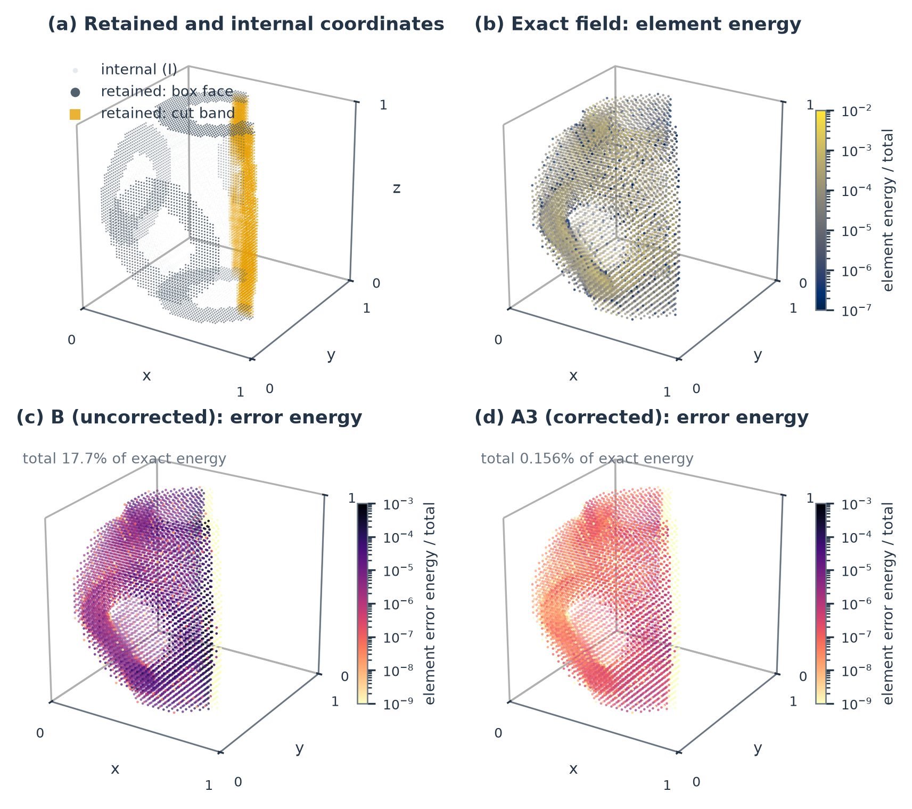
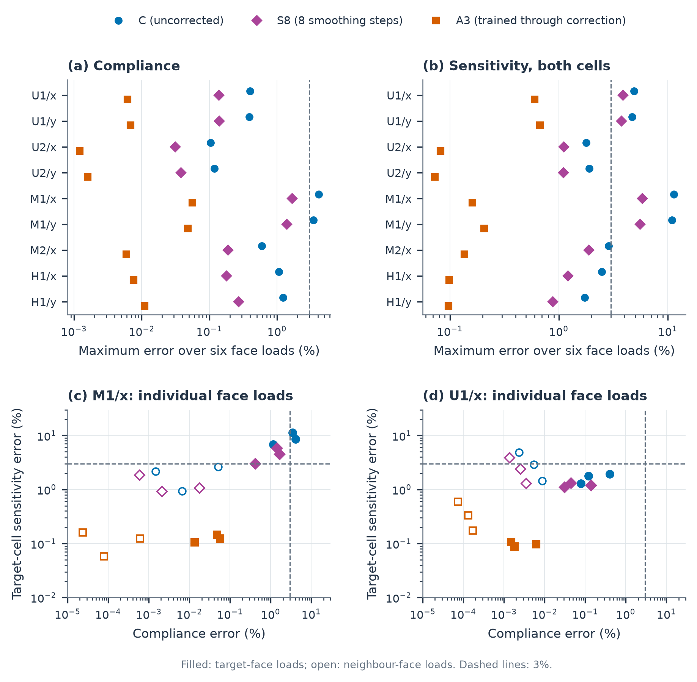

# Learned static condensation for cut thin-walled TPMS cells with equilibrium correction

## Abstract

A learned substructure must reproduce the interior deformation induced by its neighbours as well as the forces it transmits to them. We develop a geometry-conditioned neural displacement extension for cut thin-walled triply periodic minimal surface (TPMS) cells and couple it to an interior equilibrium correction that is applied in both training and evaluation. The extension is linear in retained displacement, reproduces rigid motion, and preserves all prescribed box-face and cut-band coordinates; its energy in a stabilised three-dimensional cut finite element model defines a symmetric, positive semidefinite condensed stiffness. Classical Ritz orthogonality makes the stiffness excess quadratic in the interior extension error, and we connect it to the assembled compliance discrepancy through the energy participation of each cell and to thickness sensitivity through the stiffness derivative. The analysis explains why an uncorrected learned extension can give accurate compliance but inaccurate local sensitivity, and it motivates the correction: Chebyshev smoothing and a trilinear coarse solve applied to the learned field at fixed retained displacement. Trained through this correction, the predictor attains mean directional energy errors of [TBD:newval2-A3-forcec-mean] under consistent tractions on 80 unseen geometries. In assemblies with a continuous-thickness neighbour it keeps the compliance error below 0.06% and the eight-corner thickness-sensitivity error below 0.7% in all nine configurations, whereas the uncorrected predictor exceeds a 3% sensitivity error in four. Under the same correction budget, the learned starting field is 7 to 250 times more accurate than a harmonic extension. [TBD:abstract-lattice-cost]

**Keywords:** static condensation; learned substructures; cut finite elements; TPMS; displacement extension; equilibrium correction; structural sensitivity.

## 1. Introduction

Finite structures built from thin-walled triply periodic minimal surface (TPMS) cells combine spatially varying thickness with supports, external loads and cells cut by the specimen boundary. Graded TPMS specimens have been manufactured and mechanically tested, establishing the relevance of local geometric variation to finite cellular structures. [Yu et al. (2019)](https://doi.org/10.1016/j.matdes.2019.108021) A reusable cell model must respond to the displacement imposed by the surrounding structure, whose pattern depends on both loading and neighbouring cells. Its interior field determines local design quantities, while its returned forces determine the assembled equilibrium. Understanding how error in the learned field affects these two responses is therefore central to using such models in structural analysis and design.

Static condensation exposes the two approximation choices in this problem. Interior equilibrium defines a Schur complement on retained displacement coordinates; multiscale basis constructions similarly transmit fine-scale mechanics through locally adapted fields. [Hou & Wu (1997)](https://doi.org/10.1006/jcph.1997.5682) Reducing the retained coordinates, as in transfer-operator constructions of port spaces, changes the displacement patterns that substructures can exchange. [Smetana & Patera (2016)](https://doi.org/10.1137/15m1009603) Approximating the interior extension changes the response to each of those patterns. This work holds the retained coordinates fixed and asks how a learned interior field can be corrected, how its remaining error propagates through assembly, and whether compliance accuracy suffices for local thickness sensitivity.

Learning extends these choices by constructing reusable local approximations across geometries and material distributions. Problem-independent machine learning (PIML) predicts substructure shape functions and condensed stiffnesses, imposes rigid-motion constraints, and constructs stiffness from predicted shape functions through \(N^TKN\). Its general boundary-coordinate formulation also permits an additional prescribed interpolation; the three-dimensional examples use a corner-based linear interpolation. [Huang et al. (2023)](https://doi.org/10.1016/j.eml.2023.102041) Subsequent work trains continuous numerical shape functions by minimum potential energy and applies PIML substructures to three-dimensional lattice optimisation. [Huang et al. (2024)](https://doi.org/10.1016/j.jmps.2024.105893) [Xu et al. (2025)](https://doi.org/10.1016/j.compstruct.2025.119330) The PIML-OFEM preprint combines oversampled local bases in a partition-of-unity overlapping formulation. [Guo et al. (2026)](https://arxiv.org/abs/2607.22019v1)

Related energy-based models address the structure of local operators and their assembly. Embedded learned elements use symmetric positive-semidefinite stiffness representations. [Parish et al. (2024)](https://doi.org/10.1007/s00466-024-02481-5) The convex neural energy elements preprint learns geometry-dependent boundary energies from Schur-complement targets; its reported linear field recovery uses exact interior lifting. Its nonlinear study also evaluates trial-field energies and differentiates through interior Newton refinement. [Jiang et al. (2026)](https://arxiv.org/abs/2608.02036v1) These precedents place the present work within learned shape-function and variational substructure methods. Here the question is how an approximate interior extension, used in both assembly and field recovery, can be corrected on the prescribed cut-cell coordinates, and how its remaining error affects compliance and local thickness sensitivity.

We construct a geometry-conditioned neural extension on the full prescribed retained space of a stabilised three-dimensional cut finite element model. [Burman et al. (2015)](https://doi.org/10.1002/nme.4823) Box-face coefficients carry exterior loads and intercell coupling, and cut-band coefficients preserve virtual work on the cut surface. The network's geometry branch generates interaction and transfer coefficients; its displacement branch uses those coefficients in a linear multilevel map. Retained values and rigid-body motion are imposed deterministically. The resulting extension supplies both a recoverable displacement field and, through its energy in the prescribed stiffness, a matrix-free condensed action. This construction gives learning a specific mechanical role: approximating internal equilibrium for each admissible retained displacement.

The equilibrium residual makes that approximation amenable to numerical correction. Classical subspace correction gives an energy interpretation to local and coarse updates. [Xu (1992)](https://doi.org/10.1137/1034116) Hybrid neural solvers combine prediction with relaxation, learned inverse actions or coarse spaces, as in HINTS, DeepONet-based preconditioners and the geometric multigrid transformer. [Zhang et al. (2024)](https://doi.org/10.1038/s42256-024-00910-x) [Kopaničáková & Karniadakis (2025)](https://doi.org/10.1137/24m162861x) [Xing et al. (2026)](https://doi.org/10.1145/3811333) Here, polynomial smoothing and an optional interior coarse solve act on the predicted field at fixed retained displacement. Geometry-fixed coefficients and iteration counts preserve a linear extension \(Fq\). Its complete transpose defines the condensed force \(F^TKFq\), so the correction enters the operator used by the assembled equilibrium solve as well as the recovered interior field.

We analyse this construction from local extension error to structural response. Classical Ritz orthogonality makes the condensed-stiffness excess quadratic in the interior extension error and identifies its directional energy with the squared equilibrium residual in the dual interior energy norm. At exact assembled equilibrium, the compliance discrepancy equals the total reconstructed field-error energy; a participation-weighted bound then connects that discrepancy to local directional errors. Thickness sensitivity introduces the stiffness derivative and the scale of the local reference sensitivity, while the complete derivative of surrogate compliance also includes the design dependence of the extension. Together, these relations explain the mechanical effect of equilibrium correction and the different accuracy requirements of global work and local design quantities.

The contributions are as follows. (i) A geometry-conditioned displacement extension for cut, non-periodic, thin-walled cells on the full retained space of a stabilised cut finite element model, whose energy defines a symmetric, positive semidefinite condensed stiffness with exact rigid-body behaviour. (ii) An error analysis that follows the interior extension error to the assembled compliance, through the energy participation of each cell, and to the local thickness sensitivity, through the stiffness derivative, and that quantifies why small displacement errors produce large energy errors in thin walls. (iii) An interior equilibrium correction, combining Chebyshev smoothing and a coarse Galerkin solve, that preserves the variational structure, enters both training and evaluation, and brings the compliance and eight-corner sensitivity errors of assembled cells below one percent in all configurations examined.

Sections 2 and 3 define the discrete substructures and their learned displacement extension. Section 4 develops the error relations that motivate the equilibrium corrections in Section 5. Section 6 tests local correction and the distinction between compliance and thickness sensitivity, with population, retained-space and workload comparisons providing context. Sections 7 and 8 discuss the resulting mechanics and conclusions.

## 2. Discrete substructures and static condensation

### 2.1. Geometry and discrete elastic problem

We consider three-dimensional thin-walled TPMS cells in the reference box \(\mathcal B=[0,1]^3\). Their material domain is defined by a P-type trigonometric level-set field, a spatially varying band parameter, and an optional planar cut:

\[
\phi(x)=\sum_{a=1}^{3}\cos(2\pi x_a),\qquad
\tau(x)=\sum_{c\in\{0,1\}^{3}}N_c^{Q_1}(x)\tau_c,\qquad
\Omega(\eta)=\{x\in\mathcal B:|\phi(x)|\le\tau(x),\ \boldsymbol n\cdot x\le b_{\rm cut}\}.
\tag{1}
\]

The eight parameters \(\tau_c\) are interpolated by the trilinear functions \(N_c^{Q_1}\). They control the implicit band width and hence the material distribution; they are not pointwise physical wall thicknesses. The half-space constraint is omitted for an uncut cell. The descriptor \(\eta\) collects geometry, material and discretisation parameters.

The elastic problem uses continuous tensor-product \(Q_2\) displacement functions on a Cartesian background mesh. Integration over the material domain supplies the bulk stiffness, and ghost-penalty stabilisation couples neighbouring active elements to control small-cut effects [Burman et al. (2015)](https://doi.org/10.1002/nme.4823). The resulting symmetric matrix \(K\) defines the stabilised discrete energy \(\tfrac12u^TKu\). The reference in this work is the equilibrium of this specified discrete system. Figure 1 shows representative geometries and Table 1 records the principal settings; Appendix A gives the integration and assembly details.

**Figure 1. Representative validation geometries.** The same unit-box scale and viewing direction are used for (a) uncut U1, (b) moderately cut M1, and (c,d) heavily cut H1 and H2. Blue denotes the material surface and orange the macro-cut section. Percentages indicate the retained macro-domain volume relative to the unit box, before intersection with the thin-wall material. Surfaces are reconstructed from the trilinear band parameters and cut-plane data in Eq. (1); the visualisation sampling is specified in Supplementary Note S3.

### 2.2. Retained degrees of freedom and equilibrium extension

The retained coordinates are chosen from the kinematics of cell coupling and the support of the boundary-load functional. For each cell, the set \(P\) contains the active box-face displacement coefficients and all displacement coefficients of active elements carrying a positive-area macro-cut patch. The latter form a cut band: although some of its nodes lie away from the cut plane, their finite element basis functions contribute to displacement and virtual work on that plane. Keeping these coefficients gives the full retained space used throughout prediction and assembly. It includes both intercell and exterior-boundary coordinates; interior equilibrium is approximated within this fixed space.

Let \(I\) denote the remaining internal degrees of freedom, \(p=|P|\), \(i=|I|\), and \(n_a=p+i\). The selectors \(J_P\) and \(J_I\) extract the two sets from the active displacement vector, and \(q=J_Pu\) is the retained displacement. Boundary loads act through \(q\); internal body loads are zero. In the displayed \((P,I)\) ordering, static condensation gives

\[
K=\begin{bmatrix}K_{PP}&K_{PI}\\K_{IP}&A\end{bmatrix},\qquad
A=K_{II},\qquad
E=\begin{bmatrix}I_p\\-A^{-1}K_{IP}\end{bmatrix},\qquad
S=K_{PP}-K_{PI}A^{-1}K_{IP}=E^TKE.
\tag{2}
\]

We assume \(K\succeq0\) and \(A\succ0\), so prescribing \(q\) removes every internal zero-energy motion. The equilibrium displacement extension \(u=Eq\) uniquely minimises the discrete energy over \(J_Pu=q\), and \(Sq\) is its work-conjugate retained force. For a connected free substructure, we additionally assume that \(K\) has exactly six rigid-body modes whose restriction to \(P\) has rank six. Figure 2 summarises how the learned extension replaces the interior solve while retaining the same assembly coordinates.

### 2.3. Assembly and response measures

For substructure \(m\), the Boolean assembly map \(B_m\) extracts \(q_m=B_mU\) from the free global retained displacement \(U\). Coincident box-face coordinates are shared; retained cut-band coordinates outside the box faces remain local to their substructure. Fixed homogeneous supports are incorporated into \(B_m\). The reference and approximate assembled systems are

\[
\mathbb K=\sum_mB_m^TS_mB_m,\qquad
\widehat{\mathbb K}=\sum_mB_m^T\widehat S_mB_m,
\qquad
\mathbb K U=f_g,\quad\widehat{\mathbb K}\widehat U=f_g.
\tag{3}
\]

Here \(\widehat S_m\) denotes the approximate condensed stiffness defined in Section 3. Local condensation commutes with assembly because the internal sets are disjoint and all intercell couplings act through retained coordinates. Both systems use the same local stabilised matrices. We assume that the supported reference matrix \(\mathbb K\) is positive definite.

Under a prescribed force \(f_g\), compliance is \(C=f_g^TU\), with \(\widehat C=f_g^T\widehat U\) and relative error \(e_C=|\widehat C/C-1|\). Local operator accuracy is measured by the relative directional energy excess defined in Section 4.1. Thickness sensitivities use the eight-component vector defined in Section 4.3, with relative Euclidean error \(e_s=\|\widetilde{\boldsymbol s}-\boldsymbol s\|_2/\|\boldsymbol s\|_2\). All relative measures use a nonzero reference denominator. Directional means are formed within each geometry before population statistics are computed; Section 6 specifies the geometry and load sets for each comparison.

**Table 1. Discretisation and internal-correction settings**

| Quantity | Setting |
|---|---|
| Reference geometry | Unit box; P-type implicit band with trilinear corner parameters and an optional planar cut |
| Displacement approximation | Continuous tensor-product \(Q_2\) solid elements on a Cartesian background mesh |
| Background resolution, validation geometries | \(n=32\) elements per axis; \(65\) Q2 node positions per axis |
| Isotropic material, validation geometries | Normalised Young's modulus \(E_Y=1\), Poisson's ratio \(\nu=0.3\) |
| Ghost-penalty coefficient, validation geometries | \(\gamma=10^{-4}\) |
| Retained space | Active box-face coefficients and all coefficients of active elements carrying a positive-area macro-cut patch |
| Standard volume integration | \(4^3\) initial subcells; one local refinement of partial subcells; clipped Kuhn tetrahedra with quadrature-rule parameter 4 |
| Smoothing interval | \([b/30,b]\), with \(b=1.05\widehat\lambda_{\max}\) estimated by 40 power iterations |
| Principal interior coarse space | Trilinear vector functions on a \(17^3\)-vertex grid, restricted to the internal degrees of freedom |
| Thickness-difference step | \(h_c=10^{-5}\tau_c\), with fixed active coordinates and ghost contribution |
| Correction of the principal predictor | 8 Chebyshev steps, \(Q_1(17)\) Galerkin solve, 8 Chebyshev steps; same sequence in training and evaluation |
| Arithmetic | Network in single precision (true fp32 convolutions); stiffness actions, smoothing, coarse solve and energies in double precision |

The mesh, material and stabilisation entries apply to all 80 validation geometries. Length is expressed relative to the unit reference box and the modulus is normalised. Integration and spectral-estimation entries specify the standard implementation. The coarse dimension and smoothing count vary by geometry and correction sequence and are reported with those comparisons. Training populations and the computational benchmark are specified in Tables 2 and 5.

## 3. Geometry-conditioned neural displacement extension

The method combines a geometry-conditioned displacement extension with an internal equilibrium correction. Figure 2 shows how the resulting field defines both the condensed action and the displacement recovered after assembly.

**Figure 2. Learned displacement extension, equilibrium correction and variational assembly.** (a) Rigid motion is separated from the retained displacement before the deformation is extended by the network. The rigid field is reconstructed and the prescribed retained values are restored; correction then reduces internal imbalance at fixed retained displacement. (b) Applying the local stiffness and the complete extension transpose gives the work-conjugate retained force. The assembled solution supplies the inputs for local field recovery. The neural extension is detailed in Figure 3; Section 5 defines the internal correction.

### 3.1. Geometry-conditioned multilevel displacement extension

The learning target is the internal equilibrium map \(q\mapsto E_Iq=-A^{-1}K_{IP}q\). Approximating this map provides both a displacement field and, through its energy, an action of the condensed operator on the complete retained space. This choice connects the learned representation to local shape-function methods [Huang et al. (2023)](https://doi.org/10.1016/j.eml.2023.102041), while keeping every prescribed retained coordinate. The architecture has two requirements: it must adapt to the distribution of material and support in each cell, and it must respect displacement superposition at a fixed geometry. Figure 3 shows how these requirements lead to a nonlinear geometry branch coupled to a linear, multilevel displacement branch.

Rigid motion is separated before learning. Let \(R\in\mathbb R^{n_a\times6}\) contain three translations and three rotations about a common centre, and let \(R_P=J_PR\). The coefficient extractor \(C_R=(R_P^TR_P)^{-1}R_P^T\) and projector \(\Pi_P=I_p-R_PC_R\) decompose the input into rigid coefficients \(C_Rq\) and retained deformation \(q_d=\Pi_Pq\). The network extends only \(q_d\). This decomposition reserves its approximation capacity for deformation and makes rigid reconstruction independent of training accuracy.

The geometry branch describes where the discrete body carries and transmits stiffness. Element moments resolve the material distribution within each background cell; node features identify retained and cut-band membership, weak support, local stiffness magnitude and position. Encoders form element and node embeddings, which exchange information in two successive rounds. From these embeddings, coefficient heads assign weights to prescribed element and ghost-face incidences, to transfers between latent grids, and to coarse-grid convolutions. The incidence maps and retained-coordinate semantics are deterministic. Geometry conditioning changes their numerical action, with coefficients that remain fixed for all displacement directions on the same geometry.

The displacement branch first lifts the three components of \(q_d\) to 32 channels on retained nodes and sets the internal features to zero, defining \(X^0(q)\). Local interactions then propagate these values through the element and ghost-face neighbourhoods. Each interaction gathers the features on a 27-slot stencil into four weighted heads, mixes the channels within each head, and scatters the result back to the incident nodes. Separate gather and scatter coefficients permit directional coupling across the stencil. With internal and retained masks \(M_I,M_P\) acting on nodal rows, an interaction updates the latent field by

\[
X^{\ell+1}=M_I\left[X^\ell+
 \sum_h\mathcal S_{\ell h}(\eta)
   \big(\mathcal G_{\ell h}(\eta)X^\ell W_{\ell h}\big)\right]
 +M_PX^0(q).
\tag{4}
\]

Here \(\mathcal G_{\ell h}\) and \(\mathcal S_{\ell h}\) are geometry-weighted gather and scatter maps, and \(W_{\ell h}\) mixes channels. The residual form preserves the incoming state, while the final term restores the retained features. Element interactions follow the local \(Q_2\) support, and ghost-face interactions communicate across face neighbourhoods present in the stabilised discretisation. They approximate the displacement response; the mechanical stiffness continues to be defined by \(K\).

Internal equilibrium also couples locations separated by many element neighbourhoods. A U-shaped latent hierarchy supplies this longer-range communication. Four local interaction pairs precede restriction through grids with 65, 33, 17 and 9 positions per axis. At each coarser level, two residual convolutions mix neighbouring latent features. The upward pass applies two further convolutions before prolongation and adds the stored state at the receiving finer level. These additive skips retain local information while the coarse path distributes information across larger distances. All levels carry 32 displacement channels. After returning to the active fine nodes, four local interaction pairs combine the multilevel result with the element and face neighbourhoods, and four additional pairs act on stencils containing weakly supported nodes. A linear 32-to-3 map reconstructs nodal displacement. Appendix G gives the complete order of operations and coefficient definitions.

Every displacement operation is linear: the nonlinear encoders and coefficient bounds act only on geometry. The resulting raw map \(\mathcal N_\theta(\eta)\) therefore obeys superposition for a fixed geometry \(\eta\), despite its nonlinear dependence on that geometry. Adding back the rigid field and restoring the original retained values gives

\[
\widehat E q=J_P^Tq+
J_I^TJ_I\left[RC_Rq+\mathcal N_\theta(\eta)\Pi_Pq\right].
\tag{5}
\]

Consequently, \(J_P\widehat E=I_p\) and \(\widehat ER_P=R\): admissibility and rigid reproduction hold by construction. The latent hierarchy changes how the deformation extension is computed; the mechanical input and output retain their original coordinates. Its learned communication also serves a different purpose from the residual-based equilibrium corrections introduced in Section 5, which act on the reconstructed field using \(K\).

**Figure 3. Geometry-conditioned neural displacement architecture.** (a) Element and node encoders produce 64-channel geometry embeddings, followed by two rounds of residual exchange. Coefficient heads condition the local interactions, grid transfers and convolutions. (b) The displacement branch propagates the nonrigid retained input through four local interaction pairs, the multilevel block, four further local pairs and four pairs on weakly supported stencils. Linear input and output maps connect the three displacement components to 32 latent channels. Deterministic bypasses reconstruct rigid motion and restore the original retained values. (c) Restriction and prolongation connect grids with 65, 33, 17 and 9 background positions per axis; actual active node counts depend on geometry. Each coarse level has two residual convolutions on each pass, and upward transfers combine with additive skips. (d) A local interaction uses geometry-weighted gathering, four channel-mixing heads and scattering, followed by residual addition and retained-value restoration. E and G denote element and ghost-face interactions. Blue dashed arrows carry geometry-dependent coefficients; solid arrows carry features or displacement states. Channel-mixing matrices and convolution kernels are shared trainable parameters. For fixed geometry, the complete displacement path is linear. Training updates parameters through both branches; inference reuses the geometry coefficients.

### 3.2. Variational condensed stiffness

The learned field becomes a mechanical operator by evaluating its energy with the original local stiffness. Let \(\mathcal W\) be a fixed linear internal correction that preserves retained values, with the identity corresponding to no correction. For each geometry, the correction schedule and its coefficients are fixed independently of the displacement query. The final extension and its condensed stiffness are

\[
F=\mathcal W\widehat E,\qquad
\widehat S=F^TKF,\qquad
\widehat{\mathcal U}(q)=\tfrac12q^T\widehat S q,\qquad
\widehat f_P=\widehat S q.
\tag{6}
\]

Thus a single displacement representation determines the energy and retained force. For a virtual retained displacement \(\delta q\), the corresponding full virtual field is \(F\delta q\), and \(\delta\widehat{\mathcal U}=(F\delta q)^TKFq=\delta q^TF^TKFq\). Applying the condensed operator therefore requires the transpose of the complete extension after the stiffness action. This includes the rigid reconstruction, retained-value restoration and any internal corrections. With \(F_I=J_IF\), its block form is

\[
\widehat S q=(KFq)_P+F_I^T(KFq)_I.
\tag{7}
\]

The second term transfers the work of the internal residual to the retained coordinates. It vanishes for an equilibrated field; otherwise it is needed for the returned force to be the derivative of the stated energy. Symmetry and positive semidefiniteness follow from \(K=K^T\succeq0\), without requiring symmetry of the learned gather, scatter or grid-transfer maps. Under the rigid-kernel assumption of Section 2.2 and \(FR_P=R\), the only null modes of \(\widehat S\) are the retained rigid-body modes. Appendix B proves this statement, and Appendix E derives the complete transpose.

This construction also provides a common field representation for subsequent mechanics. After an assembled solve, \(F_mB_m\widehat U\) supplies the local reconstructed displacement for response and sensitivity evaluation. Accuracy is governed by how closely that field satisfies internal equilibrium. Section 4 quantifies its effect on condensed energy and mechanical response, and Section 5 uses the same residual to correct the field while preserving the retained values.

### 3.3. Training directions and objective

Training probes the extension through retained displacement directions that exercise different forms of local deformation and interaction with neighbouring cells. Prescribed polynomial and multiscale displacements supply broad spatial content. Responses to equilibrated nodal loads and consistent tractions, spring-supported responses, and displacements induced by a neighbouring cell supply mechanically generated directions. Rigid components are removed and each retained direction is normalised to \(q_j^TSq_j=1\) using the reference substructure solution. This energy normalisation makes the objective compare approximation quality across directions with different amplitudes and stiffnesses. For a batch of \(B\) directions, the objective is

\[
\mathcal L(\theta)=\frac1B\sum_{j=1}^{B}\log(q_j^T\widehat S q_j)
 +w_s\frac1{|\mathcal J_s|}\sum_{j\in\mathcal J_s}
 \frac{\|\widetilde{\boldsymbol s}_j-\boldsymbol s_j\|_2^2}{\|\boldsymbol s_j\|_2^2},
\tag{8}
\]

The energy term is the mean logarithm of the predicted-to-reference energy ratio. For an admissible extension, the variational identity in Section 4 makes its minimum correspond to the equilibrium field on each sampled direction. The sensitivity term additionally measures the complete eight-corner vectors, so that training accounts for how the reconstructed field weights the local design derivatives. The set \(\mathcal J_s\) contains directions with reference sensitivity labels; this term is omitted when the set is empty, and the reported configurations use \(w_s=1\). Gradients with respect to \(\theta\) pass through the reconstructed field to the geometry encoders, coefficient heads and linear displacement maps. The stiffness, retained-coordinate maps and rigid basis define the mechanical objective deterministically.

The correction of Section 5 can also be placed inside the training loop. The principal predictor evaluates Eq. (8) on the corrected extension \(F=\mathcal W\widehat E\), with \(\mathcal W\) the eight-step smoothing, trilinear coarse solve and eight-step smoothing sequence of Section 5.2. Because \(\mathcal W\) is linear and fixed for a given geometry, the gradient of Eq. (8) passes through the smoothing recurrence and the coarse solve to the network parameters; the network is thereby trained to supply the initial field that the correction completes, rather than a field that must be accurate on its own. The smoothing interval and coarse factorisation depend only on \(K\) and are recomputed per geometry, so training through the correction adds no trainable parameters.

Finite direction banks sample only part of the retained space. Large-energy-ratio directions are therefore sought by a block search on the rigid complement and by a search within the span of stored directions. Adding them focuses subsequent training on observed weaknesses of the extension. Geometry augmentation uses the 48 cube symmetries with consistent transformations of vector components; predicted fields are returned to the original frame for mechanical evaluation. Appendix G specifies the direction classes, sampling weights, normalisation and optimisation settings. Table 2 identifies the model roles, and Table ST12 records the training and weight-selection settings. The fixed-weight correction study in Section 6.5 changes the internal correction while using the same learned extension.

## 4. Extension error and mechanical response

Once the retained coordinates are fixed, the local approximation lies in the interior field associated with each retained displacement. Its mechanical significance follows from the energy carried by the departure from equilibrium. We first relate this departure to condensed stiffness, then examine how assembly and thickness differentiation weight the same field error. These relations provide the basis for the internal correction in Section 5.

### 4.1. Variational energy error

For the specified symmetric stiffness \(K\succeq0\), with \(A=K_{II}\succ0\) and zero internal body loads, \(Eq\) minimises the energy at prescribed \(q\). Any admissible linear extension \(F\), with \(J_PF=J_PE=I_p\), differs from it only internally. Writing \(H=J_I(F-E)\), internal stationarity \(J_IKE=0\) eliminates the cross terms in \(F^TKF\) and gives the discrete Ritz identity

\[
\boxed{\widehat S-S=H^TAH\succeq0.}
\tag{9}
\]

The learned extension therefore adds stiffness in proportion to the energy of its internal error. The absence of a first-order term follows from equilibrium of the reference field. For \(u=Eq\), \(\widehat u=Fq\) and \(d_I=Hq\), the internal residual \(r_I=(K\widehat u)_I\) satisfies \(r_I=Ad_I\). The relative directional energy excess \(\varepsilon(q)=q^T(\widehat S-S)q/(q^TSq)\) can consequently be written as

\[
\varepsilon(q)=\frac{d_I^TAd_I}{q^TSq}
=\frac{r_I^TA^{-1}r_I}{q^TSq}.
\tag{10}
\]

Equation (10) identifies the squared \(A^{-1}\)-norm of the internal residual as the stiffness-error measure. The residual itself is available from the reconstructed field and the known stiffness, so it also supplies a correction without requiring the reference extension. Appendix B gives the corresponding all-direction norm; evaluation over a finite direction bank samples this energy error.

### 4.2. Assembled compliance and energy participation

The local stiffness excess changes both the global retained solution and the fields recovered within each substructure. Consider the exact equilibria of the two supported systems in Eq. (3), with the same local matrices, fixed assembly maps and homogeneous supports, and the same nonzero retained load. The supported reference stiffness is positive definite as assumed in Section 2.3. Writing \(u_m=E_mB_mU\), \(\widehat u_m=F_mB_m\widehat U\) and \(a(v,v)=\sum_m v_m^TK_mv_m\), global equilibrium and local energy orthogonality give

\[
\boxed{C-\widehat C
=a(\widehat u-u,\widehat u-u)
=\|\widehat U-U\|_{\mathbb K}^{2}
+\sum_m\|H_mB_m\widehat U\|_{A_m}^{2}.}
\tag{11}
\]

Compliance underestimation is therefore the total reconstructed error energy. Its two contributions have distinct mechanical origins: the changed retained solution and the internal departure from equilibrium at that solution. Their orthogonality makes the energy partition exact. The additional work associated with incomplete global equilibrium is treated in Section 5.3.

The influence of a local approximation depends on how much energy that substructure carries under the applied load. At the exact assembled traces \(q_m=B_mU\), define \(w_m=q_m^TS_mq_m/C\) and \(\beta=\sum_mw_m\varepsilon_m(q_m)\). Contributions from rigid zero-energy responses are defined as zero, consistently with the exact rigid reproduction imposed in Section 3. The energy fractions \(w_m\) sum to one, and

\[
0\le\frac{C-\widehat C}{C}\le\frac{\beta}{1+\beta}\le\beta.
\tag{12}
\]

The weighted product \(w_m\varepsilon_m\) links local stiffness error to global work. Small participation can attenuate a substructure's effect on compliance even when its local field remains inaccurate. Consequently, accurate compliance under a particular load does not establish uniform local accuracy. Appendix J.3 derives this load-specific bound and the associated asymptotic expansion.

### 4.3. Field-based sensitivity and the complete design derivative

Thickness sensitivity weights the field through the change in stiffness caused by a material variation. On a differentiable design interval with fixed active and retained coordinates, assembly maps, homogeneous supports and a design-independent load, the exact compliance sensitivity is \(s_c=-u^TK_{,c}u\), where \(K_{,c}=\partial K/\partial\tau_c\); contributions are summed over affected substructures. Internal stationarity gives \(S_{,c}=E^TK_{,c}E\), eliminating the design derivative of the exact extension from the force-controlled compliance derivative [Giles & Pierce (2000)](https://doi.org/10.1023/a:1011430410075).

The field-based estimate \(\widetilde s_c=-\widehat u^TK_{,c}\widehat u\) uses the same stiffness derivative with the reconstructed field. At the same retained displacement,

\[
\widetilde s_c-s_c=-2d^TK_{,c}u-d^TK_{,c}d,
\qquad u=Eq,\quad d=Fq-Eq.
\tag{13}
\]

Internal equilibrium sets \((Ku)_I=0\), but generally leaves \((K_{,c}u)_I\ne0\). The linear cross term in Eq. (13) therefore survives the stationarity that removed it from the stiffness error. Its magnitude relative to the quadratic term depends on the derivative-weighted fields: its presence does not imply first-order dominance at finite error, and decreasing energy error need not decrease sensitivity error monotonically. For corner thickening, nonnegative trilinear shape functions generate nested material domains. With fixed basis, material and ghost contribution, exact integration gives \(K_{,c}\succeq0\); even then the cross term can have either sign. Appendix J.4–J.5 gives the corresponding sensitivity bounds and design assumptions.

Assembly introduces a further field change through \(\Delta q=\widehat q-q\). The local discrepancy becomes \((F-E)q+E\Delta q+(F-E)\Delta q\), combining extension error, changed retained displacement and their interaction. The field-only and solution-only replacements in Section 6 isolate the first or second effect; their sensitivity norms are not additive contributions.

The derivative of surrogate compliance also accounts for the design dependence of the approximate extension. For a parameter affecting one substructure, differentiation at fixed retained coordinates gives

\[
\widehat C_{,c}
=-\widehat u^TK_{,c}\widehat u
 -2\widehat q^TF_{,c}^TK\widehat u
=\widetilde s_c-2(F_{I,c}\widehat q)^Tr_I,
\qquad\widehat u=F\widehat q.
\tag{14}
\]

Here \(\widehat q\) is the surrogate's assembled retained solution and \(r_I=(KF\widehat q)_I\); affected-substructure contributions are summed. The second term couples the extension's design dependence to its internal imbalance and vanishes for an equilibrated extension. The reported field-based estimates contain only the first term. A uniformly \(C^1\)-small extension error is sufficient for quadratic accuracy of the complete derivative, as shown by Eq. (J.5) in Appendix J.5; energy accuracy alone does not supply that design-derivative control. Appendix H specifies the numerical stiffness derivatives.

The eight-component vector refers to local corner parameters. For shared design variables \(\boldsymbol\tau_g\) enforcing continuity through \(\boldsymbol\tau_m=\boldsymbol\tau_m(\boldsymbol\tau_g)\), the structural gradient is \(\nabla_{\boldsymbol\tau_g} C=\sum_m(\partial\boldsymbol\tau_m/\partial\boldsymbol\tau_g)^T\boldsymbol s_m\) under the fixed load and assembly maps above. The same parameter map acts on the complete derivatives in Eq. (14) for surrogate compliance.

## 5. Internal equilibrium correction

The stiffness-error identity in Eq. (10) and the compliance relation in Eq. (11) suggest correcting the learned field by reducing its internal imbalance while preserving the retained motion. Polynomial relaxation and coarse energy minimisation address different components of that imbalance within the existing assembly space. Their effect on sensitivity remains governed by the derivative-weighted relations in Eqs. (13)–(14).

### 5.1. Error spectrum and polynomial relaxation

The internal spectrum resolves the error into components on which relaxation acts differently. Set \(D=\operatorname{diag}(A)\) and order the generalised eigenvectors by increasing eigenvalue, \(Av_j=\lambda_jDv_j\), with \(v_j^TDv_k=\delta_{jk}\). For \(c_j=v_j^TDd_I\),

\[
d_I^TAd_I=\sum_j\lambda_jc_j^2,\qquad
\chi_\ell(q)=\frac{\sum_{j=1}^{\ell}\lambda_jc_j^2}{d_I^TAd_I}.
\tag{15}
\]

The fraction \(\chi_\ell\) locates the error energy carried by the first \(\ell\) Jacobi-scaled internal modes. The corresponding exact-field fraction uses its own denominator \(u_I^TAu_I\). These spectra describe relaxation at fixed retained displacement, whereas Eq. (B.8) compares the full error with the loaded response. Polynomial relaxation attenuates the modal coefficients according to their eigenvalues, and a coarse space is chosen to address slowly relaxed interior error.

For each retained input, the learned field provides an initial approximation to \(Au_I=-K_{IP}q\). We apply Jacobi-preconditioned Chebyshev semi-iteration with \(q\) fixed. A prescribed iteration count and geometry-dependent coefficients make the corrected extension linear in displacement, as required for one condensed stiffness operator. Polynomial relaxation supplies a parallelisable component of multigrid methods [Adams et al. (2003)](https://doi.org/10.1016/s0021-9991(03)00194-3); pairing it with a learned initial field exploits their complementary error-reduction properties [Zhang et al. (2024)](https://doi.org/10.1038/s42256-024-00910-x).

For a degree-\(k\) error polynomial, the update is \(P_kd_I\), where \(P_k=p_k(D^{-1}A)\). Each coefficient in Eq. (15) is multiplied by \(p_k(\lambda_j)\), connecting the polynomial directly to the error-energy distribution. The Chebyshev polynomial targets \([a,b]\), \(0<a<b\), and is nonexpansive in the \(A\)-energy norm if the actual positive spectrum of \(D^{-1/2}AD^{-1/2}\) lies in \((0,b]\). Modes below \(a\) can decay slowly, providing the reason for a complementary coarse update. The correction sequences use \(a=b/30\); Appendix D gives the polynomial, recurrence, interval estimator and contraction bound.

### 5.2. Interior coarse correction

A coarse update removes the part of the remaining error accessible to a prescribed interior space. Let \(V\in\mathbb R^{i\times n_c}\) have full column rank, \(A_c=V^TAV\), and \(b_r=V^Tr_I\). Minimising the energy over \(u_I+\operatorname{range}V\) gives

\[
u_I^{\rm c}=u_I-VA_c^{-1}b_r,\qquad
d_I^{\rm c}=(I_i-VA_c^{-1}V^TA)d_I,\qquad
\|d_I\|_A^2-\|d_I^{\rm c}\|_A^2=b_r^TA_c^{-1}b_r.
\tag{16}
\]

The Galerkin solve enforces equilibrium against the coarse variations, and the last equality measures the energy removed by that projection [Xu (1992)](https://doi.org/10.1137/1034116). The principal basis consists of trilinear vector functions on a \(17^3\)-vertex grid restricted to internal fine-grid coordinates. Other resolutions, quadratic interpolation and linearly enriched partition-of-unity functions provide the comparisons in Section 6.5. All preserve the full retained space. Appendix F specifies the generating families, basis construction and numerical coarse solves.

Placing the coarse update between two \(k\)-step smoothing stages combines these corrections. With \(C_V=I_i-VA_c^{-1}V^TA\) and \(H_0=J_I(\widehat E-E)\), the resulting error is

\[
H_{\rm tg}=P_kC_VP_kH_0,\qquad
\widehat S_{\rm tg}-S=H_{\rm tg}^TAH_{\rm tg}.
\tag{17}
\]

For the exact Galerkin update and \(\|P_k\|_A\le1\), \(S\preceq\widehat S_{\rm tg}\preceq\widehat S_0\). The combined correction therefore removes variational stiffness excess while preserving the condensation target. This ordering also moves exact assembled compliance toward the reference through Eq. (11), although it does not order the sensitivity error in Eq. (13). Appendices D and F state how the polynomial and coarse-solve conditions relate to the actual correction matrices.

### 5.3. Energy-consistent operator application

The corrected field and returned force must derive from the same energy. Geometry-dependent coefficients, maps, smoothing interval and coarse factorisation are prepared once and reused across retained inputs.

**Algorithm 1. Corrected condensed stiffness action.**

1. Extend \(q\) with \(\widehat E\) and apply the prescribed pre-smoothing, coarse and post-smoothing sequence at fixed retained values to obtain \(u=Fq\).
2. Form \(y=Ku\) and return \(F^Ty\): transpose the complete correction in reverse order, followed by the transpose learned extension.
3. Assemble these actions through Eq. (3); after the global solve, recover \(F_mB_m\widehat U\) for field and sensitivity evaluation.

Each forward cycle uses \(2k\) smoothing steps and one coarse solve, with the corresponding reverse operations in the transpose. Appendices E–F give the actions, factorisation and arithmetic details.

At the assembled level, the energy relation also separates approximation error from incomplete equilibrium. For an approximate solution \(\bar U\), define the recomputed residual \(\rho=f_g-\widehat{\mathbb K}\bar U\) using the stated variational operator and the recovered fields \(\bar u_m=F_mB_m\bar U\). Then

\[
C-f_g^T\bar U=a(\bar u-u,\bar u-u)+\bar U^T\rho.
\tag{18}
\]

The signed residual work determines how incomplete solution affects the compliance comparison. Its sign and magnitude depend on the residual and displacement together. Appendix J.6 gives the residual-corrected functional and the additional consistency term required when the numerical action differs from the energy operator.
## 6. Numerical examples

The examples follow the error of a learned local extension into the quantities required for assembled analysis. Population results identify its dependence on geometry and loading; fixed-weight comparisons then establish how much the local error can be reduced by correcting interior equilibrium. The assembled responses examine the distinct accuracy requirements of global compliance and local thickness sensitivity. These are the principal comparisons, with retained-space restriction and computational cost providing complementary perspectives. Response errors are measured against equilibrium of the discrete elastic problem in Section 2.

### 6.1. Geometries, predictors and loading conditions

The 80 validation geometries span uncut, lightly cut, moderately cut and heavily cut cells, with 20 geometries in each stratum. They use the material parameters and background discretisation in Table 1 and comprise 20 uniform, 30 affine and 30 mixed trilinear thickness fields. Their corner parameters range from 0.1762 to 0.6983. Canonical cut normals are \((\cos\vartheta,\sin\vartheta,0)\), with \(0<\vartheta<\pi/4\). Cut severity refers to the retained macro-box volume before intersection with the TPMS material: heavy cuts retain less than one third, moderate cuts between one and two thirds, and light cuts more than two thirds. Table ST11 gives the parameter domain and stratum-specific ranges. U, M and H identify the selected uncut, moderately cut and heavily cut cells used for detailed comparisons.

The predictors in Table 2 separate the contribution of the network, of the correction and of training through the correction. The principal predictor A3 continues B on the larger training population with the complete correction of Section 5.2 inside the training loop (Section 3.3) and applies the same correction when evaluated. B supplies the fixed network for the local correction examples; B+W applies A3's correction to B's unchanged weights, isolating the effect of training through the correction. C continues B without correction. S8 continues B with eight smoothing steps at evaluation; only part of its training steps passed through the smoothing stage, so S8 is used as a comparison predictor and not interpreted as a trained smoothing variant. A2b continues B with eight smoothing steps included in every training step and no coarse solve. P0 provides a reference trained on a smaller population. The historical computational examples use a separate uncorrected predictor D.

**Table 2. Learned predictors and their roles in the numerical comparisons**

| Predictor | Role in the comparison | Training geometries | Correction in training | Correction at evaluation |
| --- | --- | ---: | --- | --- |
| **A3** | **Principal predictor** | 591 | 8 / \(Q_1(17)\) / 8 | 8 / \(Q_1(17)\) / 8 |
| B+W | B's weights with A3's correction, untrained | 305 | None | 8 / \(Q_1(17)\) / 8 |
| A2b | Smoothing-only training | 591 | 8 steps | 8 steps |
| S8 | Comparison predictor | 591 | Partial (see text) | 8 steps |
| C | Uncorrected continuation | 591 | None | None |
| B | Fixed weights for the local correction study | 305 | None | None |
| P0 | Reference with a smaller training population | 148 | None | None |

All predictors share the architecture of Section 3 (603,464 trainable parameters) and the same validation set. A3, A2b, C and S8 continue B for 15,000 steps; B was trained for 40,000 steps with weights selected at step 30,000. A3's continuation took 2.7 h on one NVIDIA GeForce RTX 5090 (peak device memory 29.6 GB). Table ST01 specifies direction-class coverage, and Table ST12 gives training schedules, weight selection and evaluation orientations.

Two properties of the evaluation data are relevant to the comparisons. First, the weights of the continued predictors were selected on a validation list whose first 40 geometries include 20 of the 80 reported validation geometries (6 uncut, 14 cut); selection compared two checkpoints per predictor. Population statistics are therefore also reported for the 60 geometries that did not enter selection. Second, the cells used in the assembly examples served repeatedly as development cases during method development, so the assembly results characterise these configurations rather than an independent test sample. All geometries carry a single planar cut with normal \((\cos\vartheta,\sin\vartheta,0)\); multiple cuts per cell and curved boundaries are outside the present study.

Population statistics first average directional energy excess within each geometry and loading class, then give equal weight to the available geometries. The five basic classes cover all 80 geometries; consistent tractions, single-face consistent tractions, stiffness-scaled supports and neighbour-induced displacements cover smaller subsets (Figure 5 and Table ST01). The population maximum is consequently the largest geometry-level direction mean. This aggregation separates variation across geometries from variation among directions within one cell.

The assembly examples join a learned target to an exact neighbouring cell, with continuous thickness parameters across their common interface. Figure 4 defines the two configurations, supports and load locations. The assembly accuracy solves use preconditioned conjugate gradients with the exact assembled reference factor as preconditioner. Each configuration has six face loads: the three Cartesian traction directions applied separately to the target and neighbour faces. Compliance and each cell's eight-parameter sensitivity vector are compared with their exact counterparts. For sensitivity evaluation, the assembled nodal load is held fixed at its base-design value. We use 3% as a common accuracy reference, taking maxima over the six loads and, for sensitivity, both cells. Three additional tractions on a target cut face are considered separately. Configurations x and y identify the adjoining side.

**Figure 4. Supports and loading of the two-cell examples.** Box envelopes define the coordinate convention. (a) Configuration x: the neighbour is translated by \((-1,0,0)\), the face \(x=-1\) is clamped, and face tractions act at \(y=0\). (b) Configuration y: the translation is \((0,-1,0)\), the face \(y=-1\) is clamped, and tractions act at \(x=0\). Each target (T) and neighbour (N) face carries separate x-, y- and z-directed consistent-traction loads. Coincident box-node coordinates are shared across the interface; non-box cut-band coordinates remain local. Cut targets also receive three macro-cut tractions, analysed separately from the six face loads.

### 6.2. Verification of the discrete reference and of the corrected operator

All errors in this section are measured against equilibrium of the stabilised discrete problem of Section 2, so two properties must be established first: that this reference approximates the elastic response of the thin-walled cells, and that the implemented operator possesses the structure assumed in Sections 3–5.

For the reference, single cells are clamped on one box face and loaded by a unit consistent traction on another face carrying material, in each Cartesian direction, at background resolutions \(n=24\) to 48. On the moderately cut M1, the compliance at \(n=32\) differs from that at \(n=48\) by at most 0.057% over the three load directions, and by 0.21% at \(n=24\). On the heavily cut H1, whose retained part carries no material on its \(z\)-faces and is therefore clamped on \(x=0\) and loaded on \(y=0\), the corresponding differences from \(n=48\) are at most 0.99% at \(n=32\) and 2.1% at \(n=24\), the largest for the in-plane load that bends the remaining wall segments. For heavily cut cells the discretisation error of the reference at \(n=32\) is thus of order one percent, an order of magnitude above the energy errors of the corrected predictor reported below; the comparisons in this section measure the approximation of the discrete operator, not of the continuum. The ghost-penalty contribution to the energy of these loaded fields is \(5\times10^{-5}\) of the total at \(n=32\) and decreases with refinement (from \(1.5\times10^{-4}\) at \(n=24\) to \(1.5\times10^{-5}\) at \(n=48\) on M1). [TBD:refvalid-M2-U1] Varying the penalty coefficient between \(10^{-5}\) and \(10^{-3}\) changes the compliance by [TBD:refvalid-gamma], and a refined volume integration by [TBD:refvalid-integ]. The central-difference stiffness derivative used for the reference sensitivities agrees with differences of the re-solved compliance to [TBD:refvalid-fd] and is insensitive to the step between \(10^{-6}\tau_c\) and \(10^{-3}\tau_c\) [TBD:refvalid-fd-h].

For the operator, the deployed implementation evaluates the network in single precision and the stiffness actions, smoothing and coarse solve in double precision. On M1, M2, H1 and H2, the bilinear form \(q_i^T\widehat Sq_j\) is symmetric to a relative \(3\times10^{-8}\), the returned work \(q^T\widehat Sq\) agrees with the energy of the recovered field \(q^TF^TKFq\) to \(2\times10^{-8}\), and the deployed operator reproduces the training-time field to \(10^{-7}\). The rigid-body energy \(r^T\widehat Sr\) of normalised rigid modes is at most \(2\times10^{-11}\) of a typical deformation energy. The Chebyshev interval requires \(b\ge\lambda_{\max}(D^{-1}A)\) for the energy contraction of Section 5.1; the power-iteration estimate \(b\) exceeds the Lanczos value of \(\lambda_{\max}\) by 3.9–4.3% in all four cells, whereas the guaranteed Gershgorin bound exceeds it by factors of 11 to 20 and would slow the smoothing accordingly. The contraction condition is therefore verified per cell rather than guaranteed a priori.

### 6.3. Dependence on geometry and loading

Consistent tractions are the principal loading class. They represent the surface loads and neighbour tractions of an assembled structure, and the energy of their exact fields resides almost entirely in the bulk material: the ghost-penalty contribution is below 0.05% of the exact field energy in all cells examined in Section 6.4. Equal nodal forces on the retained coordinates, by contrast, also load weakly supported nodes of small cut elements, and 49–81% of the corresponding exact field energy resides in the ghost-penalty term. The nodal-force class is therefore retained as a stress test of the stabilised discrete problem, not as the measure of mechanical accuracy.

The principal predictor removes most of the geometric dependence of the uncorrected extension (Figure 5). Under consistent tractions, A3's mean directional energy excess is [TBD:newval2-A3-forcec-strata] across the uncut, lightly, moderately and heavily cut strata of all 80 geometries, compared with [TBD:newval2-B-forcec-strata] for B. The same holds for the loading classes that probe assembly: neighbour-induced retained displacements give [TBD:newval2-glued] and spring-supported faces [TBD:newval2-supportk]. On the nodal-force stress test, B's mean increases from 0.908% in uncut cells to 11.3% in heavily cut cells, with a largest geometry mean of 70.1%, whereas A3's stratum means lie between 0.0135% and 0.0897% and its largest geometry mean is 0.325%. Restricting the statistics to the 60 geometries that did not enter weight selection leaves A3's nodal-force mean essentially unchanged (0.0591% against 0.0579% on all 80).

The intermediate predictors locate this improvement. C, which continues B without correction, changes the population means only marginally (nodal forces 4.61% against 5.04%). S8, evaluated with eight smoothing steps, reduces the mean to 0.672%, and A3 to 0.0579%. The fixed-weight examples in Section 6.5 separate the contribution of the correction from that of the network weights.

Orientation supplies another source of variation. Under the tested nonidentity cube transformation, B's consistent-traction mean changes from 6.62% to 7.49%. Thus the transformed examples expose differences that are hidden by evaluation in a single orientation. The distributions in Table ST01 and Figure S02 motivate examining both the magnitude and the internal structure of the extension error.

**Figure 5. Geometry and loading dependence of directional energy error.** (a,b) Geometry-weighted means under nodal-force and spring-supported loading, with 20 geometries per cut-severity stratum. (c) Means under consistent tractions, single-face consistent tractions, stiffness-scaled supports and neighbour-induced retained displacements; counts indicate geometries with an available observation. Panels (a–c) use the original orientation. (d) Paired nodal-force results for B on all 80 geometries in the original and transformed orientations. Open circles denote uncut cells and filled triangles cut cells; the dashed line denotes equality. Each observation is a geometry's mean directional energy excess, \(q^T(\widehat S-S)q/(q^TSq)\).

### 6.4. Components of the extension error

To relate the geometric variation to interior equilibrium, we examine where B's field error lies in the Jacobi-scaled internal spectrum (Figure 6). Under consistent tractions on M1, the lowest 200 modes contain 24.5% of the error energy and 4.87% of the exact-field energy. These modes have eigenvalues from \(5.74\times10^{-4}\) to \(1.13\times10^{-2}\), all below the lower endpoint \(a=0.173\) of the smoothing interval. In H2, the corresponding eigenvalue range is \(2.13\times10^{-2}\) to \(0.416\), and 66 of the 200 modes lie below \(a=0.138\). The error thus occupies different parts of the spectrum targeted by relaxation. These low-mode locations are consistent with the different smoothing rates examined in Section 6.5 and motivate an additional correction for slowly relaxed components.

The spectral distribution also depends on loading within the same cell. For U1, the lowest 200 modes contain 24.0% of the error energy and 8.50% of the exact-field energy under consistent tractions, compared with 5.04% and 7.98% under nodal forces. This reversal at fixed geometry shows why the error spectrum must be assessed for the response directions of interest. Table ST02b gives the eigenvalue endpoints and their relation to the smoothing intervals. These modes describe the internal problem at prescribed retained displacement.

**Figure 6. Spectral distribution of the uncorrected extension error.** Panels show U1, M1, M2 and H2 for predictor B. Modes solve \(Av=\lambda Dv\), with \(A=K_{II}\) and \(D=\operatorname{diag}(A)\), and are ordered by increasing eigenvalue. Filled orange markers represent the extension error and open grey markers the exact internal field. Solid circles correspond to consistent tractions and dashed triangles to nodal forces. Curves are directional means; bands give the 10th–90th directional percentiles under consistent tractions. Each cumulative fraction uses the total internal energy of its own field or error as denominator.

Where in the cell the error resides is shown in Figure 7 for M1 under one consistent-traction direction. The exact field distributes its energy over the thin walls, with 8% of it in the layer of elements within two element widths of the cut plane, a layer that contains 13% of the elements. B's error energy is concentrated in the same layer: across four directions, 39–43% of it lies there, adjacent to the retained cut-band coordinates whose values the extension must propagate into the interior. The corrected field reduces the element error energies by two to three orders of magnitude throughout the cell and halves the share of the cut-adjacent layer to 19–22%.

**Figure 7. Retained coordinates and spatial distribution of the extension error in M1.** (a) Retained box-face coordinates, retained cut-band coordinates of the elements carrying the macro-cut surface, and internal coordinates. (b) Bulk element energies of the exact field under one consistent-traction direction, relative to its total. (c,d) Bulk element energies of the error of B and of the corrected predictor A3 for the same retained displacement, on a common colour scale. Elements of the cut band carry no error because their coefficients are retained.

The magnitude of these energy errors reflects an amplification that can be measured directly. For a direction with interior error \(d_I\) and exact interior field \(u_I\), write \(\delta^2=d_I^TDd_I/u_I^TDu_I\) for the Jacobi-weighted relative displacement error and \(\kappa=R(d)/R(u)\) for the ratio of the Rayleigh quotients \(R(d)=d_I^TAd_I/d_I^TDd_I\) and \(R(u)=u^TKu/u_I^TDu_I\). Then the relative energy excess is exactly \(\varepsilon=\delta^2\kappa\). Under consistent tractions, B's fields in M1, M2, H1 and H2 have \(\delta\) of 0.7–1.3% but \(\kappa\) of 124 to 7089: the displacement error is small, yet it lies in directions that are far stiffer, relative to their amplitude, than the exact field, which in these thin-walled cells deforms mainly through soft bending of the walls. A displacement accuracy of about one percent therefore produces energy errors of 2–35%. The correction acts on both factors: A3's fields have \(\delta\) of 0.05–0.19% and \(\kappa\) of 33 to 582, so that the stiff error components, which relaxation removes efficiently, no longer dominate.

Thickness sensitivity introduces the derivative weighting in Eq. (13). At fixed retained displacement, M1 has mean energy and field-based sensitivity errors of 13.5% and 14.1%, whereas H2 has errors of 35% and 75.1%, respectively, under consistent tractions. The linear term contributes only 7.2% and 0.79% of the sum of the linear- and quadratic-term norms, evaluated jointly over the eight thickness parameters and the applied directions. The quadratic contribution therefore dominates these finite-error examples. The linear term in the expansion remains relevant as the error changes in magnitude and alignment. Table ST02 and Figure S04 show how this balance varies across cells and direction classes.

### 6.5. Reducing interior error with fixed network weights

Holding B fixed isolates the effect of equilibrium correction from changes in the learned weights. We first apply Chebyshev smoothing to five cells under nodal-force and consistent-traction directions, preserving the same retained displacement throughout. A zero interior field with those retained values provides a comparison for the contribution of the learned starting field.

Eight smoothing steps reduce the mean energy excess in every cell and loading class, but the residual errors differ strongly (Figure 8). Under consistent tractions, H2 decreases from 35% to 0.205%, while M1 decreases from 13.5% to 4.68%. At 32 steps the corresponding errors are 0.00333% and 2.95%. This contrast is consistent with the spectral locations in Section 6.4: much of M1's low-mode error lies below the interval targeted by the smoother. M1's mean field-based sensitivity error decreases from 14.1% to 2.76% after eight steps, although its evolution between these endpoints is not monotone (Figure S03A). At 32 steps, the learned starting field gives lower energy excess than the zero interior field in all the cases considered. Table ST03 gives both initialisations and the directional percentiles.

An interior coarse correction addresses the error that remains after relaxation. On M1, adding a trilinear coarse correction before the same eight-step smoothing stage reduces the mean energy excess from 4.68% to 0.230%. Adding eight pre-smoothing steps lowers it further to 0.186%, compared with 13.5% before correction. The first comparison holds the smoothing count fixed and identifies the additional benefit of the coarse update, whose solve contributes extra work. The \(Q_1(17)\) correction uses 5,601 coarse coefficients for 165,927 internal degrees of freedom. Applying the complete eight-step/coarse/eight-step cycle to M2 and U1 gives approximately 0.027% under the same loading class.

The remaining error can be varied through the correction budget. On M1, two, four and eight smoothing steps on each side of the trilinear coarse update give 1.02%, 0.422% and 0.186%, respectively. These fixed-weight results establish the local accuracy benefit of combining smoothing and coarse correction while preserving the retained representation. Quadratic interpolation, partition-of-unity enrichment and zero-field comparisons are given in Figure S03B and Table ST04; Appendix F.1 describes their coarse representations and the independence requirements for the projection interpretation.

What does the learned field contribute once the correction is applied? Table 3 applies the same correction to four starting fields at the same retained displacements: a zero interior, a graph-harmonic interior extension, B's learned field, and, for reference, A3. The zero and harmonic fields receive the same exact rigid-body split as the network. With eight smoothing steps on each side of the coarse solve, a zero interior leaves 28–1100% energy excess and the harmonic extension 0.08–17%, whereas B's field ends at 0.012–0.19%, lower than the harmonic start by factors of 7 to 250. Quadrupling the smoothing budget to 32 steps per stage does not close the gap: the harmonic start then reaches 0.0006–4.1%, still above B's field at the eight-step budget in three of the four cells. The learned field therefore supplies the part of the interior equilibrium that the smoothing and the coarse space do not reach at a practical budget, chiefly the slowly relaxed components identified in Section 6.4.

**Table 3. Mean energy excess (%) after the same correction applied to different starting fields (consistent tractions, 32 directions)**

| Cell | Correction | Zero interior | Harmonic | B (learned) | A3 |
| --- | --- | ---: | ---: | ---: | ---: |
| M1 | 8 / \(Q_1(17)\) / 8 | 1097 | 17.2 | 0.186 | 0.131 |
| M1 | 32 / \(Q_1(17)\) / 32 | 185 | 4.11 | 0.0727 | — |
| M2 | 8 / \(Q_1(17)\) / 8 | 324 | 6.72 | 0.0273 | 0.0358 |
| M2 | 32 / \(Q_1(17)\) / 32 | 38.9 | 1.52 | 0.00691 | — |
| H1 | 8 / \(Q_1(17)\) / 8 | 39.9 | 1.28 | 0.0131 | 0.0115 |
| H1 | 32 / \(Q_1(17)\) / 32 | 2.92 | 0.199 | 0.00130 | — |
| H2 | 8 / \(Q_1(17)\) / 8 | 28.3 | 0.0806 | 0.0117 | 0.0148 |
| H2 | 32 / \(Q_1(17)\) / 32 | 0.0156 | 0.000614 | 0.000182 | — |

Uncorrected, B's errors in these cells are 13.5% (M1), 3.64% (M2), 1.81% (H1) and 35% (H2). The harmonic extension solves a graph Laplacian on the element connectivity weighted by material volume; its setup cost is one sparse factorisation of that Laplacian. The comparison also shows that, locally, applying the correction to B's unchanged weights (B+W) is about as accurate as the predictor trained through the correction: A3 is lower on M1 and H1 and higher on M2 and H2. The assembled comparison of B+W and A3 in Section 6.6 [TBD:B2grid-gates] determines whether training through the correction matters for the structural responses.

**Figure 8. Accuracy gained by correcting B at fixed weights.** (a,b) Mean directional energy excess and field-based sensitivity error during Chebyshev smoothing on five cells. (c) M1 with no correction, eight smoothing steps, coarse correction followed by eight steps, and eight steps on each side of the coarse correction. The mean excesses are 13.5%, 4.68%, 0.230% and 0.186%, with 0, 8, 8 and 16 smoothing steps in total. Dots show means and caps the 90th percentile. The two methods with eight smoothing steps differ by one additional coarse solve. The \(Q_1(17)\) representation contains 5,601 coefficient columns for 165,927 internal degrees of freedom. (d) Mean energy excess versus steps per smoothing stage; the complete cycle uses twice this count. All panels use consistent tractions, fixed retained displacements and \(\alpha=30\). In (a,b), the step axis is linear from zero to one and logarithmic thereafter.

### 6.6. Compliance and local sensitivity after assembly

Assembly places different accuracy demands on global work and local design quantities. Figure 9 compares the predictors in the two-cell configurations of Figure 4, with an exact neighbour in every case, using 3% on compliance and on each cell's eight-parameter sensitivity vector as a common accuracy reference. The principal predictor meets both requirements in all nine configurations: its largest compliance error over the six face loads is 0.056% (M1/x) and its largest sensitivity error, taken over both cells, is 0.67% (U1/y). The uncorrected continuation C fails the sensitivity requirement in four of the nine configurations (U1/x, U1/y, M1/x, M1/y, with up to 11.4%), and S8 in the same four (up to 5.83%). B+W, which applies the same correction to B's unchanged weights, gives [TBD:B2grid-gates]. The configurations M2/y and those of two further cut cells were not evaluated in the original runs because the dense reference factor exceeded device memory; [TBD:lat-cpu-reruns].

The load-specific responses show why both quantities are needed, and how the correction changes their relation. For the uncorrected and partially corrected predictors, an accurate compliance does not guarantee an accurate local sensitivity: under a neighbour-face load on U1/x, S8's compliance error is 0.00137% while the target-cell sensitivity error is 3.89%, with the target carrying 0.13% of the exact assembled energy. A3 reduces both errors under the same loads (Table 4): the target-cell sensitivity error of that load falls to 0.598%, and on M1/x, the configuration with the largest errors for C and S8, the target-face y load gives 0.0481% and 0.145% instead of 1.42% and 5.83%. The separation between global and local accuracy therefore remains visible in A3, in that its sensitivity error exceeds its compliance error by a factor of about two for a target-face load on the heavily cut H1 and by four orders of magnitude for the weakly participating U1 target, but both now lie well within the accuracy reference. Sections 6.7 and 7.2 explain this separation through energy participation and the derivative weighting of the sensitivity.

**Figure 9. Compliance and thickness sensitivity in assembled cell pairs.** The target cell uses a learned operator and the neighbour exact condensation. (a,b) Maximum errors over the six face loads in each configuration; the sensitivity error is also maximised over both cells. (c,d) Compliance and target-cell sensitivity errors of the individual face loads on M1/x and U1/x; filled markers denote target-face loads and open markers neighbour-face loads. Dashed lines mark 3%. The uncorrected predictor C reaches sensitivity errors of 4.7–11.4% in four configurations; the principal predictor A3 stays below 0.06% in compliance and 0.67% in sensitivity. [TBD:fig8-B+W-and-reruns]

**Table 4. Compliance and target-cell sensitivity under individual face loads**

The target uses the learned operator and the neighbour exact condensation. T and N identify the loaded face; x, y and z give the traction direction. Each row compares the two response errors for the same load; the last column gives the target cell's share of the exact assembled energy.

| Target / configuration | Load | C: compliance / sensitivity (%) | S8: compliance / sensitivity (%) | A3: compliance / sensitivity (%) | Target energy share |
| --- | --- | --- | --- | --- | ---: |
| H1/x | T-x | 1.06 / 2.47 | 0.178 / 1.22 | 0.0076 / 0.0133 | 0.643 |
| U1/x | N-z | 0.0023 / 4.89 | 0.00137 / 3.89 | 7.3×10⁻⁵ / 0.598 | 0.0013 |
| M1/x | T-y | 3.44 / 11.4 | 1.42 / 5.83 | 0.0481 / 0.145 | 0.311 |

H1 is heavily cut, M1 moderately cut and U1 uncut. Configuration-level sensitivity maxima include both cells.

### 6.7. Energy participation and field recovery

Energy participation explains how a local stiffness error can have a small effect on global compliance. Under the neighbour-face z load in U1/x, B's target cell carries 0.127% of the exact assembled energy and has a local directional energy excess of 2.31%. Their product, \(\beta=w\varepsilon\), gives a relative compliance bound of 0.00295%, close to the observed 0.00283%. The target-cell sensitivity error is nevertheless 5.83%. Figure 10 shows this participation weighting across the finite load responses. Equation (12) relates the local energy error to global work, while Eq. (J.4) relates local relative sensitivity error to participation, derivative coupling and the local reference scale.

Sensitivity further depends on the interaction between field recovery and the assembled retained displacement. For B on M1/x under the target-face y load, the full sensitivity error is 12.2%. Evaluating the learned extension at the exact retained displacement gives 15.6%, whereas evaluating the exact extension at the learned retained displacement gives 19.3% (Table ST05). The full error is smaller than either replacement error. The vector expansion in Eq. (H.2) accounts for this interaction: the extension error, the retained-displacement change and their mixed term enter the recovered field together. The replacement norms consequently cannot be added as scalar error contributions. Table ST05 gives the replacement results, and Tables ST15–ST16 give the load-specific responses for S8 and B.

**Figure 10. Participation-weighted compliance error and local sensitivity.** Each point is one load for one model–configuration combination: 192 observations from the 25 model–configuration combinations in Figure 9. Filled markers denote face loads and open markers macro-cut loads. (a) Compliance error against \(\beta=\sum_mw_m\varepsilon_m\), with \(w_m=q_m^TS_mq_m/C\) and \(\varepsilon_m=q_m^T(\widehat S_m-S_m)q_m/(q_m^TS_mq_m)\), evaluated at the exact assembled retained displacement. Only the learned target contributes to \(\beta\). (b) Compliance and target-cell sensitivity errors under the same loads; the annotation identifies B on U1/x under the neighbour-z load. Dashed lines in (a,b) denote equality. (c,d) The two response errors versus the target's exact energy participation.

### 6.8. Effect of restricting the retained representation

A complementary comparison isolates the approximation of the retained representation, the assumption on which boundary-interpolation substructures rest. Pairs in configuration x are solved with exact cell operators while the box-face displacements are restricted to tensor Bernstein polynomials of degree \(r\) over each cell; degree one on the eight corners corresponds to the corner-linear boundary interpolation of the three-dimensional PIML examples. The non-box cut-band coordinates remain unrestricted, which favours the restricted model. Two variants are examined: every box face restricted, as in a lattice built entirely from such substructures, and only the shared interface restricted.

With every box face restricted, the corner-linear boundary gives compliance errors of 78–85% on U1, M1, M2 and H1 (Figure 11). The error decreases with degree to about 4% at \(r=5\) and 0.49–0.74% at \(r=8\), where the restricted problem retains, on H1, 14,001 of 32,991 free coordinates. The local sensitivity converges more slowly: at \(r=8\) the maximum target-cell sensitivity error is 1.3–4.5% over the target-face loads and 24–64% when neighbour-face loads are included, the latter because the loads applied to the neighbour deform the shared face in patterns that a polynomial of degree eight does not resolve. Restricting only the shared interface removes most of the compliance error (U1: 1.95% at \(r=1\), 0.17% at \(r=3\)), but the sensitivity error under neighbour loads remains 8% at \(r=3\). These maxima refer to their respective load sets and need not occur under the same load. The separation between global and local accuracy thus persists, and is stronger, when the approximation enters through the retained space; the full retained representation used here avoids it by construction. Table ST07 gives the degree sweeps and cut-traction responses.

**Figure 11. Response errors caused by restricting box-face displacements.** Both cells of H1/x use exact operators and Bernstein degree \(r\) on every box face, with unrestricted non-box cut-band coordinates. (a) Reduced coordinate count; the dashed line denotes the 32,991-coordinate full representation. (b,c) Maximum compliance and target-cell sensitivity errors over the three target-face loads or all six target- and neighbour-face loads. Macro-cut tractions are excluded from both sets. Errors are relative to the full retained-space solution; horizontal reference lines mark 3%.

### 6.9. Heterogeneous lattices with every cell learned

The two-cell examples isolate one learned cell. In a design, every cell of the lattice is represented by the learned operator, and the errors of neighbouring cells enter the same assembled solution. Two lattices with a continuous graded thickness field and a planar boundary cut test this situation: a \(2\times2\times2\) block of eight distinct cells, four of them cut with retained volumes of 62% and 25%, and a \(3\times3\times1\) layer of eight cells, three of them cut. Corner parameters range from 0.25 to 0.56 and neighbouring cells share their face corners. The lattices are clamped on one face and loaded by unit consistent tractions on the opposite face; every cell uses the learned operator, and the reference assembles the exact condensation of every cell. [TBD:lattice-results]

By Eq. (12), the compliance errors of the learned cells add with the same sign, so the lattice compliance error is bounded by the participation-weighted sum of the cells' energy errors at the exact traces. [TBD:lattice-bound]

### 6.10. Computational cost against conventional condensation

The practical alternative to a learned substructure is the conventional route: assemble the cut finite element stiffness of each cell and condense its interior with a sparse direct solver, either forming the dense condensed matrix \(S\) or applying it through the interior factorisation. Both routes share the geometric preprocessing, the cut-cell integration and the stiffness assembly, because the learned operator also evaluates \(F^TKF\) with the exact stiffness. They differ in the condensation: an interior factorisation, and for the explicit variant one solve per retained coordinate, against the network's geometry encoding, the smoothing-interval estimate and coarse factorisation of the correction, and the forward and transpose actions per query.

Table 5 compares the two routes on four cells [TBD:cost-table]. The conventional route runs on the 16 host cores with MKL PARDISO, as a practitioner would condense a cell; the learned route runs on one RTX 5090. For reference, the same interior factorisation performed on the GPU is also given, so that the effect of the hardware can be separated from that of the method.

[TBD:cost-discussion: preparation per cell, per-query cost for 1/16/64 directions, explicit-S time and memory, number of queries per design iteration at which each route is cheaper, memory per cell.]

The historical deployment study of an earlier uncorrected predictor, including assembled iterative solves with several preconditioners, is retained in Supplementary Note S6.

## 7. Discussion

### 7.1. Learning and correction in a fixed coupling space

Fixing the retained coordinates gives a mechanical meaning to changes in the learned extension. The same box-face and cut-band displacements remain available to loads and assembly, while learning and correction alter the interior response associated with each input. In particular, an interior coarse space changes how equilibrium is approximated without restricting intercell compatibility. This distinction is useful for cut cells, where coefficients needed for cut-surface virtual work can belong to a band of active elements and need not form a minimal surface trace.

Within this fixed space, the variational construction places the learned model in the classical Ritz setting: the extension selects an admissible field and the prescribed stiffness evaluates its energy. The complete transpose makes the returned force the derivative of that energy with respect to the retained displacement. Consequently, the interior energy error controls the amount by which the approximate condensed operator is too stiff, as expressed by Eq. (9). Symmetry and the rigid modes give this error a consistent mechanical structure; its magnitude is set by the quality of the interior extension. Rigid-body reconstruction and the reference nullspace assumptions remain essential to this interpretation.

The exact-operator Bernstein comparison reveals the complementary role of the retained space. Even with exact interior equilibrium, restricting box-face displacements changes the assembled response, and an order that gives accurate compliance for one load set can leave appreciable sensitivity error for another. Keeping the cut band unrestricted makes this comparison specific to box-face approximation. Boundary restriction and interior correction therefore act on different parts of the substructure model, and the response quantities of interest determine the acceptable error in each.

### 7.2. Why global work and local design error separate

A small compliance error constrains a global energy norm of the reconstructed field error. The information this supplies about an individual cell depends on its role in the assembled response. Under the retained-coordinate loading and exact-equilibrium assumptions, Eq. (11) separates that error into orthogonal contributions from changed retained displacements and imperfect interior extension. For a uniformly scaled small extension error, the retained displacement changes at second order while the interior field can change at first order. This explains how accurate coupling displacements can accompany a less accurate recovered field.

Energy participation weights the influence of a local error on global work. Equation (12) weights a cell's directional energy excess by its fraction of the exact assembled energy. Because that fraction depends on the load and neighbouring stiffnesses, the structural importance of a cell cannot be assigned from its geometry alone. A weakly participating target can contribute little to the compliance discrepancy while its local thickness-sensitivity vector remains inaccurate. The sensitivity error depends on the stiffness derivative acting on the field, and normalising by a small reference-vector norm can amplify the relative discrepancy. The matched-load comparisons expose this separation without changing the applied load between the two response measures.

The derivative weighting also explains why energy and sensitivity errors need not decrease together. The sensitivity expansion contains linear and quadratic field-error terms, whose relative size depends on error amplitude and alignment with the stiffness derivative. For the two difficult cut cells examined at the same retained displacement, the quadratic contribution dominates the measured aggregate term norms. In assembly, the changed retained displacement also interacts with the extension error, as Eq. (H.2) shows; the norms from the field-reconstruction and operator-replacement comparisons therefore need not add to the full sensitivity-error norm.

Design differentiation introduces a further requirement: the extension must approximate how the field changes with the thickness parameters. Under the stated stability assumptions, Eq. (J.5) gives a quadratic error in the complete surrogate compliance derivative when the extension error is uniformly \(C^1\)-small, \(H=tH_0(\tau)\), with bounded \(H_0\) and \(H_{0,c}\). The residual-weighted term in Eq. (14) supplies the derivative contribution from the extension. Field-based sensitivity tests the recovered field in the reference derivative form; differentiating the surrogate objective also requires this design dependence. These are related but distinct requirements for using a learned substructure in optimisation.

### 7.3. Complementary roles of prediction and equilibrium correction

The energy interpretation gives correction a criterion that is independent of the network architecture. If an internal update contracts the \(A\)-energy error for every retained input, its condensed stiffness lies between the original learned stiffness and the exact Schur complement. At exact assembled equilibrium, the reconstructed error energy decreases and compliance approaches the reference from below. This is a consequence of the operator ordering; it does not impose monotonicity on the derivative-weighted thickness-sensitivity error.

The comparisons of starting fields show why prediction and numerical correction are useful together, and in which proportion. Relaxation removes the error components with large Rayleigh quotients efficiently; these are the components that amplify a displacement error of one percent into an energy error of several percent (Section 6.4). The coarse solve removes the smooth components that relaxation reaches slowly, which in M1 lie below the lower end of the smoothing interval. What neither reaches at a practical budget is the remaining mid-band error, and this is what the learned field supplies: with the same eight-step, coarse, eight-step sequence, a harmonic starting field leaves 7 to 250 times the error of the learned field, and quadrupling the smoothing does not close the gap. Conversely, the correction relieves the network of the part of the problem that it represents poorly; a network error of 13.5% becomes 0.19% after correction without any change of weights. Training through the correction then lets the network concentrate on the components that the correction leaves, [TBD:disc-B2grid-vs-A3].

The all-direction condition in the operator argument also clarifies what learning must achieve. A sampled objective controls average error over its training directions, whereas assembly selects a direction through the coupled solution. Neighbour-induced directions and searches for large energy quotients make that distinction relevant to the training distribution. A uniform operator bound additionally requires quantitative coverage of the nonrigid retained space, as developed in Appendix J.7. This connects training-direction design to the mechanical guarantee and explains why distributional accuracy and an all-direction bound answer different questions.

### 7.4. Computational value at a specified response accuracy

Computational value depends on the response being predicted and the accuracy it requires. Compliance measures a global energy error, with energy participation weighting the bound on local contributions; local thickness sensitivity also resolves derivative-weighted field information. A correction budget adequate for one output can therefore leave the other inaccurate. The relevant comparison is the total work required to attain the prescribed response accuracy, including geometry-dependent setup, repeated operator actions and the assembled solve.

Reuse and batching determine how those costs are amortised. Conventional condensation factors each cell's interior once and then applies or forms the condensed operator; the learned route encodes each geometry once, prepares its correction, and applies field operations for every query. In design optimisation every iteration changes the thickness parameters, and with them the geometry of every cell, so neither preparation can be reused across iterations; the relevant comparison is the cost per cell and design iteration, including the number of queries that the assembled solve requires. [TBD:disc-cost]

Algebraic accuracy belongs to the same assessment. For a common fixed variational operator, Eq. (18) separates reconstructed mechanical error from the signed work of an incomplete assembled solve. An action–energy consistency term is additionally required if the numerical action differs from the stated energy operator. The recomputed applied-operator residual therefore connects the iteration cost to the solution actually obtained. Controlling both the interior approximation and the algebraic error makes the computational comparison meaningful for the intended structural response.

## 8. Conclusions

Interior equilibrium provides a common mechanical criterion for learning and correcting the response of cut TPMS substructures. The geometry-conditioned displacement extension preserves retained values and rigid motion, and its complete transpose defines a variational condensed stiffness. Classical energy orthogonality makes the stiffness excess quadratic in the interior extension error; at exact assembled equilibrium, the compliance discrepancy equals the reconstructed field-error energy, with each cell's influence weighted by its energy participation, while thickness sensitivity weights the same error by the stiffness derivative and a local reference scale.

These relations explain the behaviour of an uncorrected learned extension. Its displacement errors of about one percent lie in directions that are stiff relative to the exact field, which in thin walls deforms mainly by bending, so that energy errors of several percent result; weakly participating cells then show accurate compliance but sensitivity errors above 3%. The relations also identify the remedy. Chebyshev smoothing and a trilinear coarse solve at fixed retained displacement remove the stiff error components and the slowly relaxed ones, respectively, and preserve the variational structure of the condensed operator. Trained through this correction, the predictor keeps the energy error below [TBD:newval2-A3-forcec-max] on 80 unseen geometries and, in all nine assembled configurations examined, the compliance and thickness-sensitivity errors below 0.06% and 0.7%.

The learned field and the correction are complementary. Under the same correction budget, zero and harmonic starting fields leave errors 7 to 250 times larger than the learned field, and quadrupling the smoothing budget does not close this gap. The correction in turn makes the learned field sufficient: its error, not the network's accuracy alone, determines the quality of the assembled response. [TBD:concl-B2grid] [TBD:concl-lattice] [TBD:concl-cost]

## References

Adams, M., Brezina, M., Hu, J., Tuminaro, R. (2003). [Parallel multigrid smoothing: polynomial versus Gauss–Seidel](https://doi.org/10.1016/s0021-9991(03)00194-3>). *Journal of Computational Physics*, 188(2), 593–610.

Burman, E., Claus, S., Hansbo, P., Larson, M. G., Massing, A. (2015). [CutFEM: Discretizing geometry and partial differential equations](https://doi.org/10.1002/nme.4823). *International Journal for Numerical Methods in Engineering*, 104(7), 472–501.

Giles, M. B., Pierce, N. A. (2000). [An Introduction to the Adjoint Approach to Design](https://doi.org/10.1023/a:1011430410075). *Flow, Turbulence and Combustion*, 65(3–4), 393–415.

Guo, Y., Liu, C., Du, Z., Liu, J., Feng, J., Zhang, X., Li, Y., Yang, T., Shen, C., Guo, X. (2026). [PIML-OFEM: A New Large-Scale Structural Analysis Method Based on Problem-Independent Machine Learning and Overlapping Finite Element Technique](https://arxiv.org/abs/2607.22019v1). arXiv:2607.22019v1 [Preprint].

Hou, T. Y., Wu, X.-H. (1997). [A Multiscale Finite Element Method for Elliptic Problems in Composite Materials and Porous Media](https://doi.org/10.1006/jcph.1997.5682). *Journal of Computational Physics*, 134(1), 169–189.

Huang, M., Cui, T., Liu, C., Du, Z., Zhang, J., He, C., Guo, X. (2023). [A Problem-Independent Machine Learning (PIML) enhanced substructure-based approach for large-scale structural analysis and topology optimization of linear elastic structures](https://doi.org/10.1016/j.eml.2023.102041). *Extreme Mechanics Letters*, 63, 102041.

Huang, M., Liu, C., Guo, Y., Zhang, L., Du, Z., Guo, X. (2024). [A mechanics-based data-free Problem Independent Machine Learning (PIML) model for large-scale structural analysis and design optimization](https://doi.org/10.1016/j.jmps.2024.105893). *Journal of the Mechanics and Physics of Solids*, 193, 105893.

Jiang, H., Zhan, J., Zhang, C., Wang, F. (2026). [Convex Neural Energy Elements: Monolithic Finite-Element Assembly of Geometry-Parameterized Neural Operators with Stability and Error Guarantees](https://arxiv.org/abs/2608.02036v1). arXiv:2608.02036v1 [Preprint].

Kopaničáková, A., Karniadakis, G. E. (2025). [DeepONet Based Preconditioning Strategies for Solving Parametric Linear Systems of Equations](https://doi.org/10.1137/24m162861x). *SIAM Journal on Scientific Computing*, 47(1), C151–C181.

Parish, E., Lindsay, P., Shelton, T., Mersch, J. (2024). [Embedded symmetric positive semi-definite machine-learned elements for reduced-order modeling in finite-element simulations with application to threaded fasteners](https://doi.org/10.1007/s00466-024-02481-5). *Computational Mechanics*, 74(6), 1357–1381.

Smetana, K., Patera, A. T. (2016). [Optimal Local Approximation Spaces for Component-Based Static Condensation Procedures](https://doi.org/10.1137/15m1009603). *SIAM Journal on Scientific Computing*, 38(5), A3318–A3356.

Xing, Y., Liu, Y., Xue, T., Lu, L. (2026). [GMT: A Geometric Multigrid Transformer Solver for Microstructure Homogenization](https://doi.org/10.1145/3811333). *ACM Transactions on Graphics*, 45(4), 1–15.

Xu, J. (1992). [Iterative Methods by Space Decomposition and Subspace Correction](https://doi.org/10.1137/1034116). *SIAM Review*, 34(4), 581–613.

Xu, W., Liu, C., Guo, Y., Huang, M., Guo, X. (2025). [Problem-Independent Machine Learning (PIML) enhanced 3D lattice composite structures optimization via moving morphable components approach](https://doi.org/10.1016/j.compstruct.2025.119330). *Composite Structures*, 369, 119330.

Yu, S., Sun, J., Bai, J. (2019). [Investigation of functionally graded TPMS structures fabricated by additive manufacturing](https://doi.org/10.1016/j.matdes.2019.108021). *Materials & Design*, 182, 108021.

Zhang, E., Kahana, A., Kopaničáková, A., Turkel, E., Ranade, R., Pathak, J., Karniadakis, G. E. (2024). [Blending neural operators and relaxation methods in PDE numerical solvers](https://doi.org/10.1038/s42256-024-00910-x). *Nature Machine Intelligence*, 6(11), 1303–1313.

## Supplementary material

[Proofs and implementation details](../snapshot/APPENDICES_EN.md) · [Complete result tables and supplementary figures](../snapshot/SUPPLEMENTARY_EN.md)
