# Learned static condensation for cut thin-walled TPMS cells with equilibrium correction

<!-- D8: title to be decided after Section 6.11. Candidate: "Neural-initialised static condensation with equilibrium correction for the analysis and thickness design of cut thin-walled TPMS lattices". -->

## Abstract

Static condensation of cut thin-walled Schwarz-P-type triply periodic minimal surface cells needs one interior solve for each of their tens of thousands of retained coordinates. We approximate the condensed operator on the complete retained space by neural-initialised condensation with equilibrium correction (NICE): a geometry-conditioned network supplies an initial interior field, and a fixed, geometry-specific multilevel correction reduces its equilibrium residual. As for any admissible extension, the matrix-free condensed stiffness is symmetric, positive semidefinite, reproduces rigid motion and is bounded below by the exact Schur complement; the correction cannot increase its error. Following the interior error through energy participation and the stiffness derivative explains why accurate compliance need not imply accurate local thickness sensitivity. NICE attains a mean directional energy error of 0.074% under consistent tractions on 80 validation geometries not used in training (0.077% on the 60 not used for weight selection; largest geometry mean 0.65%). In two-cell assemblies, its face-load compliance and eight-corner sensitivity errors stay below 0.06% and 0.7% in fourteen configurations of development cells and below 0.28% and 1.5% in eighteen configurations of nine cells outside weight selection, including the five geometries with its largest single-cell errors, whereas the uncorrected network exceeds 3% sensitivity error in four of eleven. In two eight-cell lattices of learned cells, these errors stay within 0.015% and 0.15%. An eight-cell design iteration takes 81–110 s and 8.5–9.2 GiB of GPU memory on one RTX 5090, against 868–1,042 s and 71–86 GiB for the whole-lattice Cholesky solution on 16 CPU threads and 5,864–8,131 s on one. [Placeholder: quantitative outcome of the Section 6.11 design example.]

**Keywords:** static condensation; neural-initialised condensation; equilibrium correction; cut finite elements; TPMS lattices; thickness sensitivity; thickness optimisation.

## 1. Introduction

Finite structures built from thin-walled triply periodic minimal surface (TPMS) cells combine spatially varying thickness with supports, external loads and cells cut by the specimen boundary; graded TPMS specimens have been manufactured and mechanically tested [Yu et al. (2019)](https://doi.org/10.1016/j.matdes.2019.108021). A reusable cell model must respond to the displacement imposed by the surrounding structure. Its returned forces determine the assembled equilibrium and its interior field the local design quantities, so a reduced cell model must approximate both, and its error must be understood in the quantities that analysis and design require.

Static condensation provides such a model without approximation [Guyan (1965)](https://doi.org/10.2514/3.2874), [Irons (1965)](https://doi.org/10.2514/3.3027): interior equilibrium defines a Schur complement on the retained displacement coordinates, and the equilibrium extension recovers the interior field. For cut thin-walled cells the retained space is large: box-face coefficients carry exterior loads and intercell coupling, and a band of cut-element coefficients carries virtual work on the cut surface, so each cell here retains tens of thousands of coordinates. Forming the Schur complement then needs one interior solve per retained coordinate, and applying it needs an interior factorisation for every geometry. Two approximations reduce this cost. Reducing the retained coordinates, as in port reduction for component-based static condensation [Eftang & Patera (2013)](https://doi.org/10.1002/nme.4543), [Smetana & Patera (2016)](https://doi.org/10.1137/15m1009603), changes the displacement patterns that substructures can exchange. Approximating the interior extension on the complete retained space alters only the interior response to each pattern. This is the route of the static-condensation reduced basis element method, with parametric reduced bubble spaces and a posteriori error bounds [Huynh et al. (2013)](https://doi.org/10.1051/m2an/2012022), [Ballani et al. (2018)](https://doi.org/10.1016/j.cma.2017.09.014), and of inexact substructuring, which replaces exact discrete harmonic extensions by approximate ones [Dohrmann (2007)](https://doi.org/10.1002/nla.514), [Li & Widlund (2007)](https://doi.org/10.1016/j.cma.2006.03.011), [Klawonn & Rheinbach (2007)](https://doi.org/10.1002/nme.1758). We follow the second route with a learned, geometry-conditioned interior extension. For unfitted two-dimensional lattices, BDDC has been combined with reduced-order cell stiffnesses [Bonilla Moreno et al. (2027)](https://doi.org/10.1016/j.cma.2026.119304).

Multilevel iteration supplies the means of correcting such an extension: polynomial smoothing and a Galerkin coarse solve with geometry-fixed coefficients and a prescribed number of steps form a fixed linear map that reduces the interior equilibrium residual at fixed retained displacement [Xu (1992)](https://doi.org/10.1137/1034116). Unlike hybrid neural solvers, which combine learned prediction with relaxation, learned inverse actions or coarse spaces to accelerate one global solve [Zhang et al. (2024)](https://doi.org/10.1038/s42256-024-00910-x), [Kopaničáková & Karniadakis (2025)](https://doi.org/10.1137/24m162861x), [Xing et al. (2026)](https://doi.org/10.1145/3811333), the correction here is a fixed, geometry-specific linear map inside the condensed energy, so that the corrected operator remains symmetric, bounded below by the exact Schur complement and consistent with its complete transpose. A geometry-conditioned network supplies the initial interior field, and the correction completes it for each geometry.

Learned substructures have been developed along a related line. Problem-independent machine learning (PIML), introduced for two-dimensional substructures [Huang et al. (2022)](https://doi.org/10.1016/j.eml.2022.101887) and extended to three dimensions [Huang et al. (2023)](https://doi.org/10.1016/j.eml.2023.102041), predicts substructure shape functions, imposes rigid-motion constraints and, in its self-consistent form, evaluates the stiffness as \(N^TKN\). Its data-free variant trains the shape functions by minimum potential energy without labelled shape functions, extending the displacement of a three-dimensional substructure from 24 corner degrees of freedom [Huang et al. (2024)](https://doi.org/10.1016/j.jmps.2024.105893). The approach has been extended to Bézier-enriched boundaries [Guo et al. (2026a)](https://doi.org/10.1016/j.cma.2026.118955), two-dimensional oversampled bases joined by an overlapping partition of unity [Guo et al. (2026b)](https://arxiv.org/abs/2607.22019v1), symmetry-equivariant shape functions [Jiang, C. et al. (2026)](https://doi.org/10.1016/j.compstruct.2026.120865) and isoparametric substructures for complex domains [Zhang et al. (2026)](https://doi.org/10.1016/j.ijmecsci.2026.112007), and applied to lattice optimisation [Xu et al. (2025)](https://doi.org/10.1016/j.compstruct.2025.119330). Describing each substructure by a few boundary coordinates gives coarse models small enough for very large structures, at the price of a boundary model error independent of the learned interior, which this line of work controls by refining the partition [Huang et al. (2024)](https://doi.org/10.1016/j.jmps.2024.105893), enriching the interpolation [Guo et al. (2026a)](https://doi.org/10.1016/j.cma.2026.118955) or oversampling [Guo et al. (2026b)](https://arxiv.org/abs/2607.22019v1). Guo et al. (2026a, Table 1) also retained every boundary node with a learned interior (full node prediction) and set this option aside: for \(10^3\)-voxel substructures its displacement error, 3.46% against 2.22% with the Bézier boundary, grew, which they attribute to the larger network output, and the denser coupling raised the cost. The present framework retains the complete trace of cut thin-walled cells, \(1.7\)–\(2.6\times10^4\) coordinates per cell, and restores the accuracy of the learned interior with the equilibrium correction (directional energy error about 0.07%, assembled compliance errors 0.01–0.06%); its approximation error lies in the interior extension, at the price of tens of thousands of coarse coordinates per cell. Related energy-based models include embedded positive-semidefinite learned elements [Parish et al. (2024)](https://doi.org/10.1007/s00466-024-02481-5) and convex neural energy elements, which learn boundary energies from Schur-complement targets and recover linear fields by exact interior lifting [Jiang, H. et al. (2026)](https://arxiv.org/abs/2608.02036v1); here one corrected extension defines both the assembled operator and the recovered field.

Three further lines of work bear on this construction. First, component reduced-basis methods build their interior approximation offline from snapshots of a parameter family and certify it a posteriori [Huynh et al. (2013)](https://doi.org/10.1051/m2an/2012022); NICE conditions one network on the discrete geometry of each cell, including its cut, and provides no certified bound, although Eq. (10) supplies a computable residual in the norm that governs the stiffness error. Second, learned solver components such as multigrid prolongations [Greenfeld et al. (2019)](https://proceedings.mlr.press/v97/greenfeld19a.html), [Luz et al. (2020)](https://proceedings.mlr.press/v119/luz20a.html), adaptive FETI-DP coarse spaces [Heinlein et al. (2021)](https://doi.org/10.1137/20M1344913) and networks trained through the solver [Um et al. (2020)](https://proceedings.neurips.cc/paper/2020/hash/43e4e6a6f341e00671e123714de019a8-Abstract.html) accelerate a global solve, and geometry-aware neural operators and graph networks [Li et al. (2023a)](https://www.jmlr.org/papers/v24/23-0064.html), [Li et al. (2023b)](https://doi.org/10.52202/075280-1556), [Pfaff et al. (2021)](https://openreview.net/forum?id=roNqYL0_XP), multigrid-structured operators [He et al. (2024)](https://proceedings.iclr.cc/paper_files/paper/2024/hash/eb3c8135137c8a60425a0320869ad87e-Abstract-Conference.html), learned Green's functions [Boullé & Townsend (2023)](https://doi.org/10.1007/s10208-022-09556-w) and Ritz-type training [E & Yu (2018)](https://doi.org/10.1007/s40304-018-0127-z) learn solution maps; here the learned map is exactly linear in the retained displacement, so that its energy defines an assembled stiffness. Third, in topology optimisation, approximate reanalysis and inexact solves have shown that an accurate objective need not give accurate sensitivities [Amir et al. (2009)](https://doi.org/10.1002/nme.2536), [Amir et al. (2010)](https://doi.org/10.1007/s00158-009-0463-4), [Gogu (2015)](https://doi.org/10.1002/nme.4797), and coarse multiscale bases with fine-scale correction have been used without scale separation [Alexandersen & Lazarov (2015)](https://doi.org/10.1016/j.cma.2015.02.028), [Efendiev et al. (2013)](https://doi.org/10.1016/j.jcp.2013.04.045), including numerical shape functions on unfitted coarse elements conditioned against small cuts [Chen & Li (2026)](https://doi.org/10.1016/j.cad.2026.104038).

Following the error of this construction to the structural response shows that energy participation can mask the interior error of a weakly participating cell in the compliance while its thickness sensitivity, weighted by the stiffness derivative, remains inaccurate. This is the distinction on which goal-oriented error estimation rests [Becker & Rannacher (2001)](https://doi.org/10.1017/S0962492901000010), [Oden & Prudhomme (2001)](https://doi.org/10.1016/S0898-1221(00)00317-5), and it has been observed for approximate reanalysis [Amir et al. (2009)](https://doi.org/10.1002/nme.2536). We quantify it for learned substructures and adopt joint accuracy of compliance and local sensitivity as the design criterion.

Any admissible, rigid-motion-reproducing extension evaluated in the energy form, as in static condensation [Guyan (1965)](https://doi.org/10.2514/3.2874), multiscale finite elements [Hou & Wu (1997)](https://doi.org/10.1006/jcph.1997.5682), component reduced-basis methods [Huynh et al. (2013)](https://doi.org/10.1051/m2an/2012022) and learned shape-function substructures when the stiffness is evaluated as \(N^TKN\) [Huang et al. (2023)](https://doi.org/10.1016/j.eml.2023.102041), yields a symmetric positive semidefinite condensed stiffness with the rigid kernel, bounded below by the Schur complement on the retained trace (\(L^TSL\) for a boundary interpolated by \(L\)) with a quadratic excess [Toselli & Widlund (2005)](https://doi.org/10.1007/b137868). The correction inherits the energy properties of Chebyshev smoothing and Galerkin coarse projection [Golub & Varga (1961)](https://doi.org/10.1007/BF01386013), [Xu (1992)](https://doi.org/10.1137/1034116), [Xu & Zikatanov (2002)](https://doi.org/10.1090/S0894-0347-02-00398-3). The contributions of this work are threefold. (i) NICE: a geometry-conditioned, matrix-free extension, exactly linear in the retained displacement, on the complete retained space of cut cells in a stabilised cut finite element model, including the cut band, composed with a fixed, geometry-specific multilevel correction inside the energy form together with its complete transpose. (ii) An error analysis for learned substructures that follows the interior error to compliance, through a load-specific participation bound, and to the eight-corner sensitivity, through the stiffness derivative and the amplification of displacement error into energy error in thin walls, and that makes joint accuracy of compliance and local sensitivity a design criterion. (iii) Numerical evidence that NICE meets this criterion on 80 validation geometries, fourteen two-cell configurations and two eight-cell lattices, together with an ablation of the retained representation and a lattice-level cost comparison with the whole-lattice direct solution and conventional exact condensation [Placeholder: and a thickness design, Section 6.11].

Sections 2–5 develop the method and its error relations, Section 6 reports the numerical examples, and Section 7 discusses them and states the limitations.

## 2. Discrete substructures and static condensation

### 2.1. Geometry and discrete elastic problem

We consider three-dimensional thin-walled TPMS cells in the reference box \(\mathcal B=[0,1]^3\). Their material domain is defined by a Schwarz-P-type trigonometric level-set field, a spatially varying band parameter, and an optional planar cut:

\[
\begin{aligned}
&\phi(x)=\sum_{a=1}^{3}\cos(2\pi x_a),\qquad
\tau(x)=\sum_{c\in\{0,1\}^{3}}N_c^{Q_1}(x)\tau_c,\\
&\Omega(\eta)=\{x\in\mathcal B:|\phi(x)|\le\tau(x),\ \boldsymbol n\cdot x\le b_{\rm cut}\}.
\end{aligned}
\tag{1}
\]

The eight parameters \(\tau_c\), interpolated by the trilinear functions \(N_c^{Q_1}\), control the implicit band width and hence the material distribution; they are not pointwise wall thicknesses, and we call them corner thickness parameters and derivatives with respect to them thickness sensitivities. The half-space constraint is omitted for an uncut cell, and \(\eta\) collects geometry, material and discretisation parameters.

The elastic problem uses continuous tensor-product \(Q_2\) displacement functions on a Cartesian background mesh. Integration over the material domain supplies the bulk stiffness, and ghost-penalty stabilisation couples neighbouring active elements to control small-cut effects [Burman et al. (2015)](https://doi.org/10.1002/nme.4823). The symmetric matrix \(K\) defines the stabilised discrete energy \(\tfrac12u^TKu\), and the reference in this work is the equilibrium of this discrete system. Figure 1 shows representative geometries and Table 1 the principal settings; Appendix A gives the integration and assembly details.

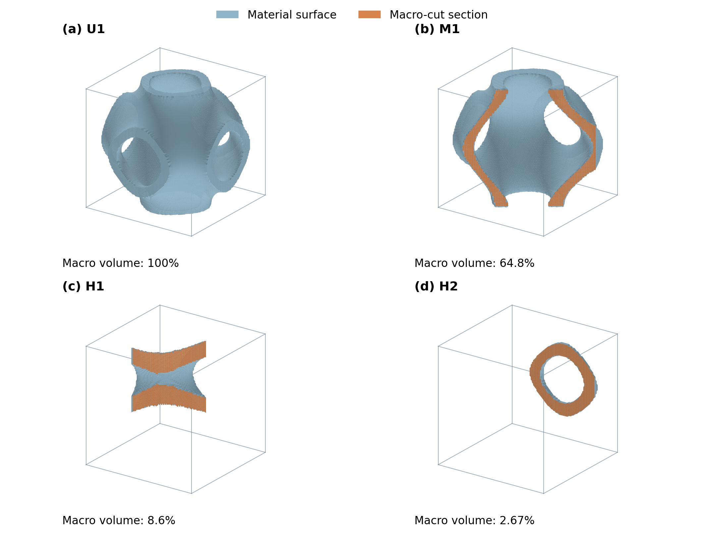

**Figure 1. Representative validation geometries.** The same unit-box scale and viewing direction are used for (a) uncut U1, (b) moderately cut M1, and (c,d) heavily cut H1 and H2. Blue denotes the material surface and orange the macro-cut section. Percentages indicate the retained macro-domain volume relative to the unit box, before intersection with the thin-wall material. Surfaces are reconstructed from Eq. (1) (Supplementary Note S1).

### 2.2. Retained degrees of freedom and equilibrium extension

For each cell, the retained set \(P\) contains the active box-face displacement coefficients and all displacement coefficients of active elements carrying a positive-area macro-cut patch. The latter form a cut band: although some of its nodes lie away from the cut plane, their basis functions contribute to displacement and virtual work on that plane. This full retained space, with both intercell and exterior-boundary coordinates, is used throughout prediction and assembly.

Let \(I\) denote the remaining internal degrees of freedom, \(p=|P|\), \(i=|I|\), and \(n_a=p+i\). The selectors \(J_P\) and \(J_I\) extract the two sets from the active displacement vector, and \(q=J_Pu\) is the retained displacement. Boundary loads act through \(q\); internal body loads are zero. In the displayed \((P,I)\) ordering, static condensation gives

\[
\begin{aligned}
&K=\begin{bmatrix}K_{PP}&K_{PI}\\K_{IP}&A\end{bmatrix},\qquad
A=K_{II},\qquad
E=\begin{bmatrix}I_p\\-A^{-1}K_{IP}\end{bmatrix},\\
&S=K_{PP}-K_{PI}A^{-1}K_{IP}=E^TKE.
\end{aligned}
\tag{2}
\]

We assume \(K\succeq0\) and \(A\succ0\), so prescribing \(q\) removes every internal zero-energy motion. The equilibrium displacement extension \(u=Eq\) uniquely minimises the discrete energy over \(J_Pu=q\), and \(Sq\) is its work-conjugate retained force. For a connected free substructure, we additionally assume that \(K\) has exactly six rigid-body modes whose restriction to \(P\) has rank six. Geometry generation enforces this: a cell is accepted only if its active background elements form a single face-connected set carrying retained box-face coordinates (10 of the 1,109 cells generated for the training expansion were rejected), and every training, validation, neighbour and lattice cell used here passes the check. The check establishes connectivity of the stabilised discrete model, in which material connected only through partially filled elements is coupled through shared basis functions and the ghost penalty; the deployed operator reproduces the six rigid-body modes to a relative energy of \(2\times10^{-11}\) (Section 6.2).

### 2.3. Assembly and response measures

For substructure \(m\), the Boolean assembly map \(B_m\) extracts \(q_m=B_mU\) from the free global retained displacement \(U\). Coincident box-face coordinates, identified by their background-grid position, are shared; retained cut-band coordinates outside the box faces remain local to their substructure. Because the thickness field on a shared face depends only on its four corner values and \(\phi\) is periodic, the material patches of two neighbours coincide on every face not intersected by a cut; where a cut removes material from one side only, the unmatched face coordinates remain coordinates of the cell that carries them. Fixed homogeneous supports are incorporated into \(B_m\). The reference and approximate assembled systems, which use the same maps \(B_m\), are

\[
\mathbb K=\sum_mB_m^TS_mB_m,\qquad
\widehat{\mathbb K}=\sum_mB_m^T\widehat S_mB_m,
\qquad
\mathbb K U=f_g,\quad\widehat{\mathbb K}\widehat U=f_g.
\tag{3}
\]

Here \(\widehat S_m\) is the approximate condensed stiffness of Section 3. Local condensation commutes with assembly because the internal sets are disjoint, and the supported reference matrix \(\mathbb K\) is assumed positive definite.

Under a prescribed force \(f_g\), compliance is \(C=f_g^TU\), with \(\widehat C=f_g^T\widehat U\) and relative error \(e_C=|\widehat C/C-1|\). Local operator accuracy is measured by the relative directional energy excess of Section 4.1. Thickness sensitivities use the eight-component vector of Section 4.3, with relative Euclidean error \(e_s=\|\widetilde{\boldsymbol s}-\boldsymbol s\|_2/\|\boldsymbol s\|_2\). All relative measures use a nonzero reference denominator.

**Table 1. Discretisation and internal-correction settings**

| Quantity | Setting |
|---|---|
| Reference geometry | Unit box; Schwarz-P-type implicit band with trilinear corner parameters and an optional planar cut |
| Displacement approximation | Continuous tensor-product \(Q_2\) solid elements on a Cartesian background mesh |
| Background resolution, validation geometries | \(n=32\) elements per axis; \(65\) Q2 node positions per axis |
| Isotropic material, validation geometries | Normalised Young's modulus \(E_Y=1\), Poisson's ratio \(\nu=0.3\) |
| Ghost-penalty coefficient, validation geometries | \(\gamma=10^{-4}\) |
| Retained space | Active box-face coefficients and all coefficients of active elements carrying a positive-area macro-cut patch |
| Standard volume integration | \(4^3\) initial subcells; one local refinement of partial subcells; clipped Kuhn tetrahedra with quadrature-rule parameter 4 |
| Smoothing interval | \([b/30,b]\), with \(b=1.05\widehat\lambda_{\max}\) estimated by 40 power iterations |
| Principal interior coarse space | Trilinear vector functions on a \(17^3\)-vertex grid, restricted to the internal degrees of freedom |
| Thickness-difference step | \(h_c=10^{-5}\tau_c\), with fixed active coordinates and ghost contribution |
| Correction of NICE | 8 Chebyshev steps, \(Q_1(17)\) Galerkin solve, 8 Chebyshev steps; same sequence in training and evaluation |
| Arithmetic | Network, rigid reconstruction and retained entries in single precision (true fp32 convolutions, no TF32); stiffness actions of the condensed product and energies in double precision; correction (smoothing and coarse solve) in double precision in the accuracy studies of Sections 6.2–6.9 and in single precision in the timed route of Table 5, with the corrected field returned to single precision (Appendix F.3) |

The mesh, material and stabilisation entries apply to all 80 validation geometries; lengths are relative to the unit box and the modulus is normalised. Coarse dimensions and smoothing counts of other correction sequences are reported with their comparisons.

## 3. Geometry-conditioned neural displacement extension

Figure 2 shows how the learned extension and the internal equilibrium correction define both the condensed action and the displacement recovered after assembly.

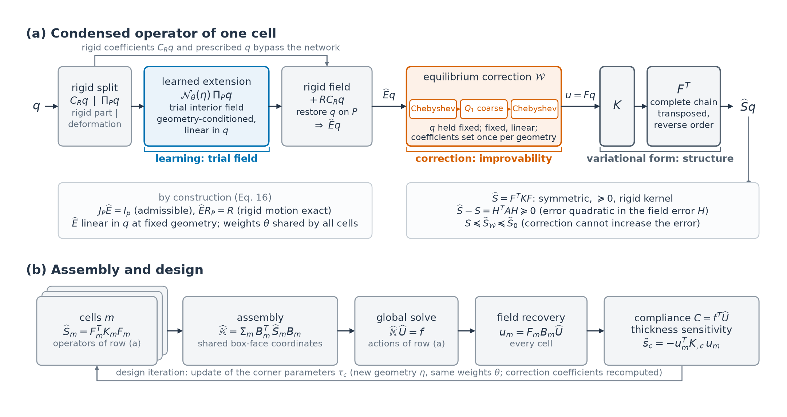

**Figure 2. Learned displacement extension, equilibrium correction and variational assembly.** (a) Rigid motion is separated from the retained displacement before the deformation is extended by the network. The rigid field is reconstructed and the prescribed retained values are restored; correction then reduces internal imbalance at fixed retained displacement. (b) Applying the local stiffness and the complete extension transpose gives the work-conjugate retained force. The assembled solution supplies the inputs for local field recovery. The neural extension is detailed in Figure 3; Section 5 defines the internal correction.

### 3.1. Geometry-conditioned multilevel displacement extension

The learning target is the internal equilibrium map \(q\mapsto E_Iq=-A^{-1}K_{IP}q\), whose approximation provides both a displacement field and, through its energy, the condensed operator on the complete retained space. The architecture must adapt to the material and support of each cell and respect superposition at fixed geometry, which leads to a nonlinear geometry branch coupled to a linear, multilevel displacement branch (Figure 3).

Rigid motion is separated before learning. Let \(R\in\mathbb R^{n_a\times6}\) contain three translations and three rotations about a common centre, and let \(R_P=J_PR\). The coefficient extractor \(C_R=(R_P^TR_P)^{-1}R_P^T\) and projector \(\Pi_P=I_p-R_PC_R\) decompose the input into rigid coefficients \(C_Rq\) and retained deformation \(q_d=\Pi_Pq\). The network extends only \(q_d\), so rigid reconstruction is independent of training accuracy.

In the geometry branch, element moments resolve the material distribution within each background cell, and node features identify retained and cut-band membership, weak support, local stiffness magnitude and position. Encoders form element and node embeddings, which exchange information in two rounds; coefficient heads then assign weights to prescribed element and ghost-face incidences, to transfers between latent grids and to coarse-grid convolutions. These coefficients are fixed for all displacement directions on the same geometry.

The displacement branch lifts the three components of \(q_d\) to 32 channels on retained nodes, with the internal features set to zero, defining \(X^0(q)\). Local interactions propagate these values through the element and ghost-face neighbourhoods: each gathers the features on a 27-slot stencil into four weighted heads, mixes the channels within each head and scatters the result back to the incident nodes. With internal and retained masks \(M_I,M_P\) acting on nodal rows, an interaction updates the latent field by

\[
X^{\ell+1}=M_I\left[X^\ell+
 \sum_h\mathcal S_{\ell h}(\eta)
   \big(\mathcal G_{\ell h}(\eta)X^\ell W_{\ell h}\big)\right]
 +M_PX^0(q).
\tag{4}
\]

Here \(\mathcal G_{\ell h}\) and \(\mathcal S_{\ell h}\) are geometry-weighted gather and scatter maps, \(W_{\ell h}\) mixes channels, and the final term restores the retained features. A U-shaped latent hierarchy through grids with 65, 33, 17 and 9 positions per axis supplies longer-range communication, with residual convolutions on each coarser level and additive skips on the upward pass. Four local interaction pairs precede the hierarchy, four follow it, and four further pairs act on stencils containing weakly supported nodes; a linear 32-to-3 map reconstructs nodal displacement. Appendix G gives the complete order of operations and coefficient definitions.

Every displacement operation is linear, and the nonlinear encoders act only on geometry, so the raw map \(\mathcal N_\theta(\eta)\) obeys superposition at fixed \(\eta\). Adding back the rigid field and restoring the original retained values gives

\[
\widehat E q=J_P^Tq+
J_I^TJ_I\left[RC_Rq+\mathcal N_\theta(\eta)\Pi_Pq\right].
\tag{5}
\]

Consequently, \(J_P\widehat E=I_p\) and \(\widehat ER_P=R\): admissibility and rigid reproduction hold by construction.

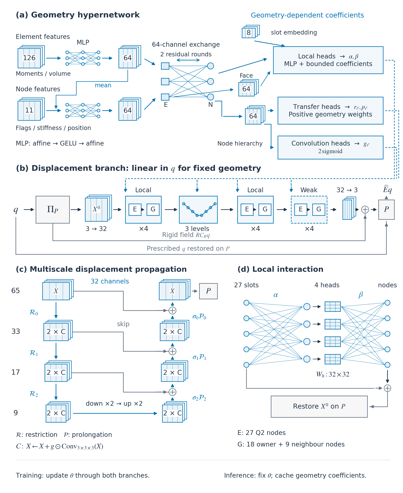

**Figure 3. Geometry-conditioned neural displacement architecture.** (a) Element and node encoders produce 64-channel geometry embeddings, followed by two rounds of residual exchange; coefficient heads condition the local interactions, grid transfers and convolutions. (b) The displacement branch propagates the nonrigid retained input through four local interaction pairs, the multilevel block, four further local pairs and four pairs on weakly supported stencils; linear maps connect the three displacement components to 32 latent channels, and deterministic bypasses reconstruct rigid motion and restore the retained values. (c) Restriction and prolongation connect grids with 65, 33, 17 and 9 background positions per axis; each coarse level has two residual convolutions on each pass. (d) A local interaction uses geometry-weighted gathering, four channel-mixing heads and scattering, followed by residual addition and retained-value restoration. E and G denote element and ghost-face interactions. Blue dashed arrows carry geometry-dependent coefficients; solid arrows carry features or displacement states. For fixed geometry, the complete displacement path is linear.

### 3.2. Variational condensed stiffness

The learned field becomes a mechanical operator through its energy with the original stiffness. Let \(\mathcal W\) be a fixed linear internal correction that preserves retained values, with the identity corresponding to no correction. For each geometry, the correction schedule and its coefficients are fixed independently of the displacement query. The final extension and its condensed stiffness are

\[
F=\mathcal W\widehat E,\qquad
\widehat S=F^TKF,\qquad
\widehat{\mathcal U}(q)=\tfrac12q^T\widehat S q,\qquad
\widehat f_P=\widehat S q.
\tag{6}
\]

For a virtual retained displacement \(\delta q\), the corresponding full virtual field is \(F\delta q\), and \(\delta\widehat{\mathcal U}=(F\delta q)^TKFq=\delta q^TF^TKFq\). Applying the condensed operator therefore requires the transpose of the complete extension after the stiffness action, including the rigid reconstruction, retained-value restoration and any internal corrections. With \(F_I=J_IF\), its block form is

\[
\widehat S q=(KFq)_P+F_I^T(KFq)_I.
\tag{7}
\]

The second term transfers the work of the internal residual to the retained coordinates. It vanishes for an equilibrated field; otherwise it is needed for the returned force to be the derivative of the stated energy. Symmetry and positive semidefiniteness follow from \(K=K^T\succeq0\), without requiring symmetry of the learned gather, scatter or grid-transfer maps. Under the rigid-kernel assumption of Section 2.2 and \(FR_P=R\), the only null modes of \(\widehat S\) are the retained rigid-body modes (Appendix B); Appendix E derives the complete transpose, and Appendix J.2 shows why it makes the operator error quadratic. After an assembled solve, \(F_mB_m\widehat U\) supplies the local reconstructed displacement for response and sensitivity evaluation.

### 3.3. Training directions and objective

Training probes the extension through retained displacement directions: prescribed polynomial and multiscale displacements supply broad spatial content, and responses to equilibrated nodal loads, consistent tractions, spring supports and neighbouring cells supply mechanically generated directions. Rigid components are removed and each direction is normalised to \(q_j^TSq_j=1\) with the reference solution. For a batch of \(B\) directions, the objective is

\[
\mathcal L(\theta)=\frac1B\sum_{j=1}^{B}\log(q_j^T\widehat S q_j)
 +w_s\frac1{|\mathcal J_s|}\sum_{j\in\mathcal J_s}
 \frac{\|\widetilde{\boldsymbol s}_j-\boldsymbol s_j\|_2^2}{\|\boldsymbol s_j\|_2^2}.
\tag{8}
\]

The energy term is the mean logarithm of the predicted-to-reference energy ratio. For an admissible extension, the variational identity of Section 4 makes its minimum correspond to the equilibrium field on each sampled direction, a Ritz principle. The sensitivity term compares the complete eight-corner field-based sensitivity vectors on the set \(\mathcal J_s\) of directions with reference sensitivity labels; the reported configurations use \(w_s=1\), and the effect of this term was not isolated. Gradients with respect to \(\theta\) pass through the reconstructed field to the geometry encoders, coefficient heads and linear displacement maps. Directions with large energy ratios, found by a block search on the rigid complement, are added during training, and geometry augmentation uses the 48 cube symmetries (Appendix G). For NICE the objective is evaluated on the corrected extension (Section 5.4); Table 2 identifies the predictors and Table ST01 records the training and weight-selection settings.

## 4. Extension error and mechanical response

With the retained coordinates fixed, the local approximation lies in the interior field. We relate its departure from equilibrium to the condensed stiffness and examine how assembly and thickness differentiation weight it. Appendix J.1 collects the assumptions. Several relations are classical and are restated in the present notation: the energy minimality of the discrete harmonic extension and the Ritz identity (9) [Fraeijs de Veubeke (1965)](https://doi.org/10.1002/nme.339), [Toselli & Widlund (2005)](https://doi.org/10.1007/b137868); the residual form (10) and the residual-corrected functional (18) [Becker & Rannacher (2001)](https://doi.org/10.1017/S0962492901000010); the energy orthogonality behind Eq. (11); the self-adjoint compliance sensitivity [Haftka & Gürdal (1992)](https://doi.org/10.1007/978-94-011-2550-5), [Bendsøe & Sigmund (2003)](https://doi.org/10.1007/978-3-662-05086-6); and, in Section 5, Chebyshev semi-iteration [Golub & Varga (1961)](https://doi.org/10.1007/BF01386013) and the two-grid error operator [Hackbusch (1985)](https://doi.org/10.1007/978-3-662-02427-0), [Trottenberg et al. (2001)](https://shop.elsevier.com/books/multigrid/trottenberg/978-0-12-701070-0), [Xu & Zikatanov (2002)](https://doi.org/10.1090/S0894-0347-02-00398-3), [Falgout et al. (2005)](https://doi.org/10.1002/nla.437). Derived here for learned substructures are the participation bounds of Eq. (12) and Appendix J.3, the sensitivity bound of Appendix J.4, the order of the complete surrogate derivative in Appendix J.5 and the identity \(\varepsilon=\delta^2\kappa\) used in Section 6.4.

### 4.1. Variational energy error

For the specified symmetric stiffness \(K\succeq0\), with \(A=K_{II}\succ0\) and zero internal body loads, \(Eq\) minimises the energy at prescribed \(q\). Any admissible linear extension \(F\), with \(J_PF=J_PE=I_p\), differs from it only internally. Writing \(H=J_I(F-E)\), internal stationarity \(J_IKE=0\) eliminates the cross terms in \(F^TKF\) and gives the discrete Ritz identity

\[
\boxed{\widehat S-S=H^TAH\succeq0.}
\tag{9}
\]

The learned extension therefore adds stiffness in proportion to the energy of its internal error; the absence of a first-order term follows from equilibrium of the reference field. For \(u=Eq\), \(\widehat u=Fq\) and \(d_I=Hq\), the internal residual \(r_I=(K\widehat u)_I\) satisfies \(r_I=Ad_I\). The relative directional energy excess \(\varepsilon(q)=q^T(\widehat S-S)q/(q^TSq)\) can consequently be written as

\[
\varepsilon(q)=\frac{d_I^TAd_I}{q^TSq}
=\frac{r_I^TA^{-1}r_I}{q^TSq}.
\tag{10}
\]

The squared \(A^{-1}\)-norm of the internal residual, available without the reference extension, is thus the stiffness-error measure; Appendix B gives the all-direction norm, which a finite direction bank samples.

### 4.2. Assembled compliance and energy participation

Consider the exact equilibria of the two supported systems in Eq. (3), with the same local matrices, assembly maps and homogeneous supports, and the same nonzero retained load. Writing \(u_m=E_mB_mU\), \(\widehat u_m=F_mB_m\widehat U\) and \(a(v,v)=\sum_m v_m^TK_mv_m\), global equilibrium and local energy orthogonality give (Appendix C)

\[
\boxed{C-\widehat C
=a(\widehat u-u,\widehat u-u)
=\|\widehat U-U\|_{\mathbb K}^{2}
+\sum_m\|H_mB_m\widehat U\|_{A_m}^{2}.}
\tag{11}
\]

Compliance underestimation is therefore the total reconstructed error energy, with orthogonal contributions from the changed retained solution and from the internal departure from equilibrium at that solution.

The influence of a local approximation depends on how much energy that substructure carries under the applied load. At the exact assembled traces \(q_m=B_mU\), define \(w_m=q_m^TS_mq_m/C\) and \(\beta=\sum_mw_m\varepsilon_m(q_m)\), with contributions of rigid zero-energy responses defined as zero. The energy fractions \(w_m\) sum to one, and

\[
0\le\frac{C-\widehat C}{C}\le\frac{\beta}{1+\beta}\le\beta.
\tag{12}
\]

Small participation can thus attenuate a substructure's effect on compliance even when its local field remains inaccurate (Appendix J.3).

### 4.3. Field-based sensitivity and the complete design derivative

On a differentiable design interval with fixed active and retained coordinates, assembly maps, homogeneous supports and a design-independent load, the exact compliance sensitivity is \(s_c=-u^TK_{,c}u\), where \(K_{,c}=\partial K/\partial\tau_c\); contributions are summed over affected substructures. Internal stationarity gives \(S_{,c}=E^TK_{,c}E\), eliminating the design derivative of the exact extension from the force-controlled compliance derivative [Giles & Pierce (2000)](https://doi.org/10.1023/a:1011430410075), [Haftka & Gürdal (1992)](https://doi.org/10.1007/978-94-011-2550-5).

The field-based sensitivity estimate \(\widetilde s_c=-\widehat u^TK_{,c}\widehat u\) uses the same stiffness derivative with the reconstructed field. At the same retained displacement,

\[
\widetilde s_c-s_c=-2d^TK_{,c}u-d^TK_{,c}d,
\qquad u=Eq,\quad d=Fq-Eq.
\tag{13}
\]

Internal equilibrium sets \((Ku)_I=0\) but generally leaves \((K_{,c}u)_I\ne0\), so the linear cross term survives, and decreasing energy error need not decrease sensitivity error monotonically. For corner thickening, nonnegative trilinear shape functions generate nested material domains, and with fixed basis, material and ghost contribution the exact integral gives \(K_{,c}\succeq0\) (Eq. J.6); a numerical derivative inherits this only while its quadrature preserves the nesting of the material domains, and the discrete moments used here violate it in a few elements of the cut cells (Appendix J.5, Supplementary Table ST19). Even then the cross term can have either sign (Appendix J.4).

The derivative of the surrogate compliance also contains the design dependence of the extension. For a parameter affecting one substructure, differentiation at fixed retained coordinates gives

\[
\widehat C_{,c}
=-\widehat u^TK_{,c}\widehat u
 -2\widehat q^TF_{,c}^TK\widehat u
=\widetilde s_c-2(F_{I,c}\widehat q)^Tr_I,
\qquad\widehat u=F\widehat q.
\tag{14}
\]

Here \(\widehat q\) is the surrogate's assembled retained solution and \(r_I=(KF\widehat q)_I\); affected-substructure contributions are summed. The second term couples the extension's design dependence to its internal imbalance and vanishes for an equilibrated extension. All sensitivities reported in this paper are the field-based estimates \(\widetilde s_c\), the first term: they estimate the exact sensitivity and are not the derivative of the surrogate compliance. Energy accuracy alone does not control the complete derivative (Appendix J.5, Section 7.3); Appendix H specifies the numerical stiffness derivatives.

These derivatives hold on intervals where the active elements, ghost faces, retained coordinates, the network's binary node features and the coarse-factor shift are fixed. Across such a switch the discrete reference compliance itself can jump, a non-smoothness shared by exact condensation on the same background mesh; because \(0\le C-\widehat C\le\beta C\) at every design (Eq. 12), any jump that the surrogate adds to that of the reference is bounded by its own error level.

## 5. Internal equilibrium correction

Equations (10) and (11) suggest reducing the internal imbalance of the learned field at fixed retained motion; polynomial relaxation and coarse energy minimisation address different components of it.

### 5.1. Error spectrum and polynomial relaxation

Set \(D=\operatorname{diag}(A)\) and order the generalised eigenvectors by increasing eigenvalue, \(Av_j=\lambda_jDv_j\), with \(v_j^TDv_k=\delta_{jk}\). For \(c_j=v_j^TDd_I\),

\[
d_I^TAd_I=\sum_j\lambda_jc_j^2,\qquad
\chi_\ell(q)=\frac{\sum_{j=1}^{\ell}\lambda_jc_j^2}{d_I^TAd_I}.
\tag{15}
\]

The fraction \(\chi_\ell\) locates the error energy in the first \(\ell\) Jacobi-scaled internal modes (the exact-field fraction uses \(u_I^TAu_I\)).

The learned field is an initial approximation to \(Au_I=-K_{IP}q\), improved by Jacobi-preconditioned Chebyshev semi-iteration with \(q\) fixed; a prescribed iteration count and geometry-dependent coefficients keep the corrected extension linear. Polynomial relaxation supplies a parallelisable component of multigrid methods [Adams et al. (2003)](https://doi.org/10.1016/s0021-9991(03)00194-3), the combination of a trial extension with smoothing is the principle of smoothed-aggregation prolongation [Vaněk et al. (1996)](https://doi.org/10.1007/BF02238511), and pairing relaxation with a learned initial field exploits their complementary error-reduction properties [Zhang et al. (2024)](https://doi.org/10.1038/s42256-024-00910-x).

A degree-\(k\) error polynomial maps \(d_I\) to \(P_kd_I\), \(P_k=p_k(D^{-1}A)\), multiplying each coefficient in Eq. (15) by \(p_k(\lambda_j)\). The Chebyshev polynomial targets \([a,b]\), \(0<a<b\), and is nonexpansive in the \(A\)-energy norm if the actual positive spectrum of \(D^{-1/2}AD^{-1/2}\) lies in \((0,b]\). Modes below \(a\) can decay slowly, which motivates a complementary coarse update. The correction sequences use \(a=b/30\), with \(b\) from a power estimate increased by 5%; Section 6.2 reports its verification, and Appendix D gives the polynomial, recurrence, interval estimator and contraction bound.

### 5.2. Interior coarse correction

Let \(V\in\mathbb R^{i\times n_c}\) have full column rank, \(A_c=V^TAV\), and \(b_r=V^Tr_I\). Minimising the energy over \(u_I+\operatorname{range}V\) gives

\[
u_I^{\rm c}=u_I-VA_c^{-1}b_r,\qquad
d_I^{\rm c}=(I_i-VA_c^{-1}V^TA)d_I,\qquad
\|d_I\|_A^2-\|d_I^{\rm c}\|_A^2=b_r^TA_c^{-1}b_r.
\tag{16}
\]

The Galerkin solve enforces equilibrium against the coarse variations, and the last equality measures the energy removed by that projection [Xu (1992)](https://doi.org/10.1137/1034116). The principal basis consists of trilinear vector functions on a \(17^3\)-vertex grid restricted to internal coordinates (Appendix F); all coarse spaces preserve the full retained space.

Placing the coarse update between two \(k\)-step smoothing stages combines these corrections. With \(C_V=I_i-VA_c^{-1}V^TA\) and \(H_0=J_I(\widehat E-E)\), the resulting error is

\[
H_{\rm tg}=P_kC_VP_kH_0,\qquad
\widehat S_{\rm tg}-S=H_{\rm tg}^TAH_{\rm tg}.
\tag{17}
\]

For the exact Galerkin update and \(\|P_k\|_A\le1\), \(S\preceq\widehat S_{\rm tg}\preceq\widehat S_0\): the correction cannot increase the error in the \(A\)-energy norm, and by Eq. (11) it moves exact assembled compliance toward the reference, although it does not order the sensitivity error in Eq. (13) (Appendix J.8; Appendix J.9 gives a matrix example in which the energy error falls while the sensitivity error rises). This ordering is guaranteed, whereas the size of the reduction is not. For the spectra of the detailed cells the polynomial estimate of Appendix D guarantees little more than non-expansion and uses no approximation property of the coarse space, so the reductions reported in Section 6.5 are empirical; repeating the cycle cannot increase the energy error, whereas changing the smoothing degree changes the polynomial and is not guaranteed to be monotone.

### 5.3. Energy-consistent operator application

Geometry-dependent coefficients, maps, smoothing interval and coarse factorisation are prepared once per geometry and reused across retained inputs.

**Algorithm 1. Corrected condensed stiffness action.**

1. Extend \(q\) with \(\widehat E\) and apply the prescribed pre-smoothing, coarse and post-smoothing sequence at fixed retained values to obtain \(u=Fq\).
2. Form \(y=Ku\) and return \(F^Ty\): transpose the complete correction in reverse order, followed by the transpose learned extension.
3. Assemble these actions through Eq. (3); after the global solve, recover \(F_mB_m\widehat U\) for field and sensitivity evaluation.

Each forward cycle uses \(2k\) smoothing steps and one coarse solve, with the corresponding reverse operations in the transpose (Appendices E–F).

At the assembled level, the energy relation also separates approximation error from incomplete equilibrium. For an approximate solution \(\bar U\), define the recomputed residual \(\rho=f_g-\widehat{\mathbb K}\bar U\) using the stated variational operator and the recovered fields \(\bar u_m=F_mB_m\bar U\). Then

\[
C-f_g^T\bar U=a(\bar u-u,\bar u-u)+\bar U^T\rho.
\tag{18}
\]

The signed residual work \(\bar U^T\rho\) determines how an incomplete solution affects the compliance comparison. Appendix J.6 gives the residual-corrected functional and the additional consistency term required when the numerical action differs from the energy operator.

### 5.4. Training on the deployed operator

NICE is trained on the operator that is deployed: Eq. (8) is evaluated on the corrected extension \(F=\mathcal W\widehat E\), with the 8 / \(Q_1(17)\) / 8 sequence of Section 5.2. Because \(\mathcal W\) is linear and fixed for a given geometry, the gradient passes through the smoothing recurrence and the coarse solve to the network parameters, as in solver-in-the-loop training [Um et al. (2020)](https://proceedings.neurips.cc/paper/2020/hash/43e4e6a6f341e00671e123714de019a8-Abstract.html). The smoothing interval and coarse factorisation depend only on \(K\) and are recomputed per geometry, so no trainable parameters are added.

## 6. Numerical examples

The examples follow the error of the learned extension from single cells, through its correction, to assembled compliance and local thickness sensitivity, and close with an ablation of the retained representation and a cost comparison. All errors are measured against equilibrium of the discrete problem of Section 2.

### 6.1. Geometries, predictors and loading conditions

The 80 validation geometries comprise 20 uncut, 20 lightly, 20 moderately and 20 heavily cut cells, with uniform, affine or mixed trilinear thickness fields and corner parameters from 0.1762 to 0.6983 (Table ST02). Each carries at most one planar cut with normal \((\cos\vartheta,\sin\vartheta,0)\), \(0<\vartheta<\pi/4\); heavy cuts retain less than one third of the macro-box volume, moderate cuts between one and two thirds, and light cuts more than two thirds. U, L, M and H identify the uncut, lightly, moderately and heavily cut cells used for detailed comparisons (Supplementary R1).

Five predictors are compared (Table 2). The base network was trained without correction. Three networks continue it for 15,000 updates: with the complete correction of Section 5.2 inside the training loop (NICE, Section 5.4), with eight smoothing steps and no coarse solve in every training step (Smoothing-trained), or without correction (Uncorrected). NICE-post is the base network with NICE's correction \(\mathcal W\) applied at deployment, without further training. Two predictors from earlier comparisons appear in the supplement only (Supplementary R1).

**Table 2. Predictors compared in the numerical examples**

| Predictor | Network weights | Training pool (geometries) | Correction in training | Correction at evaluation |
| --- | --- | ---: | --- | --- |
| **NICE** | Base network continued for 15,000 updates | 591 | 8 / \(Q_1(17)\) / 8 | 8 / \(Q_1(17)\) / 8 |
| NICE-post | Base network | 305 | None | 8 / \(Q_1(17)\) / 8 |
| Smoothing-trained | Base network continued for 15,000 updates | 591 | 8 smoothing steps | 8 smoothing steps |
| Uncorrected | Base network continued for 15,000 updates | 591 | None | None |
| Base network | 40,000 updates, selected at 30,000 | 305 | None | None |

All predictors share the architecture of Section 3 (603,409 trainable parameters and 55 fixed coefficient bounds; Table ST16). The continuations draw from a pool of 591 geometries, 304 of the base network's 305 and 287 produced later (one near-mechanism cell was removed); with one pool replacement every 100 updates, each visits about 150 distinct geometries, in the same order for all three. Measured to the last update on one NVIDIA GeForce RTX 5090, the base network's training took 4.6 h and NICE's continuation 3.5 h (5.0 h and 4.8 h including all selection evaluations; NICE's run was interrupted at update 5,600 and resumed from update 4,000, and both segments are logged; peak device memory 29.6 GiB). Generating the direction banks and exact sensitivities for the 691 training and validation geometries took about 42 GPU-hours and occupies 1.05 TB, so NICE's lineage, data included, cost about 60 GPU-hours offline (Table ST01).

Twenty of the 80 validation geometries (6 uncut, 14 cut) entered weight selection: each continuation was scored at 7,500 and 15,000 updates and the final weights were retained in every recorded case, the base network's weights were selected among four checkpoints, and NICE was designated the principal predictor after all predictors had been compared on the 80 geometries and the pairs. Statistics are therefore also given for the 60 geometries outside selection. All cells of the assembly examples belong to the 20 selection geometries and served repeatedly as development cases,; nine further cells outside weight selection are assembled in Section 6.6 as an independent check. Population statistics average the directional energy excess within each geometry and loading class and weight geometries equally (Appendix A.2), so the population maximum is the largest geometry mean.

The assembly examples join a learned target to an exact, uncut neighbouring cell whose thickness is continuous across the interface (Figure 4); where the target's cut plane meets the shared face, the pair is a diagnostic assembly rather than a physically cut specimen. Each configuration has six face loads, the three Cartesian traction directions applied separately to the target and neighbour faces, and compliance and each cell's eight-parameter sensitivity vector are compared with their exact counterparts, with the nodal load fixed at its base-design value. We use 3% on compliance and on each cell's sensitivity vector as a common visual reference, taking maxima over the six loads and, for sensitivity, both cells; the threshold is not derived from an optimiser tolerance. The directions of the sensitivity vectors are reproduced more closely than their magnitudes: in the fourteen development configurations, NICE's eight-corner vectors have cosines of at least 0.999998 with the exact ones (Supplementary Note S6.3). Three tractions on a target cut face are considered separately.

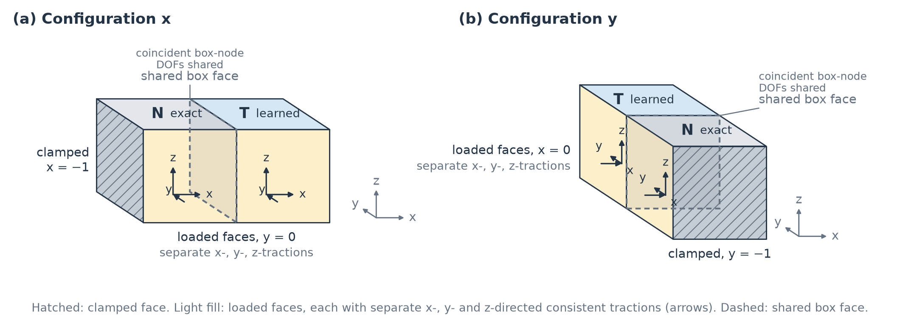

**Figure 4. Supports and loading of the two-cell examples.** (a) Configuration x: the neighbour is translated by \((-1,0,0)\), the face \(x=-1\) is clamped, and face tractions act at \(y=0\). (b) Configuration y: the translation is \((0,-1,0)\), the face \(y=-1\) is clamped, and tractions act at \(x=0\). Each target (T) and neighbour (N) face carries separate x-, y- and z-directed consistent-traction loads. Coincident box-node coordinates are shared across the interface; non-box cut-band coordinates remain local. Cut targets also receive three macro-cut tractions, analysed separately.

### 6.2. Verification of the discrete reference and of the corrected operator

To verify the discrete reference, single cells clamped on one box face and loaded by a unit consistent traction on another were solved at \(n=24\) to 48 (Figure S01, Supplementary Note S2), and H1, H2 and two further validation cells up to \(n=64\). For M1, M2 and U1, the compliance at \(n=32\) differs from the finest level by at most 0.057% and the eight-corner sensitivities by at most 0.11%. The heavily cut H1, clamped on \(x=0\) and loaded on \(y=0\) because its retained part carries no material on its \(z\)-faces, differs from \(n=48\) by up to 0.99% in compliance, for the load normal to the loaded face, and by 0.97% in sensitivity. Refinement to \(n=64\) (Supplementary Table ST18) does not converge monotonically for H1: its compliance at \(n=48\) and 56 exceeds the \(n=64\) value by up to 1.1% and 1.4%, while \(n=32\) happens to lie within 0.07% of it. The heavily cut H2 converges monotonically but has not converged at \(n=64\): at \(n=32\) its compliance deviates by up to 0.93% and its sensitivity vector by up to 3.6%, and at \(n=48\) still by 0.27% and 1.2%. For the geometry with NICE's largest single-cell error and for the thinnest-walled validation cell, \(n=32\) differs from \(n=64\) by at most 0.14% and 0.28% in compliance and 0.23% and 0.44% in sensitivity. The discretisation error of the \(n=32\) references is therefore 0.1 to 0.3% in compliance for most cells, but of order one percent in compliance and several percent in sensitivity for heavily cut ones. The comparisons therefore measure the approximation of the discrete operator, not of the continuum. This discrete model also defines the design problem, so a coarser reference would change the model rather than the cost of reaching it; the surrogate's energy error lies well below the reference's discretisation error in heavily cut cells, whereas its largest assembled sensitivity errors are comparable to the reference's sensitivity change under refinement. Varying the penalty coefficient between \(10^{-5}\) and \(10^{-3}\) changes the compliance by at most 0.053% and the sensitivities by at most 0.12% (penalty energy \(1.2\times10^{-4}\) to \(5.6\times10^{-4}\) of the total at \(\gamma=10^{-3}\)), and refining the volume integration changes both by at most 0.010%. The central-difference stiffness derivative agrees with differences of the re-solved compliance to \(4\times10^{-8}\), and relative to the step \(10^{-5}\tau_c\) it changes by at most \(2.6\times10^{-7}\) at \(10^{-3}\tau_c\) and \(1.6\times10^{-10}\) at \(10^{-6}\tau_c\), with second-order behaviour and no change of integration branch at the fixed active set.

To verify the operator: the accuracy runs evaluate the network in single precision and the stiffness actions, smoothing and coarse solve in double precision (Table 1). On U2, M1, M2, H1 and H2, the bilinear form \(q_i^T\widehat Sq_j\) is symmetric to a relative \(9\times10^{-9}\), the returned work \(q^T\widehat Sq\) agrees with the recovered-field energy \(q^TF^TKFq\) to \(5\times10^{-9}\), the deployed operator reproduces the training-time field to \(1.1\times10^{-7}\), and the energy of normalised rigid modes is at most \(2\times10^{-11}\) of a typical deformation energy. The contraction of Section 5.1 requires \(b\ge\lambda_{\max}(D^{-1}A)\): the power-iteration endpoint used by all GPU runs exceeds the converged largest eigenvalue by 2.1–5.0% on all 80 validation geometries (Appendix D), whereas the Gershgorin bound exceeds it by factors of 11 to 20. Four of the per-cell margins in Table ST04 come from a host evaluation whose seeded generator gives a different power-iteration start. The containment is thus verified per geometry, not guaranteed a priori; symmetry, positive semidefiniteness and \(\widehat S\succeq S\) do not depend on it.

### 6.3. Dependence on geometry and loading

Consistent tractions, which represent surface loads and neighbour tractions, are the principal loading class; the ghost penalty carries below 0.05% of their exact field energy in the five cells of Table ST04. Equal nodal forces also load weakly supported nodes of small cut elements, placing 49–81% of the exact field energy in the ghost penalty, and serve as a stress test of the stabilised problem.

NICE removes most of the geometric dependence of the uncorrected extension (Figure 5). Under consistent tractions, its mean directional energy excess is 0.016%, 0.079%, 0.091% and 0.109% across the uncut, lightly, moderately and heavily cut strata (0.074% overall, largest geometry mean 0.65%), against 1.03%, 5.33%, 7.82% and 11.2% for the Uncorrected continuation (6.33% overall, largest 42%) and 6.89% for the base network (largest 48.6%). Neighbour-induced displacements give 0.060% (largest 0.38%) and stiffness-scaled spring supports 0.057% (0.47%); for single-face nodal forces the largest geometry mean is 0.72% (Table ST03). Under nodal forces, the base network's mean rises from 0.908% in uncut to 11.3% in heavily cut cells (largest 70.1%), whereas NICE's stratum means stay between 0.0135% and 0.0897% (largest 0.325%). On the 60 geometries outside weight selection, NICE's overall means are essentially unchanged (0.077% under consistent tractions, 0.0591% under nodal forces), but its cut-stratum means are higher (0.105% moderate, 0.126% heavy) and the five largest geometry means all occur there (Supplementary Table ST03d). Individual sampled directions are not bounded by these geometry means: over the 5,120 sampled consistent-traction directions of the 80 geometries, NICE's directional energy excess has a 95th percentile of 0.33%, a 99th percentile of 0.69% and a maximum of 1.24%, and over the 3,840 directions of the 60 geometries outside weight selection 0.35%, 0.73% and 1.24%.

The intermediate predictors locate this improvement. Continuing the base network without correction changes its mean only from 6.89% to 6.33%, and Smoothing-trained reaches 1.28% (largest 7.8%). NICE-post gives 0.0965% (largest 0.91%), so most of the improvement comes from the correction itself. NICE's mean is lower than NICE-post's by a factor of 1.31 (95% bootstrap interval over geometries 1.20–1.40; one training seed), and by 1.5–2.0 under nodal forces, supports and single-face loads, on 96–99% of the geometries.

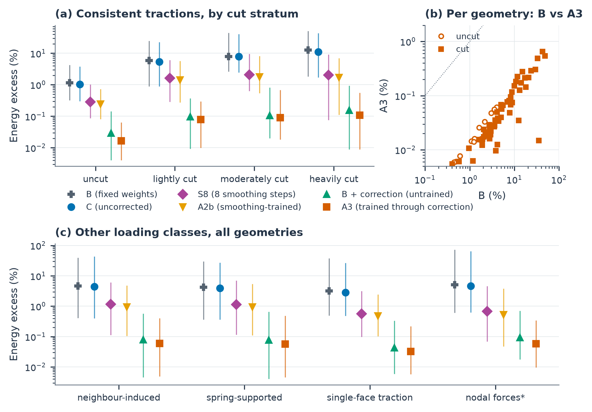

**Figure 5. Directional energy error of the learned substructures on the 80 validation geometries.** Each observation is a geometry's mean directional energy excess \(q^T(\widehat S-S)q/(q^TSq)\) over the validation directions of a loading class. (a) Consistent tractions, 20 geometries per cut stratum: markers give the mean over geometries and bars the range from the 10th percentile to the maximum. (b) Geometry means of the base network and of NICE under consistent tractions, open markers for uncut and filled markers for cut geometries; the dotted line denotes equality. (c) Neighbour-induced retained displacements, stiffness-scaled spring supports, single-face consistent tractions and equal nodal forces (75 geometries for the first two classes, 80 for the others); the asterisk marks the nodal-force stress test. Twenty geometries (6 uncut, 14 cut) entered weight selection. Predictors as in Table 2.

### 6.4. Components of the extension error

The base network's error occupies different parts of the Jacobi-scaled internal spectrum in different cells (Figure 6). Under consistent tractions on M1, the lowest 200 modes contain 24.5% of the error energy but only 4.87% of the exact-field energy, and all lie below the lower endpoint \(a=0.173\) of the smoothing interval; in H2 only 66 of the 200 modes lie below \(a=0.138\). This is consistent with the smoothing rates of Section 6.5 (Table ST05b).

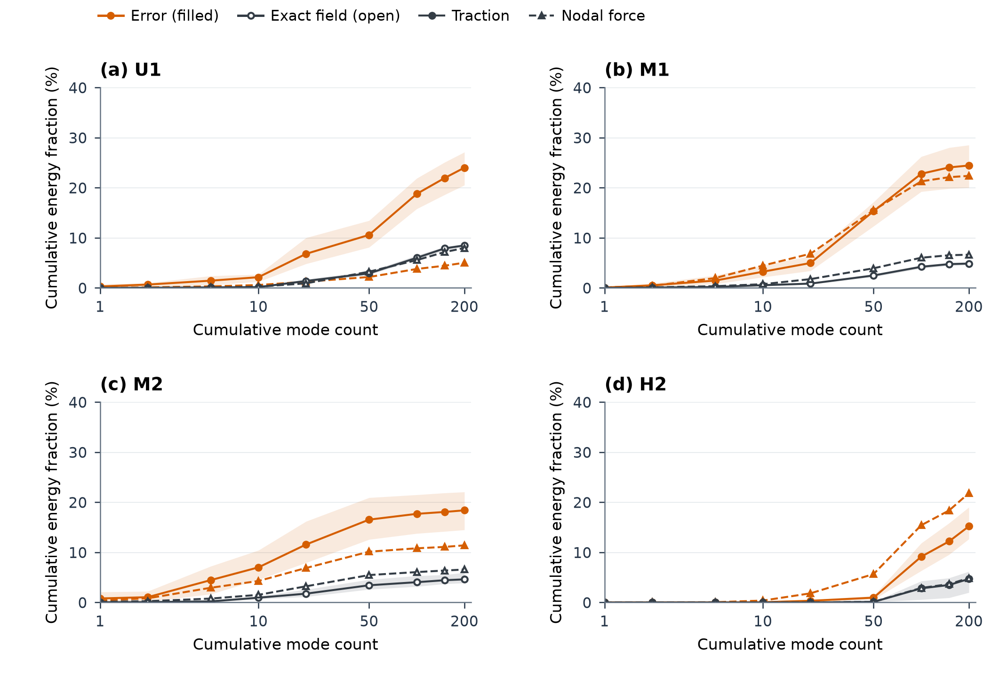

**Figure 6. Spectral distribution of the uncorrected extension error.** Panels show U1, M1, M2 and H2 for the base network. Modes solve \(Av=\lambda Dv\), with \(D=\operatorname{diag}(A)\), ordered by increasing eigenvalue. Filled orange markers represent the extension error and open grey markers the exact internal field; solid circles correspond to consistent tractions and dashed triangles to nodal forces. Curves are directional means; bands give the 10th–90th directional percentiles under consistent tractions. Each cumulative fraction uses the total internal energy of its own field or error.

Spatially (Figure 7), the exact field of M1 under one consistent-traction direction places 8% of its energy in the elements within two element widths of the cut plane, which are 13% of the elements, whereas 39–43% of the base network's error energy lies there, next to the retained cut-band coordinates whose values the extension must propagate. The corrected field reduces the total error energy by about two orders of magnitude (113–138 times) and the element error energies by roughly 25 to 300 times (10th–90th percentiles), and halves the share of this layer to 19–22%.

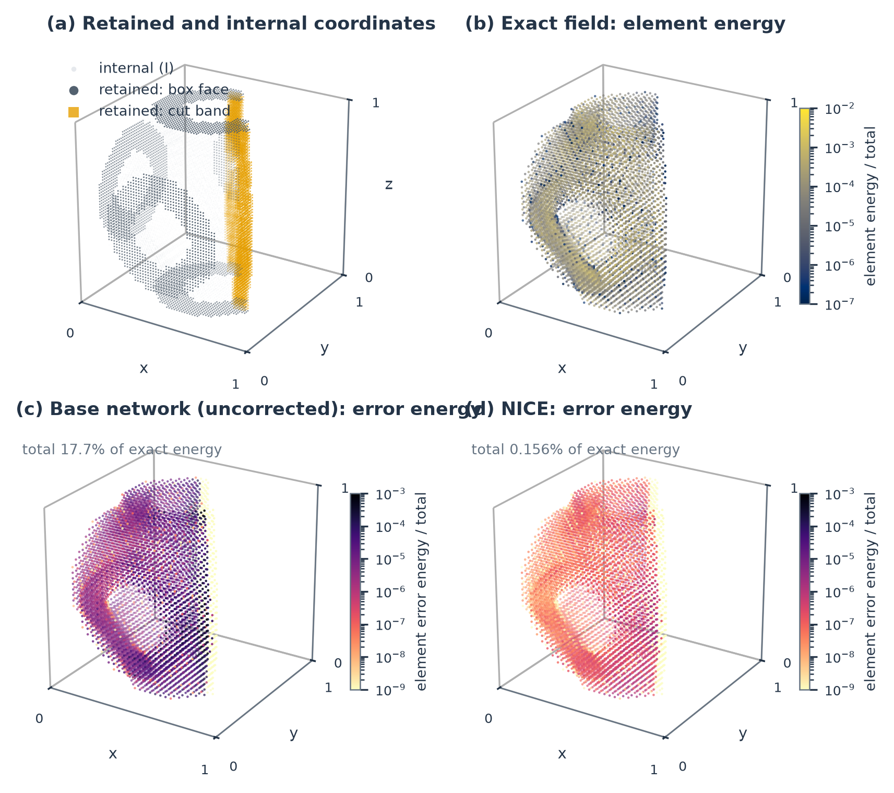

**Figure 7. Retained coordinates and spatial distribution of the extension error in M1.** (a) Retained box-face coordinates, retained cut-band coordinates and internal coordinates. (b) Bulk element energies of the exact field under one consistent-traction direction, relative to its total. (c,d) Bulk element energies of the error of the base network and of NICE for the same retained displacement, on a common colour scale. Cut-band elements carry no error because their coefficients are retained.

The size of these energy errors reflects a measurable amplification. For interior error \(d_I\) and exact interior field \(u_I\), let \(\delta^2=d_I^TDd_I/u_I^TDu_I\) be the Jacobi-weighted relative displacement error and \(\kappa=R(d)/R(u)\) the ratio of the Rayleigh quotients \(R(d)=d_I^TAd_I/d_I^TDd_I\) and \(R(u)=u^TKu/u_I^TDu_I\). Then \(\varepsilon=\delta^2\kappa\) exactly, with the weighting \(W=\operatorname{diag}(0,D)\) of Appendix B.1, admissible because \(d\) vanishes on the retained coordinates; the identity is a diagnostic decomposition, not an independent explanation. Under consistent tractions, the base network's fields in M1, M2, H1 and H2 have \(\delta\) of 0.7–1.3% but \(\kappa\) of 124 to 7089: the displacement error is small but lies in directions far stiffer, relative to their amplitude, than the exact field, so that energy errors of 2–35% result. In the uncut U2 the same \(\delta\) of 0.74% meets \(\kappa=85\) and gives 0.40%. NICE's fields have \(\delta\) of 0.05–0.19% and \(\kappa\) of 33 to 582 in the cut cells (0.11% and 47 in U2).

At fixed retained displacement, M1 has mean energy and field-based sensitivity errors of 13.5% and 14.1%, and H2 of 35% and 75.1%; the linear term of Eq. (13) contributes only 7.2% and 0.79% of the sum of the linear- and quadratic-term norms, so the quadratic term dominates these finite errors (Table ST05, Figure S03).

### 6.5. Reducing interior error with fixed network weights

Holding the base network fixed isolates the effect of the correction (Figure 8). Eight Chebyshev steps at fixed retained displacement reduce the mean energy excess everywhere, but unevenly: under consistent tractions H2 falls from 35% to 0.205%, whereas M1 falls only from 13.5% to 4.68% (2.95% after 32 steps), consistent with its low-mode error below the smoothing interval; M1's sensitivity error falls from 14.1% to 2.76%, non-monotonically (Figure S04). A trilinear coarse correction before the same eight steps brings M1 to 0.230%, and eight further pre-smoothing steps to 0.186%, with 5,601 coarse coefficients for 165,927 internal degrees of freedom. Two, four and eight steps per stage give 1.02%, 0.422% and 0.186% on M1, and the eight-step cycle about 0.027% on M2 and U1; other coarse spaces are compared in Table ST07 and Supplementary Note S3.

Table 3 applies the same correction to four starting fields at the same retained displacements: a zero interior, a graph-harmonic extension (a volume-weighted graph Laplacian on the element connectivity, with the same exact rigid split), the base network's field (NICE-post) and NICE. A zero interior leaves 28–1100% energy excess and the harmonic start 0.08–17%, whereas the base network's field ends at 0.004–0.19%, lower by factors of 7 to 290 than the harmonic start and 2,400 to 12,000 than the zero interior. With 64 steps per stage, eight times the smoothing work, the harmonic start remains 2.6 to 50 times above the base network's eight-step result in five of six cells (M1, M2, H1, U1, U2) and reaches it only in the heavily cut H2; under nodal forces it ends above the zero interior at 16 and 32 steps in U2 and from 16 steps on in H2, so it is a weak but inexpensive comparator (Tables ST08 and ST08b). The learned field thus supplies the part of the interior equilibrium that smoothing and the coarse space do not reach at a practical budget. Locally, NICE-post is about as accurate as NICE.

**Table 3. Mean energy excess (%) after the same 8 / \(Q_1(17)\) / 8 correction applied to different starting fields (consistent tractions, 32 directions)**

| Cell | Base network, uncorrected | Zero interior | Harmonic | Base network (NICE-post) | NICE |
| --- | ---: | ---: | ---: | ---: | ---: |
| M1 | 13.5 | 1097 | 17.2 | 0.186 | 0.131 |
| M2 | 3.64 | 324 | 6.72 | 0.0273 | 0.0358 |
| H1 | 1.81 | 39.9 | 1.28 | 0.0131 | 0.0115 |
| H2 | 35 | 28.3 | 0.0806 | 0.0117 | 0.0148 |
| U2 | 0.402 | 47.2 | 1.23 | 0.00424 | 0.00465 |

The first column gives the base network's error without correction. Results with 32 and 64 smoothing steps per stage and under nodal forces are given in Table ST08.

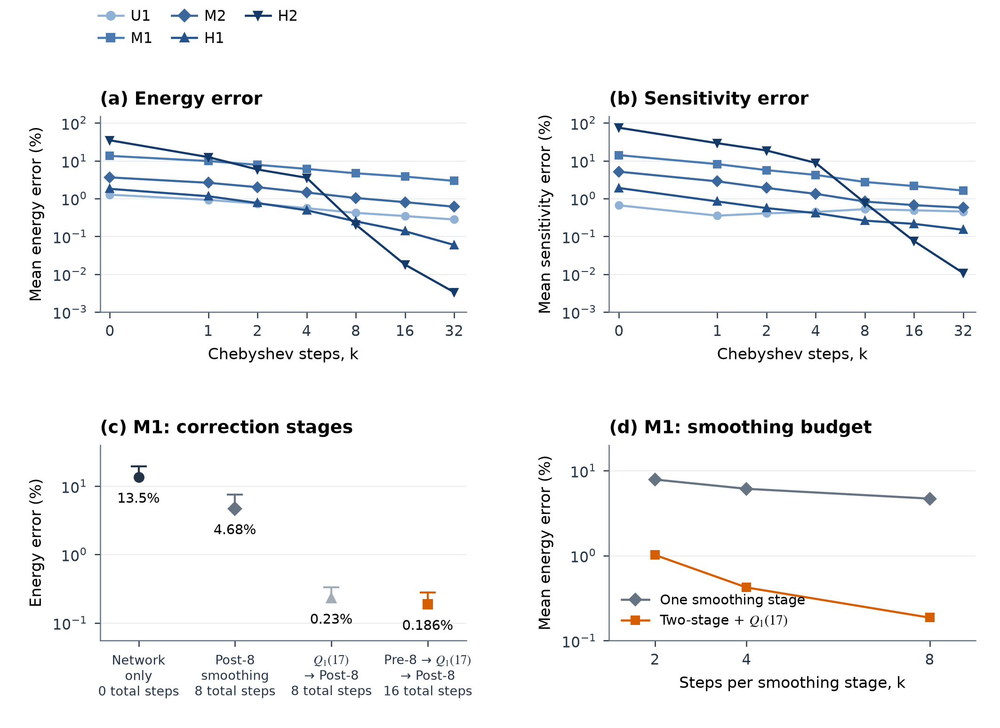

**Figure 8. Accuracy gained by correcting the base network at fixed weights.** (a,b) Mean directional energy excess and field-based sensitivity error during Chebyshev smoothing on five cells. (c) M1 with no correction, eight smoothing steps, coarse correction followed by eight steps, and eight steps on each side of the coarse correction; dots show means and caps the 90th percentile. (d) Mean energy excess versus steps per smoothing stage. All panels use consistent tractions, fixed retained displacements and \(a=b/30\); in (a,b) the step axis is linear from zero to one and logarithmic thereafter.

### 6.6. Compliance and local sensitivity after assembly

Figure 9 compares the predictors in the two-cell configurations of Figure 4. NICE meets both references in all fourteen configurations of the seven development cells: its largest compliance error over the six face loads is 0.056% (M1/x), and its largest sensitivity error, taken over both cells, is 0.67% (U1/y). On nine validation cells outside weight selection, chosen before evaluation as the five geometries with NICE's largest single-cell errors and one random cell in each of the uncut, lightly, moderately and heavily cut strata, the eighteen configurations give maxima of 0.27% in compliance and 1.49% in sensitivity, both on the geometry with the largest single-cell error (Supplementary Table ST09b). The five largest-error geometries account for all compliance errors above 0.02%; the four random cells stay below 0.011% and 0.22%. Assembled accuracy therefore follows the single-cell error, and remains within both references on every held-out configuration. The Uncorrected continuation was evaluated on eleven configurations, the nine common to Uncorrected, Smoothing-trained, NICE-post and NICE (the base network was evaluated on seven of them) and L1/x and L1/y; it fails the sensitivity reference in four of them (U1/x, U1/y, M1/x, M1/y, with up to 11.4%) and, on M1, also the compliance reference (up to 4.1%). Smoothing-trained reduces these errors but still fails the same four configurations (3.15–4.43%): smoothing without the coarse solve does not reach the slowly relaxed error components that dominate the sensitivity of U1 and M1. NICE-post also meets both references in the fourteen configurations (largest sensitivity error 0.95%, U1/x), so the correction is what brings the assembled responses within the reference. The largest sensitivity errors of NICE and NICE-post are 0.16–0.21% and 0.34–0.35% on M1, 0.60–0.67% and 0.90–0.95% on U1, and 0.136–0.154% and 0.075–0.083% on M2; NICE has the lower maximum in ten of the fourteen configurations (Table ST09). Under the cut-face tractions, NICE reaches at most 0.10% in compliance (M1/y) and 0.16% in sensitivity, whereas the Uncorrected continuation exceeds the reference on L1/y with 3.7% (Table ST10).

Table 4 shows why both quantities are needed. Without the complete correction, an accurate compliance does not guarantee an accurate local sensitivity: under a neighbour-face load on U1/x, the Smoothing-trained compliance error is 0.00109% while the target-cell sensitivity error is 3.15%, with the target carrying 0.13% of the exact assembled energy. NICE reduces both errors: the target-cell sensitivity error of that load falls to 0.598%, and on M1/x under the target-face y load NICE gives 0.0481% and 0.145% instead of the Uncorrected 3.44% and 11.4%. The separation remains visible in NICE, whose sensitivity error exceeds its compliance error by a factor of about two on H1 and by four orders of magnitude for the weakly participating U1 target, but both lie well within the reference.

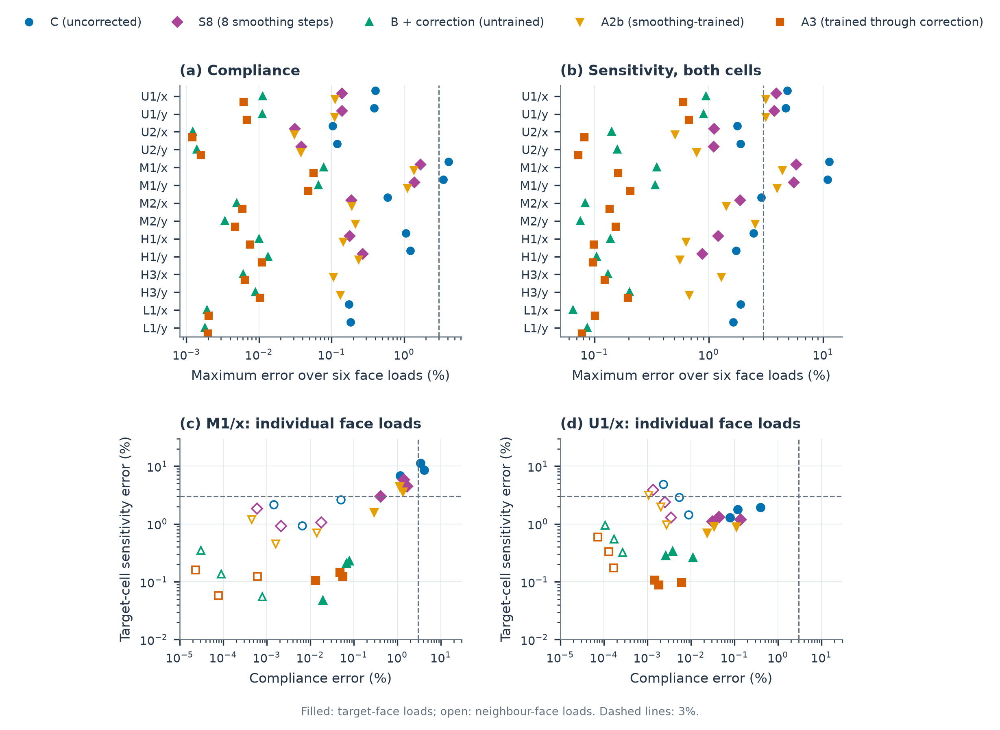

**Figure 9. Compliance and thickness sensitivity in assembled cell pairs.** The target cell uses a learned operator and the neighbour exact condensation. (a,b) Maximum errors over the six face loads in each configuration; the sensitivity error is also maximised over both cells. (c,d) Compliance and target-cell sensitivity errors of the individual face loads on M1/x and U1/x; filled markers denote target-face loads and open markers neighbour-face loads. Dashed lines mark the 3% reference. H3 is a further heavily cut cell evaluated for Smoothing-trained, NICE-post and NICE only; L1 is a lightly cut cell evaluated for Uncorrected, NICE-post and NICE. Predictors as in Table 2.

**Table 4. Compliance and target-cell sensitivity under individual face loads**

| Target / configuration | Load | Uncorrected: compliance / sensitivity (%) | Smoothing-trained: compliance / sensitivity (%) | NICE: compliance / sensitivity (%) | Target energy share |
| --- | --- | --- | --- | --- | ---: |
| H1/x | T-x | 1.06 / 2.47 | 0.144 / 0.636 | 0.0076 / 0.0133 | 0.643 |
| U1/x | N-z | 0.0023 / 4.89 | 0.00109 / 3.15 | 7.3×10⁻⁵ / 0.598 | 0.0013 |
| M1/x | T-y | 3.44 / 11.4 | 1.14 / 4.43 | 0.0481 / 0.145 | 0.311 |

T and N identify the loaded face of the target or neighbour; x, y and z give the traction direction. The last column gives the target cell's share of the exact assembled energy. Configuration-level sensitivity maxima include both cells.

### 6.7. Energy participation

Energy participation explains how a local stiffness error can have little effect on compliance. Under the neighbour-face z load in U1/x, the base network's target cell carries 0.127% of the exact assembled energy and has a local energy excess of 2.31%; their product \(\beta=w\varepsilon\) gives a relative compliance bound of 0.00295%, close to the observed 0.00283%, whereas the target-cell sensitivity error is 5.83%. Figure 10 shows this weighting across predictors and loads. For the sensitivity at fixed retained displacement, Appendix J.4 gives \(\|\widetilde{\boldsymbol s}-\boldsymbol s\|_2\le2L\sqrt{\mathcal E}+Q\mathcal E\), with \(\mathcal E\) the interior error energy, \(L\) the coupling of the error to the stiffness derivative acting on the exact field and \(Q\) the derivative relative to the interior stiffness; the relative error is further scaled by the local reference \(\|\boldsymbol s\|_2\), which is small for a weakly participating cell. In assembly the changed retained displacement also interacts with the extension error, so field-only and solution-only replacements do not add to the full sensitivity error (Table ST11, Appendix H).

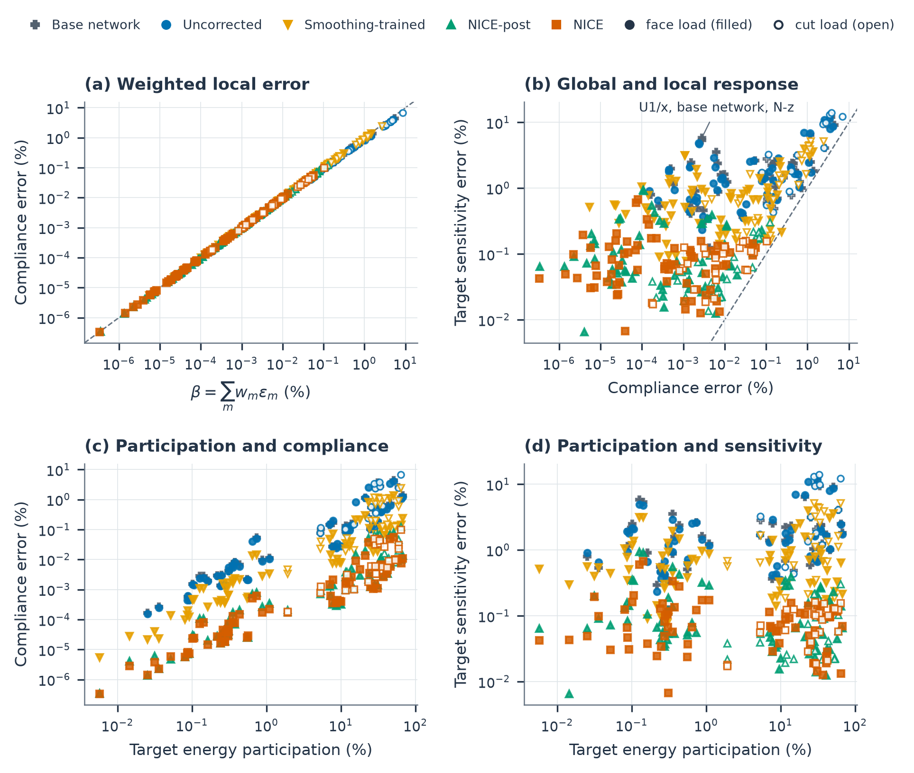

**Figure 10. Participation-weighted compliance error and local sensitivity.** Each point is one load for one predictor–configuration combination: 411 observations from 52 combinations of the base network, Uncorrected, Smoothing-trained, NICE-post and NICE in Table ST09, excluding L1. Filled markers denote face loads and open markers cut-surface loads. (a) Compliance error against \(\beta=\sum_mw_m\varepsilon_m\), with \(w_m=q_m^TS_mq_m/C\) and \(\varepsilon_m=q_m^T(\widehat S_m-S_m)q_m/(q_m^TS_mq_m)\), evaluated at the exact assembled retained displacement; only the learned target contributes to \(\beta\). (b) Compliance and target-cell sensitivity errors under the same loads; the annotation identifies the base network on U1/x under the neighbour-z load. Dashed lines denote equality. (c,d) The two response errors versus the target's exact energy participation.

### 6.8. Ablation: restricting the retained box-face representation

To isolate the role of the complete retained space, pairs in configuration x are solved with exact cell operators while the box-face displacements of each cell are restricted to tensor Bernstein polynomials of degree \(r\); the non-box cut-band coordinates remain unrestricted. This ablates our own retained representation at a fixed substructure size of one cell, under the fine-scale face tractions used throughout and without oversampling, and compares accuracy, not accuracy at equal cost; it is not a model of reduced-boundary substructure methods, which control this error by partition refinement, boundary enrichment or oversampling [Huang et al. (2024)](https://doi.org/10.1016/j.jmps.2024.105893), [Guo et al. (2026a)](https://doi.org/10.1016/j.cma.2026.118955), [Guo et al. (2026b)](https://arxiv.org/abs/2607.22019v1) (Supplementary Note S4). With every box face restricted, degree one gives compliance errors of 78–85% on U1, M1, M2 and H1, decreasing to about 4% at \(r=5\) and 0.49–0.74% at \(r=8\), where the H1 pair retains 14,001 of 32,991 coordinates (Figure 11). The local sensitivity converges more slowly: at \(r=8\) the target-cell sensitivity error is 1.3–4.5% under target-face loads and 24–64% when neighbour-face loads are included. Restricting only the shared interface removes most of the compliance error (0.17–0.44% at \(r=3\) on U1, M1 and M2), but the sensitivity error under neighbour loads remains 8–21% at \(r=3\) and 2.2–3.4% at \(r=5\). A restricted interface is thus adequate for compliance at low degree but not for local sensitivity under neighbour loads; keeping the complete retained space removes this component of the error, at the cost of the larger coarse model (Table ST14).

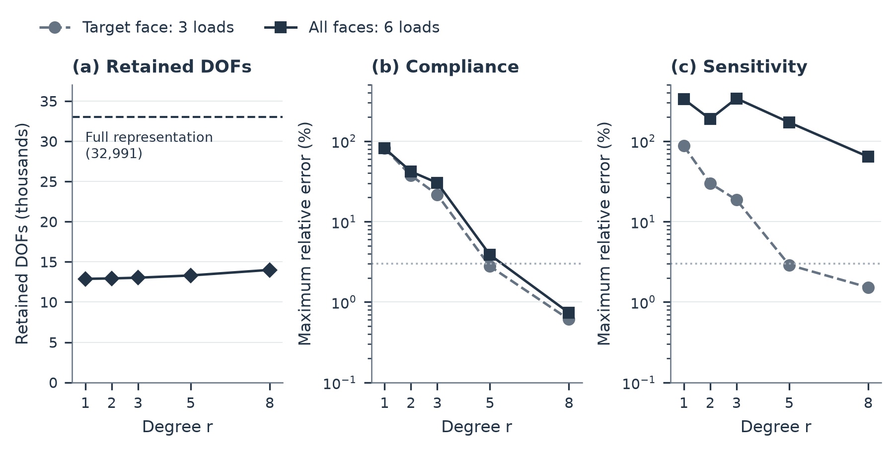

**Figure 11. Response errors caused by restricting box-face displacements.** Both cells of H1/x use exact operators and Bernstein degree \(r\) on every box face, with unrestricted non-box cut-band coordinates. (a) Reduced coordinate count; the dashed line denotes the 32,991-coordinate full representation. (b,c) Maximum compliance and target-cell sensitivity errors over the three target-face loads or all six target- and neighbour-face loads; macro-cut tractions are excluded. Errors are relative to the full retained-space solution; horizontal lines mark 3%.

### 6.9. Heterogeneous lattices with every cell learned

In a design every cell is learned, and the errors of neighbouring cells enter the same assembled solution. Two lattices with a continuous graded thickness field and a planar boundary cut test this: a \(2\times2\times2\) block of eight distinct cells, four of them cut with retained volumes of 62% and 25%, and a \(3\times3\times1\) layer of eight cells, three of them cut, with one corner position left empty. Neighbouring cells share their face corners, the corner parameters of the block range from 0.25 to 0.54, and the sixteen cells were generated for these examples and entered neither training nor weight selection. The lattices are clamped on one face and loaded by unit consistent tractions on the opposite face, held fixed at the evaluated design for the sensitivities (Appendix H), and by three random load vectors. Every cell uses NICE; the reference assembles the dense exact condensed matrices and solves to a recomputed relative residual of at most \(1.3\times10^{-10}\). The learned lattices are solved by preconditioned conjugate gradients on the free retained coordinates with a balanced two-level preconditioner: the fine action is the inverse of the assembled retained stiffness block \(K_{PP}\), factorised once per design iteration, and the coarse space consists of trilinear macro-vertex functions multiplied by the six rigid-body modes (Supplementary Note S6.1).

In the \(2\times2\times2\) block, the lattice compliance errors under the three face loads are 0.014%, 0.011% and 0.0094% (at most 0.069% under the random loads), the largest eight-corner sensitivity error over all cells is 0.14% (0.45% under the random loads), and the assembled retained solution differs from the exact one by 0.13%. The \(3\times3\times1\) layer gives 0.015%, 0.013% and 0.010% (at most 0.056%), 0.14% (0.43%) and 0.12%. These errors are below the largest two-cell errors: the cells' energy errors combine through their shares of the assembled energy rather than accumulate. By Eq. (12), the lattice compliance error is bounded by the participation-weighted sum of the cells' energy errors at the exact traces, which range from 0.006% to 0.026% in the block and 0.005% to 0.052% in the layer under the face loads (0.02% to 0.12% under the random loads), largest in the cut cells. Their weighted sums exceed the lattice compliance errors by less than 0.4% of their value under the face loads and by about 4–5% under the random loads, because the assembled solution relaxes towards the stiffer surrogate whereas \(\beta\) evaluates the errors at the exact traces.

The learned solves reach the prescribed recursive residual, while the recomputed residual \(\|f_g-\widehat{\mathbb K}\bar U\|/\|f_g\|\), at which the errors above are measured, stagnates at \(3.6\times10^{-4}\) (block) and \(3.2\times10^{-3}\) (layer). Repeating the block solve with the correction in single precision changes this residual by less than 1% and the compliance errors by less than \(3\times10^{-9}\), so the stagnation does not come from the correction arithmetic; it is consistent with rounding in the single-precision network. The solve-independent bound \(\beta\) exceeds the errors by only \(1.5\)–\(4.9\times10^{-7}\) of the compliance on all face loads, which leaves no room for a residual work comparable to them. Instrumented re-solves confirm this directly (Supplementary Note S6.3, Table ST20): the signed residual work \(\bar U^T\rho\) of Eq. (18) is at most \(2.5\times10^{-8}\) of the compliance, its dual-norm bound at most \(1.4\times10^{-5}\), and the terms of Eq. (18) balance to \(9\times10^{-9}\) of the compliance, with the compliance error unchanged from a recursive residual of \(10^{-3}\) onwards. Aggregated over the shared corner parameters, the field-based sensitivities give the lattice gradient to 0.04–0.09% under the face loads and 0.22–0.28% under the random loads, with cosines above 0.999999.

### 6.10. Computational cost of a lattice design iteration

Cost is compared for one design iteration of the lattices of Section 6.9: the two eight-cell lattices and, as four-cell lattices, the two \(2\times2\times1\) layers of the block, each with two uncut cells and two cut cells of 62% and 25% retained volume, with the same retained coordinates, clamp and loads. Table 5 compares three routes. (a) The whole-lattice direct solution assembles the full cut finite element model of the lattice, retained and interior degrees of freedom of every cell, and factorises it once by a sparse Cholesky factorisation (MKL PARDISO on one AMD EPYC 9654 host with 16 threads, and with one thread for comparison with serial solvers); its recomputed relative residuals are below \(3\times10^{-9}\), so for the four-cell lattices it is also the exact reference. (b) Conventional exact condensation condenses every cell on the same host by a Cholesky factorisation of its interior with PARDISO's Schur-complement option and solves the assembled condensed system by a block Cholesky factorisation that eliminates each cell's private retained coordinates before the shared interface (16 threads); its compliance agrees with (a) to \(7\times10^{-10}\). (c) NICE (one RTX 5090) prepares the learned operator of every cell and solves the assembled system by the preconditioned conjugate gradients of Section 6.9 to a relative residual of \(10^{-6}\), with the correction in single precision, including the field-based sensitivities. All routes include cell setup and stiffness assembly, and none includes the one-off cost of data generation and training (Section 6.1).

**Table 5. Cost of one design iteration of the lattices.** (a) Whole-lattice direct solution by sparse Cholesky factorisation (MKL PARDISO, AMD EPYC 9654) with 16 threads and with one thread: time from cell setup to the solution of six loads (three consistent, three random); peak process memory. (b) Every cell condensed with PARDISO's Schur-complement option, then the condensed lattice system solved by block Cholesky factorisation, 16 threads: total time, peak process memory. (c) Front end, preconditioner setup, conjugate gradients for the three consistent loads to \(10^{-6}\) and field-based sensitivities; peak GPU memory, host memory after the front end; compliance error against (a) for four cells and against the exact condensation of Section 6.9 for eight cells. Memory in GiB. All phases: Supplementary Note S5 and Table ST15.

| Lattice (cut / cells) | DOFs: total / free retained | (a) Whole-lattice direct, 16 threads: time (s) / memory (GiB) | (a) Whole-lattice direct, 1 thread: time (s) | (b) Conventional exact condensation, 16 threads: time (s) / memory (GiB) | (c) NICE (one RTX 5090): time (s) / iterations | (c) NICE memory (GiB): GPU / host | (c) NICE compliance error (%) |
| -------------- | -------------- | ------------- | ------------- | ------------- | ------------- | ------------ | ---------------- |
| \(2\times2\times1\), \(z=0\) (2 / 4) | 957,888 / 77,310 | 484 / 35.1 | 2,425 | 589 / 27.9 | 38.6 / 114 | 6.3 / 2.4 | 0.015, 0.012, 0.010 |
| \(2\times2\times1\), \(z=1\) (2 / 4) | 884,940 / 71,046 | 349 / 32.0 | 2,131 | 632 / 24.7 | 37.7 / 119 | 6.1 / 2.4 | 0.022, 0.016, 0.014 |
| \(2\times2\times2\) (4 / 8) | 1,833,474 / 139,002 | 868 / 71.1 | 5,864 | 950 / 40.1 | 81.2 / 129 | 8.5 / 3.9 | 0.014, 0.011, 0.0097 |
| \(3\times3\times1\) (3 / 8) | 2,113,611 / 143,685 | 1,042 / 85.9 | 8,131 | 1,218 / 42.2 | 110.1 / 165 | 9.2 / 4.7 | 0.015, 0.014, 0.015 |

For the four-cell lattices, a NICE design iteration takes 38 s, against 349 to 484 s for the whole-lattice direct solution with 16 threads, 2,131 to 2,425 s with one thread and 589 to 632 s for conventional exact condensation, and the learned compliance agrees with the direct solution within 0.022%, below the reference in every case. For the eight-cell lattices, NICE takes 81 and 110 s against 868 and 1,042 s for the parallel and 5,864 and 8,131 s for the serial direct solution, about ten and 72 to 74 times longer, and 950 and 1,218 s for conventional condensation. For the eight-cell lattices, the timed errors include the algebraic error of the \(10^{-6}\) solve (Eq. 18) and exceed the operator errors of Section 6.9 by up to 0.005 percentage points. The Cholesky factor grows slightly faster than the number of degrees of freedom, from 29 to 32 GiB for four cells to 66 and 81 GiB for eight, and the process peak of the direct solution reaches 71 and 86 GiB; conventional condensation needs 40 and 42 GiB, most of it for the condensed cell matrices held until assembly (Supplementary Table ST15). NICE needs at most 9.2 GiB of GPU and 4.7 GiB of host memory. Per cell, NICE's stored state takes 0.25 to 1.37 GiB, against 0.60 to 9.4 GiB for the interior Cholesky factor of conventional condensation (Supplementary Note S5, Table ST17). SciPy's default sparse direct solver (SuperLU), tried as a further serial baseline, failed with a memory error while factorising a single cell, at about 4 GiB of resident memory.

A design iteration changes the geometry of every cell, so every cell's preparation, interior factorisation or network encoding and correction setup, is repeated; the assembled solve can start from the previous solution, and the conventional routes can reuse their symbolic factorisation while the active-element pattern is unchanged. NICE's lattice solve is itself an inexact substructuring iteration; fine-scale iterative solvers of the whole lattice were not compared (Section 7.5).

### 6.11. Design optimisation [placeholder]

**[Placeholder — to be completed; not part of the current review.]** This subsection will report a thickness optimisation driven by the learned operator: compliance minimisation under a volume constraint, with the eight corner thickness parameters of each cell as design variables shared between neighbouring cells, updated by optimality criteria or the method of moving asymptotes, on a lattice of eight or twenty-seven cells. For shared design variables \(\boldsymbol\tau_g\) enforcing continuity through \(\boldsymbol\tau_m=\boldsymbol\tau_m(\boldsymbol\tau_g)\), the structural gradient is \(\nabla_{\boldsymbol\tau_g} C=\sum_m(\partial\boldsymbol\tau_m/\partial\boldsymbol\tau_g)^T\boldsymbol s_m\) under the fixed load and assembly maps of Section 4.3; the same parameter map acts on the complete derivatives in Eq. (14). The final design will be verified with the exact reference (compliance and thickness sensitivities), and the optimisation history will be compared with one driven by exact condensation.

<!-- Section 6.11 must state (review round 1, I-03/I-08/I-20/I-31/I-50): which gradient drives the optimiser (field-based estimate or complete surrogate derivative) and its verification against the exact derivative at initial, intermediate and final designs (relative error, cosine, per-variable percentiles, sign agreement); the load model (loads through non-design cells or nodal loads frozen at the initial design, or the load-derivative term 2 f_{g,c}^T U included); the parameter bounds [0.175, 0.699] and span/gradient limits the optimiser imposes; a log of discrete switches (active elements, ghost faces, retained set, binary node features, coarse-factor shift) per iteration; the per-iteration recomputed residual and signed residual work; the surrogate compliance error at start and optimum. -->

## 7. Discussion

### 7.1. Boundary restriction and interior approximation

Fixing the retained coordinates separates two decisions that a reduced substructure model otherwise combines: which displacement patterns neighbouring cells may exchange, and how accurately the interior responds to each of them. Learning and correction alter only the second, which matters for cut cells, where the coefficients needed for cut-surface virtual work form a band of active elements rather than a minimal surface trace. The ablation of Section 6.8 shows the role of the first: even with exact interiors, restricting box-face displacements changes the assembled response, and a degree that gives accurate compliance can leave appreciable sensitivity error. Substructure methods that describe the boundary by a few coordinates [Huang et al. (2023)](https://doi.org/10.1016/j.eml.2023.102041), [Guo et al. (2026a)](https://doi.org/10.1016/j.cma.2026.118955) accept this boundary error, which they control by partition refinement [Huang et al. (2024)](https://doi.org/10.1016/j.jmps.2024.105893), boundary enrichment [Guo et al. (2026a)](https://doi.org/10.1016/j.cma.2026.118955) or oversampling [Guo et al. (2026b)](https://arxiv.org/abs/2607.22019v1), in exchange for coarse models small enough for very large structures. For orientation only, since error definitions, problems and baselines differ: Guo et al. (2026a, Table 1) report displacement errors of 7.76–13.64% with linear, 1.95–2.22% with cubic Bézier and 0.84–3.46% with full-node boundaries, at 7 to 380 times the speed of their serial direct finite element solution, whereas NICE's directional energy error is about 0.07% and its assembled compliance errors are 0.01–0.06% against exact condensation, at 9 to 13 times the speed of the parallel and 56 to 74 times that of the serial whole-lattice direct solution (Section 6.10). For the local sensitivity of the cut cells examined, the boundary restriction produces larger errors than the interior approximation of NICE (Sections 6.6 and 6.8, for single cells at fixed size); where a compact coarse model matters more, the balance can differ. The retained cut band keeps cut-surface loads and supports available without retraining; in the lattices, whose cut surfaces are traction-free, it accounts for 37 to 50% of the free retained coordinates, but each cell application acts on the complete cell irrespective of how its retained coordinates are shared.

### 7.2. Complementary roles of prediction and equilibrium correction

An internal update that does not increase the \(A\)-energy error for any retained input yields a condensed stiffness between the learned stiffness and the exact Schur complement, independently of the network. The guarantee is an ordering, not a rate: the reductions by one to two orders of magnitude in Section 6.5 are empirical, and the ordering imposes no monotonicity on the sensitivity error. Within this structure, prediction and correction are complementary. Relaxation efficiently removes the error components with large Rayleigh quotients, which amplify a displacement error of one percent into an energy error of several percent (Section 6.4); the coarse solve removes the smooth components that relaxation reaches slowly. The learned field supplies what neither reaches at a practical budget: under the same correction, a harmonic start leaves 7 to 290 times its error, and eight times the smoothing work closes the gap in only one of six cells. Conversely, the correction relieves the network of what it represents poorly: a base-network error of 13.5% on M1 becomes 0.19% without any change of weights, and NICE-post already meets the assembled accuracy reference, so an existing network need not be retrained to benefit from the correction.

### 7.3. Requirements for design use

Design differentiation adds a requirement that the energy error does not control. At a fixed retained displacement, with \(H=F-E\), Eqs. (13) and (14) give \(\widetilde s_c-s_c=2(Hq)^TAE_{I,c}q-(Hq)^TK_{,c}Hq\) and \(\widehat C_{,c}-C_{,c}=-2(H_{I,c}q)^TA\,Hq-(Hq)^TK_{,c}Hq\): the residual term of Eq. (14) removes the linear field-error term and replaces it by one weighted by the design derivative of the extension error. Which of the two is the more accurate gradient therefore depends on whether \(\|H_{I,c}q\|_A\) is small compared with \(\|E_{I,c}q\|_A\). A fixed-\(\widehat q\) central-difference check on the fourteen pair configurations and on the four lattices of Sections 6.9 and 6.10 could not resolve \(\widehat C_{,c}\) (Supplementary Note S6.3, Table ST20). Each perturbation rebuilds the cell's learned operator, and 21 to 48 of the 49 rebuilds of every lattice cell change at least one of the discrete choices listed in Section 4.3; the difference quotient then grows as the step decreases, from 0.18–0.29% of the exact lattice gradient at a step of \(3\times10^{-3}\tau_c\) to 0.35–1.5% at \(3\times10^{-4}\tau_c\). At this resolution the surrogate objective is not smooth in the thickness. The field-based estimate needs no difference quotient and gives the shared-variable lattice gradient to 0.02–0.13% under the face loads and 0.22–0.35% under the random loads. The field-based estimate used here therefore estimates the exact sensitivity and is not the gradient of the surrogate objective, an inconsistency that matters for optimisers with a line search. Moreover, assembly selects its directions through the coupled solution, whereas training controls the average error over sampled directions; a uniform operator bound would require quantitative coverage of the nonrigid retained space (Appendix J.7).

### 7.4. Computational value

A correction budget adequate for compliance can leave local sensitivity inaccurate, so the relevant cost is the total work needed to reach the prescribed accuracy of both. For the lattices examined, a NICE design iteration takes less time and memory than the whole-lattice direct solution and conventional exact condensation (Section 6.10). Its lattice solve is an inexact substructuring iteration, with approximate interior extensions as in inexact BDDC and FETI-DP methods [Li & Widlund (2007)](https://doi.org/10.1016/j.cma.2006.03.011), [Klawonn & Rheinbach (2007)](https://doi.org/10.1002/nme.1758). Its distinguishing output is a condensed operator per cell with a quantified and reducible error, not a faster fine-scale solve, and no advantage over iterative solvers of the whole lattice is claimed. Fusing the operations of an application or reducing the smoothing budget would lower its cost, at an accuracy cost that Section 6.5 quantifies.

### 7.5. Limitations

The trained operator applies to the setting in which it was trained and tested: Schwarz-P-type cells defined by Eq. (1), eight trilinear corner parameters in [0.175, 0.699] with corner span and gradient norm at most 0.47 (Table ST02), at most one planar cut whose normal is a cube-symmetry image of \((\cos\vartheta,\sin\vartheta,0)\), and one discretisation (\(n=32\), \(E_Y=1\), \(\nu=0.3\), \(\gamma=10^{-4}\)), to which the 65/33/17/9 latent hierarchy is tied. Other TPMS families were not tested; they, cells with several cuts or curved boundaries, other resolutions and other materials require new training. The network is not equivariant under the cube symmetries, as symmetry-decoupled shape functions are for voxel substructures [Jiang, C. et al. (2026)](https://doi.org/10.1016/j.compstruct.2026.120865), and NICE was evaluated mainly in the identity orientation: in a second cube-symmetry orientation of the 80 validation geometries, which also entered weight selection, its mean directional energy excess over the load classes is 4% higher, and 12% higher under consistent tractions. The variational properties of Section 3.2 hold for any input, but the accuracy does not: no certified error bound is provided, although the residual of Eq. (10) and a label-free lower bound on each cell's energy error (Appendix I) can be computed at run time. Accuracy is measured against the discrete reference, whose error for heavily cut cells at \(n=32\) is of order one percent in compliance and several percent in sensitivity (Section 6.2). The assembled evidence comprises fourteen two-cell configurations of development cells, eighteen of held-out cells and two eight-cell lattices; all training comparisons use one seed, and the effect of the sensitivity term in Eq. (8) was not isolated. The reported sensitivities are field-based estimates that omit the design dependence of the extension in Eq. (14). The cost comparison excludes data generation and training, and fine-scale iterative solvers of the whole lattice, such as algebraic multigrid [Vaněk et al. (1996)](https://doi.org/10.1007/BF02238511), [Henson & Yang (2002)](https://doi.org/10.1016/S0168-9274(01)00115-5), [Falgout & Yang (2002)](https://doi.org/10.1007/3-540-47789-6_66) or BDDC and FETI-DP preconditioners [Dohrmann (2003)](https://doi.org/10.1137/S1064827502412887), [Farhat et al. (2001)](https://doi.org/10.1002/nme.76), were not compared. An optimiser must keep designs inside the parameter domain above.

## 8. Conclusions

NICE approximates the static condensation of cut thin-walled Schwarz-P-type TPMS cells on the complete retained space by a geometry-conditioned learned interior field and a fixed, geometry-specific multilevel equilibrium correction, applied through the complete transpose without forming the condensed stiffness. The operator inherits the variational properties of admissible extensions, including the Schur-complement lower bound, and the correction cannot increase its error; in all examples, a better initial field or a larger correction budget reduced it.

For learned substructures, the error relations quantify a distinction familiar from goal-oriented error estimation and approximate reanalysis: accurate compliance does not imply accurate local thickness sensitivity. For an uncorrected extension they also explain why: displacement errors of about one percent lie in stiff directions and give energy errors of several percent, and weakly participating cells show accurate compliance but sensitivity errors above 3%. Chebyshev smoothing and a trilinear coarse solve remove the stiff and the slowly relaxed error components while preserving the variational structure. NICE keeps the geometry-mean energy error under consistent tractions at or below 0.65% on all 80 validation geometries, the largest occurring on a geometry that entered neither training nor weight selection, and keeps the face-load compliance and sensitivity errors below 0.06% and 0.7% in the fourteen two-cell configurations of development cells and below 0.28% and 1.5% in eighteen configurations of cells outside weight selection.

The learned field and the correction are complementary: under the same correction, a harmonic start leaves 7 to 290 times and a zero interior 2,400 to 12,000 times the error of the learned field on five detailed cells, and NICE-post, the base network with the correction applied at deployment, also meets the assembled accuracy reference. In lattices of learned cells, the compliance error, at most 0.015% under consistent face loads, follows the participation-weighted bound of Eq. (12) to within 0.4% under face loads (about 5% under random loads), and the thickness sensitivities stay within 0.15%. For the eight-cell lattices, a NICE design iteration takes 81 to 110 s and at most 9.2 GiB of GPU memory on one RTX 5090, against 868 to 1,042 s for the whole-lattice Cholesky solution on 16 CPU threads, whose factor needs 66 to 81 GiB, and 5,864 to 8,131 s on one thread; these figures exclude the one-off cost of data generation and training.

[Placeholder: conclusion on the design-optimisation example of Section 6.11.]

## Code and data availability

The implementation of the neural extension, the equilibrium correction and its transpose, the cut-cell preprocessing and reference condensation, and the assembly, benchmark and figure scripts will be archived as a cleaned, frozen snapshot, together with the trained weights of the predictors of Table 2, the parameter files of all validation and lattice geometries and the result records from which every table and figure is generated, at [Zenodo DOI] upon acceptance. Training data are available from the corresponding author on reasonable request.

## References

Adams, M., Brezina, M., Hu, J., Tuminaro, R. (2003). [Parallel multigrid smoothing: polynomial versus Gauss–Seidel](https://doi.org/10.1016/s0021-9991(03)00194-3). *Journal of Computational Physics*, 188(2), 593–610.

Alexandersen, J., Lazarov, B. S. (2015). [Topology optimisation of manufacturable microstructural details without length scale separation using a spectral coarse basis preconditioner](https://doi.org/10.1016/j.cma.2015.02.028). *Computer Methods in Applied Mechanics and Engineering*, 290, 156–182.

Amir, O., Bendsøe, M. P., Sigmund, O. (2009). [Approximate reanalysis in topology optimization](https://doi.org/10.1002/nme.2536). *International Journal for Numerical Methods in Engineering*, 78(12), 1474–1491.

Amir, O., Stolpe, M., Sigmund, O. (2010). [Efficient use of iterative solvers in nested topology optimization](https://doi.org/10.1007/s00158-009-0463-4). *Structural and Multidisciplinary Optimization*, 42(1), 55–72.

Ballani, J., Huynh, D. B. P., Knezevic, D. J., Nguyen, L., Patera, A. T. (2018). [A component-based hybrid reduced basis/finite element method for solid mechanics with local nonlinearities](https://doi.org/10.1016/j.cma.2017.09.014). *Computer Methods in Applied Mechanics and Engineering*, 329, 498–531.

Becker, R., Rannacher, R. (2001). [An optimal control approach to a posteriori error estimation in finite element methods](https://doi.org/10.1017/S0962492901000010). *Acta Numerica*, 10, 1–102.

Bendsøe, M. P., Sigmund, O. (2003). [*Topology Optimization: Theory, Methods, and Applications*](https://doi.org/10.1007/978-3-662-05086-6), 2nd edn. Springer, Berlin, Heidelberg.

Bonilla Moreno, G., Guarino, G., Antolin, P. (2027). [A ROM-based BDDC solver for unfitted p-FEM level-set-based two-dimensional lattice structures](https://doi.org/10.1016/j.cma.2026.119304). *Computer Methods in Applied Mechanics and Engineering*, 463, 119304.

Boullé, N., Townsend, A. (2023). [Learning elliptic partial differential equations with randomized linear algebra](https://doi.org/10.1007/s10208-022-09556-w). *Foundations of Computational Mathematics*, 23(2), 709–739.

Burman, E., Claus, S., Hansbo, P., Larson, M. G., Massing, A. (2015). [CutFEM: Discretizing geometry and partial differential equations](https://doi.org/10.1002/nme.4823). *International Journal for Numerical Methods in Engineering*, 104(7), 472–501.

Chen, W., Li, M. (2026). [Conditioned numerical shape functions on unfitted reduced coarse elements for robust analysis of complex solid structures](https://doi.org/10.1016/j.cad.2026.104038). *Computer-Aided Design*, 193, 104038.

Dohrmann, C. R. (2003). [A preconditioner for substructuring based on constrained energy minimization](https://doi.org/10.1137/S1064827502412887). *SIAM Journal on Scientific Computing*, 25(1), 246–258.

Dohrmann, C. R. (2007). [An approximate BDDC preconditioner](https://doi.org/10.1002/nla.514). *Numerical Linear Algebra with Applications*, 14(2), 149–168.

E, W., Yu, B. (2018). [The Deep Ritz method: a deep learning-based numerical algorithm for solving variational problems](https://doi.org/10.1007/s40304-018-0127-z). *Communications in Mathematics and Statistics*, 6(1), 1–12.

Efendiev, Y., Galvis, J., Hou, T. Y. (2013). [Generalized multiscale finite element methods (GMsFEM)](https://doi.org/10.1016/j.jcp.2013.04.045). *Journal of Computational Physics*, 251, 116–135.

Eftang, J. L., Patera, A. T. (2013). [Port reduction in parametrized component static condensation: approximation and a posteriori error estimation](https://doi.org/10.1002/nme.4543). *International Journal for Numerical Methods in Engineering*, 96(5), 269–302.

Falgout, R. D., Vassilevski, P. S., Zikatanov, L. T. (2005). [On two-grid convergence estimates](https://doi.org/10.1002/nla.437). *Numerical Linear Algebra with Applications*, 12(5–6), 471–494.

Falgout, R. D., Yang, U. M. (2002). [hypre: A library of high performance preconditioners](https://doi.org/10.1007/3-540-47789-6_66). In *Computational Science — ICCS 2002*, Lecture Notes in Computer Science, 2331, 632–641. Springer, Berlin, Heidelberg.

Farhat, C., Lesoinne, M., LeTallec, P., Pierson, K., Rixen, D. (2001). [FETI-DP: a dual–primal unified FETI method—part I: A faster alternative to the two-level FETI method](https://doi.org/10.1002/nme.76). *International Journal for Numerical Methods in Engineering*, 50(7), 1523–1544.

Fraeijs de Veubeke, B. (1965). Displacement and equilibrium models in the finite element method. In Zienkiewicz, O. C., Holister, G. S. (eds.), *Stress Analysis*, Chapter 9, 145–197. John Wiley & Sons. Reprinted in *International Journal for Numerical Methods in Engineering*, 52(3) (2001), 287–342, [doi:10.1002/nme.339](https://doi.org/10.1002/nme.339).

Giles, M. B., Pierce, N. A. (2000). [An Introduction to the Adjoint Approach to Design](https://doi.org/10.1023/a:1011430410075). *Flow, Turbulence and Combustion*, 65(3–4), 393–415.

Gogu, C. (2015). [Improving the efficiency of large scale topology optimization through on-the-fly reduced order model construction](https://doi.org/10.1002/nme.4797). *International Journal for Numerical Methods in Engineering*, 101(4), 281–304.

Golub, G. H., Varga, R. S. (1961). [Chebyshev semi-iterative methods, successive overrelaxation iterative methods, and second order Richardson iterative methods. Part I](https://doi.org/10.1007/BF01386013). *Numerische Mathematik*, 3(1), 147–156.

Greenfeld, D., Galun, M., Basri, R., Yavneh, I., Kimmel, R. (2019). [Learning to optimize multigrid PDE solvers](https://proceedings.mlr.press/v97/greenfeld19a.html). In *Proceedings of the 36th International Conference on Machine Learning*, PMLR 97, 2415–2423.

Guo, Y., Liu, C., Du, Z., Jia, Y., Jiang, C., Guo, X., Shen, C. (2026a). [High-Generalization AI-Enhanced Mechanical Analysis and Topology Optimization via Cubic Bézier Interpolation of Substructure Boundary Displacements](https://doi.org/10.1016/j.cma.2026.118955). *Computer Methods in Applied Mechanics and Engineering*, 456, 118955.

Guo, Y., Liu, C., Du, Z., Liu, J., Feng, J., Zhang, X., Li, Y., Yang, T., Shen, C., Guo, X. (2026b). [PIML-OFEM: A New Large-Scale Structural Analysis Method Based on Problem-Independent Machine Learning and Overlapping Finite Element Technique](https://arxiv.org/abs/2607.22019v1). arXiv:2607.22019v1 [Preprint].

Guyan, R. J. (1965). [Reduction of stiffness and mass matrices](https://doi.org/10.2514/3.2874). *AIAA Journal*, 3(2), 380.

Hackbusch, W. (1985). [*Multi-Grid Methods and Applications*](https://doi.org/10.1007/978-3-662-02427-0). Springer, Berlin.

Haftka, R. T., Gürdal, Z. (1992). [*Elements of Structural Optimization*](https://doi.org/10.1007/978-94-011-2550-5), 3rd edn. Kluwer, Dordrecht.

He, J., Liu, X., Xu, J. (2024). [MgNO: Efficient parameterization of linear operators via multigrid](https://proceedings.iclr.cc/paper_files/paper/2024/hash/eb3c8135137c8a60425a0320869ad87e-Abstract-Conference.html). In *International Conference on Learning Representations (ICLR 2024)*, 53409–53428. OpenReview: [8OxL034uEr](https://openreview.net/forum?id=8OxL034uEr).

Heinlein, A., Klawonn, A., Lanser, M., Weber, J. (2021). [Combining machine learning and adaptive coarse spaces—a hybrid approach for robust FETI-DP methods in three dimensions](https://doi.org/10.1137/20M1344913). *SIAM Journal on Scientific Computing*, 43(5), S816–S838.

Henson, V. E., Yang, U. M. (2002). [BoomerAMG: A parallel algebraic multigrid solver and preconditioner](https://doi.org/10.1016/S0168-9274(01)00115-5). *Applied Numerical Mathematics*, 41(1), 155–177.

Hou, T. Y., Wu, X.-H. (1997). [A Multiscale Finite Element Method for Elliptic Problems in Composite Materials and Porous Media](https://doi.org/10.1006/jcph.1997.5682). *Journal of Computational Physics*, 134(1), 169–189.

Huang, M., Du, Z., Liu, C., Zheng, Y., Cui, T., Mei, Y., Li, X., Zhang, X., Guo, X. (2022). [Problem-independent machine learning (PIML)-based topology optimization—A universal approach](https://doi.org/10.1016/j.eml.2022.101887). *Extreme Mechanics Letters*, 56, 101887.

Huang, M., Cui, T., Liu, C., Du, Z., Zhang, J., He, C., Guo, X. (2023). [A Problem-Independent Machine Learning (PIML) enhanced substructure-based approach for large-scale structural analysis and topology optimization of linear elastic structures](https://doi.org/10.1016/j.eml.2023.102041). *Extreme Mechanics Letters*, 63, 102041.

Huang, M., Liu, C., Guo, Y., Zhang, L., Du, Z., Guo, X. (2024). [A mechanics-based data-free Problem Independent Machine Learning (PIML) model for large-scale structural analysis and design optimization](https://doi.org/10.1016/j.jmps.2024.105893). *Journal of the Mechanics and Physics of Solids*, 193, 105893.

Huynh, D. B. P., Knezevic, D. J., Patera, A. T. (2013). [A static condensation reduced basis element method: approximation and a posteriori error estimation](https://doi.org/10.1051/m2an/2012022). *ESAIM: Mathematical Modelling and Numerical Analysis*, 47(1), 213–251.

Irons, B. (1965). [Structural eigenvalue problems—elimination of unwanted variables](https://doi.org/10.2514/3.3027). *AIAA Journal*, 3(5), 961–962.

Jiang, C., Liu, C., Guo, Y., Du, Z., Zhang, W., Guo, X. (2026). [Mechanically consistent equivariant machine learning for substructural analysis](https://doi.org/10.1016/j.compstruct.2026.120865). *Composite Structures*, 397, 120865.

Jiang, H., Zhan, J., Zhang, C., Wang, F. (2026). [Convex Neural Energy Elements: Monolithic Finite-Element Assembly of Geometry-Parameterized Neural Operators with Stability and Error Guarantees](https://arxiv.org/abs/2608.02036v1). arXiv:2608.02036v1 [Preprint].

Klawonn, A., Rheinbach, O. (2007). [Inexact FETI-DP methods](https://doi.org/10.1002/nme.1758). *International Journal for Numerical Methods in Engineering*, 69(2), 284–307.

Kopaničáková, A., Karniadakis, G. E. (2025). [DeepONet Based Preconditioning Strategies for Solving Parametric Linear Systems of Equations](https://doi.org/10.1137/24m162861x). *SIAM Journal on Scientific Computing*, 47(1), C151–C181.

Li, J., Widlund, O. B. (2007). [On the use of inexact subdomain solvers for BDDC algorithms](https://doi.org/10.1016/j.cma.2006.03.011). *Computer Methods in Applied Mechanics and Engineering*, 196(8), 1415–1428.

Li, Z., Huang, D. Z., Liu, B., Anandkumar, A. (2023a). [Fourier neural operator with learned deformations for PDEs on general geometries](https://www.jmlr.org/papers/v24/23-0064.html). *Journal of Machine Learning Research*, 24(388), 1–26.

Li, Z., Kovachki, N., Choy, C., Li, B., Kossaifi, J., Otta, S., Nabian, M. A., Stadler, M., Hundt, C., Azizzadenesheli, K., Anandkumar, A. (2023b). [Geometry-informed neural operator for large-scale 3D PDEs](https://doi.org/10.52202/075280-1556). In *Advances in Neural Information Processing Systems 36 (NeurIPS 2023)*, 35836–35854.

Luz, I., Galun, M., Maron, H., Basri, R., Yavneh, I. (2020). [Learning algebraic multigrid using graph neural networks](https://proceedings.mlr.press/v119/luz20a.html). In *Proceedings of the 37th International Conference on Machine Learning*, PMLR 119, 6489–6499.

Oden, J. T., Prudhomme, S. (2001). [Goal-oriented error estimation and adaptivity for the finite element method](https://doi.org/10.1016/S0898-1221(00)00317-5). *Computers & Mathematics with Applications*, 41(5–6), 735–756.

Parish, E., Lindsay, P., Shelton, T., Mersch, J. (2024). [Embedded symmetric positive semi-definite machine-learned elements for reduced-order modeling in finite-element simulations with application to threaded fasteners](https://doi.org/10.1007/s00466-024-02481-5). *Computational Mechanics*, 74(6), 1357–1381.

Pfaff, T., Fortunato, M., Sanchez-Gonzalez, A., Battaglia, P. W. (2021). [Learning mesh-based simulation with graph networks](https://openreview.net/forum?id=roNqYL0_XP). In *International Conference on Learning Representations (ICLR 2021)*.

Smetana, K., Patera, A. T. (2016). [Optimal Local Approximation Spaces for Component-Based Static Condensation Procedures](https://doi.org/10.1137/15m1009603). *SIAM Journal on Scientific Computing*, 38(5), A3318–A3356.

Toselli, A., Widlund, O. (2005). [*Domain Decomposition Methods — Algorithms and Theory*](https://doi.org/10.1007/b137868). Springer, Berlin.

Trottenberg, U., Oosterlee, C. W., Schüller, A. (2001). [*Multigrid*](https://shop.elsevier.com/books/multigrid/trottenberg/978-0-12-701070-0). Academic Press, San Diego. ISBN 0-12-701070-X.

Um, K., Brand, R., Fei, Y., Holl, P., Thuerey, N. (2020). [Solver-in-the-loop: learning from differentiable physics to interact with iterative PDE-solvers](https://proceedings.neurips.cc/paper/2020/hash/43e4e6a6f341e00671e123714de019a8-Abstract.html). In *Advances in Neural Information Processing Systems 33 (NeurIPS 2020)*, 6111–6122.

Vaněk, P., Mandel, J., Brezina, M. (1996). [Algebraic multigrid by smoothed aggregation for second and fourth order elliptic problems](https://doi.org/10.1007/BF02238511). *Computing*, 56(3), 179–196.

Xing, Y., Liu, Y., Xue, T., Lu, L. (2026). [GMT: A Geometric Multigrid Transformer Solver for Microstructure Homogenization](https://doi.org/10.1145/3811333). *ACM Transactions on Graphics*, 45(4), 1–15.

Xu, J. (1992). [Iterative Methods by Space Decomposition and Subspace Correction](https://doi.org/10.1137/1034116). *SIAM Review*, 34(4), 581–613.

Xu, J., Zikatanov, L. (2002). [The method of alternating projections and the method of subspace corrections in Hilbert space](https://doi.org/10.1090/S0894-0347-02-00398-3). *Journal of the American Mathematical Society*, 15(3), 573–597.

Xu, W., Liu, C., Guo, Y., Huang, M., Guo, X. (2025). [Problem-Independent Machine Learning (PIML) enhanced 3D lattice composite structures optimization via moving morphable components approach](https://doi.org/10.1016/j.compstruct.2025.119330). *Composite Structures*, 369, 119330.

Yu, S., Sun, J., Bai, J. (2019). [Investigation of functionally graded TPMS structures fabricated by additive manufacturing](https://doi.org/10.1016/j.matdes.2019.108021). *Materials & Design*, 182, 108021.

Zhang, E., Kahana, A., Kopaničáková, A., Turkel, E., Ranade, R., Pathak, J., Karniadakis, G. E. (2024). [Blending neural operators and relaxation methods in PDE numerical solvers](https://doi.org/10.1038/s42256-024-00910-x). *Nature Machine Intelligence*, 6(11), 1303–1313.

Zhang, L., Liu, C., Guo, Y., Jiang, C., Guo, X. (2026). [Problem-independent transfer learning for complex-domain 3D topology optimization](https://doi.org/10.1016/j.ijmecsci.2026.112007). *International Journal of Mechanical Sciences*, 328, 112007.

## Supplementary material

[Proofs and implementation details](APPENDICES_EN.md) · [Complete result tables and supplementary figures](SUPPLEMENTARY_EN.md)
