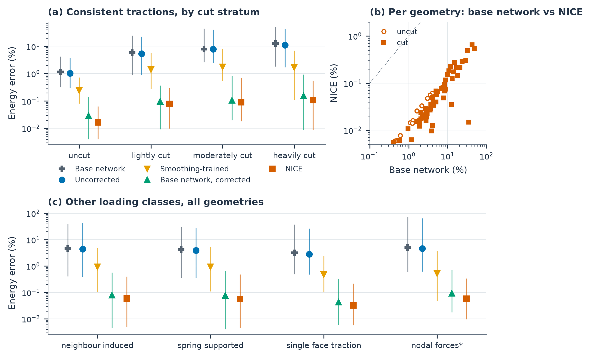
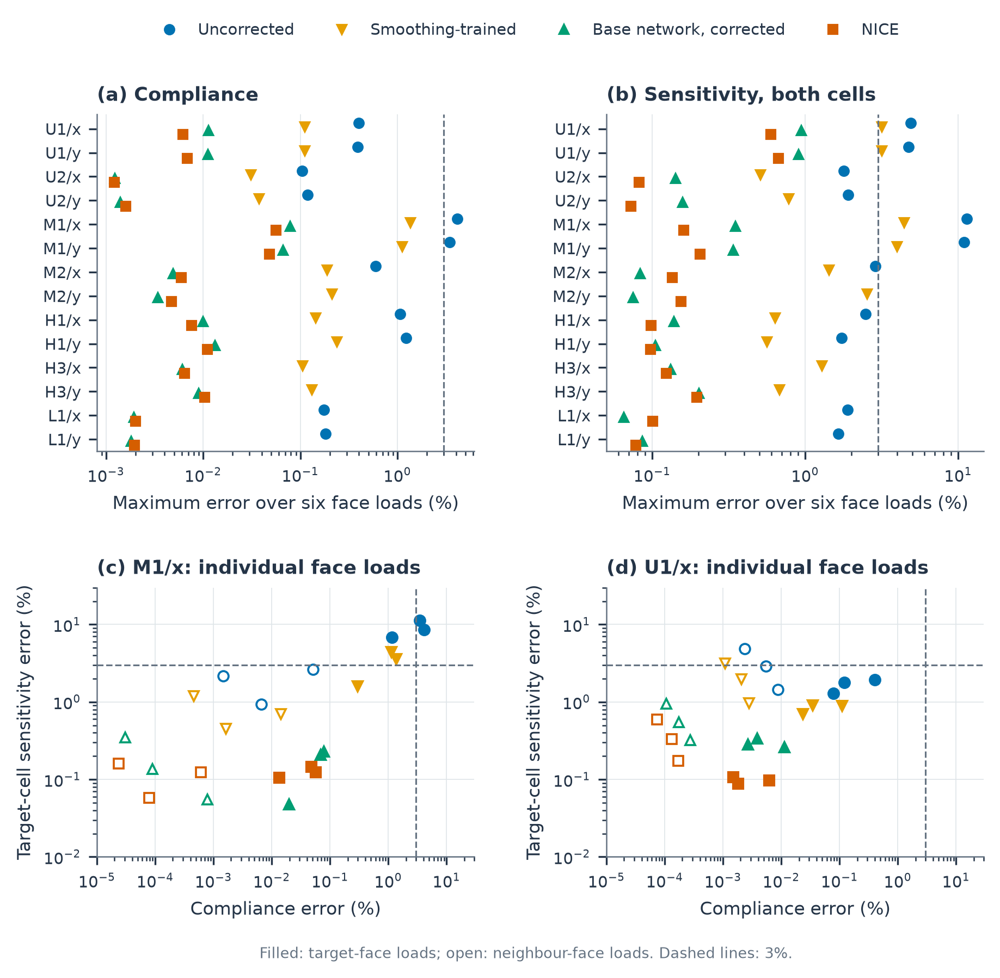
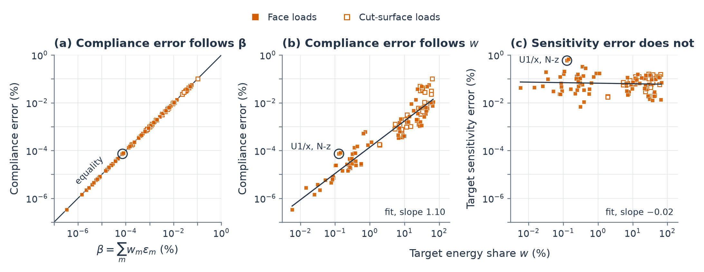
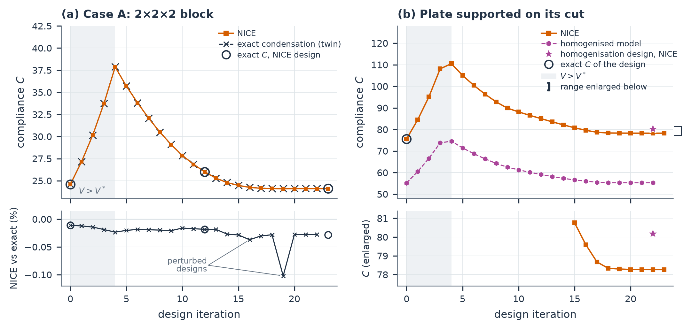
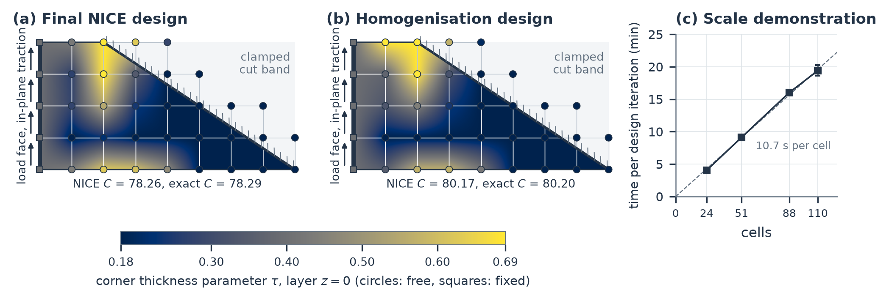

# Neural-initialised static condensation with equilibrium correction for the analysis and thickness design of cut thin-walled TPMS lattices

## Abstract

When a lattice is trimmed to the shape of a part, the cells cut by the boundary can carry its supports and loads, and each has a geometry of its own. Resolving every wall makes each design iteration a fine-scale analysis of the whole structure, whereas homogenisation loses accuracy where scales do not separate, underestimating the compliance of a 24-cell layer clamped at its cut by 27%. Static condensation keeps each cell's fine scale, but needs an interior factorisation for every geometry, whose discrete space changes with the cut. We replace it by a learned interior extension, keeping condensation's structure on all box-face and cut-band degrees of freedom. A geometry-conditioned network, exactly linear in the retained displacement and admissible by construction, computes the extension for tens of thousands of retained degrees of freedom per cell, forming no matrix. Its energy defines a Ritz approximation of the condensed stiffness, bounded below by the exact Schur complement with error quadratic in the interior error; a fixed two-grid correction inside this energy keeps these properties and, under stated conditions, cannot increase the error. For cut Schwarz-P cells in a stabilised cut finite element model, the mean energy error is 0.074%, assembled compliance and sensitivity errors stay below 0.28% and 1.5%, and an eight-cell analysis with sensitivities is about ten times faster than direct solution. Thickness optimisation reproduces the exact-condensation design of an eight-cell lattice; on the clamped layer, compliance and gradient agree with exact condensation to 0.03% and 0.3% at the checked designs.

**Keywords:** learned substructures; static condensation; Schur complement; Ritz approximation; cut finite elements; TPMS lattices; thickness optimisation.

## 1. Introduction

Many engineered structures are assembled from a large number of components of the same kind but of different geometry: graded lattices whose cells vary in wall thickness [Yu et al. (2019)](https://doi.org/10.1016/j.matdes.2019.108021), architected materials trimmed to the shape of a part, cellular cores supported and loaded along cut boundaries. Their analysis, and still more their design, must reconcile two opposing demands. The structure as a whole is large, and every design change calls for its analysis again, which favours replacing each component by something cheaper; yet the quantities that drive the design, such as the stiffness of a cut cell next to a support or the sensitivity to a wall thickness, are local, which favours keeping each component's detail. Homogenisation resolves this tension in favour of economy, and the design of graded lattices commonly rests on it [Li et al. (2018)](https://doi.org/10.1016/j.cad.2018.06.003), [Wu et al. (2021)](https://doi.org/10.1007/s00158-021-02881-8). It is accurate where the cells are small compared with the variation of the field and loses that accuracy where they are not: at supports, at loads and in cells cut by the boundary. For the plate of Section 5.10, a single layer clamped through its cut band, the homogenised model examined there underestimates the compliance by 27%. Resolving every wall of every cell settles the tension in favour of fidelity; large-scale parallel solvers make this feasible [Aage et al. (2017)](https://doi.org/10.1038/nature23911), at a cost that each design iteration, since it changes every cell, pays again in full (Section 5.9). Substructuring takes the middle course. Each component is condensed onto the degrees of freedom it shares with its surroundings and returns the forces conjugate to their displacement, so that the structure can be assembled; the interior field, from which local design quantities are evaluated, is recovered afterwards. Static condensation does this exactly [Guyan (1965)](https://doi.org/10.2514/3.2874), [Irons (1965)](https://doi.org/10.2514/3.3027), but at the price of an interior factorisation for every geometry. Learned component models seek to remove this price: some map nodal displacements directly to forces [Capuano & Rimoli (2019)](https://doi.org/10.1016/j.cma.2018.10.046), and learned substructures evaluate learned shape functions in the energy form and assemble like finite elements [Huang et al. (2023)](https://doi.org/10.1016/j.eml.2023.102041), [Guo et al. (2026a)](https://doi.org/10.1016/j.cma.2026.118955).

Static condensation serves analysis and design well because its condensed stiffness is symmetric and positive semidefinite with the rigid-body kernel and therefore assembles like a finite element. A learned component model that takes its place is most useful if it keeps this structure, applies to every new geometry without an interior factorisation even when the cut changes the discrete space, has an error that can be traced to the compliance and to the local sensitivities that design uses, and can be improved at deployment without retraining. This paper shows that a learned component model can have these four properties while keeping every degree of freedom on the faces of the cell box and on the band of elements cut by the boundary (the cut band). It obtains the structure of static condensation from where its approximation is placed and how its condensed stiffness is formed, and its improvability from a fixed correction of its interior field.

For cut thin-walled cells the retained space is large: the box-face degrees of freedom carry exterior loads and intercell coupling, and those of the cut band carry virtual work on the cut surface, so each cell here retains a median of \(2.4\times10^4\) degrees of freedom (2,679 to 45,900 over the 80 validation geometries). Forming the Schur complement explicitly needs one interior solve per retained degree of freedom, and applying it needs an interior factorisation for every geometry. An approximation can reduce the retained set or approximate the interior extension. Reducing the retained degrees of freedom, as in port reduction [Eftang & Patera (2013)](https://doi.org/10.1002/nme.4543), [Smetana & Patera (2016)](https://doi.org/10.1137/15m1009603), [Ballani et al. (2018)](https://doi.org/10.1016/j.cma.2017.09.014) and in learned substructures, restricts the displacement patterns that substructures can exchange and leaves a boundary model error that no improvement of the interior removes. Approximating the interior extension on the complete retained space, as in [Huynh et al. (2013)](https://doi.org/10.1051/m2an/2012022), alters only the interior response to each pattern. We place the approximation in the interior extension, learned and conditioned on the geometry of each cell, and keep every box-face degree of freedom and the whole cut band. Keeping the cut band also keeps loads and supports on the cut surface available: the plate of Section 5.10 is clamped through its cut band without retraining.

An interior error enters the compliance weighted by the energy the cell carries, but it enters the thickness sensitivity through the stiffness derivative, so a cell with a small energy share can leave the compliance accurate while its sensitivity remains inaccurate. This has been observed for approximate reanalysis and inexact solves in topology optimisation [Amir et al. (2009)](https://doi.org/10.1002/nme.2536), [Amir et al. (2010)](https://doi.org/10.1007/s00158-009-0463-4), [Gogu (2015)](https://doi.org/10.1002/nme.4797). We quantify it for learned substructures and adopt joint accuracy of compliance and local sensitivity as the criterion for design use.

The central idea is a division of tasks within static condensation. The approximation is placed in the interior extension; the extension is a network that is exactly linear in the retained displacement and admissible by construction, so that its energy defines a Ritz approximation of the condensed stiffness; a fixed equilibrium correction inside that energy removes much of the error the network leaves; and the error that remains is followed through the energy share and the stiffness derivative to the compliance and the design sensitivity. Each part rests on established ground. The energy form supplies the structure: any admissible extension that reproduces rigid-body motion, evaluated in the energy form, yields a symmetric positive semidefinite condensed stiffness with the rigid-body kernel, bounded below by the exact Schur complement with an error quadratic in the interior error [Toselli & Widlund (2005)](https://doi.org/10.1007/b137868). This holds for static condensation itself, for multiscale finite elements [Hou & Wu (1997)](https://doi.org/10.1006/jcph.1997.5682), for component reduced-basis methods [Huynh et al. (2013)](https://doi.org/10.1051/m2an/2012022) and for learned shape functions evaluated as \(N^TKN\) [Huang et al. (2023)](https://doi.org/10.1016/j.eml.2023.102041).

Learning supplies the trial field, and three obstacles shape how. An extension matrix formed for every geometry would cost one interior solve per retained degree of freedom. A network with one output per retained degree of freedom, as for learned shape functions, computes such a matrix column by column, with an output dimension fixed by the retained set it was built for. And a solution map that is nonlinear in its input, as most neural operators learn, gives up superposition and with it the quadratic condensed energy on which the structure rests. A geometry-conditioned network, nonlinear in the geometry and exactly linear in the retained displacement, therefore computes the interior field of each cell by local interactions and a multilevel latent hierarchy whose weights act on stencils, channels and grid levels rather than on individual degrees of freedom. Its size, about \(6\times10^5\) parameters, does not grow with the number of retained degrees of freedom, one network serves cells whose retained sets differ, and neither the extension nor the condensed matrix is ever formed.

A fixed correction supplies the improvability: one symmetric two-grid cycle per geometry, with Chebyshev smoothing and a coarse-grid Galerkin correction [Xu (1992)](https://doi.org/10.1137/1034116), reduces the interior equilibrium residual at fixed retained displacement, much as smoothing improves a tentative prolongation in smoothed-aggregation multigrid [Vaněk et al. (1996)](https://doi.org/10.1007/BF02238511). Because the correction is a fixed linear map inside the condensed energy, the corrected condensed stiffness keeps every property above. Its error cannot exceed that of the uncorrected one when the coarse solve is exact or nonnegatively shifted and the upper end of the smoothing interval bounds the spectrum [Golub & Varga (1961)](https://doi.org/10.1007/BF01386013), [Xu & Zikatanov (2002)](https://doi.org/10.1090/S0894-0347-02-00398-3), and the transpose of the complete corrected extension returns the force conjugate to that energy. The network is trained through the correction, and the two are complementary: under the same correction a deterministic harmonic start leaves 5.4 to 265 times the error of NICE (Section 5.5). We call the construction neural-initialised static condensation with equilibrium correction (NICE).

Learned substructures have been developed furthest as problem-independent machine learning (PIML), which predicts substructure shape functions for a few boundary degrees of freedom, imposes rigid-body motion constraints and, in its self-consistent form, evaluates the stiffness as \(N^TKN\) [Huang et al. (2022)](https://doi.org/10.1016/j.eml.2022.101887), [Huang et al. (2023)](https://doi.org/10.1016/j.eml.2023.102041). Its variants train without labelled shape functions by minimum potential energy [Huang et al. (2024)](https://doi.org/10.1016/j.jmps.2024.105893), enrich the boundary with Bézier functions [Guo et al. (2026a)](https://doi.org/10.1016/j.cma.2026.118955), join oversampled bases by an overlapping partition of unity and correct the reconstructed fine-scale field by a few Jacobi-preconditioned conjugate-gradient iterations on the global equilibrium equations [Guo et al. (2026b)](https://arxiv.org/abs/2607.22019v1), impose symmetry equivariance [Jiang, C. et al. (2026)](https://doi.org/10.1016/j.compstruct.2026.120865), treat isoparametric substructures [Zhang, L. et al. (2024)](https://doi.org/10.1016/j.eml.2024.102237), transfer them to complex three-dimensional design domains [Zhang et al. (2026)](https://doi.org/10.1016/j.ijmecsci.2026.112007) and optimise lattices [Xu et al. (2025)](https://doi.org/10.1016/j.compstruct.2025.119330). A few boundary degrees of freedom per substructure give coarse models small enough for very large structures, with the boundary model error controlled by refining the partition, enriching the interpolation or oversampling. NICE sits at the other end of this trade-off: it keeps every retained degree of freedom of a cell, so that no boundary model error arises and the assembled model is larger, and it learns the interior extension for each geometry of a family whose discrete space changes with the cut, rather than shape functions for a fixed set of boundary degrees of freedom.

Closest to the present construction are component models that keep a mechanical structure. They differ from NICE in the retained space, in how the component is represented and in where its approximation is improved. In the retained space, component reduced-basis methods keep the complete interface in their condensation and construct interior reduced bases offline [Huynh et al. (2013)](https://doi.org/10.1051/m2an/2012022); they are built on a discrete space shared by the parameter family, and for unfitted discretisations solutions on varying active sets have been extended to a common background space before reduction [Chasapi et al. (2023)](https://doi.org/10.1016/j.cma.2023.115997). NICE keeps the complete retained space although that space itself changes with the cut, and therefore conditions its network on the discrete geometry of each cell rather than on parameters of a shared discretisation.

For the representation of a component, lattice methods have condensed cells into super-elements whose stiffness, interpolated in a density parameter by a reduced-order surrogate, supplies explicit stiffness derivatives for optimisation without scale separation [Wu et al. (2019)](https://doi.org/10.1016/j.cma.2018.11.003); have replaced the cell-wise local solves of inexact finite element tearing and interconnecting, dual–primal (FETI-DP) methods by reduced-order cell operators for lattices built by spline composition [Hirschler et al. (2024)](https://doi.org/10.1002/nme.7419); and, for unfitted two-dimensional lattices, have combined balancing domain decomposition by constraints (BDDC) with full cell stiffness matrices whose trimmed-cell integrals are approximated by matrix discrete empirical interpolation [Bonilla Moreno et al. (2027)](https://doi.org/10.1016/j.cma.2026.119304). Each keeps one discretisation across cells: respectively, a common lattice pattern, a composed parametric cell and one high-order unfitted element per cell. For unfitted coarse elements, numerical shape functions have also been conditioned against small cuts [Chen & Li (2026)](https://doi.org/10.1016/j.cad.2026.104038). Learned elements condense an embedded inner domain into a symmetric positive semidefinite interface stiffness [Parish et al. (2024)](https://doi.org/10.1007/s00466-024-02481-5), and convex neural energy elements learn boundary energies from Schur-complement targets and recover interior fields by exact lifting [Jiang, H. et al. (2026)](https://arxiv.org/abs/2608.02036v1). In NICE the learned object is the interior extension itself: one corrected extension, built without an interior factorisation and applied without forming a matrix, defines the assembled operator, the recovered field and the thickness sensitivities.

Where the approximation is improved differs as well. Inexact substructuring methods [Dohrmann (2007)](https://doi.org/10.1002/nla.514), [Li & Widlund (2007)](https://doi.org/10.1016/j.cma.2006.03.011), [Klawonn & Rheinbach (2007)](https://doi.org/10.1002/nme.1758) improve approximate subdomain and coarse solves inside a preconditioner, whose iteration converges to the exact discrete solution (Section 6.3). Convex neural energy elements, for a nonlinear example, refine the exact lifting by Newton steps through which they differentiate [Jiang, H. et al. (2026)](https://arxiv.org/abs/2608.02036v1). Component reduced-basis methods bound the error of the component or assembled solution a posteriori [Huynh et al. (2013)](https://doi.org/10.1051/m2an/2012022), where NICE provides a computable residual (Eq. (5)) instead of a certified bound. NICE corrects the interior field of each component at fixed retained displacement, inside the condensed energy, so the correction changes the operator that is assembled.

Learning has also been combined with multilevel and domain-decomposition solvers, through learned multigrid prolongations [Greenfeld et al. (2019)](https://proceedings.mlr.press/v97/greenfeld19a.html), [Luz et al. (2020)](https://proceedings.mlr.press/v119/luz20a.html), machine-learning-assisted adaptive FETI-DP coarse spaces [Heinlein et al. (2021)](https://doi.org/10.1137/20M1344913), hybrid neural solvers that combine learned predictions with relaxation, learned inverse actions or coarse spaces [Zhang, E. et al. (2024)](https://doi.org/10.1038/s42256-024-00910-x), [Kopaničáková & Karniadakis (2025)](https://doi.org/10.1137/24m162861x), [Xing et al. (2026)](https://doi.org/10.1145/3811333) and networks trained through the solver [Um et al. (2020)](https://proceedings.neurips.cc/paper/2020/hash/43e4e6a6f341e00671e123714de019a8-Abstract.html). Geometry-aware neural operators and graph networks [Li et al. (2023a)](https://www.jmlr.org/papers/v24/23-0064.html), [Li et al. (2023b)](https://doi.org/10.52202/075280-1556), [Pfaff et al. (2021)](https://openreview.net/forum?id=roNqYL0_XP), multigrid-structured operators [He et al. (2024)](https://proceedings.iclr.cc/paper_files/paper/2024/hash/eb3c8135137c8a60425a0320869ad87e-Abstract-Conference.html), learned Green's functions [Boullé & Townsend (2023)](https://doi.org/10.1007/s10208-022-09556-w) and Ritz-type training [E & Yu (2018)](https://doi.org/10.1007/s40304-018-0127-z) instead learn solution maps of the whole problem. Spectral multiscale coarse bases [Efendiev et al. (2013)](https://doi.org/10.1016/j.jcp.2013.04.045) have likewise served in optimisation without scale separation as the coarse space of a two-level preconditioner for the fully resolved problem [Alexandersen & Lazarov (2015)](https://doi.org/10.1016/j.cma.2015.02.028). These methods accelerate a global solve or approximate the solution of the whole problem; here the learned map is a per-cell extension whose energy defines a condensed operator that can be assembled, differentiated and improved. The corrected extension \(F\) is in effect a geometry-conditioned prolongation from the retained to the active DOFs, with \(\widehat S=F^TKF\) as its Galerkin operator; learned multigrid prolongations [Greenfeld et al. (2019)](https://proceedings.mlr.press/v97/greenfeld19a.html), [Luz et al. (2020)](https://proceedings.mlr.press/v119/luz20a.html) are likewise nonlinear in the operator and linear in the vector they act on, but serve as part of a solver, whereas \(F\) is a component model: it serves retained sets that change with the cut, and its Galerkin operator is assembled into the lattice and differentiated in design.

The contributions of this work are fourfold and follow this division. (i) The retained space: every degree of freedom through which a cell exchanges displacement with its neighbours, supports and loads is kept, and the approximation is confined to the interior response. This leaves a larger assembled system, but cut-surface loads and supports and the deformation imposed by neighbouring cells act on the original discrete degrees of freedom, without restriction and without retraining, although these degrees of freedom change with the geometry (Sections 2, 5.7 and 5.10). (ii) The network architecture: a geometry-conditioned extension that is exactly linear in the retained displacement and nonlinear only in the geometry, whose weights act on stencil slots, channels and grid levels rather than on individual degrees of freedom, and in which the retained values and rigid-body motion are imposed by construction. The relations of Section 3 therefore apply to the learned extension itself, and its transpose returns the work-conjugate force, so that the assembled operator is symmetric and the sensitivities are evaluated on the solution of this variational system. One network of about \(6\times10^5\) parameters serves retained sets of 2,679 to 45,900 degrees of freedom without forming the extension or the condensed matrix; a dense condensed matrix of a cell of median retained size (23,604 DOFs) would take 4.2 GiB in double precision (Sections 4.2 and 4.6, Table 1). (iii) A correction of each component's condensed operator, valid for any discrete model with a symmetric positive semidefinite stiffness and a positive definite interior block. It keeps the properties of static condensation, remains design-differentiable on design intervals on which the discrete model does not switch, and improves a deployed network without retraining (Sections 4.1, 4.3, 4.4 and 5.5). (iv) An error chain from the component to the design, used as the acceptance test for design use (Section 3). Beyond the quadratic error of the Ritz approximation, the interior error enters the compliance weighted by each cell's energy share but the thickness sensitivity through the stiffness derivative, with a linear term that the energy error bounds only at the order of its square root (Eq. (H.4)). The learned model is therefore trained (Eq. (18)) and checked on compliance and local sensitivity separately, and the optimisations are verified against exact condensation in both (Sections 5.6, 5.8 and 5.10).

Section 2 states the cut finite element model of the cells, exact condensation and the properties sought for an approximate condensed stiffness. Section 3 derives the error relations that hold for any admissible extension: the Ritz identity, the share-weighted bound on the compliance and the error of the thickness sensitivity. Section 4 constructs NICE: the variational condensed stiffness, the geometry-conditioned network that supplies the extension, the two-grid correction, training through the correction and the application of the operator without forming it. Section 5 realises it for cut thin-walled Schwarz-P cells in a stabilised cut finite element model and verifies it on 80 validation geometries and two-cell assemblies of them, on eight-cell lattices of cells unseen in training and checkpoint selection, by an ablation of the retained representation, in cost against the whole-lattice direct solution and conventional exact condensation, and in thickness optimisations checked against exact condensation and compared with a homogenised model. Section 6 discusses the results and states the limitations; Section 7 concludes.

## 2. Discrete substructures and static condensation

The cells are discretised by a stabilised cut finite element method (CutFEM) [Burman et al. (2015)](https://doi.org/10.1002/nme.4823) on a fixed Cartesian background mesh. The walls and the cut are not meshed: they decide which background elements are active and enter the stiffness through integrals over the material part of each element. A change of wall thickness or of the cut therefore needs no remeshing, the thickness sensitivity follows from the derivatives of these integrals (Appendix H), and every cell lives on the same background grid, on which the network of Section 4.2 places its fixed latent grids. The price is that the active elements, and with them the retained set, change with the geometry, which Sections 3 and 4 must accommodate; their relations use only the symmetry and positive semidefiniteness of the resulting stiffness and the positive definiteness of its interior block.

### 2.1. Geometry and discrete elastic problem

We consider three-dimensional thin-walled TPMS cells in the reference box \(\mathcal B=[0,1]^3\). Their material domain is defined by a Schwarz-P-type trigonometric level-set field, a spatially varying band parameter, and an optional planar cut:

\[
\begin{aligned}
&\phi(x)=\sum_{a=1}^{3}\cos(2\pi x_a),\qquad
\tau(x)=\sum_{c\in\{0,1\}^{3}}N_c^{Q_1}(x)\tau_c,\\
&\Omega(\eta)=\{x\in\mathcal B:|\phi(x)|\le\tau(x),\ \boldsymbol n\cdot x\le b_{\rm cut}\}.
\end{aligned}
\tag{1}
\]

The eight parameters \(\tau_c\), interpolated by the trilinear functions \(N_c^{Q_1}\), set the width of the implicit band and with it the wall thickness and material distribution; we call them corner thickness parameters, and derivatives with respect to them thickness sensitivities. When the eight corner values are collected in vectors, such as \(\boldsymbol\tau\) or the sensitivity vector \(\boldsymbol s\), the corners are numbered \(c=1,\ldots,8\). The cut plane \(\boldsymbol n\cdot x=b_{\rm cut}\) has unit normal \(\boldsymbol n\), pointing away from the retained material, and offset \(b_{\rm cut}\); the half-space constraint is omitted for an uncut cell, and \(\eta\) collects geometry, material and discretisation parameters.

The elastic problem uses continuous tensor-product \(Q_2\) displacement functions on a Cartesian background mesh. A background element is active if its intersection with \(\Omega(\eta)\) has positive measure, which is certified by interval enclosures of the level-set and band functions over the element (Appendix A.1); the displacement degrees of freedom (DOFs) of the nodes of active elements are the active DOFs. Integration over the material domain supplies the bulk stiffness, and ghost-penalty stabilisation [Burman (2010)](https://doi.org/10.1016/j.crma.2010.10.006) couples neighbouring active elements to control small-cut effects [Burman et al. (2015)](https://doi.org/10.1002/nme.4823). The symmetric matrix \(K\) defines the stabilised discrete energy \(\tfrac12u^TKu\), and the reference in this work is the equilibrium of this discrete system: all errors are measured against it, not against the continuum problem. Figure 1 shows representative geometries; Table 2 (Section 5.1) lists the settings of the examples, and Appendix A gives the integration and assembly details.

**Figure 1. Representative validation geometries.** The same unit-box scale and viewing direction are used for (a) uncut U1, (b) moderately cut M1, and (c,d) heavily cut H1 and H2. Light blue denotes the material surface, dark blue the wall section on the box faces and sand the section on the cut plane; the part removed by the cut is drawn translucent grey, and the cells are viewed from the side of the cut. Percentages indicate the box volume remaining after the cut, relative to the unit box, before intersection with the thin-wall material. Surfaces are reconstructed from Eq. (1) on a grid of 129 positions per axis, for visualisation only.

### 2.2. Retained degrees of freedom and equilibrium extension

For each cell, the retained DOFs, collected in the set \(P\), are the DOFs of the box-face nodes of every positive-area material patch on the faces of the cell box and all displacement DOFs of active elements carrying a positive-area cut-surface patch (Appendix A.1). These elements, the layer of active elements intersected by the cut plane, form the cut band: although some of its nodes lie away from the cut plane, their basis functions contribute to displacement and virtual work on that plane. This full retained space, with both intercell and exterior-boundary DOFs, is used throughout prediction and assembly.

Let \(I\) denote the remaining interior DOFs, \(p=|P|\), \(i=|I|\), and \(n_a=p+i\). The selectors \(J_P\) and \(J_I\) extract the two sets from the active displacement vector, and \(q=J_Pu\) is the retained displacement. Boundary loads act through \(q\); interior body loads are zero. In the displayed \((P,I)\) ordering, static condensation gives

\[
\begin{aligned}
&K=\begin{bmatrix}K_{PP}&K_{PI}\\K_{IP}&A\end{bmatrix},\qquad
A=K_{II},\qquad
E=\begin{bmatrix}I_p\\-A^{-1}K_{IP}\end{bmatrix},\\
&S=K_{PP}-K_{PI}A^{-1}K_{IP}=E^TKE.
\end{aligned}
\tag{2}
\]

The stiffness \(K\) is symmetric positive semidefinite. Its null space consists of the six rigid-body modes, the columns of \(R\in\mathbb R^{n_a\times6}\), whose restriction \(R_P=J_PR\) has rank six: the geometry generator accepts only cells whose active elements form a single face-connected set, and material connected only through partially filled elements is coupled through shared basis functions and the ghost penalty (Appendix A.1). The interior block \(A\) is then positive definite, since an interior field of zero energy would be a rigid-body motion vanishing on the retained DOFs, so prescribing \(q\) removes every interior zero-energy motion. The equilibrium displacement extension \(u=Eq\) uniquely minimises the discrete energy over \(J_Pu=q\), and \(Sq\) is its work-conjugate retained force.

### 2.3. Assembly and response measures

For substructure \(m\), the Boolean assembly map \(B_m\) extracts \(q_m=B_mU\) from the free global retained displacement \(U\). Coincident box-face DOFs, identified by their background-grid position, are shared; retained cut-band DOFs outside the box faces remain local to their substructure. Because the thickness field on a shared face depends only on its four corner values and \(\phi\) is periodic, the material patches of two neighbours coincide on every face not intersected by a cut; where a cut removes material from one side only, the unmatched face DOFs remain DOFs of the cell that carries them. Fixed homogeneous supports are incorporated into \(B_m\). The reference and approximate assembled systems, which use the same maps \(B_m\), are

\[
\mathbb K=\sum_mB_m^TS_mB_m,\qquad
\widehat{\mathbb K}=\sum_mB_m^T\widehat S_mB_m,
\qquad
\mathbb K U=f_g,\quad\widehat{\mathbb K}\widehat U=f_g.
\tag{3}
\]

Here \(\widehat S_m\) is the approximate condensed stiffness of Section 4 and \(f_g\) the prescribed force on the free retained DOFs. Local condensation commutes with assembly because the interior sets are disjoint, and the supported reference matrix \(\mathbb K\) is assumed positive definite.

Compliance is \(C=f_g^TU\), with \(\widehat C=f_g^T\widehat U\) and relative error \(e_C=|\widehat C/C-1|\). The local accuracy of the condensed stiffness is measured by the relative directional energy error of Section 3.1. Thickness sensitivities use the eight-component vector of Section 3.3, with relative Euclidean error \(e_s=\|\widetilde{\boldsymbol s}-\boldsymbol s\|_2/\|\boldsymbol s\|_2\).

Of the four properties named in Section 1, two can now be made precise. \(\widehat S_m\) must be symmetric and positive semidefinite with the retained rigid-body modes as its only null space, and the supported \(\widehat{\mathbb K}\) of Eq. (3) must be positive definite, which follows from \(\widehat S_m\succeq S_m\) and \(\mathbb K\succ0\) (Appendix B.2); and its error must be traceable to \(e_C\) and \(e_s\), which weight it differently. Section 3 derives what any admissible extension gives towards these two; Section 4 constructs a condensed stiffness that has all four.

## 3. Error of an approximate extension in analysis and design

With the retained DOFs fixed, the local approximation lies in the interior field. For any admissible linear extension we relate its departure from equilibrium to the condensed stiffness and examine how assembly and thickness differentiation weight it; the relations are stated for a single substructure and apply to every cell of an assembly. Appendix B.1 collects the assumptions. The Ritz identity (4), the residual form (5), the energy orthogonality behind Eq. (6), the residual-corrected functional underlying Eq. (8) and the self-adjoint compliance sensitivity are classical [Fraeijs de Veubeke (1965)](https://doi.org/10.1002/nme.339), [Toselli & Widlund (2005)](https://doi.org/10.1007/b137868), [Becker & Rannacher (2001)](https://doi.org/10.1017/S0962492901000010), [Haftka & Gürdal (1992)](https://doi.org/10.1007/978-94-011-2550-5), [Bendsøe & Sigmund (2004)](https://doi.org/10.1007/978-3-662-05086-6); the share-weighted bounds of Eq. (7) and Appendix C.1 and the sensitivity relations (9)–(10) with their bounds (Appendices H.1 and H.2) are derived here for approximate extensions; Appendix B.3 rearranges the energy error as \(\varepsilon=\delta^2\kappa\) (applied in Section 5.4).

### 3.1. Variational energy error

For the specified symmetric stiffness \(K\succeq0\), with \(A=K_{II}\succ0\) and zero interior body loads, \(Eq\) minimises the energy at prescribed \(q\). Any admissible linear extension \(F\), with \(J_PF=J_PE=I_p\), differs from it only in the interior DOFs. Writing \(H=J_I(F-E)\), interior equilibrium \(J_IKE=0\) eliminates the cross terms in the condensed stiffness \(\widehat S=F^TKF\) of \(F\) and gives the discrete Ritz identity

\[
\boxed{\widehat S-S=H^TAH\succeq0.}
\tag{4}
\]

An approximate extension therefore adds stiffness in proportion to the energy of its interior error; the absence of a first-order term follows from equilibrium of the reference field. For \(u=Eq\), \(\widehat u=Fq\) and \(d_I=Hq\), the interior residual \(r_I=(K\widehat u)_I\) satisfies \(r_I=Ad_I\). The relative directional energy error \(\varepsilon(q)=q^T(\widehat S-S)q/(q^TSq)\), which measures the excess of the condensed strain energy over the exact one and is nonnegative by Eq. (4), can consequently be written as

\[
\varepsilon(q)=\frac{d_I^TAd_I}{q^TSq}
=\frac{r_I^TA^{-1}r_I}{q^TSq}.
\tag{5}
\]

The interior residual is available without the reference extension, and its squared \(A^{-1}\)-norm, which needs one interior solve per direction, is the stiffness-error measure. Appendix B gives the all-direction energy error \(\varepsilon_*\) (Eq. (B.4)). The largest error over a finite direction set bounds it from below; an upper bound follows only from the coverage of the direction set (Appendix G.4).

### 3.2. Assembled compliance and energy share

Consider the exact equilibria of the two supported systems in Eq. (3), with the same local matrices, assembly maps and homogeneous supports, and the same nonzero retained load. Writing \(u_m=E_mB_mU\), \(\widehat u_m=F_mB_m\widehat U\) and \(a(v,v)=\sum_m v_m^TK_mv_m\), global equilibrium and local energy orthogonality give (Appendix C)

\[
\boxed{C-\widehat C
=a(\widehat u-u,\widehat u-u)
=\|\widehat U-U\|_{\mathbb K}^{2}
+\sum_m\|H_mB_m\widehat U\|_{A_m}^{2}.}
\tag{6}
\]

Compliance underestimation is therefore the total reconstructed error energy, with orthogonal contributions from the changed retained solution and from the interior departure from equilibrium at that solution.

The influence of a local approximation depends on how much energy that substructure carries under the applied load. At the exact assembled traces \(q_m=B_mU\), define the energy shares \(w_m=q_m^TS_mq_m/C\) and \(\beta=\sum_mw_m\varepsilon_m(q_m)\), with contributions of zero-energy rigid-body responses defined as zero. The energy shares \(w_m\) sum to one, and

\[
0\le\frac{C-\widehat C}{C}\le\frac{\beta}{1+\beta}\le\beta.
\tag{7}
\]

A small energy share can thus attenuate a substructure's effect on compliance even when its local field remains inaccurate (Appendix C.1).

The energy relation (6) also separates the operator error from the error of an incomplete assembled solve. For an approximate solution \(\bar U\), define the recomputed residual \(\rho=f_g-\widehat{\mathbb K}\bar U\) using the stated variational operator and the recovered fields \(\bar u_m=F_mB_m\bar U\). Then

\[
C-f_g^T\bar U=a(\bar u-u,\bar u-u)+\bar U^T\rho.
\tag{8}
\]

The signed residual work \(\bar U^T\rho\) determines how an incomplete solution affects the compliance comparison. Appendix C.2 gives the residual-corrected functional and the additional consistency term required when the numerical action differs from the energy operator.

### 3.3. Field-based sensitivity and the complete design derivative

On a differentiable design interval with fixed active and retained DOFs, assembly maps, homogeneous supports and a design-independent load, the exact compliance sensitivity is \(s_c=-u^TK_{,c}u\), where \(K_{,c}=\partial K/\partial\tau_c\); contributions are summed over affected substructures. Interior equilibrium gives \(S_{,c}=E^TK_{,c}E\), eliminating the design derivative of the exact extension from the force-controlled compliance derivative [Giles & Pierce (2000)](https://doi.org/10.1023/a:1011430410075), [Haftka & Gürdal (1992)](https://doi.org/10.1007/978-94-011-2550-5).

The field-based sensitivity estimate \(\widetilde s_c=-\widehat u^TK_{,c}\widehat u\) uses the same stiffness derivative with the reconstructed field. Over the eight corners these form the thickness sensitivity vectors \(\boldsymbol s=(s_c)_{c=1}^8\) and \(\widetilde{\boldsymbol s}=(\widetilde s_c)_{c=1}^8\). At the same retained displacement,

\[
\widetilde s_c-s_c=-2d^TK_{,c}u-d^TK_{,c}d,
\qquad u=Eq,\quad d=Fq-Eq.
\tag{9}
\]

Interior equilibrium sets \((Ku)_I=0\) but generally leaves \((K_{,c}u)_I\ne0\), so the linear cross term survives, and decreasing energy error need not decrease sensitivity error monotonically. Because the trilinear shape functions are nonnegative, thickening a corner enlarges the material domain monotonically; with basis, material and ghost contribution held fixed, the exact stiffness derivative is therefore positive semidefinite, \(K_{,c}\succeq0\) (Eq. (H.6)). The quadratic term of Eq. (9) is then nonpositive, but the cross term can have either sign (Appendix H.2). A numerical derivative inherits \(K_{,c}\succeq0\) only while its quadrature preserves the nesting (Appendix H.2).

The derivative of the surrogate compliance also contains the design dependence of the extension. For a parameter affecting one substructure, differentiation at fixed retained DOFs gives

\[
\widehat C_{,c}
=-\widehat u^TK_{,c}\widehat u
 -2\widehat q^TF_{,c}^TK\widehat u
=\widetilde s_c-2(F_{I,c}\widehat q)^Tr_I,
\qquad\widehat u=F\widehat q.
\tag{10}
\]

Here \(\widehat q\) is the assembled retained solution obtained with \(\widehat S\), \(r_I=(KF\widehat q)_I\) and \(F_{I,c}=J_I\partial F/\partial\tau_c\); affected-substructure contributions are summed. The second term couples the extension's design dependence to its interior imbalance and vanishes for an equilibrated extension. All sensitivities reported in this paper are the field-based estimates \(\widetilde s_c\), the first term: they estimate the exact sensitivity and are not the derivative of the surrogate compliance. Energy accuracy alone does not control the complete derivative (Appendix H.2, Section 6.2). Appendix H specifies the numerical stiffness derivatives.

These derivatives hold on intervals where the discrete choices listed in Appendix B.1 (active elements, ghost faces, retained DOFs, the network's binary node indicators and the correction's discrete choices) are fixed; a change of any of them is a switch of the discrete model. Across a switch the discrete reference compliance itself can jump, as it does for exact condensation on the same background mesh; because \(0\le C-\widehat C\le\beta C\) at every design (Eq. (7)), any jump that the surrogate compliance adds is bounded by its own error level (Supplementary Note S4.3).

For the construction of Section 4, these relations turn the properties sought in Sections 1 and 2.3 into three conditions on the extension: its interior error energy must be small in the directions that the assembled solution selects, which Eq. (5) expresses through the interior residual; a correction applied at deployment must not increase that energy, so that Eq. (4) places the corrected condensed stiffness between the uncorrected one and the exact Schur complement (Section 4.4); and, since the energy error bounds the sensitivity error of Eq. (9) only at the order \(\sqrt\varepsilon\), with constants that vary between cells and directions (Eq. (H.4)), the sensitivity must be verified independently of the compliance (Sections 5.6 and 5.10).

## 4. Neural-initialised static condensation with equilibrium correction

The construction divides the task of condensation. The energy form, applied with the transpose of the complete extension, supplies the mechanical structure for any admissible extension (Section 4.1). A geometry-conditioned network, exactly linear in the retained displacement and admissible by construction, supplies the trial interior field (Section 4.2). A fixed correction \(\mathcal W\) inside the same energy reduces the interior imbalance that the network leaves (Sections 4.3 and 4.4), and the network is trained through that correction (Section 4.5). Figure 2 shows how the parts define both the condensed action and the displacement recovered after assembly.

**Figure 2. Learned displacement extension, equilibrium correction and variational assembly.** (a) Rigid-body motion is separated from the retained displacement before the deformation is extended by the network. The rigid field is reconstructed and the prescribed retained values are restored; the correction \(\mathcal W\) then reduces interior imbalance at fixed retained displacement, and applying the local stiffness and the transpose \(F^T\) of the complete extension gives the work-conjugate retained force. The ordering in (a) assumes an exact or nonnegatively shifted coarse solve and a smoothing interval whose upper end bounds the spectrum; it orders the energy error, not the sensitivity error. (b) The cell operators are assembled on the shared box-face DOFs and the assembled system is solved; the assembled solution supplies the inputs for local field recovery, the compliance and the field-based thickness sensitivity. A design iteration updates the corner thickness parameters and so regenerates every cell's geometry; the network parameters stay the same and the coefficients of \(\mathcal W\) are recomputed.

### 4.1. Variational condensed stiffness

Let \(\widehat E\) be an admissible extension, \(J_P\widehat E=I_p\), that reproduces rigid-body motion, \(\widehat ER_P=R\) for the rigid-body modes \(R\) of Section 2.2; Section 4.2 constructs it with a geometry-conditioned network (Eq. (14)). The extension becomes a mechanical operator through the energy, under the original stiffness, of the field it produces. Let the interior correction \(\mathcal W\) be one symmetric two-grid cycle, with the same Chebyshev smoothing before and after a coarse-grid Galerkin correction (Sections 4.3 and 4.4), at fixed retained displacement; it is the equilibrium correction of the method's name. It is linear and preserves retained values, and the identity corresponds to no correction. For each geometry, the correction schedule and its coefficients are fixed independently of the retained displacement. The final extension and its condensed stiffness are

\[
F=\mathcal W\widehat E,\qquad
\widehat S=F^TKF,\qquad
\widehat{\mathcal U}(q)=\tfrac12q^T\widehat S q,\qquad
\widehat f_P=\widehat S q.
\tag{11}
\]

For a virtual retained displacement \(\delta q\), the corresponding full virtual field is \(F\delta q\), and \(\delta\widehat{\mathcal U}=(F\delta q)^TKFq=\delta q^TF^TKFq\). Applying the condensed operator therefore requires, after the stiffness action, the transpose \(F^T\) of the complete extension (rigid reconstruction, retained-value restoration and correction included). With \(F_I=J_IF\), the condensed action has the block form

\[
\widehat S q=(KFq)_P+F_I^T(KFq)_I.
\tag{12}
\]

The second term transfers the work of the interior residual to the retained DOFs. It vanishes for an equilibrated field; otherwise it is needed for the returned force to be the derivative of the stated energy. Symmetry and positive semidefiniteness follow from \(K=K^T\succeq0\), without requiring symmetry of the learned gather, scatter or grid-transfer maps. Under the assumption of Section 2.2 on the rigid-body kernel and \(FR_P=R\), the only null modes of \(\widehat S\) are the retained rigid-body modes (Appendix B); Appendix E derives the transpose \(F^T\), and Appendix B.2 shows why it makes the operator error quadratic. By Eq. (4), \(\widehat S-S=H^TAH\) with \(H=J_I(F-E)\): the operator error is the energy of the interior error of \(F\), which Sections 4.3 and 4.4 reduce. After an assembled solve, \(F_mB_m\widehat U\) supplies the local reconstructed displacement for response and sensitivity evaluation.

### 4.2. Geometry-conditioned multilevel displacement extension

The learning target is the interior equilibrium map \(q\mapsto E_Iq=-A^{-1}K_{IP}q\). Its approximation provides both a displacement field and, through its energy, the condensed operator on the complete retained space (Section 4.1), and the properties of this map, together with those of the cut cells, set the requirements on the architecture (Table 1). For every geometry the map is linear in \(q\). The relations of Section 3 apply to an approximation that is linear in \(q\) and restores the retained values, and the rigid-body kernel of Section 4.1 requires in addition that it reproduce rigid-body motion. The retained set has 2,679 to 45,900 DOFs and changes with the cut, so an extension matrix formed for every geometry costs one interior solve per retained DOF, and a network with one output per retained DOF would have to change its output dimension with the cut. The map is nonlocal, as is the solution operator of any elliptic problem, whereas the geometry that determines it varies within each background element: wall surfaces and the cut plane intersect the elements and in places leave nodes with little material support. Finally, the force of Eq. (12) requires the transpose of the complete extension.

**Table 1. Requirements on the learned extension and the architectural elements that meet them**

| Requirement | Reason | Architectural element |
| --- | --- | --- |
| Linear in \(q\) at fixed geometry | Quadratic condensed energy; Ritz approximation and error relations (Sections 3 and 4.1) | Nonlinearity confined to the geometry branch; every operation on displacement features linear |
| Retained values and rigid-body motion reproduced | Admissibility assumed in Section 3; rigid-body kernel of \(\widehat S\) (Section 4.1) | Rigid motion separated before learning and reconstructed, retained values overwritten at the output (Eq. (14)); retained features also reset after every interaction (Eq. (13)) |
| One network for the retained sets of the trained domain, which vary in size and pattern | The retained set changes with the cut (2,679–45,900 DOFs) | Weights on stencil slots, channels and grid levels; coefficients generated per stencil from the geometry |
| Material distribution within background elements resolved | Wall surfaces and the cut plane intersect the elements | Element moments as geometry input; element and ghost-face stencils |
| Long-range coupling represented | The interior equilibrium map is nonlocal | U-shaped latent hierarchy on grids of 65, 33, 17 and 9 positions per axis |
| Nodes with little material support resolved | Few, small stiffness entries couple them to the rest of the cell | Additional local interactions on stencils containing weakly supported nodes |
| Transpose of the extension available | Work-conjugate force (Eq. (12)) | Linear displacement path transposed operation by operation (Appendix G.1, Eq. (E.1)) |

Rows 1, 2 and 7 hold by construction and are verified numerically in Section 5.2; rows 3–6 are design choices and were not ablated individually.

These requirements split the network into two branches. A nonlinear geometry branch computes, once per geometry, the coefficients of a linear operator, and the displacement branch is that operator (Figure 3). Its data flow resembles that of an iterative solver for the interior problem with the retained displacement as Dirichlet data: each local interaction, Eq. (13), updates the interior features from their stencil neighbours with geometry-dependent coefficients while the retained features are reset to their lifted prescribed values, and the latent hierarchy carries information between distant parts of the cell, as coarse levels do in multigrid. Unlike a solver, the branch never applies the stiffness matrix or forms a residual, and the equilibrium field is not a fixed point of its layers; it is a fixed sequence of learned linear maps. The correction of Sections 4.3 and 4.4, in contrast, acts on the residual of the same interior problem with prescribed coefficients, and the network, trained through it (Section 4.5), is trained to supply the part of the interior field that a fixed number of these steps does not recover.

Rigid-body motion is separated before learning. We take for the columns of \(R\) three translations and three rotations about a common centre. The coefficient extractor \(C_R=(R_P^TR_P)^{-1}R_P^T\) and projector \(\Pi_P=I_p-R_PC_R\) decompose the input into rigid coefficients \(C_Rq\) and retained deformation \(q_d=\Pi_Pq\). The network extends only \(q_d\), so rigid reconstruction is independent of training accuracy.

In the geometry branch, element moments resolve the material distribution within each background element, and node features identify retained and cut-band membership, weak support (a diagonal stiffness block below 1% of the median over active nodes; Appendix G), local stiffness magnitude and position. Encoders form element and node feature vectors, which exchange information in two rounds; coefficient heads (small output networks) then assign weights to prescribed element and ghost-face incidences, to transfers between latent grids and to coarse-grid convolutions. These coefficients are fixed for all displacement directions on the same geometry.

The displacement branch lifts the three components of \(q_d\) to 32 channels on retained nodes, with the interior features set to zero, defining \(X^0(q)\). Local interactions propagate these values through the element and ghost-face neighbourhoods: each gathers the features on a 27-slot stencil into four weighted heads, mixes the channels within each head and scatters the result back to the incident nodes. With interior and retained node masks \(\mathsf M_I,\mathsf M_P\) acting on nodal rows, an interaction updates the latent field by

\[
X^{\ell+1}=\mathsf M_I\left[X^\ell+
 \sum_h\mathcal S_{\ell h}(\eta)
   \big(\mathcal G_{\ell h}(\eta)X^\ell W_{\ell h}\big)\right]
 +\mathsf M_PX^0(q).
\tag{13}
\]

Here \(\mathcal G_{\ell h}\) and \(\mathcal S_{\ell h}\) are geometry-weighted gather and scatter maps, \(W_{\ell h}\) mixes channels, and the final term restores the retained features. A U-shaped latent hierarchy through grids with 65, 33, 17 and 9 positions per axis, the first being the \(Q_2\) node grid of the cell, supplies the long-range coupling; pairs of local interactions before and after it, and further pairs on stencils containing weakly supported nodes, complete the branch, and a linear map reconstructs nodal displacement (Figure 3b,c). The weights act on stencil slots, channels and grid levels rather than on individual DOFs, so the same network, of about \(6\times10^5\) parameters (Table ST15), serves every retained set. For a given channel width and stencil size, one application costs work proportional to the number of element and ghost-face stencils and to the size of the fixed latent grids, independently of how many of the nodes are retained, and treats a batch of displacement directions at once. Appendix G gives the complete order of operations and coefficient definitions.

Every displacement operation is linear, and the nonlinear encoders act only on geometry, so the raw map \(\mathcal N_\theta(\eta)\), with network parameters \(\theta\), obeys superposition at fixed \(\eta\). Adding back the rigid field and restoring the original retained values gives

\[
\widehat E q=J_P^Tq+
J_I^TJ_I\left[RC_Rq+\mathcal N_\theta(\eta)\Pi_Pq\right].
\tag{14}
\]

Consequently, \(J_P\widehat E=I_p\) and \(\widehat ER_P=R\): admissibility, from the final overwrite of the retained values, and rigid reproduction, from the rigid-body split, hold by construction. The transpose \(\mathcal N_\theta(\eta)^T\) required by Eq. (12) is the composition of the transposed operations in reverse order (Appendix G.1, Eq. (E.1)), so that, in exact arithmetic, the returned force is the derivative of the energy of the learned extension.

**Figure 3. Geometry-conditioned neural displacement architecture.** (a) Element and node encoders produce 64-channel geometry feature vectors, followed by two rounds of residual exchange; coefficient heads condition the local interactions, grid transfers and convolutions. (b) The displacement branch propagates the nonrigid retained input through four local interaction pairs, the multilevel block, four further local pairs and four pairs on weakly supported stencils; linear maps connect the three displacement components to 32 latent channels, and deterministic bypasses reconstruct rigid-body motion and restore the retained values. (c) Restriction and prolongation connect grids with 65, 33, 17 and 9 background positions per axis; each coarse level has two residual convolutions on each pass. (d) A local interaction uses geometry-weighted gathering, four channel-mixing heads and scattering, followed by residual addition and retained-value restoration. E and G denote element and ghost-face interactions. Blue dashed arrows carry geometry-dependent coefficients; solid arrows carry features or displacement states. For fixed geometry, the complete displacement path is linear. \(\mathcal R\) and \(\mathcal I\) in (c) denote restriction and prolongation.

### 4.3. Error spectrum and Chebyshev smoothing

Equations (5) and (6) suggest reducing the interior imbalance of the learned field at fixed retained motion; polynomial smoothing [Adams et al. (2003)](https://doi.org/10.1016/s0021-9991(03)00194-3) and coarse energy minimisation address different components of it.

Set \(D=\operatorname{diag}(A)\) and order the generalised eigenvectors by increasing eigenvalue, \(Av_j=\lambda_jDv_j\), with \(v_j^TDv_k=\delta_{jk}\). For \(c_j=v_j^TDd_I\),

\[
d_I^TAd_I=\sum_j\lambda_jc_j^2,\qquad
\chi_\ell(q)=\frac{\sum_{j=1}^{\ell}\lambda_jc_j^2}{d_I^TAd_I}.
\tag{15}
\]

The fraction \(\chi_\ell\) locates the error energy in the first \(\ell\) Jacobi-scaled interior modes (the exact-field fraction uses \(u_I^TAu_I\)).

The learned field is an initial approximation to \(Au_I=-K_{IP}q\), improved by Jacobi-preconditioned Chebyshev semi-iteration [Golub & Varga (1961)](https://doi.org/10.1007/BF01386013) with \(q\) fixed; a prescribed iteration count and geometry-dependent coefficients keep the corrected extension linear. Pairing a learned start with smoothing in this way mirrors the smoothing of a tentative prolongation in smoothed aggregation [Vaněk et al. (1996)](https://doi.org/10.1007/BF02238511) and hybrid solvers in which relaxation removes the high-frequency error that a learned prediction leaves [Zhang, E. et al. (2024)](https://doi.org/10.1038/s42256-024-00910-x).

A degree-\(k\) error polynomial maps \(d_I\) to \(\Phi_kd_I\), \(\Phi_k=p_k(D^{-1}A)\), multiplying each coefficient in Eq. (15) by \(p_k(\lambda_j)\). The Chebyshev polynomial targets \([a,b]\), \(0<a<b\), and is nonexpansive in the \(A\)-energy norm if the actual positive spectrum of \(D^{-1/2}AD^{-1/2}\) lies in \((0,b]\). Modes below \(a\) can decay slowly, which motivates a complementary coarse-grid correction. The correction sequences use \(a=b/30\), with \(b\) from a power estimate increased by 5%; Section 5.2 reports its verification, and Appendix D gives the polynomial, recurrence, interval estimator and contraction bound.

### 4.4. Coarse-grid correction

Let \(V\in\mathbb R^{i\times n_c}\) have full column rank (Appendix F.1 treats a basis without it), \(A_c=V^TAV\), and \(b_r=V^Tr_I\). Minimising the energy over \(\widehat u_I+\operatorname{range}V\), with \(\widehat u_I\) the current approximate interior field (the learned field or a smoothed iterate) and \(r_I=(K\widehat u)_I\) its interior residual, gives

\[
\widehat u_I^{\rm c}=\widehat u_I-VA_c^{-1}b_r,\qquad
d_I^{\rm c}=(I_i-VA_c^{-1}V^TA)d_I,\qquad
\|d_I\|_A^2-\|d_I^{\rm c}\|_A^2=b_r^TA_c^{-1}b_r.
\tag{16}
\]

The coarse-grid (Galerkin) correction enforces equilibrium against the coarse variations, and the last equality measures the energy removed by that projection [Xu (1992)](https://doi.org/10.1137/1034116). The principal coarse basis, denoted \(Q_1(17)\), consists of trilinear vector functions on a \(17^3\)-vertex grid restricted to interior DOFs (Appendix F.1); all coarse spaces act on interior DOFs only, so the retained values stay fixed.

Placing the coarse-grid correction between two \(k\)-step smoothing stages combines these corrections into one two-grid cycle, the correction \(\mathcal W\) of Section 4.1. With \(C_V=I_i-VA_c^{-1}V^TA\) and \(H_{\rm net}=J_I(\widehat E-E)\), the two-grid error operator \(\Phi_kC_V\Phi_k\) [Hackbusch (1985)](https://doi.org/10.1007/978-3-662-02427-0), [Trottenberg et al. (2001)](https://shop.elsevier.com/books/multigrid/trottenberg/978-0-12-701070-0), [Xu & Zikatanov (2002)](https://doi.org/10.1090/S0894-0347-02-00398-3), [Falgout et al. (2005)](https://doi.org/10.1002/nla.437) gives the interior error of \(F\) and, by Eq. (4), the operator error

\[
H=\Phi_kC_V\Phi_kH_{\rm net},\qquad
\widehat S-S=H^TAH.
\tag{17}
\]

If the coarse solve is exact, or uses the nonnegatively shifted inverse of Appendix F.1 (Eq. (D.6)), and \(\|\Phi_k\|_A\le1\), then \(S\preceq\widehat S\preceq\widehat S_{\rm net}\), where \(\widehat S_{\rm net}=\widehat E^TK\widehat E\) is the uncorrected condensed stiffness. The correction therefore cannot increase the error in the \(A\)-energy norm, and by the order reversal of Appendix C it moves the assembled compliance towards the reference (Appendix D.1). The ordering is guaranteed; the size of the reduction is not (Appendix D), and Section 5.5 measures it. The ordering does not extend to the sensitivity error of Eq. (9) (Appendix D.1), and changing the smoothing degree changes the polynomial, so the reduction need not be monotone in \(k\).

### 4.5. Training directions and objective

Training probes the extension through retained displacement directions: prescribed polynomial and multiscale displacements supply broad spatial content, and responses to equilibrated nodal loads, consistent tractions, spring supports and neighbouring cells supply mechanically generated directions. Rigid components are removed and each direction is normalised to \(q_j^TSq_j=1\) with the reference solution. For a batch of \(B\) directions, the objective is

\[
\mathcal L(\theta)=\frac1B\sum_{j=1}^{B}\log(q_j^T\widehat S q_j)
 +w_s\frac1{|\mathcal J_s|}\sum_{j\in\mathcal J_s}
 \frac{\|\widetilde{\boldsymbol s}_j-\boldsymbol s_j\|_2^2}{\|\boldsymbol s_j\|_2^2}.
\tag{18}
\]

The energy term is the mean logarithm of the predicted-to-reference energy ratio. For an admissible extension, the variational identity of Section 3.1 makes its minimum correspond to the equilibrium field on each sampled direction, a Ritz principle. The sensitivity term compares the field-based thickness sensitivities (eight-component vectors) on the set \(\mathcal J_s\) of directions with reference sensitivity labels; the reported configurations use \(w_s=1\). Gradients with respect to \(\theta\) pass through the reconstructed field to the geometry encoders, coefficient heads and linear displacement maps. Directions with large energy ratios, found by a block search on the rigid complement, are added during training, and geometry augmentation uses the 48 cube symmetries (Appendix G). Table 3 identifies the variants and Table ST01 records the training and model-selection settings.

NICE is trained on the operator that is deployed: Eq. (18) is evaluated on the corrected extension \(F=\mathcal W\widehat E\), with the two-grid cycle of Table 2, written 8 / \(Q_1(17)\) / 8 for its smoothing steps and coarse space. Because \(\mathcal W\) is linear and fixed for a given geometry, the gradient passes through the smoothing recurrence and the coarse-grid correction to the network parameters, as in solver-in-the-loop training [Um et al. (2020)](https://proceedings.neurips.cc/paper/2020/hash/43e4e6a6f341e00671e123714de019a8-Abstract.html). The smoothing interval and coarse factorisation depend only on \(K\) and are recomputed per geometry, so no trainable parameters are added.

### 4.6. Application of the condensed operator

Geometry-dependent quantities are prepared once per geometry and reused across retained inputs: the element moments, the network's geometry encoding, coefficients and maps, the smoothing interval and the coarse factorisation (Table ST13 gives their cost). Each application of \(\widehat S\) then requires one network pass, one two-grid cycle, one stiffness action and the transposes of the cycle and the network (Appendices E–F). Neither \(\widehat E\) nor \(\widehat S\) is formed: a cell stores its geometry-dependent coefficients and coarse factorisation, whereas a dense \(\widehat S\) of a cell of median retained size, 23,604 DOFs, would take 4.2 GiB in double precision.

**Algorithm 1. Corrected condensed stiffness action.**

1. Extend \(q\) with \(\widehat E\) and apply the two-grid cycle \(\mathcal W\) at fixed retained values to obtain \(\widehat u=Fq\).
2. Form \(y=K\widehat u\) and return \(F^Ty\): apply \(\mathcal W^T\), then the transposed learned extension.
3. Assemble these actions through Eq. (3); after the global solve, recover \(F_mB_m\widehat U\) for field and sensitivity evaluation.

## 5. Numerical examples

The examples follow the error of the learned extension from single cells, through its correction, to the assembled response and to design, and so test the parts of the division stated in Section 1 in turn. Sections 5.1 and 5.2 define the geometries, variants and loads and verify the discrete reference and the deployed operator. Sections 5.3–5.5 examine the operator of a single cell and what the network and the correction each contribute: its dependence on geometry and loading, the components of its error, and what the correction removes at fixed network parameters. Sections 5.6 and 5.7 follow the error to the assembled response and test the error chain of Section 3 and the role of the complete retained space: compliance and local sensitivity in two-cell configurations, energy share, and an ablation of the retained representation. Sections 5.8 and 5.9 assemble lattices in which every cell is learned and compare their cost with whole-lattice direct and iterative solution and conventional exact condensation, and Section 5.10 optimises thickness fields with the operator and verifies the designs against exact condensation.

### 5.1. Geometries, variants and loading conditions

The 80 validation geometries comprise 20 uncut, 20 lightly, 20 moderately and 20 heavily cut cells, with uniform, affine or mixed trilinear thickness fields and corner parameters from 0.1762 to 0.6983 (Table ST02). Each carries at most one planar cut with normal \((\cos\vartheta,\sin\vartheta,0)\), \(0<\vartheta<\pi/4\); heavy cuts retain less than one third of the volume of the cell box, moderate cuts between one and two thirds, and light cuts more than two thirds. U, L, M and H identify the uncut, lightly, moderately and heavily cut cells used for detailed comparisons (U1, U2, L1, M1, M2 and H1–H3; Supplementary R1). Table 2 lists the discretisation and correction settings.

Each validation geometry is probed with retained displacement directions from the nine validation classes of Table ST03 (defined in Appendix G.2): imposed polynomial and multiscale displacements, equilibrated nodal forces and consistent tractions on all faces or on a single face, spring-supported responses and traces induced by a neighbouring cell. Consistent tractions (64 directions per geometry), which represent surface loads and neighbour tractions, are the principal loading class; equal nodal forces also load weakly supported nodes and serve as a stress test of the stabilised problem: in the five cells of Table ST04 the ghost penalty carries on average less than 0.05% of the exact field energy under consistent tractions, but 49–81% under equal nodal forces.

**Table 2. Discretisation and correction settings**

| Quantity | Setting |
|---|---|
| Reference geometry | Unit box; Schwarz-P-type implicit band with trilinear corner parameters and an optional planar cut |
| Displacement approximation | Continuous tensor-product \(Q_2\) solid elements on a Cartesian background mesh |
| Background resolution, validation geometries | \(n=32\) elements per axis; \(65\) Q2 nodes per axis |
| Isotropic material, validation geometries | Normalised Young's modulus \(E_Y=1\), Poisson's ratio \(\nu=0.3\) |
| Ghost-penalty coefficient, validation geometries | \(\gamma=10^{-4}\) |
| Retained space | DOFs of the box-face nodes of positive-area material patches on the box faces; all DOFs of active elements carrying a positive-area cut-surface patch |
| Standard volume integration | \(4^3\) initial subcells; one local refinement of partial subcells; clipped Kuhn tetrahedra with quadrature-rule parameter 4 |
| Smoothing interval | \([b/30,b]\), with \(b\) equal to 1.05 times a 40-step power-iteration estimate of \(\lambda_{\max}(D^{-1}A)\) (Section 4.3) |
| Principal interior coarse space | Trilinear vector functions on a \(17^3\)-vertex grid, restricted to the interior DOFs |
| Thickness-difference step | \(h_c=10^{-5}\tau_c\), with fixed active DOFs and ghost contribution |
| Correction of NICE | 8 Chebyshev steps, \(Q_1(17)\) coarse-grid Galerkin correction, 8 Chebyshev steps; same sequence in training and evaluation |
| Arithmetic | Network in single precision; stiffness actions and energies in double precision; correction in double precision in the accuracy studies and in single precision in the timed route of Section 5.9 and in the optimisations of Section 5.10 (Appendix F.2) |

The mesh, material and stabilisation entries apply to all 80 validation geometries; lengths are relative to the unit box and the modulus is normalised. Coarse dimensions and smoothing counts of other correction sequences are reported with their comparisons.

Four variants are compared (Table 3). The base network was trained without correction. Three networks continue it for 15,000 training steps: with the complete correction \(\mathcal W\) of Sections 4.3 and 4.4 inside the training loop (NICE, Section 4.5), with eight smoothing steps and no coarse-grid correction in every training step (Smoothing-trained), or without correction (Uncorrected, referred to in the text as the Uncorrected continuation).

**Table 3. Variants compared in the numerical examples**

| Variant | Network parameters | Training pool (geometries) | Correction in training | Correction at evaluation |
| --- | --- | ---: | --- | --- |
| **NICE** | Base network continued for 15,000 training steps | 591 | 8 / \(Q_1(17)\) / 8 | 8 / \(Q_1(17)\) / 8 |
| Smoothing-trained | Base network continued for 15,000 training steps | 591 | 8 smoothing steps | 8 smoothing steps |
| Uncorrected | Base network continued for 15,000 training steps | 591 | None | None |
| Base network | 40,000 training steps, selected at 30,000 | 305 | None | None |

The base network with the correction \(\mathcal W\) applied at deployment, without retraining, is also evaluated and denoted 'Base network, corrected' (Sections 5.3, 5.5 and 5.6).

All variants share the architecture of Section 4 (about \(6\times10^5\) trainable parameters; Table ST15). The three continuations draw from the same set of 591 geometries, which contains 304 of the base network's 305 training geometries, and see the same geometries in the same order, at most 153 of the 591 in their 15,000 steps (Table ST01). On one RTX 5090 GPU, training the base network took 4.6 h and NICE's continuation 3.5 h, and generating the directions and exact sensitivities of the 691 training and validation geometries took about 42 GPU-hours; data generation, training and model selection together took about 60 GPU-hours (Table ST01).

Twenty of the 80 validation geometries (6 uncut, 14 cut) were used for checkpoint selection (Table ST01); statistics are therefore also given for the 60 geometries outside checkpoint selection. The target cells of the two-cell assemblies of Section 5.6 belong to these 20 selection geometries; nine further cells outside checkpoint selection are assembled there as an additional check. The principal variant was designated after all variants had been compared on the 80 validation geometries and the two-cell configurations (Table ST01); the sixteen cells of the lattices of Section 5.8 entered no selection step. Population statistics average the directional energy error within each geometry and loading class and weight geometries equally (Appendix A.1), so the population maximum is the largest geometry mean.

### 5.2. Verification of the discrete reference and of the corrected operator

The \(n=32\) reference was verified by refinement on seven cells, to \(n=40\) for U1 and to \(n=48\) for M1 and M2 (Figure S01), and to \(n=64\) for H1, H2 and two further validation cells (Table ST10; Supplementary Note S1): the compliance of uncut and moderately cut cells changes by at most 0.14% and their thickness sensitivities by at most 0.23%, whereas for the heavily cut cells the changes reach up to about 1% in compliance and 3.6% in sensitivity, both in H2. On uncut cells and assemblies of them, the compliance of the discrete model agrees with an independent body-fitted quadratic-tetrahedral discretisation to 0.05–0.25% (Supplementary Note S1). Varying the ghost-penalty coefficient between \(10^{-5}\) and \(10^{-3}\) and refining the volume integration change compliance and sensitivities by at most 0.12%, and the finite-difference stiffness derivative and its step are verified in Supplementary Note S1 (Figure S01(c)). All comparisons that follow are made against this discrete reference (Section 2.1).

We checked the deployed operator on U2, M1, M2, H1 and H2 with the arithmetic of Table 2, over the first eight consistent-traction validation directions of each cell. The bilinear form \(q_i^T\widehat Sq_j\) is symmetric to a relative \(9\times10^{-9}\). The returned work \(q^T\widehat Sq\) agrees with the recovered-field energy \(q^TF^TKFq\) to \(5\times10^{-9}\). The deployed operator reproduces the training-time field to \(1.1\times10^{-7}\). Normalised rigid-body modes carry at most \(2\times10^{-11}\) of a typical deformation energy. Over the first eight nodal-force directions, the asymmetry, the work–energy difference and the rigid-body energy ratio are at most \(3\times10^{-8}\), \(2\times10^{-8}\) and \(1\times10^{-10}\) (Table ST04).

The nonexpansiveness of Section 4.3 is guaranteed by \(b\ge\lambda_{\max}(D^{-1}A)\). On all 80 validation geometries the power-iteration endpoint exceeds the converged largest eigenvalue by 2.1–5.0% (Appendix D), whereas the guaranteed Gershgorin bound is 4.7 to 19.4 times larger (median 18.4) and would place the smoothing interval far above the actual spectrum. The spectral condition is thus supported numerically on these geometries; it was not checked for the cells of the lattices and optimisations of Sections 5.8–5.10, which use the same power-iteration estimate. Symmetry, positive semidefiniteness and \(\widehat S\succeq S\) do not depend on it.

### 5.3. Dependence on geometry and loading

NICE's stratum-mean errors are 64 to 102 times lower than those of the Uncorrected continuation, although its error still grows about sevenfold from uncut to heavily cut cells (Figure 4). Under consistent tractions, NICE's mean directional energy errors in the uncut, lightly, moderately and heavily cut strata are 0.016%, 0.079%, 0.091% and 0.109%, and those of the Uncorrected continuation 1.03%, 5.33%, 7.82% and 11.2% (Supplementary Table ST03b). Over all 80 geometries the mean is 0.074% for NICE, 6.33% for the Uncorrected continuation and 6.89% for the base network, and the largest geometry means are 0.65%, 42% and 48.6%. Taken direction by direction, NICE's errors over the 5,120 sampled consistent-traction directions have a 95th percentile of 0.33%, a 99th percentile of 0.69% and a maximum of 1.24% (0.35%, 0.73% and 1.24% on the 60 geometries outside checkpoint selection).

Under the other loading classes, NICE's mean is 0.060% for neighbour-induced displacements (largest 0.38%) and 0.057% for stiffness-scaled spring supports (0.47%); for single-face nodal forces its largest geometry mean is 0.72% (Table ST03; per-geometry distributions in Figure S02). Under nodal forces, the base network's mean rises from 0.908% in uncut to 11.3% in heavily cut cells (largest 70.1%), whereas NICE's stratum means stay between 0.013% and 0.090% (largest 0.325%). On the 60 geometries outside checkpoint selection, NICE's overall means are essentially unchanged (0.077% under consistent tractions, 0.059% under nodal forces), but under consistent tractions its cut-stratum means are higher (0.105% moderate, 0.126% heavy) and the five largest geometry means all belong to these 60 geometries (Supplementary Table ST03).

The intermediate variants locate this improvement. Continuing the base network without correction changes its mean only from 6.89% to 6.33%, and Smoothing-trained reaches 1.28% (largest 7.8%). Applying the correction to the base network without retraining already gives 0.0965% (largest 0.91%), so most of the improvement comes from the correction itself; the NICE continuation, which also adds training and widens the training pool, lowers the mean by a further factor of 1.31 (95% bootstrap interval over geometries 1.20–1.40; Supplementary Table ST03).

**Figure 4. Directional energy error of the learned substructures on the 80 validation geometries.** Each observation is a geometry's mean directional energy error \(q^T(\widehat S-S)q/(q^TSq)\) over the validation directions of a loading class. (a) Consistent tractions, 20 geometries per cut stratum: markers give the mean over geometries and bars the range from the 10th percentile to the maximum. (b) Geometry means of the base network and of NICE under consistent tractions, open markers for uncut and filled markers for cut geometries; the dotted line denotes equality. (c) Neighbour-induced retained displacements, stiffness-scaled spring supports, single-face consistent tractions and equal nodal forces (75 geometries for the first two classes, 80 for the others); the asterisk marks the nodal-force stress test. Twenty geometries (6 uncut, 14 cut) were used for checkpoint selection. Variants as in Table 3; 'Base network, corrected' is the base network with the correction applied at deployment.

### 5.4. Components of the extension error

Before the correction is applied, the error of the learned extension is examined in four ways: where it lies in the interior spectrum, where it lies in space, why an interior displacement error of about one percent becomes an energy error of several percent, and how its effect on the sensitivity divides between the linear and quadratic terms of Eq. (9). The base network's error occupies different parts of the Jacobi-scaled interior spectrum in different cells (Figure 5). Under consistent tractions on M1, the lowest 200 modes contain 24.5% of the error energy but only 4.87% of the exact-field energy, and all lie below the lower endpoint \(a=0.173\) of the smoothing interval (\(a=b/30\), Table 2); in H2 only 66 of the 200 modes lie below \(a=0.138\). Smoothing damps these modes slowly, which leaves them to the coarse-grid correction (Section 5.5, Table ST05b).

**Figure 5. Spectral distribution of the base network's extension error.** Panels show U1, M1, M2 and H2 for the base network. Modes solve \(Av=\lambda Dv\), with \(D=\operatorname{diag}(A)\), ordered by increasing eigenvalue. Filled dark markers represent the extension error and open light-grey markers the exact interior field; solid circles correspond to consistent tractions and dashed triangles to nodal forces. Curves are directional means; bands give the 10th–90th directional percentiles under consistent tractions. Each cumulative fraction uses the total interior energy of its own field or error.

Spatially (Figure 6), for the plotted consistent-traction direction the exact field of M1 places 8% of its energy in the elements within two element widths of the cut plane, which are 13% of the elements; over the four directions evaluated, 39–43% of the base network's error energy lies there, next to the retained cut-band DOFs whose values the extension must propagate. Relative to the base network, NICE reduces the total error energy by about two orders of magnitude (113–138 times) and the element error energies by roughly 25 to 300 times (10th–90th percentiles), and halves the share of this layer to 19–22%.

**Figure 6. Retained DOFs and spatial distribution of the extension error in M1.** (a) Retained box-face DOFs, retained cut-band DOFs and interior DOFs. (b) Bulk element energies of the exact field under one consistent-traction direction, relative to its total. (c,d) Bulk element energies of the error of the base network and of NICE for the same retained displacement, relative to the total energy of the exact field in (b), on a common colour scale. Cut-band elements carry no error because their DOFs are retained.

The size of these energy errors reflects a measurable amplification. For interior error \(d_I\) and exact interior field \(u_I\), let \(\delta^2=d_I^TDd_I/u_I^TDu_I\) be the Jacobi-weighted relative displacement error and \(\kappa=(d_I^TAd_I/d_I^TDd_I)/(u^TKu/u_I^TDu_I)\) the ratio of the Rayleigh quotients of the interior error and of the exact field. Then \(\varepsilon=\delta^2\kappa\) holds exactly in every direction with nonzero interior error and nonzero exact interior field (Appendix B.3; values in Supplementary Table ST04). Under consistent tractions, the base network's fields in M1, M2, H1 and H2 have mean \(\delta\) of 0.7–1.3% but mean \(\kappa\) of 124 to 7089: the displacement error is small but lies in directions far stiffer, relative to their amplitude, than the exact field, so that energy errors of 1.8–35% result. In the uncut U2 a similar \(\delta\) of 0.74% meets \(\kappa=85\) and gives 0.40%; because \(\delta\), \(\kappa\) and \(\varepsilon\) are averaged over directions separately, the product of the means need not equal the mean error (0.47% against 0.40% here). NICE's fields have \(\delta\) of 0.05–0.19% and \(\kappa\) of 33 to 582 in the cut cells (0.11% and 47 in U2).

Where the base network's errors are large, the quadratic term of Eq. (9) dominates. At fixed retained displacement, its mean energy and field-based sensitivity errors are 13.5% and 14.1% in M1 and 35.0% and 75.1% in H2, and the linear term contributes only 7.2% (M1) and 0.79% (H2) of the sum of the linear- and quadratic-term norms. The linear term is not negligible elsewhere: it contributes 28–43% under consistent tractions in U1, U2 and H1, whose energy errors are below 2%, and 24–72% under nodal forces in all six cells examined (U1, U2, M1, M2, H1 and H2); being first order in the field error, it dominates as that error tends to zero (Table ST05, Figure S03).

### 5.5. Reducing interior error with fixed network parameters

Holding the base network fixed isolates the effect of the correction (Figure 7). Eight Chebyshev steps at fixed retained displacement reduce the mean energy error everywhere, but unevenly (Table ST05a): under consistent tractions H2 falls from 35.0% to 0.205%, whereas M1 falls only from 13.5% to 4.69% (2.95% after 32 steps), because much of its error lies in modes below the smoothing interval (Section 5.4). M1's sensitivity error falls from 14.1% to 2.76%, whereas U1's sensitivity error varies non-monotonically with the number of steps although its energy error decreases at every step (Figure 7a,b).

A trilinear coarse-grid correction before the same eight steps brings M1 to 0.230%, and eight further pre-smoothing steps to 0.186%, with 5,601 coarse DOFs for 165,927 interior DOFs. Two, four and eight steps per stage give 1.02%, 0.422% and 0.186% on M1, and the eight-step cycle about 0.027% on M2 and U1 (Table ST07); other coarse spaces are compared in Table ST06.

Table 4 applies the same correction to four starting fields at the same retained displacements: a zero interior, a graph-harmonic extension (a volume-weighted graph Laplacian on the element connectivity, with the same exact rigid-body split), the base network's field and NICE. A zero interior leaves 28–1100% energy error and the harmonic start 0.08–17%, whereas the base network's field ends at 0.004–0.19%, lower by factors of 7 to 290 than the harmonic start and 2,400 to 12,000 than the zero interior. Even with 64 steps per stage, eight times the smoothing work, the harmonic start remains 2.6 to 50 times above the base network's eight-step result under consistent tractions in five of the six cells of Table ST07 (those of Table 4 and U1); only in H2 does it reach that result. The learned field thus supplies the part of the interior equilibrium that smoothing and the coarse space do not reach even with eight times the smoothing work.

**Table 4. Mean energy error (%) after the same 8 / \(Q_1(17)\) / 8 correction applied to different starting fields (consistent tractions, 32 directions)**

| Cell | Base network, no correction | Zero interior | Harmonic | Base network, corrected | NICE |
| --- | ---: | ---: | ---: | ---: | ---: |
| M1 | 13.5 | 1097 | 17.2 | 0.186 | 0.131 |
| M2 | 3.64 | 324 | 6.72 | 0.0273 | 0.0358 |
| H1 | 1.81 | 39.9 | 1.28 | 0.0131 | 0.0115 |
| H2 | 35.0 | 28.3 | 0.0806 | 0.0117 | 0.0148 |
| U2 | 0.402 | 47.2 | 1.23 | 0.00424 | 0.00465 |

The first column gives the base network's error without correction. Results with 16 to 64 smoothing steps per stage are given in Table ST07.

**Figure 7. Accuracy gained by correcting the base network at fixed network parameters.** (a,b) Mean directional energy error and field-based sensitivity error during Chebyshev smoothing on five cells. (c) M1 with no correction, eight smoothing steps, coarse-grid correction followed by eight steps, and eight steps on each side of the coarse-grid correction; dots show means and caps the 90th percentile. (d) M1: mean energy error against the number \(k\) of steps per smoothing stage, for one smoothing stage alone and for \(k\) pre-smoothing steps, the \(Q_1(17)\) coarse-grid correction and \(k\) post-smoothing steps. All panels use consistent tractions, fixed retained displacements and \(a=b/30\); in (a,b) the step axis is linear from zero to one and logarithmic thereafter.

### 5.6. Compliance, local sensitivity and energy share after assembly

Do the small single-cell energy errors of Sections 5.3–5.5 yield accurate compliance and local sensitivity once cells are assembled? The two-cell assemblies join a learned target to an exact, uncut neighbouring cell whose thickness is continuous across the interface (Figure 8). The seven targets from the selection geometries are U1, U2, L1, M1, M2, H1 and H3, each in configurations x and y; 'M1/x' denotes target M1 in configuration x. Each configuration has six face loads, the three Cartesian traction directions applied separately to the target and neighbour faces. For each load, compliance and each cell's thickness sensitivity, an eight-component vector, are compared with their exact counterparts, with the nodal load fixed at its base-design value (load normalisation and pair solver: Supplementary Note S4.2). We use 3% as a common reference tolerance for compliance and for each cell's sensitivity vector, drawn as a 3% line in the figures, and report maxima over the six loads and, for sensitivity, over both cells. Three tractions on a target cut face are considered separately.

**Figure 8. Supports and loading of the two-cell assemblies.** (a) Configuration x: the neighbour is translated by \((-1,0,0)\), the face \(x=-1\) is clamped, and face tractions act at \(y=0\). (b) Configuration y: the translation is \((0,-1,0)\), the face \(y=-1\) is clamped, and tractions act at \(x=0\). Each target (T) and neighbour (N) face carries separate x-, y- and z-directed consistent-traction loads. Coincident box-node DOFs are shared across the interface; non-box cut-band DOFs remain local. Cut targets also receive three cut-surface tractions, analysed separately.

Figure 9 compares the variants in these configurations. NICE stays below both 3% lines in all fourteen configurations of the seven selection cells: its largest compliance error over the six face loads is 0.056% (M1/x), and its largest sensitivity error, taken over both cells, is 0.67% (U1/y). The directions of the thickness sensitivity vectors are reproduced more closely than their magnitudes: in these fourteen configurations, NICE's vectors have cosines of at least 0.999998 with the exact ones (Supplementary Note S4.3).

On nine validation cells outside checkpoint selection, the five geometries with NICE's largest single-cell errors and one randomly chosen cell in each of the uncut, lightly, moderately and heavily cut strata, the eighteen configurations give maxima of 0.27% in compliance and 1.49% in sensitivity, both on the geometry with the largest single-cell error (Supplementary Table ST08b). The five largest-error geometries account for all compliance errors above 0.02%; the four stratum cells stay below 0.011% and 0.22%. All held-out configurations stay below both 3% lines.

The Uncorrected continuation exceeds the 3% sensitivity line in four of the eleven configurations on which it was evaluated (U1/x, U1/y, M1/x, M1/y, up to 11.4%; Table ST08) and, on M1, also the compliance line (up to 4.1%). Smoothing-trained reduces these errors but still exceeds the line in the same four configurations (3.15–4.43%): smoothing without the coarse-grid correction leaves the slowly damped low-mode error of Section 5.4, consistent with the sensitivity errors that remain in U1 and M1. 'Base network, corrected' also stays below both lines (largest sensitivity error 0.95%, U1/x), so the correction is what brings the assembled responses below them.

Under the cut-face tractions, NICE reaches at most 0.10% in compliance (M1/y) and 0.16% in sensitivity, whereas the Uncorrected continuation exceeds the 3% line in four of its seven configurations, including M2/x (3.3%) and L1/y (3.7%), which stay below it under the face loads; its largest errors are 14.1% in sensitivity and 6.9% in compliance on M1/y (Table ST09).

Table 5 shows why both quantities are needed. Without the complete correction, an accurate compliance does not guarantee an accurate local sensitivity: under a neighbour-face load on U1/x, the Smoothing-trained compliance error is 0.00109% while the target-cell sensitivity error is 3.15%, with the target carrying 0.13% of the exact assembled energy. NICE reduces both errors: the target-cell sensitivity error of that load falls to 0.598%, and on M1/x under the target-face y load NICE gives 0.0481% and 0.145% instead of the Uncorrected continuation's 3.44% and 11.4%. The separation remains visible in NICE, whose sensitivity error exceeds its compliance error by a factor of about two on H1 and by four orders of magnitude for the U1 target, whose energy share is small, but both lie far below the 3% line.

**Figure 9. Compliance and thickness sensitivity in two-cell assemblies.** The target cell is represented by a learned substructure and the neighbour by exact condensation. (a,b) Maximum errors over the six face loads in each configuration; the sensitivity error is also maximised over both cells. (c,d) Compliance and target-cell sensitivity errors of the individual face loads on M1/x and U1/x; filled markers denote target-face loads and open markers neighbour-face loads. Dashed lines mark the 3% lines. The base network is not shown, and not every variant was evaluated on every configuration; all results are in Table ST08. Variants as in Table 3; 'Base network, corrected' is the base network with the correction applied at deployment, without retraining.

**Table 5. Compliance and target-cell sensitivity under individual face loads**

| Target / configuration | Load | Uncorrected: compliance / sensitivity (%) | Smoothing-trained: compliance / sensitivity (%) | NICE: compliance / sensitivity (%) | Target energy share |
| --- | --- | --- | --- | --- | ---: |
| H1/x | T-x | 1.06 / 2.47 | 0.144 / 0.636 | 0.0076 / 0.0133 | 0.643 |
| U1/x | N-z | 0.0023 / 4.89 | 0.00109 / 3.15 | 7.3×10⁻⁵ / 0.598 | 0.0013 |
| M1/x | T-y | 3.44 / 11.4 | 1.14 / 4.43 | 0.0481 / 0.145 | 0.311 |

T and N identify the loaded face of the target or neighbour; x, y and z give the traction direction. The last column gives the target cell's share of the exact assembled energy.

The target's energy share (Table 5) explains how a local stiffness error can have little effect on compliance. Under the neighbour-face z load in U1/x, the base network's target cell carries 0.127% of the exact assembled energy and has a local energy error of 2.31%; their product \(\beta=w\varepsilon\) gives a relative compliance bound of 0.00295%, close to the observed 0.00283%, whereas the target-cell sensitivity error is 5.83%. Figure 10 shows this weighting across variants and loads. For the sensitivity at fixed retained displacement, Appendix H.1 bounds the error by a term linear in the interior error and one quadratic in it; the relative error is further divided by the local reference value, which is small for a cell that carries little of the assembled energy.

**Figure 10. Share-weighted compliance error and local sensitivity.** Each point is one load of one variant–configuration combination; the maxima over the loads are given in Tables ST08 (face loads) and ST09 (cut-surface loads). Filled markers denote face loads and open markers cut-surface loads. (a) Compliance error against \(\beta=\sum_mw_m\varepsilon_m\), with the energy shares \(w_m=q_m^TS_mq_m/C\) and energy errors \(\varepsilon_m=q_m^T(\widehat S_m-S_m)q_m/(q_m^TS_mq_m)\), evaluated at the exact assembled retained displacement; only the learned target contributes to \(\beta\). (b) Compliance and target-cell sensitivity errors under the same loads; the annotation identifies the base network on U1/x under the neighbour-z load. Dashed lines denote equality. (c,d) The two response errors versus the target's exact energy share. Variants as in Table 3 and Figure 9.

### 5.7. Ablation: restricting the retained box-face representation

To isolate the role of the complete retained space, pairs in configuration x are solved with exact cell operators while the box-face displacements of each cell are restricted to tensor Bernstein polynomials of degree \(r\); the non-box cut-band DOFs remain unrestricted. The ablation restricts only the retained representation of the present cells at fixed cell size; reduced-boundary learned substructures control the resulting error by partition refinement, boundary enrichment or oversampling [Huang et al. (2024)](https://doi.org/10.1016/j.jmps.2024.105893), [Guo et al. (2026a)](https://doi.org/10.1016/j.cma.2026.118955), [Guo et al. (2026b)](https://arxiv.org/abs/2607.22019v1) and are not reproduced here (Supplementary Note S2). With every box face restricted, degree one gives compliance errors of 78–85% on U1, M1, M2 and H1, decreasing to about 4% at \(r=5\) and 0.49–0.74% at \(r=8\), where the H1 pair has 14,001 retained DOFs instead of 32,991 (Figure 11).

The local sensitivity converges more slowly: at \(r=8\) the target-cell sensitivity error is 1.3–4.5% under target-face loads and 24–64% when neighbour-face loads are included. Restricting only the shared interface removes most of the compliance error (0.17–0.44% at \(r=3\) on U1, M1 and M2), but the sensitivity error under neighbour loads remains 8–21% at \(r=3\) and 2.2–3.4% at \(r=5\). A restricted interface is thus adequate for compliance at low degree but not for local sensitivity under neighbour loads; keeping the complete retained space removes this component of the error, at the cost of the larger coarse model (Table ST11).

**Figure 11. Response errors caused by restricting box-face displacements.** Both cells of H1/x use exact operators and Bernstein degree \(r\) on every box face, with unrestricted non-box cut-band DOFs. (a) Number of retained DOFs; the dashed line denotes the 32,991 DOFs of the full representation. (b,c) Maximum compliance and target-cell sensitivity errors over the three target-face loads or all six target- and neighbour-face loads; cut-surface tractions are excluded. Errors are relative to the full retained-space solution; horizontal lines mark 3%.

### 5.8. Heterogeneous lattices with every cell learned

In a design every cell is learned, and the errors of neighbouring cells enter the same assembled solution. Two lattices with a continuous graded thickness field and a planar boundary cut test this: a \(2\times2\times2\) block of eight distinct cells, four of them cut with retained volumes of 62% and 25%, and a \(3\times3\times1\) layer of eight cells, three of them cut, with one corner position left empty. Neighbouring cells share their face corners, and the corner parameters of the block range from 0.25 to 0.54. The sixteen cells were generated for these examples and entered neither training nor checkpoint selection. The lattices are clamped on one face and loaded by unit consistent tractions in the three Cartesian directions on the opposite face (the face loads) and by three random load vectors; for the sensitivities, the nodal load is held at its value for the evaluated design (Appendix H). Every cell uses NICE; the reference assembles the dense exact condensed matrices and solves to a recomputed relative residual of at most \(1.3\times10^{-10}\). The learned lattices are solved by preconditioned conjugate gradients on the free retained DOFs with a balanced two-level preconditioner: the fine action is the inverse of the assembled retained stiffness block \(\mathbb K_{PP}=\sum_mB_m^TK_{PP,m}B_m\), factorised once per design iteration, and the coarse space consists of trilinear lattice-vertex functions multiplied by the six rigid-body modes (Supplementary Note S4.1).

In the \(2\times2\times2\) block, the lattice compliance errors under the three face loads are 0.014%, 0.011% and 0.0094% (at most 0.069% under the random loads), the largest thickness-sensitivity error over all cells is 0.14% (0.45% under the random loads), and the assembled retained solution differs from the exact one by 0.13% (relative Euclidean norm over all six loads). The \(3\times3\times1\) layer gives 0.015%, 0.013% and 0.010% (at most 0.056%), 0.14% (0.43%) and 0.12%. The lattice errors are below the largest two-cell errors because Eq. (7) bounds the lattice compliance error by the sum of the cells' energy errors at the exact traces, weighted by their shares of the assembled energy. These cell energy errors range from 0.006% to 0.026% in the block and 0.005% to 0.052% in the layer under the face loads (0.02% to 0.12% under the random loads), largest in the cut cells. The weighted sum \(\beta\) exceeds the lattice compliance error by less than 0.4% of \(\beta\) under the face loads and by about 4–5% under the random loads, because the assembled solution adapts to the stiffer learned cells whereas \(\beta\) evaluates the errors at the exact traces.

The learned solves reach the prescribed tolerance on the recursively updated residual, while the recomputed residual \(\|f_g-\widehat{\mathbb K}\bar U\|/\|f_g\|\) stagnates at \(3.6\times10^{-4}\) (block) and \(3.2\times10^{-3}\) (layer), consistent with rounding in the single-precision network: in the block, running the correction in single instead of double precision changes it by less than 1%, so the correction is not its source. The residual work \(\bar U^T\rho\) at the final iterate is at most \(2.5\times10^{-8}\) of the compliance. Together with the dual-norm bound and the action–energy discrepancy (Supplementary Note S4.3, Table ST14), this shows that the errors above are those of the operator, not of the incomplete solve. Aggregated over the shared corner parameters, the field-based sensitivities give the lattice gradient to 0.04–0.09% under the face loads and 0.22–0.28% under the random loads, with cosines above 0.999999.

### 5.9. Computational cost of a lattice analysis with sensitivities

Cost is compared for one lattice analysis with sensitivities, from cell setup to the solution, on the two eight-cell lattices of Section 5.8 and on two four-cell lattices, the \(2\times2\times1\) layers of the block. Each layer has two uncut cells and two cut cells of 62% and 25% retained volume, and keeps the block's retained DOFs, clamp and loads. Table 6 compares three routes. The exact routes solve six loads but do not evaluate sensitivities, which would add to their time; the solution of the six loads takes 3–4% of the total of route (a) (Supplementary Table ST12b).

Route (a), the whole-lattice direct solution, assembles the full cut finite element model of the lattice, retained and interior DOFs of every cell, and factorises it once by a sparse Cholesky factorisation (MKL PARDISO with 16 threads on one AMD EPYC 9654 CPU); its recomputed relative residuals are below \(3\times10^{-9}\), so for the four-cell lattices it is also the exact reference.

Route (b), conventional exact condensation, condenses every cell on the same CPU by a Cholesky factorisation of its interior with PARDISO's Schur-complement option and solves the assembled condensed system by a block Cholesky factorisation that eliminates each cell's private retained DOFs before the shared interface (16 threads); its compliance agrees with (a) to \(7\times10^{-10}\).

Route (c), NICE on the GPU, prepares the learned substructure of every cell, solves the assembled system by the preconditioned conjugate gradients of Section 5.8 to a relative residual of \(10^{-6}\) and computes the field-based sensitivities; the correction runs in single precision.

All routes include cell setup and stiffness assembly, and none includes the one-off cost of data generation and training (Section 5.1). The routes run on different processors, one GPU against 16 CPU threads; the comparison is between the routes as each is deployed, not between hardware-equivalent amounts of work.

**Table 6. Cost of one lattice analysis with sensitivities.** (a) Whole-lattice direct solution by sparse Cholesky factorisation (MKL PARDISO, 16 threads on the CPU): time from cell setup to the solution of six loads (three consistent-traction, three random); peak process memory. (b) Every cell condensed with PARDISO's Schur-complement option, then the condensed lattice system solved by block Cholesky factorisation, 16 threads: total time, peak process memory. (c) Cell preparation, preconditioner setup, conjugate gradients for the three consistent-traction loads to \(10^{-6}\) and field-based sensitivities; peak GPU memory, CPU memory after cell preparation; compliance error against (a) for four cells and against the exact condensation of Section 5.8 for eight cells. Routes (a) and (b) solve six loads and do not evaluate sensitivities; route (c) solves three loads and evaluates them. Memory in GiB. All phases: Supplementary Note S3 and Table ST12.

| Lattice (cut / cells) | DOFs: total / free retained | (a) Whole-lattice direct, 16 threads: time (s) / memory (GiB) | (b) Conventional exact condensation, 16 threads: time (s) / memory (GiB) | (c) NICE (one GPU): time (s) / iterations | (c) NICE memory (GiB): GPU / CPU | (c) NICE compliance error (%) |
| -------------- | -------------- | ------------- | ------------- | ------------- | ------------ | ---------------- |
| \(2\times2\times1\), \(z=0\) (2 / 4) | 957,888 / 77,310 | 484 / 35.1 | 589 / 27.9 | 39.4 / 114 | 6.3 / 2.4 | 0.015, 0.012, 0.010 |
| \(2\times2\times1\), \(z=1\) (2 / 4) | 884,940 / 71,046 | 349 / 32.0 | 632 / 24.7 | 37.3 / 119 | 6.1 / 2.4 | 0.022, 0.016, 0.014 |
| \(2\times2\times2\) (4 / 8) | 1,833,474 / 139,002 | 868 / 71.1 | 950 / 40.1 | 79.2 / 129 | 8.5 / 3.9 | 0.014, 0.011, 0.0097 |
| \(3\times3\times1\) (3 / 8) | 2,113,611 / 143,685 | 1,042 / 85.9 | 1,218 / 42.2 | 105.5 / 164 | 9.2 / 4.7 | 0.015, 0.014, 0.015 |

For the four-cell lattices, a NICE analysis takes 37 to 39 s, against 349 to 484 s for the whole-lattice direct solution with 16 threads and 589 to 632 s for conventional exact condensation, and the learned compliance agrees with the direct solution within 0.022%. For the two eight-cell lattices, NICE takes 79 and 105 s per analysis; the whole-lattice direct solution takes 868 and 1,042 s, about ten times as long, and conventional exact condensation 950 and 1,218 s. With 32 threads the direct solution still takes 341 to 956 s, only slightly less than with 16, because cell setup and assembly do not speed up (Supplementary Table ST12b). Run on a single thread, as full-scale comparisons are often reported, the direct solution takes 2,131 to 8,131 s, 57 to 77 times as long as NICE (Supplementary Table ST12b). In route (a), cell setup and stiffness assembly on the CPU take 41 to 53% of the time. Excluding them, the direct solution takes 165 to 610 s; excluding NICE's cell preparation on the GPU, which besides setup and assembly contains the network encoding and the correction setup, NICE takes 31 to 93 s, five to eight times less. For the eight-cell lattices, the timed compliance errors include the algebraic error of the \(10^{-6}\) solve (Eq. (8)) and exceed the operator errors of Section 5.8 by up to 0.005 percentage points.

The Cholesky factor grows slightly faster than the number of DOFs, from 29 to 32 GiB for four cells to 66 and 81 GiB for eight, and the process peak of the direct solution reaches 71 and 86 GiB; conventional exact condensation needs 40 and 42 GiB, most of it for the condensed cell matrices held until their elimination (Supplementary Table ST12). NICE peaks at 9.2 GiB of GPU memory and keeps 4.7 GiB of CPU memory after cell preparation. Per cell, NICE's stored state takes 0.25 to 1.37 GiB, against 0.60 to 9.4 GiB for the interior Cholesky factor of conventional exact condensation (Supplementary Note S3, Table ST13).

Whole-lattice iterative solvers were compared on the two eight-cell lattices, with the systems of route (a) and on the same CPU with 16 MPI processes (PETSc [Balay et al. (2026)](https://petsc.org/release/manual/); Supplementary Note S3, Table ST12e). Conjugate gradients preconditioned by smoothed-aggregation algebraic multigrid [Vaněk et al. (1996)](https://doi.org/10.1007/BF02238511), with the rigid-body modes of the DOF positions as near-null space, reach a relative residual of \(10^{-4}\), at which compliance and energy norm differ from the converged solution by less than \(5\times10^{-10}\) and \(2.2\times10^{-5}\), in 52 to 84 s per load after a setup of 35 and 39 s. For the three loads of route (c) the solution takes 221 and 278 s, and the analysis, with the setup and assembly of route (a), 637 and 752 s, eight and seven times as long as NICE; for the six loads of route (a) the solution takes 432 and 478 s, against 452 and 568 s for the symbolic analysis, factorisation and solution of route (a). Classical algebraic multigrid (BoomerAMG [Falgout & Yang (2002)](https://doi.org/10.1007/3-540-47789-6_66), nodal coarsening) gave an indefinite preconditioner for the \(2\times2\times2\) lattice with its default smoother and needed 250 to 260 iterations and 405 to 481 s per load to reach \(10^{-4}\) for the \(3\times3\times1\) lattice. For BDDC [Dohrmann (2003)](https://doi.org/10.1137/S1064827502412887) with exact local solvers and one subdomain per cell, factorising every cell's Dirichlet matrix and complete Neumann matrix with the configuration of route (a) takes 449 and 523 s, without the treatment of the primal constraints, the coarse problem and the iterations; a PETSc BDDC setup with MUMPS local and coarse solvers on eight processes exceeded 90 GiB. Every fine-scale route repeats the cell setup and the assembly of the whole-lattice system, 416 and 474 s in route (a) (Table ST12b), which alone take 5.3 and 4.5 times as long as the NICE analysis.

In a design iteration the geometry of every cell changes, so every cell's preparation (its interior factorisation, or its network encoding and correction setup) is repeated, as in the analyses of Table 6; the assembled solve can start from the previous solution, and the conventional routes can reuse their symbolic factorisation while the active-element pattern is unchanged.

### 5.10. Thickness design optimisation

Two cases are optimised: case A, the \(2\times2\times2\) block of Section 5.8, and a cut plate supported on its cut, both described below. The corner thickness parameters at the lattice vertices, collected in the global vector \(\boldsymbol\tau_g\) and mapped to each cell's corners by \(\boldsymbol\tau_m=\boldsymbol\tau_m(\boldsymbol\tau_g)\), are optimised for minimum compliance under one unit consistent face traction subject to \(V\le V^*=0.8\,V(\boldsymbol\tau^0)\), with \(V\) the material volume of the discrete model. The parameters at the vertices in the plane of the loaded face (9 of 27 in case A, 10 of 74 in the plate) are fixed, which keeps the nodal load independent of the design and removes the load-derivative term \(2f_{g,c}^T\widehat U\) of Appendix H. The optimiser receives the field-based estimates of Section 3.3 summed over the cells at each vertex, \(\sum_m(\partial\boldsymbol\tau_m/\partial\boldsymbol\tau_g)^T\widetilde{\boldsymbol s}_m\). The bounds \(0.18\le\tau\le0.69\) and limits of 0.45 on each cell's corner span and gradient norm keep every cell inside the trained domain ([0.175, 0.699], at most 0.47; Section 6.4). Each design iteration regenerates every cell's geometry and learned substructure, solves the lattice by the preconditioned conjugate gradients of Section 5.8 from the previous solution and takes one step of the method of moving asymptotes [Svanberg (1987)](https://doi.org/10.1002/nme.1620240207), in the variant of Svanberg (2007), with a move limit of 5% of the parameter range and no line search (Table ST16).

Case A, the \(2\times2\times2\) block of Section 5.8 loaded by a normal traction on the face opposite the clamp, is optimised from its graded design with NICE and, for comparison, with exact condensation (the twin run; Table 7, Figure 12a). NICE stops after 24 design iterations and exact condensation after 23, both when the relative change of the objective has stayed below \(10^{-4}\) in three consecutive iterations (Table ST16); no Karush–Kuhn–Tucker (KKT) residual is used for stopping, since the discrete model, and with it the objective, changes between design iterations (Section 3.3, Supplementary Note S6.1). Both lower the compliance by 2.0% with 20% less material; their final corner parameters differ by at most 0.0051, and the exact compliances of their final designs by \(1.25\times10^{-5}\) of their value. At iterations 0, 12 and 23, the NICE compliance lies 0.011%, 0.018% and 0.028% below the exact one, the sign given by Eq. (7), and the lattice gradient has errors of 0.069%, 0.17% and 0.33%, cosines of at least 0.999996, 95th-percentile per-variable errors of at most 0.28% of the largest component and the exact sign in every component (Table ST17). Both errors grow as the design approaches the bounds, yet the final NICE design still matches the twin design to 0.0051 in every corner parameter.

The plate supported on its cut is a single layer of \(8\times4\) cells from which a planar cut removes eight, leaving 16 uncut and eight cut cells (Supplementary Note S6.3). It is clamped on its cut: every DOF of the cut band of every cut cell is fixed, a support that lies within one element (\(h=1/32\)) of the cut surface and that the retained cut band represents without retraining. Its end face, four cells wide, carries a consistent traction of unit resultant in the plane of the plate and normal to its long side, so that the plate acts as an in-plane cantilever supported along the oblique cut (Figure 13a). The cut normal (\(\vartheta=33.7^\circ\)) lies in the orientation in which NICE was mainly evaluated (\(0<\vartheta<\pi/4\), Sections 5.1 and 6.4).

From the uniform \(\tau=0.40\), NICE stops after 24 design iterations by the objective-change rule (Figure 12b). The compliance rises from 75.59 to 110.49 while the volume is reduced to \(V^*\) and then falls to 78.26; the final design reaches both bounds and the span and gradient limits, with its thickest walls near the end of the support closest to the loaded face and along the opposite free edge, and the cells far from the load thinned to the lower bound (Figure 13a). Checked with exact condensation (Table ST21), the NICE compliance lies 0.011% below the exact one at the uniform start and 0.030% below it at the final design; the lattice gradient has errors of 0.029% and 0.30%, cosines of at least 0.999996, 95th-percentile per-variable errors of at most 0.27% of the largest component and the exact sign in all 64 components.

A homogenised model, as in homogenisation-based graded design [Li et al. (2018)](https://doi.org/10.1016/j.cad.2018.06.003), with the tensor of the uniform-thickness cell from periodic homogenisation on the same discrete model (Table ST18b), is clamped on the plane of the cut and optimised with the same variables, bounds, limits, volume bound and optimiser; its volume, from the homogenised material volume fraction \(V^H(\tau)\), equals the discrete material volume at the uniform start to \(1.2\times10^{-7}\). It underestimates the exact compliance of the uniform start by 27.0%, consistent with the single layer offering no separation of scales through its thickness; with 12 instead of 6 elements per cell and axis it underestimates it by 25.8%, and a hundredfold penalty changes the macroscale compliance by less than 0.001% (Supplementary Note S6.3). The fine-scale model clamps the whole cut band, a support at least as stiff as one acting on the cut surface alone; this lowers the exact compliance and so narrows the difference rather than widening it. The macroscale compliance lies 27–33% below the NICE compliance along its own optimisation path; up to iteration 3 the two runs analyse the same designs (Figure 12b). Analysed on the cut geometry, the homogenisation design uses 0.18% less material and has a compliance 2.44% above that of the NICE design; the difference is the same whether both are evaluated with NICE or with exact condensation (exact compliances 80.198 and 78.287; Tables ST18c and ST21). Its corner parameters differ from those of the NICE design by up to 0.26 (correlation 0.95; Table ST18c, Figure 13b). The homogenised model examined here thus underestimates the compliance of the cut layer by about a quarter on either macroscale mesh and leads to a design that is less stiff on the cut geometry.

The discrete model switched (Section 3.3) between every pair of consecutive design iterations, in at least 3 of the 8 cells of case A and at least 11 of the 24 cells of the plate (Table ST19b), and the residual work of Eq. (8) stayed at most \(5.4\times10^{-8}\) of the compliance. In four design iterations over all runs the geometry generator required a perturbation of at most \(5.8\times10^{-4}\) in a corner parameter (Supplementary Table ST19a and Note S6.4). A NICE design iteration took 74 s on average for case A and 200 s for the plate (155–270 s), whose 24 iterations took 1.3 h (Table 7, Supplementary Table ST18a).

To examine how the cost grows with the size of the lattice, the design iteration was timed on plates with the proportions and cut of this plate and 24, 51, 88 and 110 cells, clamped along the uncut long side and loaded in plane on the opposite face (Figure 13c, Table ST20). They have 8 to 18 cut cells and 6.5 to 32.7 million DOFs in the cut finite-element model, condensed to 0.39 to 1.62 million free retained DOFs; each was run over its first four design iterations, with the learned substructures beyond 4 GiB of GPU memory streamed from CPU memory. A design iteration took 4.0, 9.1, 16.0 and 19.4 min, in proportion to the number of cells (10.1 to 10.9 s per cell), with 138 to 173 conjugate-gradient iterations. CPU memory, which holds the streamed state of the learned cells, grew by about 0.7 GiB per cell; with the learned cells held on the GPU within a fixed 4 GiB, the GPU memory grew with the assembled retained system, whose stiffness \(\mathbb K_{PP}\) the preconditioner factorises directly (Table ST20).

**Table 7. Thickness optimisation cases.** Compliance under a unit consistent face traction. Start: initial design, whose volume exceeds \(V^*\) by 25% in every run; final: last design iteration. Compliances are NICE values except where marked. Exact verification: exact discrete compliance of the designs, with the amount by which the NICE compliance lies below it in parentheses. Iterations: design iterations. Time: mean time of a design iteration, including geometry generation for every cell. Unlike the analyses of Table 6, a design iteration regenerates every cell's geometry and solves for one load (Supplementary Note S6.1). Hom: homogenised macroscale model (4,464 trilinear elements). Details: Supplementary Note S6 and Tables ST16–ST21.

| Case | Cells (cut) | Support and load | Iterations | Start \(C\) | Final \(C\) | Exact verification | Time (s) |
| --- | --- | --- | ---: | ---: | ---: | --- | ---: |
| A, NICE | 8 (4) | Clamped face; normal traction on the opposite face | 24 | 24.5908 | 24.1038 | 24.5936 (0.011%), 26.0063 (0.018%), 24.1105 (0.028%) at iterations 0, 12, 23 | 74 |
| A, exact condensation | 8 (4) | As A | 23 | 24.5936\(^{a}\) | 24.1108\(^{a}\) | Exact throughout; final design 0.0013% above the NICE design | 469 |
| Plate, NICE | 24 (8) | Clamped cut band; in-plane traction on the end face | 24 | 75.591 | 78.264 | 75.599 (0.011%), 78.287 (0.030%) at iterations 0, 23 | 200 |
| Plate, Hom | Macroscale | As plate | 23 | 55.19\(^{b}\) (NICE 75.59) | 55.27\(^{b}\) (NICE 80.17) | Final design: 80.198 (0.032%) | 4\(^{b}\) |
| Scale: plates of 24, 51, 88, 110 cells | 24–110 (8–18) | Clamped long side; in-plane traction on the opposite face | 4 timed | 94.34, 89.12, 86.75, 85.38 | — | Not checked | 242; 547; 962; 1,164 |

\(^{a}\) Exact compliance. \(^{b}\) Homogenised macroscale model (time on the CPU); in parentheses the NICE compliance of the same design on the cut geometry.

**Figure 12. Thickness optimisation with NICE.** (a) Case A: compliance histories of the NICE optimisation and of the twin optimisation with exact condensation, with the exact compliance of the NICE designs at iterations 0, 12 and 23 (open circles); the compliance first rises while the volume is reduced from \(1.25V^*\) to \(V^*\) (shading, iterations 0–3). Lower strip: NICE compliance relative to the twin run at the same design iteration (line; the designs of the two runs coincide at iterations 0–4 and differ afterwards) and to the exact compliance of the same design (circles: −0.011%, −0.018%, −0.028%); at iterations 16 and 19 (labelled 'perturbed designs') the geometry-generation fallback had perturbed the NICE design (Supplementary Note S6.4, Table ST19a). (b) Plate supported on its cut: NICE compliance from the uniform start, compliance of the homogenised macroscale model along its own optimisation (dashed), the homogenisation design analysed with NICE on the cut geometry (star, at the last macroscale iteration) and the exact compliance of the uniform start, the final NICE design and the homogenisation design (open circles). Shading: design iterations with \(V>V^*\). Lower strip: the range marked by the bracket, enlarged, from iteration 15.

**Figure 13. Plate designs and scale demonstration.** (a,b) Corner thickness parameters of the final NICE design and of the homogenisation design, drawn with the long side horizontal, layer \(z=0\); circles: design variables; squares: vertices in the plane of the loaded face, held fixed; vertices drawn in the removed region are corners of cut cells. Thick line with hatching: the clamped cut band; arrows: load face and direction of the in-plane traction. (c) Scale demonstration on plates with the proportions and cut of the plate in (a,b), clamped along the uncut long side and loaded in plane on the opposite face: time per design iteration (mean; bars: range over the timed iterations) against the number of cells; dashed: proportionality at the mean time per cell; memory in Table ST20. Compliances in (a,b): NICE and exact values of the same design (Table ST21).

## 6. Discussion

### 6.1. What is retained, how it is represented and what is corrected

Fixing the retained DOFs separates two decisions that a reduced substructure model otherwise combines: which displacement patterns neighbouring cells may exchange, and how accurately the interior responds to each of them. Learning and correction alter only the second. The ablation of Section 5.7 shows the role of the first: even with exact interiors, restricting box-face displacements changes the assembled response, and a degree that gives accurate compliance can leave appreciable sensitivity error. In the cut cells examined, at fixed cell size and without the partition refinement or enrichment that reduced-boundary methods use, restricting the box-face representation produced larger local-sensitivity errors than NICE's interior approximation (Sections 5.6 and 5.7, for two-cell assemblies). The retained cut band keeps cut-surface loads and supports available without retraining: the plate of Section 5.10 is clamped through it, a support for which the homogenised model needs a separate constraint on the plane of the cut. It also has a cost. In the lattices, whose cut surfaces are traction-free, its DOFs off the box faces account for 37 to 50% of the free retained DOFs (Table ST12a), and the assembled solve on the retained DOFs takes most of the time of a NICE analysis (Table ST12d).

The representation is what makes the complete retained space learnable (Table 1). Weights that act on stencil slots, channels and grid levels let one network of about \(6\times10^5\) parameters serve every retained set, and the same network, unchanged, served the 80 validation geometries, the sixteen cells of the lattices and the cut cells of the plate clamped through its cut band (Sections 5.3, 5.8 and 5.10). Exact linearity in the retained displacement gives superposition; with the rigid-body split and the overwrite of the retained values in Eq. (14), it makes the extension admissible and rigid-body reproducing by construction, so that the relations of Section 3 apply to the network itself and its transpose returns the work-conjugate force. Because the correction is linear and fixed for each geometry, the network can be trained through it (Section 4.5). And since the operator is applied without being formed, a cell stores what its geometry determines rather than a dense matrix on its retained DOFs (Section 4.6). The price of this generality is that the network is tied to the discretisation on which it was trained: its latent hierarchy of 65, 33, 17 and 9 positions per axis matches \(n=32\), and another resolution requires new training (Section 6.4).

Within the interior, prediction and correction are complementary, and the variational structure makes the role of each visible. An interior correction that does not increase the \(A\)-energy error for any retained input yields a condensed stiffness between the uncorrected condensed stiffness and the exact Schur complement, independently of the network (Section 4.4). A displacement error of about one percent becomes an energy error of 1.8 to 35% because the error is stiffer than the solution (Section 5.4); smoothing removes the components with large Rayleigh quotients of the scaled interior operator, and the coarse-grid correction the smooth components that smoothing reaches slowly. The learned field supplies what neither reaches at a comparable budget: under the same correction, a harmonic start leaves 5.4 to 265 times the error of NICE on the five cells of Table 4, and eight times the smoothing work closes the gap to the corrected learned field in only one of six cells. Conversely, the correction relieves the network of what it represents poorly: a base-network error of 13.5% on M1 becomes 0.19% without any change of network parameters, and 'Base network, corrected' already stays below the 3% lines in the two-cell configurations, so an existing network need not be retrained to benefit from the correction. Training through the correction adds less than the correction itself, a further factor of 1.31 (Section 5.3).

### 6.2. What the guarantees cover

The variational properties hold for every input and, with an exact or nonnegatively shifted coarse solve (Appendix F.1), the ordering for every geometry whose spectrum lies below the upper end of the smoothing interval (Section 5.2). Design differentiation adds a requirement that the energy error does not control. At a common retained vector \(q\), with \(H=J_I(F-E)\) as in Eq. (4), \(E_{I,c}=J_IE_{,c}\), \(H_{,c}=\partial H/\partial\tau_c\) and \(K_{II,c}=J_IK_{,c}J_I^T\), Eqs. (9) and (10) give (Appendix H.2, Eq. (H.5))
\[
\widetilde s_c-s_c=2(Hq)^TAE_{I,c}q-(Hq)^TK_{II,c}Hq,\qquad
-q^T\widehat S_{,c}q-s_c=-2(H_{,c}q)^TA\,Hq-(Hq)^TK_{II,c}Hq,
\]
both at the common \(q\). The complete derivative of Eq. (10) evaluates \(-q^T\widehat S_{,c}q\) at the assembled \(\widehat q\), so its comparison with \(s_c\) contains in addition the change of this quantity between \(q\) and \(\widehat q\). The residual term of Eq. (10) thus removes the linear field-error term and replaces it by one weighted by the design derivative of the extension error. Which of the two is the more accurate gradient depends on whether \(\|H_{,c}q\|_A\) is small compared with \(\|E_{I,c}q\|_A\). A central-difference check of \(\widehat C_{,c}\) could not resolve this question: at least one of the discrete choices listed in Section 3.3 switches in 21 to 48 of the 49 rebuilds of each lattice cell and the difference quotient grows as the step decreases (Supplementary Note S4.3, Table ST14). The field-based estimate needs no difference quotient and gives the shared-variable gradient of the two eight-cell lattices of Section 5.8 and the two four-cell layers of the block (Section 5.9) to 0.02–0.13% under the face loads and 0.22–0.35% under the random loads (Table ST14). The optimisations of Section 5.10 take steps of the method of moving asymptotes without a line search; an optimiser with a line search would compare the surrogate objective with a field-based gradient that is not its derivative (Section 3.3).

### 6.3. Computational value

A correction budget adequate for compliance can leave local sensitivity inaccurate, so the relevant cost is the total work needed to reach the prescribed accuracy of both. For the lattices examined, a NICE lattice analysis with sensitivities takes less time and memory than the whole-lattice direct solution and conventional exact condensation, and less time than whole-lattice conjugate gradients with algebraic multigrid (Section 5.9). The advantage comes from where the interior is resolved: the exact routes, direct or iterative, solve the fine-scale problem of every cell or of the whole lattice, whereas NICE resolves each interior by a network evaluation and a fixed number of correction steps and solves the assembled problem only on the retained DOFs, 139,002 and 143,685 for the eight-cell lattices instead of 1.83 and 2.11 million. Unlike inexact BDDC and FETI-DP methods [Li & Widlund (2007)](https://doi.org/10.1016/j.cma.2006.03.011), [Klawonn & Rheinbach (2007)](https://doi.org/10.1002/nme.1758), [Hirschler et al. (2024)](https://doi.org/10.1002/nme.7419), which use approximate subdomain and coarse solves only inside the preconditioner and therefore converge to the exact discrete solution, its lattice solve iterates on the assembled condensed stiffnesses \(\widehat S\) of the learned substructures, so that the approximation lies in the operator itself. Its output is a condensed operator per cell with a quantified and reducible error; whole-lattice iterative solvers converge to the exact discrete solution but repeat the fine-scale setup and assembly of every cell (Section 5.9). A smaller smoothing budget would lower the cost of an application, at the loss of accuracy quantified in Section 5.5.

### 6.4. Limitations

The construction and the error relations apply to any discrete model with a symmetric positive semidefinite stiffness and a positive definite interior block. The trained network has a narrower scope, the setting in which it was trained and tested: Schwarz-P-type cells of Eq. (1) with eight corner parameters in [0.175, 0.699], corner span and gradient norm at most 0.47 (Table ST02), and at most one planar cut whose normal is a cube-symmetry image of \((\cos\vartheta,\sin\vartheta,0)\). It is tied to one discretisation (\(n=32\), \(E_Y=1\), \(\nu=0.3\), \(\gamma=10^{-4}\)), to which the 65/33/17/9 latent hierarchy is matched. Other TPMS families were not tested. They, like cells with several cuts or curved boundaries, other resolutions and other materials, require new training data and network parameters, at the cost reported in Section 5.1. The network is not equivariant under the cube symmetries, as symmetry-decoupled shape functions are for voxel substructures [Jiang, C. et al. (2026)](https://doi.org/10.1016/j.compstruct.2026.120865), and NICE was evaluated mainly in the identity orientation: in a second cube-symmetry orientation of the 80 validation geometries (an orientation also used in checkpoint selection), its mean directional energy error over the seven load classes evaluated in both orientations is 4% higher in relative terms, and 12% higher under consistent tractions (Supplementary Table ST03c).

The variational properties of Section 4.1 hold for any input, but the accuracy does not: no certified error bound is provided (Appendix G.4). Because \(\widehat S\succeq S\), the learned model is stiffer than the reference and underestimates the compliance (Eq. (7)); its compliance is not a conservative estimate. The interior residual of Eq. (5) is available at run time, but the energy error it determines needs one interior solve per direction, and the label-free lower bound of Appendix I can detect a large error in a direction but cannot confirm a small one. Accuracy is measured against the discrete reference, whose deviation at \(n=32\) from the \(n=64\) refinement is at most 0.28% in compliance and 0.44% in sensitivity except in the heavily cut H2, where it reaches about 1% and 3.6% (Section 5.2, Supplementary Table ST10).

The assembled evidence comprises fourteen two-cell configurations of selection cells, eighteen of held-out cells, two eight-cell lattices and the two four-cell layers of the block (Sections 5.8 and 5.9), three exact-checked designs of the block (case A) and three of a cut 24-cell plate (Section 5.10); all training comparisons use one seed, and the effect of the sensitivity term in Eq. (18) was not isolated. The reported sensitivities are field-based estimates that omit the design dependence of the extension in Eq. (10). Where the cut surfaces carry no loads or supports, the retained cut band enlarges the assembled system, by 37 to 50% of the free retained DOFs in the lattices examined; a reduced representation of the cut band was not tested. On one GPU, the size of lattice that can be analysed is at present set by the direct factorisation of \(\mathbb K_{PP}\) in the preconditioner, whose memory grows with the assembled retained system while that of the learned cells is held within a fixed budget; larger lattices require it to be replaced, for instance by a further level of the multilevel correction or an iterative coarse solve, which was not tested.

Fine-scale iterative solvers of the whole lattice were compared on the two eight-cell lattices only, with algebraic multigrid [Vaněk et al. (1996)](https://doi.org/10.1007/BF02238511), [Henson & Yang (2002)](https://doi.org/10.1016/S0168-9274(01)00115-5), [Falgout & Yang (2002)](https://doi.org/10.1007/3-540-47789-6_66) in standard settings and with the local factorisation cost of BDDC with exact local solvers [Dohrmann (2003)](https://doi.org/10.1137/S1064827502412887) (Section 5.9); FETI-DP [Farhat et al. (2001)](https://doi.org/10.1002/nme.76) and tuned multigrid were not compared. An optimiser must keep designs inside the parameter domain above, as the bounds and limits of Section 5.10 do; the optimisations there are local, and the accuracy of NICE was not verified on plates of more than 24 cells.

## 7. Conclusions

A learned reduced model of a structural component can carry the structure of static condensation on its complete, geometry-dependent retained space when the tasks are divided: the approximation is placed in the interior extension, the extension is a network that is exactly linear in the retained displacement and admissible by construction, and a fixed, geometry-specific two-grid correction inside the energy reduces the error the network leaves. Evaluated in the energy form with its transpose \(F^T\), the corrected extension gives a condensed operator that is symmetric and positive semidefinite with the rigid-body kernel, bounded below by the exact Schur complement with an error quadratic in the interior error, assemblable and differentiable. It is also improvable at deployment: a correction with an exact or nonnegatively shifted coarse solve and a smoothing interval that bounds the spectrum from above cannot increase the error, and in every example examined (Table ST07) a larger correction budget reduced the energy error further, whether the correction started from the base network's field or from a deterministic field. The representation of the extension makes the complete retained space learnable: exactly linear in the retained displacement and acting on stencils, channels and grid levels, one network of about \(6\times10^5\) parameters serves retained sets that differ in size and pattern without forming a matrix. Learning supplies the trial field, the variational form the structure and the correction the improvability. The three are complementary: under the same correction a harmonic start leaves 5.4 to 265 times the error of NICE on the five cells examined. Conversely, the correction alone, applied to the base network without retraining, lowers its mean energy error under consistent tractions on the 80 validation geometries from 6.89% to 0.0965% and keeps its compliance and sensitivity errors below 1% in all fourteen two-cell configurations of the selection cells, on each of which it was evaluated.

The error relations fix what such a model must be checked against. The interior error enters the assembled compliance weighted by the energy the cell carries, so that a cell with a small energy share can leave the compliance accurate; it enters the thickness sensitivity through the stiffness derivative with a linear term that the energy error bounds only at the order of its square root; and in the cut cells examined a displacement error of about one percent lies in stiff directions and becomes an energy error of 1.8 to 35%. Accurate compliance therefore does not imply accurate local sensitivity, and the local sensitivity must be checked on its own.

Realised for cut thin-walled Schwarz-P cells, with tens of thousands of retained degrees of freedom and a discrete space that changes with the cut, NICE keeps the mean energy error under consistent tractions at 0.074% on 80 validation geometries and the compliance and sensitivity errors below 0.28% and 1.5% in every two-cell configuration and below 0.02% and 0.15% in lattices of eight learned cells under face loads. An eight-cell lattice analysis with sensitivities takes 79–105 s on one GPU against 868–1,042 s for the whole-lattice direct solution on 16 CPU threads and 637–752 s for whole-lattice conjugate gradients with algebraic multigrid on 16 CPU processes. Driven by the field-based sensitivities, the method of moving asymptotes reproduces on an eight-cell lattice the design obtained with exact condensation to within 0.0051 in every corner parameter. On a 24-cell plate clamped through its cut band, a support that the retained cut band represents directly, the exact checks give compliance errors below 0.04% and gradient errors below 0.33%; a homogenised model underestimates the compliance by 27%, and its design, analysed on the cut geometry, is 2.4% less stiff than the NICE design, in the NICE and in the exact model alike. A design iteration of a 110-cell plate with 32.7 million degrees of freedom takes 19 min.

Between homogenisation, which loses accuracy where scales do not separate, and the resolution of every wall, whose cost each design iteration pays again, NICE thus provides a component model that keeps the structure of static condensation without its interior factorisation, with an error that can be checked against it. The construction applies to other component families that satisfy the stated assumptions; its accuracy and cost there remain to be established. Within the present family, the coarse-grid correction could be folded into the network, as a coarse level that solves the Galerkin problem instead of passing learned features, which would leave the smoothing as the only fixed stage; this is left to future work.

## Code and data availability

The implementation of the neural extension, the equilibrium correction and its transpose, the cut-cell preprocessing and reference condensation, and the assembly, benchmark and figure scripts will be archived as a cleaned, frozen snapshot, together with the trained network parameters of the variants of Table 3, the parameter files of all validation and lattice geometries and the result records from which every table and figure is generated, in a public Zenodo repository upon acceptance. Training data are available from the corresponding author on reasonable request.

## References

Aage, N., Andreassen, E., Lazarov, B. S., Sigmund, O. (2017). [Giga-voxel computational morphogenesis for structural design](https://doi.org/10.1038/nature23911). *Nature*, 550(7674), 84–86.

Adams, M., Brezina, M., Hu, J., Tuminaro, R. (2003). [Parallel multigrid smoothing: polynomial versus Gauss–Seidel](https://doi.org/10.1016/s0021-9991(03)00194-3). *Journal of Computational Physics*, 188(2), 593–610.

Alexandersen, J., Lazarov, B. S. (2015). [Topology optimisation of manufacturable microstructural details without length scale separation using a spectral coarse basis preconditioner](https://doi.org/10.1016/j.cma.2015.02.028). *Computer Methods in Applied Mechanics and Engineering*, 290, 156–182.

Amir, O., Bendsøe, M. P., Sigmund, O. (2009). [Approximate reanalysis in topology optimization](https://doi.org/10.1002/nme.2536). *International Journal for Numerical Methods in Engineering*, 78(12), 1474–1491.

Amir, O., Stolpe, M., Sigmund, O. (2010). [Efficient use of iterative solvers in nested topology optimization](https://doi.org/10.1007/s00158-009-0463-4). *Structural and Multidisciplinary Optimization*, 42(1), 55–72.

Balay, S., Abhyankar, S., Adams, M. F., et al. (2026). [PETSc/TAO users manual, revision 3.26](https://petsc.org/release/manual/). Argonne National Laboratory, ANL-21/39.

Ballani, J., Huynh, D. B. P., Knezevic, D. J., Nguyen, L., Patera, A. T. (2018). [A component-based hybrid reduced basis/finite element method for solid mechanics with local nonlinearities](https://doi.org/10.1016/j.cma.2017.09.014). *Computer Methods in Applied Mechanics and Engineering*, 329, 498–531.

Becker, R., Rannacher, R. (2001). [An optimal control approach to a posteriori error estimation in finite element methods](https://doi.org/10.1017/S0962492901000010). *Acta Numerica*, 10, 1–102.

Bendsøe, M. P., Sigmund, O. (2004). [*Topology Optimization: Theory, Methods, and Applications*](https://doi.org/10.1007/978-3-662-05086-6), 2nd edn. Springer, Berlin, Heidelberg.

Bonilla Moreno, G., Guarino, G., Antolin, P. (2027). [A ROM-based BDDC solver for unfitted p-FEM level-set-based two-dimensional lattice structures](https://doi.org/10.1016/j.cma.2026.119304). *Computer Methods in Applied Mechanics and Engineering*, 463, 119304.

Boullé, N., Townsend, A. (2023). [Learning elliptic partial differential equations with randomized linear algebra](https://doi.org/10.1007/s10208-022-09556-w). *Foundations of Computational Mathematics*, 23(2), 709–739.

Burman, E. (2010). [Ghost penalty](https://doi.org/10.1016/j.crma.2010.10.006). *Comptes Rendus Mathématique*, 348(21–22), 1217–1220.

Burman, E., Claus, S., Hansbo, P., Larson, M. G., Massing, A. (2015). [CutFEM: Discretizing geometry and partial differential equations](https://doi.org/10.1002/nme.4823). *International Journal for Numerical Methods in Engineering*, 104(7), 472–501.

Capuano, G., Rimoli, J. J. (2019). [Smart finite elements: A novel machine learning application](https://doi.org/10.1016/j.cma.2018.10.046). *Computer Methods in Applied Mechanics and Engineering*, 345, 363–381.

Chasapi, M., Antolin, P., Buffa, A. (2023). [A localized reduced basis approach for unfitted domain methods on parameterized geometries](https://doi.org/10.1016/j.cma.2023.115997). *Computer Methods in Applied Mechanics and Engineering*, 410, 115997.

Chen, W., Li, M. (2026). [Conditioned numerical shape functions on unfitted reduced coarse elements for robust analysis of complex solid structures](https://doi.org/10.1016/j.cad.2026.104038). *Computer-Aided Design*, 193, 104038.

Dohrmann, C. R. (2003). [A preconditioner for substructuring based on constrained energy minimization](https://doi.org/10.1137/S1064827502412887). *SIAM Journal on Scientific Computing*, 25(1), 246–258.

Dohrmann, C. R. (2007). [An approximate BDDC preconditioner](https://doi.org/10.1002/nla.514). *Numerical Linear Algebra with Applications*, 14(2), 149–168.

E, W., Yu, B. (2018). [The Deep Ritz method: a deep learning-based numerical algorithm for solving variational problems](https://doi.org/10.1007/s40304-018-0127-z). *Communications in Mathematics and Statistics*, 6(1), 1–12.

Efendiev, Y., Galvis, J., Hou, T. Y. (2013). [Generalized multiscale finite element methods (GMsFEM)](https://doi.org/10.1016/j.jcp.2013.04.045). *Journal of Computational Physics*, 251, 116–135.

Eftang, J. L., Patera, A. T. (2013). [Port reduction in parametrized component static condensation: approximation and a posteriori error estimation](https://doi.org/10.1002/nme.4543). *International Journal for Numerical Methods in Engineering*, 96(5), 269–302.

Falgout, R. D., Vassilevski, P. S., Zikatanov, L. T. (2005). [On two-grid convergence estimates](https://doi.org/10.1002/nla.437). *Numerical Linear Algebra with Applications*, 12(5–6), 471–494.

Falgout, R. D., Yang, U. M. (2002). [hypre: A library of high performance preconditioners](https://doi.org/10.1007/3-540-47789-6_66). In *Computational Science — ICCS 2002*, Lecture Notes in Computer Science, 2331, 632–641. Springer, Berlin, Heidelberg.

Farhat, C., Lesoinne, M., LeTallec, P., Pierson, K., Rixen, D. (2001). [FETI-DP: a dual–primal unified FETI method—part I: A faster alternative to the two-level FETI method](https://doi.org/10.1002/nme.76). *International Journal for Numerical Methods in Engineering*, 50(7), 1523–1544.

Fraeijs de Veubeke, B. (1965). Displacement and equilibrium models in the finite element method. In Zienkiewicz, O. C., Holister, G. S. (eds.), *Stress Analysis*, Chapter 9, 145–197. John Wiley & Sons. Reprinted in *International Journal for Numerical Methods in Engineering*, 52(3) (2001), 287–342, [doi:10.1002/nme.339](https://doi.org/10.1002/nme.339).

Giles, M. B., Pierce, N. A. (2000). [An Introduction to the Adjoint Approach to Design](https://doi.org/10.1023/a:1011430410075). *Flow, Turbulence and Combustion*, 65(3–4), 393–415.

Gogu, C. (2015). [Improving the efficiency of large scale topology optimization through on-the-fly reduced order model construction](https://doi.org/10.1002/nme.4797). *International Journal for Numerical Methods in Engineering*, 101(4), 281–304.

Golub, G. H., Varga, R. S. (1961). [Chebyshev semi-iterative methods, successive overrelaxation iterative methods, and second order Richardson iterative methods. Part I](https://doi.org/10.1007/BF01386013). *Numerische Mathematik*, 3(1), 147–156.

Greenfeld, D., Galun, M., Basri, R., Yavneh, I., Kimmel, R. (2019). [Learning to optimize multigrid PDE solvers](https://proceedings.mlr.press/v97/greenfeld19a.html). In *Proceedings of the 36th International Conference on Machine Learning*, PMLR 97, 2415–2423.

Guo, Y., Liu, C., Du, Z., Jia, Y., Jiang, C., Guo, X., Shen, C. (2026a). [High-Generalization AI-Enhanced Mechanical Analysis and Topology Optimization via Cubic Bézier Interpolation of Substructure Boundary Displacements](https://doi.org/10.1016/j.cma.2026.118955). *Computer Methods in Applied Mechanics and Engineering*, 456, 118955.

Guo, Y., Liu, C., Du, Z., Liu, J., Feng, J., Zhang, X., Li, Y., Yang, T., Shen, C., Guo, X. (2026b). [PIML-OFEM: A New Large-Scale Structural Analysis Method Based on Problem-Independent Machine Learning and Overlapping Finite Element Technique](https://arxiv.org/abs/2607.22019v1). arXiv:2607.22019v1 [Preprint].

Guyan, R. J. (1965). [Reduction of stiffness and mass matrices](https://doi.org/10.2514/3.2874). *AIAA Journal*, 3(2), 380.

Hackbusch, W. (1985). [*Multi-Grid Methods and Applications*](https://doi.org/10.1007/978-3-662-02427-0). Springer, Berlin.

Haftka, R. T., Gürdal, Z. (1992). [*Elements of Structural Optimization*](https://doi.org/10.1007/978-94-011-2550-5), 3rd edn. Kluwer, Dordrecht.

He, J., Liu, X., Xu, J. (2024). [MgNO: Efficient parameterization of linear operators via multigrid](https://proceedings.iclr.cc/paper_files/paper/2024/hash/eb3c8135137c8a60425a0320869ad87e-Abstract-Conference.html). In *International Conference on Learning Representations (ICLR 2024)*, 53409–53428. OpenReview: [8OxL034uEr](https://openreview.net/forum?id=8OxL034uEr).

Heinlein, A., Klawonn, A., Lanser, M., Weber, J. (2021). [Combining machine learning and adaptive coarse spaces—a hybrid approach for robust FETI-DP methods in three dimensions](https://doi.org/10.1137/20M1344913). *SIAM Journal on Scientific Computing*, 43(5), S816–S838.

Henson, V. E., Yang, U. M. (2002). [BoomerAMG: A parallel algebraic multigrid solver and preconditioner](https://doi.org/10.1016/S0168-9274(01)00115-5). *Applied Numerical Mathematics*, 41(1), 155–177.

Hirschler, T., Bouclier, R., Antolin, P., Buffa, A. (2024). [Reduced order modeling based inexact FETI-DP solver for lattice structures](https://doi.org/10.1002/nme.7419). *International Journal for Numerical Methods in Engineering*, 125(8), e7419.

Hou, T. Y., Wu, X.-H. (1997). [A Multiscale Finite Element Method for Elliptic Problems in Composite Materials and Porous Media](https://doi.org/10.1006/jcph.1997.5682). *Journal of Computational Physics*, 134(1), 169–189.

Huang, M., Du, Z., Liu, C., Zheng, Y., Cui, T., Mei, Y., Li, X., Zhang, X., Guo, X. (2022). [Problem-independent machine learning (PIML)-based topology optimization—A universal approach](https://doi.org/10.1016/j.eml.2022.101887). *Extreme Mechanics Letters*, 56, 101887.

Huang, M., Cui, T., Liu, C., Du, Z., Zhang, J., He, C., Guo, X. (2023). [A Problem-Independent Machine Learning (PIML) enhanced substructure-based approach for large-scale structural analysis and topology optimization of linear elastic structures](https://doi.org/10.1016/j.eml.2023.102041). *Extreme Mechanics Letters*, 63, 102041.

Huang, M., Liu, C., Guo, Y., Zhang, L., Du, Z., Guo, X. (2024). [A mechanics-based data-free Problem Independent Machine Learning (PIML) model for large-scale structural analysis and design optimization](https://doi.org/10.1016/j.jmps.2024.105893). *Journal of the Mechanics and Physics of Solids*, 193, 105893.

Huynh, D. B. P., Knezevic, D. J., Patera, A. T. (2013). [A static condensation reduced basis element method: approximation and a posteriori error estimation](https://doi.org/10.1051/m2an/2012022). *ESAIM: Mathematical Modelling and Numerical Analysis*, 47(1), 213–251.

Irons, B. (1965). [Structural eigenvalue problems—elimination of unwanted variables](https://doi.org/10.2514/3.3027). *AIAA Journal*, 3(5), 961–962.

Jiang, C., Liu, C., Guo, Y., Du, Z., Zhang, W., Guo, X. (2026). [Mechanically consistent equivariant machine learning for substructural analysis](https://doi.org/10.1016/j.compstruct.2026.120865). *Composite Structures*, 397, 120865.

Jiang, H., Zhan, J., Zhang, C., Wang, F. (2026). [Convex Neural Energy Elements: Monolithic Finite-Element Assembly of Geometry-Parameterized Neural Operators with Stability and Error Guarantees](https://arxiv.org/abs/2608.02036v1). arXiv:2608.02036v1 [Preprint].

Klawonn, A., Rheinbach, O. (2007). [Inexact FETI-DP methods](https://doi.org/10.1002/nme.1758). *International Journal for Numerical Methods in Engineering*, 69(2), 284–307.

Kopaničáková, A., Karniadakis, G. E. (2025). [DeepONet Based Preconditioning Strategies for Solving Parametric Linear Systems of Equations](https://doi.org/10.1137/24m162861x). *SIAM Journal on Scientific Computing*, 47(1), C151–C181.

Li, D., Liao, W., Dai, N., Dong, G., Tang, Y., Xie, Y. M. (2018). [Optimal design and modeling of gyroid-based functionally graded cellular structures for additive manufacturing](https://doi.org/10.1016/j.cad.2018.06.003). *Computer-Aided Design*, 104, 87–99.

Li, J., Widlund, O. B. (2007). [On the use of inexact subdomain solvers for BDDC algorithms](https://doi.org/10.1016/j.cma.2006.03.011). *Computer Methods in Applied Mechanics and Engineering*, 196(8), 1415–1428.

Li, Z., Huang, D. Z., Liu, B., Anandkumar, A. (2023a). [Fourier neural operator with learned deformations for PDEs on general geometries](https://www.jmlr.org/papers/v24/23-0064.html). *Journal of Machine Learning Research*, 24(388), 1–26.

Li, Z., Kovachki, N., Choy, C., Li, B., Kossaifi, J., Otta, S., Nabian, M. A., Stadler, M., Hundt, C., Azizzadenesheli, K., Anandkumar, A. (2023b). [Geometry-informed neural operator for large-scale 3D PDEs](https://doi.org/10.52202/075280-1556). In *Advances in Neural Information Processing Systems 36 (NeurIPS 2023)*, 35836–35854.

Luz, I., Galun, M., Maron, H., Basri, R., Yavneh, I. (2020). [Learning algebraic multigrid using graph neural networks](https://proceedings.mlr.press/v119/luz20a.html). In *Proceedings of the 37th International Conference on Machine Learning*, PMLR 119, 6489–6499.

Parish, E., Lindsay, P., Shelton, T., Mersch, J. (2024). [Embedded symmetric positive semi-definite machine-learned elements for reduced-order modeling in finite-element simulations with application to threaded fasteners](https://doi.org/10.1007/s00466-024-02481-5). *Computational Mechanics*, 74(6), 1357–1381.

Pfaff, T., Fortunato, M., Sanchez-Gonzalez, A., Battaglia, P. W. (2021). [Learning mesh-based simulation with graph networks](https://openreview.net/forum?id=roNqYL0_XP). In *International Conference on Learning Representations (ICLR 2021)*.

Smetana, K., Patera, A. T. (2016). [Optimal Local Approximation Spaces for Component-Based Static Condensation Procedures](https://doi.org/10.1137/15m1009603). *SIAM Journal on Scientific Computing*, 38(5), A3318–A3356.

Svanberg, K. (1987). [The method of moving asymptotes—a new method for structural optimization](https://doi.org/10.1002/nme.1620240207). *International Journal for Numerical Methods in Engineering*, 24(2), 359–373.

Svanberg, K. (2007). MMA and GCMMA – two methods for nonlinear optimization. Technical report, Department of Mathematics, KTH Royal Institute of Technology, Stockholm.

Toselli, A., Widlund, O. B. (2005). [*Domain Decomposition Methods — Algorithms and Theory*](https://doi.org/10.1007/b137868). Springer, Berlin.

Trottenberg, U., Oosterlee, C. W., Schüller, A. (2001). [*Multigrid*](https://shop.elsevier.com/books/multigrid/trottenberg/978-0-12-701070-0). Academic Press, San Diego. ISBN 0-12-701070-X.

Um, K., Brand, R., Fei, Y., Holl, P., Thuerey, N. (2020). [Solver-in-the-loop: learning from differentiable physics to interact with iterative PDE-solvers](https://proceedings.neurips.cc/paper/2020/hash/43e4e6a6f341e00671e123714de019a8-Abstract.html). In *Advances in Neural Information Processing Systems 33 (NeurIPS 2020)*, 6111–6122.

Vaněk, P., Mandel, J., Brezina, M. (1996). [Algebraic multigrid by smoothed aggregation for second and fourth order elliptic problems](https://doi.org/10.1007/BF02238511). *Computing*, 56(3), 179–196.

Wu, J., Sigmund, O., Groen, J. P. (2021). [Topology optimization of multi-scale structures: a review](https://doi.org/10.1007/s00158-021-02881-8). *Structural and Multidisciplinary Optimization*, 63(3), 1455–1480.

Wu, Z., Xia, L., Wang, S., Shi, T. (2019). [Topology optimization of hierarchical lattice structures with substructuring](https://doi.org/10.1016/j.cma.2018.11.003). *Computer Methods in Applied Mechanics and Engineering*, 345, 602–617.

Xing, Y., Liu, Y., Xue, T., Lu, L. (2026). [GMT: A Geometric Multigrid Transformer Solver for Microstructure Homogenization](https://doi.org/10.1145/3811333). *ACM Transactions on Graphics*, 45(4), 1–15.

Xu, J. (1992). [Iterative Methods by Space Decomposition and Subspace Correction](https://doi.org/10.1137/1034116). *SIAM Review*, 34(4), 581–613.

Xu, J., Zikatanov, L. (2002). [The method of alternating projections and the method of subspace corrections in Hilbert space](https://doi.org/10.1090/S0894-0347-02-00398-3). *Journal of the American Mathematical Society*, 15(3), 573–597.

Xu, W., Liu, C., Guo, Y., Huang, M., Guo, X. (2025). [Problem-Independent Machine Learning (PIML) enhanced 3D lattice composite structures optimization via moving morphable components approach](https://doi.org/10.1016/j.compstruct.2025.119330). *Composite Structures*, 369, 119330.

Yu, S., Sun, J., Bai, J. (2019). [Investigation of functionally graded TPMS structures fabricated by additive manufacturing](https://doi.org/10.1016/j.matdes.2019.108021). *Materials & Design*, 182, 108021.

Zhang, E., Kahana, A., Kopaničáková, A., Turkel, E., Ranade, R., Pathak, J., Karniadakis, G. E. (2024). [Blending neural operators and relaxation methods in PDE numerical solvers](https://doi.org/10.1038/s42256-024-00910-x). *Nature Machine Intelligence*, 6(11), 1303–1313.

Zhang, L., Huang, M., Liu, C., Du, Z., Cui, T., Guo, X. (2024). [Problem-independent machine learning-enhanced structural topology optimization of complex design domains based on isoparametric elements](https://doi.org/10.1016/j.eml.2024.102237). *Extreme Mechanics Letters*, 72, 102237.

Zhang, L., Liu, C., Guo, Y., Jiang, C., Guo, X. (2026). [Problem-independent transfer learning for complex-domain 3D topology optimization](https://doi.org/10.1016/j.ijmecsci.2026.112007). *International Journal of Mechanical Sciences*, 328, 112007.

## Supplementary material

[Proofs and implementation details](APPENDICES_EN.md) · [Complete result tables and supplementary figures](SUPPLEMENTARY_EN.md)
