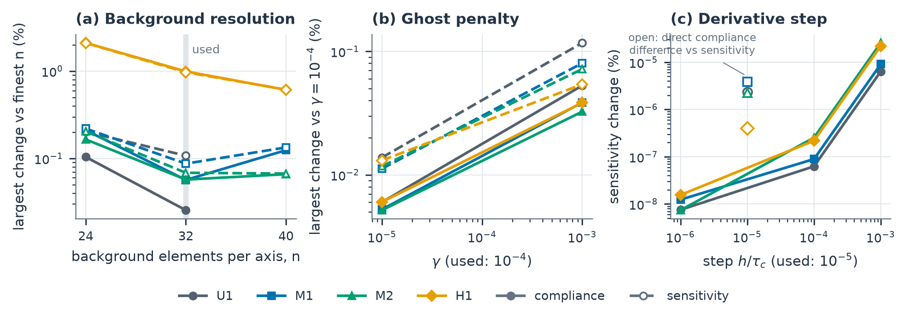
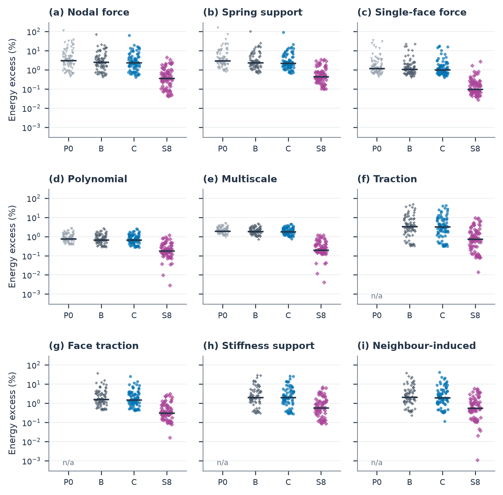
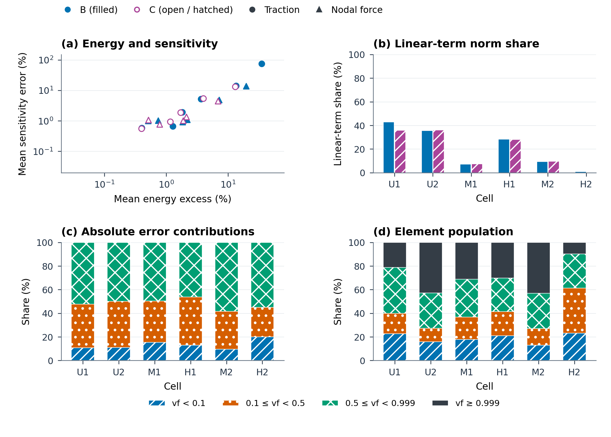

# 补充材料

补充说明、补充表和补充图按其在本补充材料中出现的顺序编号。变体标签与正文（表 2）一致；下方索引还给出了各变体在数据存档中的记录标识符。

## R1. 变体与几何索引

| 标签 | 数值作用 | 数据存档中的记录标识符 |
| --- | --- | --- |
| 基础网络 | 基线变体；所有继续训练以及第 5.5 节校正实验的初始网络参数 | v2L1 |
| 未校正 | 由基础网络继续训练；训练和评估中均不施加校正 | A0_ctrl |
| 平滑训练 | 由基础网络继续训练，并通过八步光滑进行训练 | A2b_tail8 |
| 基础网络（加校正） | 部署时对基础网络施加 NICE 的校正，不重新训练 | B2grid |
| NICE | 主要变体，通过完整校正（8 / Q1(17) / 8）进行训练 | A3_2grid |

| 胞元标签 | 几何分层 | 数据存档中的几何标识符 |
| --- | --- | --- |
| U1 | 未切割 | fresh_val_2000_full |
| U2 | 未切割 | fresh_val_2001_full |
| M1 | 中度切割 | fresh_val_2003_d1_v1 |
| H1 | 重度切割 | fresh_val_2005_d1_v0 |
| M2 | 中度切割 | fresh_val_2006_d0_v1 |
| H2 | 重度切割 | fresh_val_2010_d0_v0 |
| H3 | 重度切割 | fresh_val_2002_d0_v0 |
| L1 | 轻度切割 | fresh_val_2004_d0_v2 |
| W1：NICE 误差最大的验证胞元（表 ST08b、ST10） | 中度切割 | fresh_val_2051_d1_v1 |
| W2（表 ST08b） | 重度切割 | fresh_val_2045_d1_v0 |
| W3：壁最薄的验证胞元（表 ST08b、ST10） | 重度切割 | fresh_val_2074_d0_v0 |
| W4（表 ST08b） | 重度切割 | fresh_val_2021_d1_v0 |
| W5（表 ST08b） | 轻度切割 | fresh_val_2063_d1_v2 |
| RU（表 ST08b） | 未切割 | fresh_val_2032_full |
| RL（表 ST08b） | 轻度切割 | fresh_val_2047_d1_v2 |
| RM（表 ST08b） | 中度切割 | fresh_val_2078_d0_v1 |
| RH（表 ST08b） | 重度切割 | fresh_val_2053_d1_v0 |

在验证胞元标识符中，d0 和 d1 表示切割角 \(\vartheta\) 所在的 \((0,\pi/4)\) 的半区间，v0、v1 和 v2 分别表示重度、中度和轻度保留体积分层。在 U1/x 等构型标签中，x 和 y 表示图 9 的邻胞元构型。部署几何采用表 ST13 的 G1–G4 标签；下表给出它们在数据存档中的标识符。

| 基准标签 | 几何分层 | 数据存档中的几何标识符 |
| --- | --- | --- |
| G1 | 切割 | fresh_train_0020_cover01_r2 |
| G2 | 切割 | fresh_train_0020_cover01_r1 |
| G3 | 未切割 | fresh_train_0020_full |
| G4 | 未切割 | fresh_train_0007_full |

## 表 ST01. 训练与评估设置

| 变体 | 训练集（几何数） | 训练期验证几何 | 训练步数 | 评估的训练步 / 参数 | 评估时校正 | 评估取向 |
| --- | --- | --- | --- | --- | --- | --- |
| 基础网络 | 305 | 40 | 40,000 | 30,000 / EMA | 无 | 恒等、17 |
| 未校正 | 591 | 40 | 15,000 | 15,000 / EMA | 无 | 恒等 |
| 平滑训练 | 591 | 40 | 15,000 | 15,000 / EMA | 八步光滑 | 恒等 |
| 基础网络（加校正） | 305 | 40 | — | 30,000 / EMA | 8 / Q1(17) / 8 | 恒等 |
| NICE | 591 | 40 | 15,000 | 15,000 / EMA | 8 / Q1(17) / 8 | 恒等、17 |

所有变体均在表 ST02 的 80 个验证几何上评估。取向 17 是附录 G（式 (G.2)）中 48 个立方体对称变换之一，同时作用于几何和保留方向；取向 0 为恒等变换。由 591 个几何组成的训练集包括基础网络 305 个几何中的 304 个（移除了一个表现为近似机构的胞元）以及另外 287 个训练几何。根据下文所述的几何轮换，每次 15,000 步的继续训练至多访问其 591 个训练几何中的 153 个；基础网络在 40,000 个训练步中访问了其自身全部 305 个几何。未校正、平滑训练和 NICE 使用相同的随机种子和数据划分，因此按相同顺序抽取几何。

训练设置（表 2 中各变体通用）：

- 每批 16 个方向；几何在每一步都更换。训练集中的三个几何驻留在 GPU 上，每 100 步替换其中一个，因此 \(N_{\rm st}\) 个训练步的运行至多访问 \(N_{\rm st}/100+3\) 个不同的训练几何。
- 名义类别权重按 `force`、`force_c`、`support`、`support_k`、`face`、`face_c`、`macro`、`grf`、`glued`、`adv` 的顺序为 \(0.10,0.10,0.075,0.075,0.10,0.10,0.10,0.125,0.075,0.15\)，在可用类别上重新归一化，并按系统配额分配。
- 采用 Adam 优化器与单周期学习率调度：峰值 \(3\times10^{-4}\)，5% 预热，余弦衰减，最终除数因子为 100；梯度范数裁剪阈值为 1。
- 模型选择和评估使用网络参数的指数移动平均（EMA），衰减率为 0.9997，并进行零初始化偏差校正。
- 式 (18)：能量项对数内部取 \(10^{-12}\) 的下限截断；灵敏度项权重为 1。

计至最后一个训练步，基础网络的训练在 GPU（第 5.1 节）上耗时 4.6 h，NICE 的继续训练耗时 3.5 h；若计入全部选择评估，则分别为 5.0 h 和 4.8 h；训练期间 GPU 峰值显存为 29.6 GiB。基础网络由此前三个训练阶段（合计 7.5 GPU 小时）得到的参数初始化。这些阶段、上述两次运行（含其选择评估），以及数据划分中 691 个几何（591 个训练几何和 100 个验证几何，后者包括表 ST02 的 80 个）的方向集与精确灵敏度的生成（约 42 GPU 小时，第 5.1 节），共同构成 NICE 的离线成本，约 60 GPU 小时。

对于基础网络、未校正、平滑训练和 NICE，检查点选择使用经偏差校正的 EMA 参数，并同时采用恒等取向（\(v=0\)）和取向 17（\(v=17\)），尽管表 ST03 仅报告恒等取向。在几何族 \(f\)（训练期验证列表中由同一厚度场生成的几何；独立生成的验证胞元自成一族）和取向 \(v\) 内，记 \(\bar\varepsilon_{fv}\) 为在选择类别上平均的平均能量误差，\(\bar e_{s,fv}\) 为在带标签类别上平均的平均相对灵敏度向量误差，\(\varepsilon^{(90)}_{fv}\) 为方向能量误差第 90 百分位数的类别平均。每个类别统计量首先在该族的可用几何上取平均。选择得分为

\[
J_{\rm sel}=\frac12\sum_{v\in\{0,17\}}\frac1{|\mathcal F|}
\sum_{f\in\mathcal F}\left(\bar\varepsilon_{fv}+\bar e_{s,fv}+\tfrac12\varepsilon^{(90)}_{fv}\right).
\]

各族与两个取向具有相同权重。八个选择类别为 `force`、`support`、`face`、`macro`、`grf`、`force_c`、`face_c` 和 `support_k`；缺失的类别被略去，缺失的灵敏度项贡献为零。在符合条件的评估中，选取有限得分最低者。

- 基础网络在 10,000、20,000、30,000 和 40,000 个训练步时进行评分（\(J_{\rm sel}\) = 0.1057、0.1065、0.0905 和 0.0912）；选定第 30,000 步的参数。所有延续变体均从这些参数出发。
- 未校正和 NICE 在 7,500 和 15,000 个训练步时进行评分（0.0944 和 0.0906；0.00281 和 0.00237）；两者均为最终参数得分较低，因而予以保留。
- 平滑训练采用相同的评估计划和取向；其选择得分未被记录，采用其最终步（第 15,000 步）的参数。
- 在所有变体于 80 个验证几何和两胞元构型上完成比较之后，NICE 被确定为主要变体。

80 个验证几何中有 20 个（6 个未切割、14 个切割）属于选择列表；其中包括补充材料第 R1 节中全部八个详细分析的胞元。

## 表 ST02. 验证几何域

这 80 个几何采用独立生成的厚度场，其中 20 个为均匀场、30 个为仿射场、30 个为混合三线性场。生成器将每个角点参数约束在 \([0.17520160,0.69933962]\) 内，将角点跨度约束为至多 0.47，并将最大参考坐标梯度范数约束为至多 0.47。以每八个为一组，将均匀场等效的中心体积分数在 0.1 与 0.4 之间分层；非均匀的仿射或三线性形状在上述约束内缩放。该中心密度参数是一个采样坐标，而非切割后的材料分数。

标准切割法向为 \((\cos\vartheta,\sin\vartheta,0)\)。生成器在 \((0,\pi/4)\) 的两个半区间上对 \(\vartheta\) 分层，并在 \((0,1)\) 的三等分区间上对保留胞元立方体体积 \(v_{\mathcal B}\) 分层。每八个验证场中有两个未切割，其余六个占据角度–体积分层。训练与验证取自相互独立的随机流；本表描述的是 80 个几何的验证集。

| 分层 | 几何数 | \(v_{\mathcal B}\) 的生成区间 | 观测 \(v_{\mathcal B}\) | 观测角点参数范围 |
| --- | ---: | --- | --- | --- |
| 未切割 | 20 | 1 | 1 | 0.1762–0.6902 |
| 轻度切割 | 20 | \((2/3,1)\) | 0.6765–0.9996 | 0.1853–0.6972 |
| 中度切割 | 20 | \((1/3,2/3)\) | 0.3437–0.6605 | 0.1867–0.6983 |
| 重度切割 | 20 | \((0,1/3)\) | 0.01326–0.3195 | 0.1768–0.6946 |

切割体积指立方体与 TPMS 带求交之前的体积。任意两个验证几何在立方体对称意义下均不重合。在 \(n=32\) 时，80 个几何的保留集自由度中位数为 23,604，范围为 2,679 至 45,900 个自由度；激活自由度中位数为 221,442，范围为 2,757 至 439,092。所选的谱分析算例与装配算例在补充材料第 R1 节的几何索引中标明；它们作为测试算例报告，而非用于总体推断的随机样本。

## 表 ST03. 按方向类别的能量误差（恒等取向）

表中条目为几何等权平均值 / 几何级方向均值的最大值，单位为百分比。该最大值并非最差的单个方向。“基础网络（加校正）”指部署时对基础网络施加 NICE 的校正、不重新训练所得的变体。最后一列将 NICE 限制在既未参与训练、也未参与检查点选择的 60 个验证几何上（另外 20 个参与了检查点选择，表 ST01）。对于一致面力下的 NICE，80 个几何的 5,120 个单独采样方向的第 95 百分位数为 0.331%，第 99 百分位数为 0.693%，最大值为 1.24%（检查点选择之外 60 个几何的 3,840 个方向：0.355%、0.734%、1.24%）。在一致面力下，加校正基础网络的均值为 0.0965%，NICE 为 0.0737%，比值为 1.31；对 80 个几何进行有放回重抽样（配对、几何等权均值之比、百分位区间）得到的 95% 区间为 1.20–1.40。

| 类别 | 几何数（全部 / 选择之外） | 基础网络 | 未校正 | 平滑训练 | 基础网络（加校正） | NICE | NICE（选择之外） |
| --- | --- | --- | --- | --- | --- | --- | --- |
| force | 80 / 60 | 5.036 / 70.122 | 4.607 / 62.465 | 0.525 / 3.658 | 0.092 / 0.683 | 0.058 / 0.325 | 0.059 / 0.325 |
| support | 80 / 60 | 5.332 / 99.857 | 4.878 / 90.741 | 0.638 / 3.552 | 0.084 / 0.852 | 0.055 / 0.372 | 0.056 / 0.372 |
| face | 80 / 60 | 2.486 / 22.139 | 2.233 / 17.635 | 0.165 / 1.808 | 0.072 / 1.990 | 0.037 / 0.724 | 0.040 / 0.724 |
| macro | 80 / 60 | 0.842 / 2.636 | 0.827 / 2.584 | 0.203 / 0.935 | 0.022 / 0.165 | 0.015 / 0.118 | 0.015 / 0.118 |
| grf | 80 / 60 | 2.038 / 4.582 | 2.009 / 4.550 | 0.251 / 0.933 | 0.029 / 0.180 | 0.025 / 0.143 | 0.025 / 0.143 |
| force_c | 80 / 60 | 6.886 / 48.628 | 6.334 / 41.962 | 1.280 / 7.817 | 0.097 / 0.905 | 0.074 / 0.651 | 0.077 / 0.651 |
| face_c | 80 / 60 | 3.150 / 36.337 | 2.806 / 25.525 | 0.483 / 2.326 | 0.043 / 0.319 | 0.032 / 0.210 | 0.033 / 0.210 |
| support_k | 75 / 56 | 4.177 / 28.817 | 3.941 / 26.175 | 0.938 / 5.246 | 0.077 / 0.632 | 0.057 / 0.468 | 0.058 / 0.468 |
| glued | 75 / 60 | 4.593 / 38.128 | 4.422 / 42.030 | 0.953 / 4.629 | 0.078 / 0.555 | 0.060 / 0.384 | 0.055 / 0.384 |

在一致面力下，NICE 在检查点选择之外 60 个几何上的分层均值为 0.020%（未切割）、0.054%（轻度）、0.105%（中度）和 0.126%（重度），且 80 个几何中最大的五个几何均值（0.651%、0.540%、0.487%、0.303%、0.287%）均属于这 60 个几何。

### ST03b. 节点力与一致面力的几何分层均值（%）

| 分层 | 几何数 | 基础网络 force/force_c | 未校正 force/force_c | 平滑训练 force/force_c | 基础网络（加校正） force/force_c | NICE force/force_c |
| --- | --- | --- | --- | --- | --- | --- |
| 未切割 | 20 | 0.908 / 1.142 | 0.879 / 1.029 | 0.072 / 0.242 | 0.034 / 0.029 | 0.013 / 0.016 |
| 轻度切割（v2） | 20 | 3.239 / 5.801 | 3.021 / 5.325 | 0.523 / 1.414 | 0.088 / 0.096 | 0.059 / 0.079 |
| 中度切割（v1） | 20 | 4.720 / 7.899 | 4.506 / 7.823 | 0.723 / 1.769 | 0.103 / 0.105 | 0.070 / 0.091 |
| 重度切割（v0） | 20 | 11.278 / 12.702 | 10.021 / 11.160 | 0.783 / 1.697 | 0.141 / 0.156 | 0.090 / 0.109 |

### ST03c. NICE 的取向依赖性：恒等 / 取向 17 均值（%）

NICE 还在取向 17（该取向参与了检查点选择，表 ST01）下，以表 ST03 的验证方向在全部 80 个几何上进行了评估。刚度缩放支撑类别与邻胞元诱导类别不在此比较之列。

| 类别 | 恒等 | 取向 17 |
| --- | --- | --- |
| force | 0.058 | 0.059 |
| support | 0.055 | 0.056 |
| face | 0.037 | 0.034 |
| macro | 0.015 | 0.016 |
| grf | 0.025 | 0.026 |
| force_c | 0.074 | 0.083 |
| face_c | 0.032 | 0.034 |

## 表 ST04. 部署算术下的算子验证

各列依次为：\(G=Q^T\widehat SQ\) 的最大相对非对称度 \(\max_{i,j}|G_{ij}-G_{ji}|/\sqrt{|G_{ii}G_{jj}|}\)，其中 \(Q\) 的列为该胞元一致面力（force_c）验证集中的前八个保留位移方向；返回功与场能量之间的最大相对差、部署场与训练场之差以及最大刚体能量比，三者均在同样的八个方向上计算，这些方向也用于刚体能量比的归一化；ghost 罚项在精确场能量中所占份额，取方向平均（一致面力 / 节点力）；以及第 5.4 节中基础网络和 NICE 在一致面力下的平均 \(\delta\) 与 \(\kappa\)，采用附录 B.3 的 Jacobi 加权 \(\mathsf W=\operatorname{diag}(0,D)\)，\(D=\operatorname{diag}(K_{II})\)。在前八个节点力方向上，非对称度、功–能量差和刚体能量比分别至多为 \(3\times10^{-8}\)、\(2\times10^{-8}\) 和 \(1\times10^{-10}\)。

| 胞元 | 非对称度 | 功–能量差 | 部署场与训练场之差 | 刚体能量 | ghost 罚项份额（一致面力 / 节点力） | \(\delta\)、\(\kappa\)：基础网络（一致面力） | \(\delta\)、\(\kappa\)：NICE（一致面力） |
|---|---|---|---|---|---|---|---|
| H2 | 6.3e-09 | 4.5e-09 | 4.6e-09 | 1.7e-11 | 0.00048 / 0.49 | 0.71%, 7089 | 0.051%, 582 |
| H1 | 5.6e-09 | 4.0e-09 | 4.2e-08 | 1.6e-12 | 7.9e-05 / 0.81 | 1.23%, 124 | 0.186%, 33 |
| M2 | 8.7e-09 | 3.4e-09 | 9.4e-08 | 2.4e-12 | 3.6e-05 / 0.66 | 1.15%, 294 | 0.156%, 163 |
| M1 | 7.3e-09 | 4.4e-09 | 9.3e-08 | 1.4e-11 | 0.00012 / 0.58 | 1.26%, 866 | 0.179%, 426 |
| U2 | 3.5e-09 | 1.8e-09 | 1.1e-07 | 2.9e-13 | 3.6e-05 / 0.79 | 0.74%, 85 | 0.107%, 47 |

## 表 ST05. 固定保留位移下的灵敏度与谱诊断

### ST05a. 能量误差与灵敏度误差

固定保留位移下的方向均值（%）。\(k\) 为施加于基础网络场的 Jacobi 预条件 Chebyshev 光滑步数（\(a=b/30\)；第 5.5 节，图 8a,b）；光滑后的数值仅针对一致面力下的基础网络列出，— 表示未列出的条目。一阶份额为线性误差数组的 Frobenius 范数除以线性数组与二次数组 Frobenius 范数之和（%），在 \(k=0\) 时计算；每个数组包含该胞元和该类别中全部八个角点及全部评估方向。

| 变体 | 胞元 | 类别 | 能量误差，\(k=0\) | 能量误差，\(k=8\) / \(32\) | 灵敏度误差，\(k=0\) | 灵敏度误差，\(k=8\) / \(32\) | 一阶份额 |
| --- | --- | --- | --- | --- | --- | --- | --- |
| 基础网络 | U1 | force_c | 1.270 | 0.41971 / 0.27998 | 0.664 | 0.52592 / 0.45509 | 42.887 |
| 基础网络 | U1 | force | 0.742 | — | 1.018 | — | 55.124 |
| 基础网络 | U2 | force_c | 0.402 | — | 0.588 | — | 35.658 |
| 基础网络 | U2 | force | 0.506 | — | 1.008 | — | 71.565 |
| 基础网络 | M1 | force_c | 13.512 | 4.685 / 2.9452 | 14.128 | 2.7552 / 1.6339 | 7.164 |
| 基础网络 | M1 | force | 7.156 | — | 4.822 | — | 23.516 |
| 基础网络 | H1 | force_c | 1.814 | 0.25081 / 0.059403 | 1.909 | 0.26139 / 0.14959 | 28.403 |
| 基础网络 | H1 | force | 1.842 | — | 0.923 | — | 35.199 |
| 基础网络 | M2 | force_c | 3.643 | 1.0382 / 0.61088 | 5.159 | 0.83675 / 0.5753 | 9.339 |
| 基础网络 | M2 | force | 2.175 | — | 1.103 | — | 41.390 |
| 基础网络 | H2 | force_c | 34.954 | 0.20515 / 0.0033313 | 75.072 | 0.77195 / 0.010708 | 0.786 |
| 基础网络 | H2 | force | 19.507 | — | 13.649 | — | 36.322 |
| 未校正 | U1 | force_c | 1.165 | — | 0.937 | — | 35.750 |
| 未校正 | U1 | force | 0.779 | — | 0.766 | — | 59.185 |
| 未校正 | U2 | force_c | 0.397 | — | 0.560 | — | 35.988 |
| 未校正 | U2 | force | 0.515 | — | 1.062 | — | 72.929 |
| 未校正 | M1 | force_c | 13.009 | — | 13.275 | — | 7.456 |
| 未校正 | M1 | force | 6.841 | — | 4.442 | — | 26.413 |
| 未校正 | H1 | force_c | 1.699 | — | 1.894 | — | 28.046 |
| 未校正 | H1 | force | 1.877 | — | 1.013 | — | 34.751 |
| 未校正 | M2 | force_c | 3.988 | — | 5.432 | — | 9.548 |
| 未校正 | M2 | force | 2.105 | — | 1.357 | — | 49.454 |

### ST05b. 最低 200 个广义内部模态中的能量分数

基础网络，对一致面力方向取平均；每个分数采用各自的内部能量分母（式 (15)）。累积曲线、节点力结果和方向百分位数见图 6。

| 胞元 | 误差分数（%） | 精确场分数（%） |
| --- | --- | --- |
| U1 | 24.019 | 8.498 |
| M1 | 24.452 | 4.870 |
| M2 | 18.399 | 4.620 |
| H2 | 15.216 | 4.705 |

| 胞元 | \(\lambda_1\) | 光滑区间下端点 \(a=b/30\) | 低于 \(a\) 的模态数（最低 200 个中） |
| --- | --- | --- | --- |
| U1 | 0.000402235 | 0.174937 | 200 |
| M1 | 0.000574199 | 0.173294 | 200 |
| M2 | 0.000935594 | 0.174182 | 200 |
| H2 | 0.0213148 | 0.137632 | 66 |

此处 \(b\) 为第 5.5 节光滑研究中的幂迭代估计值乘以 1.05；该研究从其自身的随机向量启动幂迭代（附录 F.2），因此其区间与校正 \(\mathcal W\) 所用区间不同。

## 表 ST06. 内部粗空间

在固定保留位移下，对基础网络的场依次施加八步光滑、一次粗网格校正和八步光滑后，一致面力下的平均能量误差（%）；粗列是通过附录 F.1 的支撑筛选、并剔除对角能量至多为最大值 \(10^{-12}\) 倍的列之后保留下来的列，\(V^TAV\) 被显式形成，并在不加对角平移的情况下进行分解。富集单位分解（PU）空间通过场 \(\sum_vN_v(x)[a_v+B_v(x-x_v)]\) 在 \(Q_1\) 网格的每个顶点上携带 12 个自由度；其生成函数线性相关，因此列数可能超过所张成空间的维数，PU 各项是数值观测结果，而非经过验证的 Galerkin 投影。NICE 采用 \(Q_1(17)\)。

| 粗空间 | 粗列数：M1 / M2 / U1 | M1 | M2 | U1 |
| --- | --- | ---: | ---: | ---: |
| \(Q_1\)，\(9^3\) 个顶点 | 1,275 / 984 / 1,728 | 0.813 | 0.135 | 0.0966 |
| \(Q_1\)，\(17^3\) 个顶点（NICE） | 5,601 / 4,557 / 7,950 | 0.186 | 0.0273 | 0.0267 |
| \(Q_1\)，\(33^3\) 个顶点 | 27,207 / 23,199 / 40,983 | 0.0477 | 0.00870 | 0.00784 |
| \(Q_2\)，\(17^3\) 个节点 | 7,401 / 5,751 / 10,452 | 0.0900 | 0.0170 | 0.0125 |
| PU，\(9^3\) 个顶点 | 5,100 / 3,936 / 6,912 | 0.114 | 0.0211 | 0.0154 |
| PU，\(17^3\) 个顶点 | 22,404 / 18,228 / 31,800 | 0.0365 | 0.00760 | 0.00653 |

## 表 ST07. 相同校正下不同初始场的能量误差

在一致面力下（32 个验证方向，固定保留位移），对三种初始场和六个详细胞元，施加在 \(Q_1(17)\) 粗网格校正前后各进行 \(k\) 步光滑的校正后的平均方向能量误差（%）；M1、M2、H1、H2 和 U2 的 8 步结果即表 3 中的结果。调和初始场与零初始场采用精确的刚体分解。

调和初始场是保留位移变形部分的图调和延拓。该图以胞元的激活节点为顶点，将每个激活单元 27 个节点中的每一对节点相连，并以单元的材料体积为权重（对共享同一节点对的各单元求和）；\(L=D_W-W\) 为其 Laplace 矩阵。在给定保留值的条件下，各位移分量分别通过 \(L_{II}u_I=-L_{IP}q\) 进行延拓。与零场的处理相同，保留位移首先按 \(q=R_Pc+(q-R_Pc)\) 分解，其中 \(c=R_P^{+}q\)；仅对第二部分进行延拓，再叠加刚体场 \(Rc\)，并恢复保留值。该延拓不含可训练参数，仅使用单元连接关系和单元体积。

| 胞元 | 初始场 | 8 步 | 16 步 | 32 步 | 64 步 |
|---|---|---|---|---|---|
| H2 | 基础网络 | 0.0117 | 0.00163 | 0.000182 | 3.65e-06 |
| H2 | 调和 | 0.0806 | 0.00482 | 0.000614 | 1.22e-05 |
| H2 | 零 | 28.3 | 0.284 | 0.0156 | 0.000315 |
| H1 | 基础网络 | 0.0131 | 0.00487 | 0.0013 | 0.000173 |
| H1 | 调和 | 1.28 | 0.547 | 0.199 | 0.0345 |
| H1 | 零 | 39.9 | 10.7 | 2.92 | 0.437 |
| M2 | 基础网络 | 0.0273 | 0.0135 | 0.00691 | 0.00351 |
| M2 | 调和 | 6.72 | 3.53 | 1.52 | 0.485 |
| M2 | 零 | 324 | 104 | 38.9 | 14.1 |
| M1 | 基础网络 | 0.186 | 0.12 | 0.0727 | 0.0393 |
| M1 | 调和 | 17.2 | 8.13 | 4.11 | 1.43 |
| M1 | 零 | 1.1e+03 | 420 | 185 | 81.8 |
| U1 | 基础网络 | 0.0267 | 0.0176 | 0.0118 | 0.00783 |
| U1 | 调和 | 4.19 | 2.65 | 1.87 | 1.33 |
| U1 | 零 | 133 | 47.7 | 22 | 11.9 |
| U2 | 基础网络 | 0.00424 | 0.00202 | 0.0009 | 0.000377 |
| U2 | 调和 | 1.23 | 0.693 | 0.38 | 0.194 |
| U2 | 零 | 47.2 | 14 | 5.51 | 2.32 |

在 M1 上，从基础网络出发，每阶段 2 步和 4 步的相同循环分别给出 1.02% 和 0.422%，而先进行一次粗网格校正、再进行单个八步阶段则给出 0.230%。M1 的 \(Q_1(17)\) 空间对应 165,927 个内部自由度，含 5,601 个粗列。

## 表 ST08. 完整的连续邻胞元装配结果

六种面载荷下柔度与场基灵敏度向量的最大相对误差（%），并与 3% 参考线进行比较。灵敏度最大值涵盖两个胞元。目标胞元采用指定的学习变体，其邻胞元为精确的。胞元标签为验证标识符的缩写（补充材料第 R1 节）。

| 目标胞元 | 配置 | 变体 | 最大柔度误差（%） | 最大灵敏度误差（%） |
| --- | --- | --- | --- | --- |
| U1 | x | 基础网络 | 0.465 | 5.830 |
| U1 | y | 基础网络 | 0.427 | 5.390 |
| U2 | x | 基础网络 | 0.105 | 1.996 |
| M1 | x | 基础网络 | 4.384 | 12.153 |
| H1 | x | 基础网络 | 1.180 | 2.512 |
| H1 | y | 基础网络 | 1.379 | 1.820 |
| M2 | x | 基础网络 | 0.571 | 2.539 |
| U1 | x | 未校正 | 0.401 | 4.885 |
| U1 | y | 未校正 | 0.388 | 4.723 |
| U2 | x | 未校正 | 0.104 | 1.781 |
| U2 | y | 未校正 | 0.119 | 1.906 |
| M1 | x | 未校正 | 4.119 | 11.365 |
| M1 | y | 未校正 | 3.458 | 10.929 |
| H1 | x | 未校正 | 1.061 | 2.469 |
| H1 | y | 未校正 | 1.223 | 1.734 |
| M2 | x | 未校正 | 0.593 | 2.874 |
| L1 | x | 未校正 | 0.174 | 1.894 |
| L1 | y | 未校正 | 0.182 | 1.646 |
| U1 | x | 平滑训练 | 0.112 | 3.155 |
| U1 | y | 平滑训练 | 0.111 | 3.166 |
| U2 | x | 平滑训练 | 0.031 | 0.508 |
| U2 | y | 平滑训练 | 0.038 | 0.782 |
| M1 | x | 平滑训练 | 1.363 | 4.432 |
| M1 | y | 平滑训练 | 1.115 | 3.974 |
| H1 | x | 平滑训练 | 0.144 | 0.636 |
| H1 | y | 平滑训练 | 0.237 | 0.561 |
| M2 | x | 平滑训练 | 0.189 | 1.428 |
| M2 | y | 平滑训练 | 0.213 | 2.545 |
| H3 | x | 平滑训练 | 0.106 | 1.290 |
| H3 | y | 平滑训练 | 0.132 | 0.678 |
| U1 | x | 基础网络（加校正） | 0.011 | 0.945 |
| U1 | y | 基础网络（加校正） | 0.011 | 0.904 |
| U2 | x | 基础网络（加校正） | 0.00123 | 0.142 |
| U2 | y | 基础网络（加校正） | 0.0014 | 0.158 |
| M1 | x | 基础网络（加校正） | 0.079 | 0.350 |
| M1 | y | 基础网络（加校正） | 0.066 | 0.339 |
| H1 | x | 基础网络（加校正） | 0.010 | 0.139 |
| H1 | y | 基础网络（加校正） | 0.013 | 0.105 |
| M2 | x | 基础网络（加校正） | 0.00492 | 0.083 |
| M2 | y | 基础网络（加校正） | 0.0034 | 0.075 |
| H3 | x | 基础网络（加校正） | 0.00609 | 0.132 |
| H3 | y | 基础网络（加校正） | 0.00894 | 0.202 |
| L1 | x | 基础网络（加校正） | 0.00193 | 0.065 |
| L1 | y | 基础网络（加校正） | 0.00181 | 0.087 |
| U1 | x | NICE | 0.00614 | 0.598 |
| U1 | y | NICE | 0.00681 | 0.669 |
| U2 | x | NICE | 0.00121 | 0.082 |
| U2 | y | NICE | 0.00159 | 0.073 |
| M1 | x | NICE | 0.056 | 0.161 |
| M1 | y | NICE | 0.048 | 0.206 |
| H1 | x | NICE | 0.0076 | 0.098 |
| H1 | y | NICE | 0.011 | 0.097 |
| M2 | x | NICE | 0.00595 | 0.136 |
| M2 | y | NICE | 0.00472 | 0.154 |
| H3 | x | NICE | 0.0064 | 0.124 |
| H3 | y | NICE | 0.010 | 0.196 |
| L1 | x | NICE | 0.00202 | 0.101 |
| L1 | y | NICE | 0.00197 | 0.078 |

表中未列出的组合未作评估。本表中所有胞元均属于用于检查点选择的 20 个验证几何（第 5.1 节）。相同配置在切割面面力下的响应见表 ST09。对于 U1/x 上的基础网络，在邻胞元面 z 向面力作用下（第 5.6 节，图 11b），目标胞元承担精确装配能量的 0.1274669%，其局部能量误差为 2.312168%；乘积 \(\beta=w\varepsilon\) 为 0.002947249%，柔度误差为 0.002827394%，目标胞元灵敏度误差为 5.82992%。

#### ST08b. 留出的两胞元配置（NICE）

检查点选择之外的胞元：NICE 单胞误差最大的五个验证几何，以及每个分层中随机选取的一个可评估胞元。最大相对误差（%）分别取六种面载荷上的最大值（柔度）和两个胞元上的最大值（厚度灵敏度）；与表 ST08 相同，邻胞元为精确的，目标胞元为学习的。胞元标签的定义见补充材料第 R1 节。

| 胞元 | 选取方式 | 保留体积 | x：柔度 | x：灵敏度 | y：柔度 | y：灵敏度 |
| --- | --- | --- | --- | --- | --- | --- |
| W1 | 最大误差，第 1 位 | 0.571 | 0.2706 | 1.485 | 0.2220 | 1.312 |
| W2 | 最大误差，第 2 位 | 0.267 | 0.1982 | 0.815 | 0.1703 | 1.344 |
| W3 | 最大误差，第 3 位 | 0.287 | 0.1587 | 1.329 | 0.2489 | 1.419 |
| W4 | 最大误差，第 4 位 | 0.266 | 0.0827 | 0.526 | 0.0753 | 0.971 |
| W5 | 最大误差，第 5 位 | 0.681 | 0.0967 | 0.434 | 0.0878 | 0.563 |
| RU | 随机，未切割 | 1.000 | 0.0010 | 0.181 | 0.0011 | 0.133 |
| RL | 随机，轻度切割 | 0.779 | 0.0038 | 0.102 | 0.0051 | 0.102 |
| RM | 随机，中度切割 | 0.661 | 0.0101 | 0.103 | 0.0066 | 0.100 |
| RH | 随机，重度切割 | 0.078 | 0.0050 | 0.136 | 0.0066 | 0.218 |

## 表 ST09. 切割面面力下的响应

对表 ST08 中目标胞元为切割胞元的每种变体与配置，给出三个切割面面力方向上的最大相对误差（%）；表中未列出的组合未作评估。灵敏度最大值涵盖两个胞元。目标胞元为学习的，邻胞元为精确的。与第 5.6 节中切割面面力的比较相同，超过共同 3% 界线的值以粗体标出。

| 变体 | 胞元 | 配置 | 柔度误差（%） | 灵敏度误差（%） |
| --- | --- | --- | --- | --- |
| 基础网络 | M1 | x | 2.880 | **9.924** |
| 基础网络 | H1 | x | 0.445 | 2.066 |
| 基础网络 | H1 | y | 0.651 | 1.275 |
| 基础网络 | M2 | x | 0.560 | **3.155** |
| 未校正 | M1 | x | 2.768 | **9.827** |
| 未校正 | M1 | y | **6.870** | **14.053** |
| 未校正 | H1 | x | 0.399 | 1.825 |
| 未校正 | H1 | y | 0.613 | 1.200 |
| 未校正 | M2 | x | 0.574 | **3.252** |
| 未校正 | L1 | x | 0.355 | 1.660 |
| 未校正 | L1 | y | 1.141 | **3.702** |
| 平滑训练 | M1 | x | 0.713 | **3.228** |
| 平滑训练 | M1 | y | 2.417 | **5.191** |
| 平滑训练 | H1 | x | 0.062 | 0.356 |
| 平滑训练 | H1 | y | 0.130 | 0.587 |
| 平滑训练 | M2 | x | 0.200 | 1.664 |
| 平滑训练 | M2 | y | 1.117 | **3.924** |
| 平滑训练 | H3 | x | 0.052 | 0.689 |
| 平滑训练 | H3 | y | 0.237 | 1.354 |
| 基础网络（加校正） | M1 | x | 0.049 | 0.217 |
| 基础网络（加校正） | M1 | y | 0.124 | 0.305 |
| 基础网络（加校正） | H1 | x | 0.0044 | 0.096 |
| 基础网络（加校正） | H1 | y | 0.00709 | 0.022 |
| 基础网络（加校正） | M2 | x | 0.00468 | 0.053 |
| 基础网络（加校正） | M2 | y | 0.020 | 0.091 |
| 基础网络（加校正） | H3 | x | 0.00391 | 0.038 |
| 基础网络（加校正） | H3 | y | 0.011 | 0.042 |
| 基础网络（加校正） | L1 | x | 0.00479 | 0.039 |
| 基础网络（加校正） | L1 | y | 0.011 | 0.069 |
| NICE | M1 | x | 0.035 | 0.161 |
| NICE | M1 | y | 0.101 | 0.158 |
| NICE | H1 | x | 0.00338 | 0.061 |
| NICE | H1 | y | 0.00587 | 0.126 |
| NICE | M2 | x | 0.00603 | 0.072 |
| NICE | M2 | y | 0.027 | 0.154 |
| NICE | H3 | x | 0.00313 | 0.125 |
| NICE | H3 | y | 0.00982 | 0.129 |
| NICE | L1 | x | 0.00435 | 0.087 |
| NICE | L1 | y | 0.011 | 0.071 |

## 补充说明 S1. 参考解与厚度导数的验证

图 S01 与表 ST10 针对背景网格加密和 ghost 罚项系数验证 CutFEM 参考解，表 ST10b 在未切割胞元上将其与贴体离散进行比较；本说明最后一段验证数值厚度导数。

对于 U1、M1 和 M2，\(n=32\) 时的柔度与图 S01(a) 中最细层级的差异至多为 0.057%，厚度灵敏度的差异至多为 0.11%。H1 在 \(x=0\) 上固支、在 \(y=0\) 上加载，因为其保留部分在 \(z\) 面上不含材料；在 \(n=32\) 时，它与 \(n=48\) 的柔度差异最高达 0.99%（对应垂直于加载面的载荷），灵敏度差异为 0.97%，但与 \(n=64\) 的差异仅为 0.07% 和 0.08%，而 \(n=48\) 与 \(n=64\) 的差异为 1.08%：H1 并非单调收敛（图 S01(d)，表 ST10）。在 U1、M1、M2 和 H1 上，将 ghost 罚项系数在 \(10^{-5}\) 与 \(10^{-3}\) 之间变化，柔度变化至多 0.053%，灵敏度变化至多 0.12%（在 \(\gamma=10^{-3}\) 时罚项能量占总能量的 \(1.2\times10^{-4}\) 至 \(5.6\times10^{-4}\)），而加密体积积分使两者的变化至多为 0.010%。

### 表 ST10. 参考解加密至 \(n=64\)

单个胞元在一个胞元边界面上固支，并在另一胞元边界面上沿三个方向施加单位一致面力，在 \(n=24\) 至 64 下用稀疏直接求解器求解；H2 唯一含材料的胞元边界面即为固支面，因此改为施加合力为单位值的一致体力。表中各项：三种载荷中幅值最大的、相对于 \(n=64\) 的带符号柔度偏差 / 厚度灵敏度向量的最大相对偏差，均以百分比表示。H2 在 \(n=56\) 时无法生成网格。生产计算所用参考解采用 \(n=32\)。

| 胞元 | \(n=24\) | \(n=32\) | \(n=40\) | \(n=48\) | \(n=56\) |
| --- | --- | --- | --- | --- | --- |
| H1 | -1.05 / 1.06 | +0.07 / 0.08 | +0.46 / 0.44 | +1.08 / 1.06 | +1.40 / 1.37 |
| H2 | -1.58 / 5.60 | -0.93 / 3.59 | -0.52 / 2.16 | -0.27 / 1.24 | — |
| NICE 误差最大的验证胞元 | -0.32 / 0.57 | -0.14 / 0.23 | +0.08 / 0.09 | -0.14 / 0.15 | -0.02 / 0.03 |
| 壁厚最薄的验证胞元 | -0.66 / 1.02 | -0.28 / 0.44 | -0.16 / 0.24 | -0.09 / 0.20 | +0.17 / 0.16 |

在未切割胞元上，离散模型还与一个独立的贴体离散进行了比较：后者以二次四面体对同一隐式几何划分网格，与离散模型不共享任何几何、积分或稳定化代码（表 ST10b）。

### 表 ST10b. 未切割胞元上与贴体二次四面体离散的比较

| 构型 | 载荷 | CutFEM 与较细贴体网格的最大柔度差（%） | 贴体离散在两级网格之间的变化（%） |
| --- | --- | ---: | ---: |
| 四个未切割的单个胞元 | 六种夹具载荷工况 | 0.084–0.101 | 0.130–0.273 |
| 一个未切割胞元 | 十二个有限面积上的局部面力 | 0.253 | 0.502 |
| 未切割胞元的装配结构：两胞元、2×2×2、1×1×4 | 夹具载荷工况 | 0.052–0.090 | 0.108–0.190 |

图 S01(c) 给出了四个胞元上数值厚度导数的步长加密研究：相对于生产步长 \(10^{-5}\tau_c\)，灵敏度在 \(10^{-3}\tau_c\) 时变化至多 \(2.6\times10^{-7}\)，在 \(10^{-4}\tau_c\) 时至多 \(2.5\times10^{-9}\)，在 \(10^{-6}\tau_c\) 时至多 \(1.6\times10^{-10}\)；每个数量级减小约百倍，这正是中心差分的二阶截断误差，与这些胞元上导数在固定激活集下于 \(\pm10^{-3}\tau_c\) 范围内光滑的情形相一致。在相同的胞元上，中心差分刚度导数与在扰动设计处重新计算的柔度之差吻合至 \(4\times10^{-8}\)。对八个详细胞元中部分填充单元进行的单元级检查表明，离散矩并非处处保持式 (H.6) 所依赖的嵌套性。单元刚度在舍入误差范围内为半正定，但在固定裁剪拓扑下，离散矩的精确导数给出的单元导数矩阵具有负特征值：在未切割胞元中，最小比值 \(\lambda_{\min}/\max|\lambda|\) 为 \(-2.3\times10^{-3}\)；在六个切割胞元中的四个里，有 2 至 11 个部分填充单元（总数为 762 至 6,033 个）的均匀增厚导数，其最负特征值的幅值超过其最大幅值的 \(10^{-6}\)；这些导数是不定的，其最大特征值至少为最大幅值的 \(10^{-3}\)。生产计算所用的中心差分与该精确离散导数吻合至 \(2\times10^{-8}\)。

## 补充说明 S2. 保留表示的消融：Bernstein 限制的胞元边界面

本说明给出第 5.7 节所概述消融的完整结果：每个胞元算子均为精确的 Schur 补，仅对保留胞元边界面位移的表示进行缩减。

### S2.1. 受限 Galerkin 系统

受限空间在每个胞元的选定胞元边界面上采用 \(r\) 次张量积 Bernstein 多项式。其全局映射 \(G_r\) 保持胞元间共享的自由度一致，而胞元边界面迹之外的切割带自由度保留单位列。施加支撑后的 Galerkin 系统为

\[
\mathbb K_r=G_r^T\mathbb K G_r,\qquad
f_r=G_r^Tf_g,\qquad U_r=G_r\mathbb K_r^{-1}f_r.
\tag{S2.1}
\]

该比较在这一受限迹空间内评估精确的局部 Schur 算子，因此内部是精确的，所有误差均来自受限边界。考察两种变体：所有胞元边界面均受限（如同整个点阵完全由此类子结构构成），以及仅共享界面受限。

边界限制与内部校正 \(\mathcal W\) 作用于不同的试探空间。先进行精确凝聚、再施加限制 \(U=G_ry\)，相当于在保留空间的一个子空间上求解，而嵌套的边界空间给出非递减的 Ritz 柔度。校正保持每个保留自由度不变，并改变内部场 \(u=FBU\)；其有序性来自 \(H\) 的压缩性（第 4.4 节），尽管两个这样的内部空间未必嵌套。在两种情况下，局部灵敏度范数均不具有有序性。

### S2.2. 条件

- 配置 x 中的胞元对（图 9；补充说明 S4），每个目标胞元配以其精确的连续厚度邻胞元，针对 U1、M1、M2 和 H1；仅界面受限变体针对 U1、M1 和 M2 运行。
- 每个子结构一个胞元，采用全文统一使用的细尺度一致面力，且不进行过采样。
- 载荷：三个目标面面力与三个邻胞元面面力。
- 非胞元边界面切割带自由度保持不受限，这对受限模型有利（受控自由度见表 ST11）。
- 该比较关注的是精度，而非同等代价下的精度。

### 表 ST11. 胞元边界面位移的 Bernstein 限制

每个目标胞元及其连续厚度邻胞元在配置 x 中使用精确胞元算子进行装配。次数 r 作用于受限胞元边界面；切割带自由度保留其单位表示。受控自由度包括这些不受限的切割带自由度。所有误差均为所述载荷集上的最大值（%），相对于完整保留空间解；灵敏度列指目标胞元的向量。目标面载荷为目标胞元加载面上的三个单位一致面力，六载荷集在此基础上加入三个邻胞元面面力；两个载荷集的最大值未必出现在同一载荷下。

#### ST11a. 所有胞元边界面均受限

| 胞元 | r | 受控自由度 | 目标面柔度（3 种载荷） | 目标面灵敏度（3 种载荷） | 六载荷柔度（6 种载荷） | 六载荷灵敏度（6 种载荷） |
| --- | --- | --- | --- | --- | --- | --- |
| U1 | 1 | 24 | 76.998 | 89.056 | 82.609 | 203.566 |
| U1 | 2 | 102 | 56.944 | 62.055 | 56.944 | 317.415 |
| U1 | 3 | 240 | 38.907 | 47.849 | 38.907 | 398.644 |
| U1 | 5 | 696 | 3.926 | 3.603 | 3.961 | 114.545 |
| U1 | 8 | 1,830 | 0.485 | 1.467 | 0.485 | 24.435 |
| M1 | 1 | 15,423 | 77.749 | 88.966 | 78.485 | 294.272 |
| M1 | 2 | 15,498 | 53.133 | 62.622 | 53.133 | 402.365 |
| M1 | 3 | 15,627 | 33.998 | 45.584 | 33.998 | 421.766 |
| M1 | 5 | 16,047 | 3.930 | 4.748 | 3.930 | 138.963 |
| M1 | 8 | 17,082 | 0.521 | 1.295 | 0.611 | 39.320 |
| M2 | 1 | 15,648 | 76.234 | 84.796 | 85.269 | 244.968 |
| M2 | 2 | 15,723 | 49.547 | 41.050 | 50.436 | 606.013 |
| M2 | 3 | 15,852 | 29.124 | 19.138 | 33.554 | 747.730 |
| M2 | 5 | 16,272 | 3.413 | 4.275 | 3.634 | 334.483 |
| M2 | 8 | 17,307 | 0.505 | 4.458 | 0.586 | 38.693 |
| H1 | 1 | 12,888 | 81.713 | 87.320 | 81.713 | 333.566 |
| H1 | 2 | 12,939 | 37.528 | 29.960 | 41.962 | 188.527 |
| H1 | 3 | 13,026 | 21.660 | 18.637 | 30.364 | 340.008 |
| H1 | 5 | 13,308 | 2.784 | 2.890 | 3.860 | 171.306 |
| H1 | 8 | 14,001 | 0.608 | 1.520 | 0.735 | 64.044 |

#### ST11b. 仅共享界面受限

| 胞元 | r | 受控自由度 | 目标面柔度（3 种载荷） | 目标面灵敏度（3 种载荷） | 六载荷柔度（6 种载荷） | 六载荷灵敏度（6 种载荷） |
| --- | --- | --- | --- | --- | --- | --- |
| U1 | 1 | 25,386 | 1.947 | 3.599 | 1.947 | 85.982 |
| U1 | 2 | 25,401 | 0.667 | 4.905 | 0.667 | 29.133 |
| U1 | 3 | 25,422 | 0.169 | 0.338 | 0.169 | 7.999 |
| U1 | 5 | 25,482 | 0.010 | 0.328 | 0.036 | 2.194 |
| U1 | 8 | 25,617 | 0.001 | 0.003 | 0.002 | 0.359 |
| M1 | 1 | 37,080 | 9.355 | 10.397 | 9.355 | 81.909 |
| M1 | 2 | 37,095 | 1.915 | 4.529 | 1.915 | 36.640 |
| M1 | 3 | 37,116 | 0.440 | 1.106 | 0.440 | 9.954 |
| M1 | 5 | 37,176 | 0.073 | 0.335 | 0.073 | 2.174 |
| M1 | 8 | 37,311 | 0.011 | 0.031 | 0.011 | 0.615 |
| M2 | 1 | 35,196 | 4.228 | 8.397 | 4.228 | 88.562 |
| M2 | 2 | 35,211 | 0.728 | 3.825 | 0.728 | 18.427 |
| M2 | 3 | 35,232 | 0.261 | 1.058 | 0.261 | 21.216 |
| M2 | 5 | 35,292 | 0.030 | 1.004 | 0.030 | 3.366 |
| M2 | 8 | 35,427 | 0.009 | 0.049 | 0.009 | 1.537 |

完整保留空间上施加支撑后的系统分别含 28,206（U1）、39,996（M1）、39,120（M2）和 32,991（H1）个自由的自由度。

## 补充说明 S3. 成本记录：整体点阵直接求解与逐胞元凝聚

本说明定义表 5 中的三条路线并记录其各阶段（表 ST12），同时给出常规凝聚与 NICE 的逐胞元成本比较（表 ST13）。四胞元点阵取自第 5.8 节 \(2\times2\times2\) 块的两层 \(z=0\) 与 \(z=1\)，其厚度角点保持不变：每层包含两个未切割胞元和两个切割胞元，后者的保留体积分数分别为 0.616 和 0.252。所有点阵均在面 \(y=\min\) 上固支，并在面 \(y=\max\) 上沿三个笛卡尔方向施加单位一致面力；路线 (a) 和 (b) 还另外求解三个随机载荷。

路线 (a) 即整体点阵直接求解，将每个胞元的完整切割胞元刚度（保留自由度与内部自由度）装配为一个全局矩阵。保留自由度的编号与耦合方式与学习点阵完全相同，采用相同的固支、自由集与载荷向量，每个胞元的内部自由度排在自由保留自由度之后。该矩阵按其对角线进行对称缩放，并在 CPU 上由 MKL PARDISO 2026.1 以上三角的对称正定 Cholesky 分解（mtype 2）进行分解，采用嵌套剖分排序（iparm(2) = 3）和 16 个线程；PARDISO 各阶段以显式设定的参数直接调用，六个载荷一次性同时求解。相对残差 \(\|Ku-f\|/\|f\|\) 使用未缩放矩阵重新计算。

路线 (b) 即常规精确凝聚，在 CPU 上以 16 个线程逐个处理各胞元：胞元的设置与装配同路线 (a)，随后利用 PARDISO 带 Schur 补选项（iparm(36)）的 Cholesky 分解得到该胞元在其保留自由度上的稠密凝聚矩阵，之后释放该胞元。凝聚点阵系统按子结构法顺序通过分块 Cholesky 分解精确求解：对每个胞元，用稠密核对其私有保留块进行分解与消元；对由多个胞元共享的保留自由度上的稠密界面矩阵进行分解与求解；再通过回代恢复私有自由度。各胞元的凝聚矩阵保存至其被消元为止。

路线 (c) 在 GPU 上以采用 NICE 的部署实现运行一次带灵敏度的点阵分析：胞元准备（胞元构建、刚度与矩装配、网络输入与编码，以及为校正做准备的首次作用）、点阵及 \(\mathbb K_{PP}\) 的装配、预条件子设置（补充说明 S4.1 的平衡两层作用）、针对三个一致载荷的共轭梯度求解直至递推相对残差达到 \(10^{-6}\)（实际达到 \(9.0\times10^{-7}\) 至 \(9.9\times10^{-7}\)），以及三个载荷下式 (9) 的场基灵敏度 \(\widetilde s_c\)，后者通过在固定的恢复场下对矩积分进行反向模式微分得到。其算术精度与表 1 中计时路线相同：网络以及校正中的光滑与粗求解采用单精度，凝聚作用中的刚度乘积采用双精度（附录 F.2）。三条路线读取相同的已生成胞元几何；几何生成不计入计时。

整体点阵迭代求解器（表 ST12e）使用路线 (a) 的整体矩阵、载荷向量、固支和编号，一次导出后在路线 (a) 和 (b) 所用的 CPU 上以 16 个 MPI 进程用 PETSc 3.26 [Balay et al. (2026)](https://petsc.org/release/manual/) 求解。共轭梯度法在未缩放的系统上运行，以未预条件的相对残差 \(\|Ku-f\|/\|f\|\le10^{-9}\) 为停止条件；在残差首次低于 \(10^{-3}, 10^{-4}, \dots\) 处记录迭代解，并给出其柔度和能量范数与最终迭代解之差。GAMG（光滑聚集，PETSc 默认设置）采用块大小 3，并以自由度位置的六个刚体模态为近零空间；BoomerAMG 采用 HMIS 粗化、extended+i 插值、节点粗化、强连接阈值 0.5 及其默认松弛。对于每胞元一个子区域、采用精确局部求解的 BDDC，胞元的 Dirichlet 矩阵是其在不与其他胞元共享的自由度上的刚度，Neumann 矩阵是其在自由自由度上的整胞元刚度。二者均按路线 (a) 的 PARDISO 配置（对称 Jacobi 缩放、实对称正定 Cholesky、调优的 iparm、16 线程）逐胞元各分解一次；悬浮胞元的奇异 Neumann 矩阵在缩放矩阵的对角线上加 \(10^{-10}\) 的平移。这些分解的总时间是该配置下采用精确局部求解的 BDDC 局部分解成本的参照，不含局部 Neumann 问题中主约束与零空间的处理、粗问题和迭代。以 MUMPS 求解局部和粗问题、在八个进程上同时保存全部局部分解时，BDDC 在设置内存超过 90 GiB。

### 表 ST12. 整体点阵直接求解、常规精确凝聚与学习路线：规模、各阶段与内存

时间单位为 s。内存单位为 GiB（\(2^{30}\) 字节）：PARDISO 内存为分析阶段报告的永久存储加分解存储（iparm(16) + iparm(17)），其中千字节按 1024 字节计。总计、迭代次数、进程峰值内存以及路线 (c) 的内存见表 5。

#### ST12a. 点阵规模

| 点阵 | 胞元数（切割） | 胞元边界面以外的切割带自由度（占自由保留自由度的比例） |
| --- | --- | --- |
| 2×2×1, z=0 | 4 (2) | 35,829 (46%) |
| 2×2×1, z=1 | 4 (2) | 33,327 (47%) |
| 2×2×2 | 8 (4) | 69,156 (50%) |
| 3×3×1 | 8 (3) | 53,085 (37%) |

总自由度与自由保留自由度：见表 5。

#### ST12b. 路线 (a)，CPU 上的直接求解（Cholesky，16 线程与单线程）：各阶段（s）与内存（GiB）

| 点阵 | 线程数 | 胞元：设置 + 装配 | 全局装配与缩放 | 分析 | 分解 | 求解，6 个载荷 | 总计 | PARDISO 内存 | 最大相对残差 |
| --- | ---: | --- | --- | --- | --- | --- | --- | --- | --- |
| 2×2×1, z=0 | 16 | 229.9 | 21.9 | 26.0 | 193.1 | 13.5 | 484.4 | 32.0 | 3.3e-10 |
| 2×2×1, z=0 | 1 | 777.3 | 19.8 | 115.8 | 1,500.0 | 12.1 | 2,425.0 | 31.4 | 4.0e-10 |
| 2×2×1, z=1 | 16 | 184.2 | 17.6 | 20.2 | 116.9 | 10.4 | 349.2 | 28.8 | 4.5e-10 |
| 2×2×1, z=1 | 1 | 685.6 | 18.8 | 106.1 | 1,309.4 | 11.3 | 2,131.3 | 28.3 | 5.2e-10 |
| 2×2×2 | 16 | 379.5 | 36.0 | 53.1 | 368.2 | 31.0 | 867.8 | 66.4 | 1.5e-10 |
| 2×2×2 | 1 | 1,402.1 | 39.3 | 254.5 | 4,140.3 | 27.7 | 5,863.9 | 65.5 | 1.8e-10 |
| 3×3×1 | 16 | 431.3 | 42.3 | 50.4 | 481.5 | 36.0 | 1,041.6 | 80.9 | 2.6e-09 |
| 3×3×1 | 1 | 1,669.9 | 45.4 | 324.4 | 6,059.1 | 32.4 | 8,131.0 | 79.8 | 2.8e-09 |

总计：各阶段之和；16 线程的总计即表 5 中的数值。采用 32 线程时，整体直接求解分别耗时 378.5、341.1、823.4 和 955.5 s，而非 484.4、349.2、867.8 和 1,041.6 s，这是因为胞元的设置与装配并未加速。

#### ST12c. 路线 (b)，CPU 上的常规精确凝聚（16 线程）：各阶段（s）与内存（GiB）

| 点阵 | 胞元准备 | 胞元：Schur 补 | 凝聚求解 | 保存的胞元凝聚矩阵（GiB） | 柔度与 (a) 之差 |
| --- | --- | --- | --- | --- | --- |
| 2×2×1, z=0 | 210.6 | 274.3 | 86.8 | 17.8 | 5e-10 |
| 2×2×1, z=1 | 263.4 | 279.2 | 71.4 | 14.9 | 4e-10 |
| 2×2×2 | 393.6 | 392.5 | 133.9 | 32.8 | 2e-10 |
| 3×3×1 | 462.0 | 555.0 | 165.7 | 33.4 | 7e-10 |

凝聚求解：私有消元、界面分解与求解，以及六个载荷的回代。表 5 中的总计还包括逐胞元点阵几何、矩阵缩放以及各阶段之间的数据移动（17 至 35 s）。柔度与 (a) 之差：六个载荷下与整体点阵直接求解结果的最大相对差。

#### ST12d. 路线 (c)，学习路线：一次带灵敏度的点阵分析的各阶段（s）

| 点阵 | 胞元准备 | 点阵及 \(\mathbb K_{PP}\) 装配 | 预条件子设置 | 共轭梯度求解，3 个载荷 | 灵敏度 |
| --- | --- | --- | --- | --- | --- |
| 2×2×1, z=0 | 7.50 | 0.08 | 3.78 | 25.63 | 2.12 |
| 2×2×1, z=1 | 6.49 | 0.08 | 3.39 | 25.23 | 1.87 |
| 2×2×2 | 11.82 | 0.17 | 6.57 | 56.37 | 3.80 |
| 3×3×1 | 12.66 | 0.14 | 7.25 | 80.85 | 4.07 |

总计、迭代次数与内存：见表 5；各阶段之和比总计少 0.2–0.5 s，差额为阶段之间的簿记开销（GPU 内存：进程分配的峰值；CPU 内存：胞元准备之后的常驻集大小）。常驻 GPU 的学习子结构（补充说明 S4.1）：四胞元点阵的全部胞元，以及每个八胞元点阵中的四个胞元。

#### ST12e. CPU 上的整体点阵迭代求解器（16 个 MPI 进程）：设置、共轭梯度与 BDDC 分解（s）

| 点阵 | GAMG：设置 | GAMG 至 \(10^{-4}\)：迭代次数 / 每个载荷时间 | GAMG 至 \(10^{-4}\)，含设置：3 个载荷 / 6 个载荷 | GAMG 在 \(10^{-4}\) 处：柔度 / 能量的最大差别 | BoomerAMG：设置 / 至 \(10^{-4}\) 的迭代次数 / 每个载荷时间 | BDDC 分解：Dirichlet + Neumann |
| --- | --- | --- | --- | --- | --- | --- |
| 2×2×2 | 35.3 | 90–134 / 52–72 | 221 / 432 | 4.6e-10 / 2.1e-5 | 88.0 / 预条件子不定 | 207.9 + 241.3 = 449.2 |
| 3×3×1 | 39.2 | 98–123 / 66–84 | 278 / 478 | 1.4e-10 / 1.2e-5 | 96.6 / 250–260 / 405–481 | 245.3 + 277.9 = 523.1 |

差别相对于相对残差 \(10^{-9}\) 处的迭代解，GAMG 达到该残差需 235–274 次（2×2×2）和 204–220 次（3×3×1）迭代。载荷：与路线 (a) 相同，先三个一致面力，后三个随机载荷。不含取自路线 (a)、为所有细尺度路线共有的胞元设置与装配以及整体装配与缩放（表 ST12b：416 s 和 474 s）。

### 表 ST13. 常规凝聚与 NICE 的逐胞元成本

四个部署胞元，其中两个切割、两个未切割（补充材料第 R1 节）。胞元准备：几何预处理加上胞元设置、矩积分与刚度装配，NICE 在 GPU 上进行，常规路线在 CPU 上进行。凝聚：对 NICE 为网络编码加校正设置（光滑区间与粗分解）；对常规路线为 MKL PARDISO（16 线程）对内部的符号分析与 Cholesky 分解。内存单位为 GiB：NICE 的网络状态与校正所占用的 GPU 内存，或 PARDISO 的分解存储（iparm(17)）；两者均不包括胞元刚度 \(K\)，该刚度两条路线都需保存（最后一列，GPU 存储格式）。

| 胞元 | 自由度 / 保留自由度 | 胞元准备（s）：NICE / 常规 | 凝聚（s）：NICE / 常规 | 内存（GiB）：NICE 状态 / PARDISO 因子 | \(K\)（GiB） |
| --- | --- | --- | --- | --- | --- |
| G1（切割） | 177,507 / 24,636 | 5.3 / 27.3 | 0.72 / 10.5 | 0.74 / 2.89 | 1.39 |
| G2（切割） | 67,224 / 18,858 | 3.0 / 10.9 | 0.16 / 1.9 | 0.25 / 0.60 | 0.51 |
| G3（未切割） | 289,494 / 17,508 | 6.1 / 45.0 | 0.78 / 27.3 | 1.20 / 6.18 | 2.32 |
| G4（未切割） | 404,148 / 25,920 | 6.5 / 47.0 | 1.09 / 48.9 | 1.37 / 9.42 | 2.71 |

## 补充说明 S4. 全局预条件、两胞元配置与残差记录

### S4.1. 平衡两层预条件子

设 \(\mathbb A\) 为某次运行中所用的带支撑装配算子，可以是精确算子或学习算子。该记号不同于局部内部刚度 \(A=K_{II}\)。设
\(\mathbb K_{PP}=\sum_mB_m^TK_{PP,m}B_m\)，定义于自由保留自由度上。刚度块细层作用为 \(\mathcal B_f=\mathbb K_{PP}^{-1}\)。

对于保留自由度上的全局粗基 \(Z_g\)，在去除线性相关列之后，理想粗层作用为
\(Q_g=Z_g(Z_g^T\mathbb A Z_g)^{-1}Z_g^T\)。平衡作用为

\[
\mathcal M^{-1}=Q_g+(I-Q_g\mathbb A)\mathcal B_f(I-\mathbb A Q_g).
\]

所报告的粗基将三线性点阵顶点函数分别乘以绕各顶点的三个平移和三个转动，再将所得场限制到带支撑的保留自由度上。该全局粗基不同于用于校正局部延拓的内部基 \(V\)。第 5.8 节的精确与学习点阵求解、第 5.9 节的学习路线 (c) 以及第 5.10 节的学习求解，均采用这一平衡作用，配合刚度块细层作用与该粗基。

粗矩阵 \(A_g=Z_g^T\mathbb A Z_g\) 经对称化后按其对角线缩放。保留缩放特征值为正且超过最大特征值 \(10^{-10}\) 倍的特征向量，相应的归一化列 \(Y_g\) 给出 \(Q_g=Y_gY_g^T\)。存储的乘积 \(\mathbb A Y_g\) 提供两个投影。

在 GPU 上，\(\mathbb K_{PP}\) 在每次设计迭代中由 NVIDIA cuDSS 进行一次稀疏 Cholesky 分解。学习子结构在常驻学习子结构的内存预算范围内保存在 GPU 上；超出该预算时，其余胞元的状态保存在 CPU 内存中并从那里流式传输。每次运行的常驻胞元或预算见表 ST12d 的注释、表 ST16 以及表 ST20 的标题说明。

### S4.2. 两胞元测试配置

在图 9 的两种配置中，六个面载荷为施加于目标面的三个笛卡尔面力方向，以及施加于邻胞元面的相同三个方向。一致载荷的实现对 Q2 表面形函数进行积分，在消除支撑之前将每个节点载荷归一化为单位合力，然后消除固支分量。若存在作用于目标切割表面上、经同样归一化的三个一致面力，则单独报告。邻胞元为未切割胞元；因此，在目标胞元的切割平面与共享面相交之处，该胞元对是一种测试配置，而非物理上被切割的试件。

胞元对求解采用以精确装配参考刚度的 Cholesky 因子作为预条件的共轭梯度法，相对递推残差容差为 \(10^{-10}\)，最多 400 次迭代。

### S4.3. 残差功、梯度检验与代理柔度的差商

对于第 5.8 节的点阵及其两个 \(2\times2\times1\) 层，采用 NICE 并以双精度校正算术求解至递推残差 \(10^{-10}\)，在最终迭代值 \(\bar U\) 处记录以下各量：带符号残差功 \(\bar U^T\rho\)，其中 \(\rho=f_g-y(\bar U)\)，\(y\) 为所施加的学习作用；作用–能量不一致量 \(\omega=\sum_m\omega_m\)，\(\omega_m=\bar q_m^Ty_m(\bar q_m)-\bar u_m^TK_m\bar u_m\)，其中 \(\bar q_m=B_m\bar U\)，\(\bar u_m=F_m\bar q_m\)，\(y_m\) 为胞元 \(m\) 所施加的作用，从而 \(y(\bar U)=\sum_mB_m^Ty_m(\bar q_m)\)，且 \(\omega\) 即附录 C.2 中的量；以及附录 C.2 中 \(|\bar U^T\rho|\) 的对偶范数界，其中 \(\rho^T\mathbb K^{-1}\rho\) 用精确装配算子计算。所有量均相对于精确柔度。重新计算的相对残差 \(\|f_g-\widehat{\mathbb K}\bar U\|/\|f_g\|\) 停滞于 \(3.6\times10^{-4}\)（块）和 \(3.2\times10^{-3}\)（层）。将校正由双精度改为单精度运行时，块的该残差变化小于 1%，块的柔度误差变化小于 \(3\times10^{-9}\)，层的柔度误差变化小于 \(4\times10^{-8}\)，二者的梯度误差变化均小于 \(10^{-6}\)。

梯度指标在对共享点阵顶点进行聚合（即在每个顶点处对各胞元的厚度灵敏度分量求和）之后，将场基灵敏度与精确灵敏度进行比较，这正是采用共享厚度变量的优化器所接收的梯度；载荷保持固定。对于代理柔度的完整导数，针对每个角点在 \(\tau\pm h\tau_ce_c\) 处重建每个胞元的凝聚刚度，并在固定 \(\widehat q\) 下将其作用于已求得的保留位移（即作用–能量差商 \(D_{\mathrm{act}}\)）。若某次重建相对于未扰动构建改变了某个二值节点指示量、弱区域单元或面模板集合（含弱支撑节点的模板，附录 G.1）、激活单元集合或粗分解的对角平移（附录 F.1），则该重建计为发生切换。

#### 表 ST14. 残差功、对偶范数界、场基梯度与代理柔度的差商

面 = 三个一致面载荷；随机 = 三个随机载荷。梯度误差：在共享顶点参数上的 \(\|\widetilde{\boldsymbol s}_g-\boldsymbol s_g\|/\|\boldsymbol s_g\|\)，以百分比计；余弦取全部六个载荷。\(D_{\mathrm{act}}\)：在面载荷下、步长 \(h\)（以 \(\tau_c\) 为单位）时相对于精确顶点梯度的相对误差，以百分比计。切换重建：每个胞元 49 次重建（三个步长、正负两个符号与八个角点，外加一次未扰动构建）中改变离散选择的次数，给出各胞元的范围。

| 点阵 | \(\max\lvert\bar U^T\rho\rvert/C\) | 对偶范数界 / \(C\) | \(\max\lvert\omega\rvert/C\) | 梯度误差，面 / 随机（%） | 最小余弦 | \(D_{\mathrm{act}}\)，\(h=3\times10^{-3}\) / \(10^{-3}\) / \(3\times10^{-4}\)（%） | 每胞元切换重建次数 |
| --- | --- | --- | --- | --- | --- | --- | --- |
| \(2\times2\times1\), \(z=0\) | \(2.3\times10^{-8}\) | \(6.8\times10^{-6}\) | \(5.0\times10^{-9}\) | 0.022–0.048 / 0.22–0.27 | 0.9999998 | 0.29 / 0.65 / 1.53 | 31–48 |
| \(2\times2\times1\), \(z=1\) | \(5.3\times10^{-8}\) | \(7.9\times10^{-6}\) | \(9.5\times10^{-9}\) | 0.067–0.130 / 0.29–0.35 | 0.9999993 | 0.21 / 0.27 / 0.35 | 32–47 |
| \(2\times2\times2\) | \(2.9\times10^{-9}\) | \(4.7\times10^{-6}\) | \(2.4\times10^{-9}\) | 0.052–0.069 / 0.24–0.27 | 0.9999996 | 0.18 / 0.29 / 0.59 | 31–48 |
| \(3\times3\times1\) | \(2.5\times10^{-8}\) | \(1.4\times10^{-5}\) | \(7.0\times10^{-9}\) | 0.041–0.088 / 0.22–0.28 | 0.9999996 | 0.19 / 0.23 / 0.35 | 21–48 |

在这些点阵上，\(D_{\mathrm{act}}\) 随步长减小而增大，因此该差商无法分辨代理柔度的完整导数。在选择胞元的十四个两胞元配置上（第 5.6 节），相同的记录给出：\(|\bar U^T\rho|/C\le1.8\times10^{-8}\)，对偶范数界至多为 \(2.0\times10^{-5}\)，\(|\omega|/C\le1.7\times10^{-8}\)，场基厚度灵敏度误差为 0.07–0.67%，余弦至少为 0.999998；\(h=10^{-3}\) 时 \(D_{\mathrm{act}}\) 误差为 0.05–0.27%，同样不随步长减小而减小。

这些运行中两个八胞元点阵的精度（见第 5.8 节）如下，依次对应 \(2\times2\times2\) 块 / \(3\times3\times1\) 层：三个面载荷下的柔度误差为 0.0137、0.0110 和 0.0094% / 0.0147、0.0134 和 0.0103%，随机载荷下至多为 0.069% / 0.056%；所有胞元中最大的厚度灵敏度误差在面载荷下为 0.144% / 0.144%，在随机载荷下为 0.454% / 0.426%；全部六个载荷下学习与精确装配保留解之间的相对欧氏差为 0.130% / 0.123%；精确迹处的胞元能量误差 \(\varepsilon_m\) 在面载荷下为 0.0061–0.026% / 0.0051–0.052%，在随机载荷下为 0.027–0.123% / 0.023–0.077%；\(\beta\)（式 (7)）超出点阵柔度误差的部分，在面载荷下为该误差的 0.13–0.28% / 0.21–0.33%，在随机载荷下为 4.4–5.1% / 4.2–5.0%。由稠密精确凝聚矩阵装配的精确参考解，其重新计算的相对残差达到 \(9.1\times10^{-11}\) / \(1.3\times10^{-10}\)。块的角点参数范围为 0.2516 至 0.5350。

单角点扫描用于检验代理柔度在这些切换处的光滑性。在两胞元配置 M1/x 和 U1/y 中，对目标胞元的一个角点参数（灵敏度最大或居中的角点）在其值的至多 ±10% 范围内变化，每个设计都使用各自重新生成的几何与学习子结构，并将相邻设计之间的柔度变化与由两端灵敏度按梯形法则预测的变化进行比较；对精确离散模型每隔十个设计进行同样的比较。M1/x 上的每个区间以及 U1/y 上 26 个区间中的 24 个至少改变一个离散选择，其中多数为激活单元、ghost 面和保留自由度，这些均属于离散模型本身。在这些区间上，代理柔度与预测变化的偏离至多为柔度的 0.25%（M1/x）、0.17% 和 0.085%（U1/y），而精确模型的偏离与之相当：在 M1/x 上为 0.230、0.252 和 0.228%，对比 0.228、0.249 和 0.225%；在 U1/y 上三位有效数字完全相同。在 U1/y 上两个未发生切换的区间，偏离为 \(7\times10^{-8}\)。在参考设计处，代理柔度的误差保持在其界 \(\beta\) 处（M1/x 上为 \(6.0\times10^{-4}\)，U1/y 上为 \(7.2\times10^{-5}\)）。因此，在所检验的区间上，代理目标的主要偏离同样存在于精确离散模型中，由精确凝聚驱动的优化器也会以相同方式遇到这种偏离。

## 补充说明 S5. 网络设置与参数数量

表 ST15 补充附录 G，给出系数界分组、初始化方式以及每个模块的参数数量。

### 表 ST15. 系数界、初始化与参数数量

| 项目 | 设置 |
| --- | --- |
| 系数界 \(a_{\max}\) | 按组固定：8 个单元层、12 个面层和 4 个弱区域层各自的聚集与散布角色（48 组），以及 3 个层级各自的限制与插值（6 组），外加拐点 \(k_b\)：共 55 个存储值，属于存储的模型状态（定义见附录 G） |
| 初始化 | 通道映射 \(W_{\ell h}\)：\(0.5\,\mathcal N(0,1)/\sqrt{32}\)；\(W_{\rm in}\)：\(\mathcal N(0,1)/\sqrt3\)；\(W_{\rm out}\)：\(0.1\,\mathcal N(0,1)/\sqrt{32}\)；卷积核：\(0.5\,\mathcal N(0,1)/\sqrt{27\cdot32}\)；槽表：\(0.1\,\mathcal N(0,1)\)；\(\sigma_\ell=1\)；\(\lambda_{\rm mix}=0\)；仿射层：PyTorch 默认。基础网络由前三个训练阶段的参数初始化（见表 ST01 的注释），其中第一个阶段采用上述随机初始化；各继续训练从基础网络所选参数开始 |
| 参数数量，几何分支 | 单元编码器 12,288；节点编码器 9,024；消息传递 49,664；面编码器 12,608；槽表 432；单元、面和弱区域系数头分别为 12,928、15,008 和 10,848；限制/插值头 12,870；卷积系数头 37,440。合计 173,110 |
| 参数数量，位移分支 | 单元通道映射 32,768；面通道映射 49,152；弱区域单元通道映射 16,384；卷积核 331,776；\(W_{\rm in}\) 与 \(W_{\rm out}\) 各 96；跳跃连接标量 3；\(\lambda_{\rm mix}\) 24。合计 430,299 |
| 存储值 | 603,409 个可训练参数与 55 个固定界值：共 603,464 |
| 训练设置 | 见补充表 ST01 的注释；每次运行的随机种子均为 0 |

## 补充说明 S6. 设计优化记录

本说明给出第 5.10 节厚度优化的设置（S6.1，表 ST16）和记录。所有 NICE 运行均使用一块 GPU。柔度采用第 5.1 节的单位（\(E_Y=1\)，单位胞元），内存以 GiB（\(2^{30}\) 字节）计，时间为完整设计迭代的墙钟时间，包含几何生成；迭代 0 除外，其几何事先已生成。

### S6.1. 优化器与约束

表 ST16 列出了各项设置。移动渐近线法在每次分析中由场基梯度估计构造一个凸可分近似，且从不沿搜索方向检验 \(\widehat C\) 的下降，而第 3.3 节讨论的不一致性恰恰会在这种检验中产生影响。梯度范数和 KKT 残差均不用于停止判据，因为该估计并非 \(\widehat C\) 的梯度，且 \(\widehat C\) 在迭代之间会改变其离散模型（S6.4）。设计迭代与表 5 中的分析不同之处在于：它重新生成每个胞元的几何，并且只求解一个载荷而非三个。对于 算例 A，一次 NICE 设计迭代平均耗时 74 s（表 ST17c），而表 5 中对同一块体的分析耗时 79 s，后者无需几何生成，但需求解三个载荷。

### 表 ST16. 优化器、约束与分析设置

| 项目 | 设置 |
| --- | --- |
| 设计变量 | 点阵顶点处的角点厚度参数 \(\boldsymbol\tau_g\)；\(\boldsymbol\tau_m=\boldsymbol\tau_m(\boldsymbol\tau_g)\) 将顶点值复制到交汇于该顶点的每个胞元的角点。算例 A：27 个顶点，其中 18 个自由；板：74 个顶点，其中 64 个自由 |
| 固定顶点 | 位于受载面所在平面内的顶点（算例 A 中 9 个，板中 10 个），使一致节点载荷不随设计改变（附录 H：无载荷导数项） |
| 目标函数 | 柔度 \(\widehat C\)，在一个合力为单位值的一致面力作用下，以最终共轭梯度迭代解的功 \(f_g^T\bar U\) 计算，并除以其在第一次迭代时的值 |
| 梯度 | 第 5.10 节的场基估计，在固定的恢复场下对矩积分进行一次反向模式传播得到；不使用式 (10) 的完整代理导数。精确孪生：由精确场并结合式 (H.3) 的矩导数得到精确灵敏度 |
| 体积约束 | \(V/V^*-1\le0\)；\(V\) = 所有胞元的零阶单元矩之和（离散模型的材料体积），其导数由同一次反向传播得到（精确孪生：式 (H.3)）。\(V^*=0.8\,V(\boldsymbol\tau^0)\)：1.03558（算例 A），3.65526（板） |
| 角点跨度约束 | 对每个胞元的每一对有序的不同角点顶点施加 \((\tau_a-\tau_b)/0.45-1\le0\)（算例 A 中共 316 个有序对，其中 276 个涉及自由顶点；板中为 938 和 896 个）；两个顶点均固定的对为常数，不传给优化器；训练限值 0.47（表 ST02） |
| 梯度范数约束 | 在每个胞元的每个角点处施加 \(\lvert\nabla\tau\rvert^2/0.45^2-1\le0\)，由三条棱的差分计算（算例 A 中 64 个角点模板，板中 192 个，每个均含自由顶点）；对于三线性场，胞元内最大梯度范数在角点处取得；训练限值 0.47 |
| 边界 | \(0.18\le\tau\le0.69\)；训练范围 [0.1752, 0.6993]（表 ST02） |
| 优化器 | 移动渐近线法 [Svanberg (1987)](https://doi.org/10.1002/nme.1620240207)，每次分析更新一次，无线搜索，也不采用其全局收敛变体 GCMMA 的保守性检验；子问题采用 Svanberg (2007, Section 5) 的原–对偶内点法求解，障碍参数从 1 逐次缩小十倍直至 \(10^{-7}\)（在每个取值下执行 Newton 步，直至最大残差低于该值的 0.9 倍，至多 200 步）；标准 MMA 问题形式中的常数：\(a_0=1\)，\(a_i=0\)，\(c_i=1000\)，\(d_i=1\) |
| 渐近线 | 初始为 \(x\pm0.5(x_{\max}-x_{\min})\)（前两次迭代），此后在相邻步同号处放宽 1.2 倍、在交替变号处收窄至 0.7 倍，并保持其与 \(x\) 的距离在 0.01 到 10 个变量范围之间；子问题边界取为到渐近线距离的 0.1 处 |
| 移动限 | 变量范围的 0.05，即每次迭代 0.0255 |
| 停止准则 | \(\max\lvert\Delta\tau\rvert<10^{-3}\)，或连续三次迭代的目标函数相对变化低于 \(10^{-4}\)，或达到 60 次迭代 |
| 几何 | 每次迭代均使用本研究所有胞元所用的几何生成器，依据当前角点参数重新生成每个胞元的几何，在 CPU 上以并行进程执行（算例 A 为 8 个，板为 12 个），并重建每个学习子结构 |
| 点阵求解 | 采用补充说明 S4.1 的平衡两层预条件子的预条件共轭梯度法，求解至递推相对残差 \(10^{-6}\)（至多 3,000 次迭代），算术精度与表 5 计时路线相同，粗因子主元规则采用附录 F.1；若某次求解达到 3,000 次迭代或重新计算的相对残差高于 \(10^{-2}\)，则终止该运行。精确孪生：每个胞元的稠密精确凝聚矩阵，装配后求解至 \(10^{-10}\) |
| 热启动 | 以前一次迭代的解为初值，按绝对网格位置、位移分量和私有切割带标记逐自由度匹配；未匹配的自由度从零开始；初值按能量最优因子 \(f_g^TX_0/(X_0^T\widehat{\mathbb K}X_0)\) 缩放；相对于 \(\lVert f_g\rVert\) 的停止判据保持不变。每次运行的迭代 0 均从零开始求解。精确孪生：冷启动 |
| 常驻学习子结构的 GPU 内存预算（补充说明 S4.1） | 算例 A：所有胞元常驻；板：在已分配 GPU 内存低于 22 GiB 期间胞元常驻；规模演示：4 GiB（表 ST20） |
| 几何生成回退机制 | 若部分胞元生成失败，则将这些胞元的自由顶点依次乘以 \(1+\epsilon\)，\(\epsilon=10^{-4},-10^{-4},10^{-3},-10^{-3},3\times10^{-3},-3\times10^{-3}\)（截断至边界内），重新生成共享这些顶点的每个胞元，并对扰动后的设计进行分析、由此继续优化。在全部运行中共应用四次（表 ST19a） |

在细观尺度上分析的所有设计（表 ST17 和表 ST18 中各运行的全部迭代以及均匀化设计）中，最大角点跨度为 0.4500，最大梯度范数为 0.4518，角点参数位于 [0.1800, 0.6900] 内，因此每个被分析的胞元均处于训练限值之内。

### S6.2. 算例 A：NICE 优化、精确孪生与精确检验

算例 A 为第 5.8 节的 \(2\times2\times2\) 块体，在与固支面相对的面 \(y=\max\) 上受 \(y\) 方向的一致面力作用。精确孪生从相同的初始设计出发，采用相同的设置、约束和几何重新生成运行同一优化，但使用精确凝聚（表 ST16）。NICE 运行在迭代 0、12 和 23 处用精确模型进行了检验（表 ST17b）。孪生运行是验证运行，而非成本基准；精确路线与学习路线的成本比较见第 5.9 节。

### 表 ST17. 算例 A：NICE 优化、精确孪生与精确检验

#### ST17a. 迭代历史

| 迭代 | \(\widehat C\)（NICE） | \(C\)，精确孪生 | NICE 相对孪生（%） |
| --- | --- | --- | --- |
| 0 | 24.59081 | 24.59356 | −0.011 |
| 1 | 27.14662 | 27.14994 | −0.012 |
| 2 | 30.16595 | 30.17025 | −0.014 |
| 3 | 33.73640 | 33.74275 | −0.019 |
| 4 | 37.85673 | 37.86557 | −0.023 |
| 5 | 35.69282 | 35.70004 | −0.020 |
| 6 | 33.80530 | 33.81157 | −0.019 |
| 7 | 32.05341 | 32.05955 | −0.019 |
| 8 | 30.48399 | 30.49000 | −0.020 |
| 9 | 29.08392 | 29.08994 | −0.021 |
| 10 | 27.85699 | 27.86145 | −0.016 |
| 11 | 26.84866 | 26.85332 | −0.017 |
| 12 | 26.00158 | 26.00632 | −0.018 |
| 13 | 25.28700 | 25.29168 | −0.018 |
| 14 | 24.78587 | 24.79256 | −0.027 |
| 15 | 24.46873 | 24.47568 | −0.028 |
| 16* | 24.24430 | 24.25329 | −0.037 |
| 17 | 24.14971 | 24.15703 | −0.030 |
| 18 | 24.10947 | 24.11624 | −0.028 |
| 19* | 24.08748 | 24.11211 | −0.102 |
| 20 | 24.10488 | 24.11155 | −0.028 |
| 21 | 24.10448 | 24.11117 | −0.028 |
| 22 | 24.10411 | 24.11081 | −0.028 |
| 23 | 24.10377 | — | — |

\* 设计经几何生成回退机制扰动（表 ST19a）。NICE 相对孪生：同一迭代序号下的 \((\widehat C-C_{\rm twin})/C_{\rm twin}\)。在迭代 0–4 中，体积界被违反，每个自由参数均按移动限移动或移至下界，此时两者设计一致（相差在 4e-14 以内），该列即为同一设计的代理柔度误差。自迭代 5 起，角点参数出现差异，至多相差 8.8e-04。NICE 运行中 \(\lvert\bar U^T\rho\rvert/\widehat C\) 的最大值：1.5e-08。

#### ST17b. NICE 运行的精确检验

| 迭代 | 精确 \(C\) | \(\widehat C\) | 代理柔度误差（%） | 梯度误差（%） | 余弦 | 分量误差 / \(\max\lvert g\rvert\)：中位数 / 第 95 百分位数 / 最大值 | 符号一致率 | 精确求解：PCG 迭代次数 / 重新计算的残差 |
| --- | --- | --- | --- | --- | --- | --- | --- | --- |
| 0 | 24.59356 | 24.59081 | −0.0112 | 0.069 | 0.9999998 | 2.2e-04 / 5.1e-04 / 6.3e-04 | 1.000 | 178 / 9.1e-11 |
| 12 | 26.00630 | 26.00158 | −0.0182 | 0.170 | 0.9999987 | 4.1e-04 / 1.2e-03 / 1.8e-03 | 1.000 | 244 / 9.0e-11 |
| 23 | 24.11050 | 24.10377 | −0.0279 | 0.329 | 0.9999966 | 3.8e-04 / 2.8e-03 / 4.1e-03 | 1.000 | 262 / 9.9e-11 |

针对 18 个自由顶点参数统计。代理柔度误差 \((\widehat C-C)/C\)；梯度误差 \(\lVert\widetilde{\boldsymbol s}_g-\boldsymbol s_g\rVert/\lVert\boldsymbol s_g\rVert\)；分量误差 \(\lvert\widetilde s_{g,i}-s_{g,i}\rvert/\max_j\lvert s_{g,j}\rvert\)。

#### ST17c. 最终设计与成本

|  | NICE 运行 | 精确孪生 |
| --- | --- | --- |
| 最终设计的精确柔度 | 24.110504 | 24.110806 |
| 最终 \(\tau\) 范围；最大角点跨度；最大梯度范数 | 0.1800–0.6239；0.4439；0.4500 | 0.1800–0.6236；0.4436；0.4500 |
| PCG 迭代次数；重新计算的残差 | 99–157；6.2e-05–1.5e-04 | 178–262；8.5e-11–9.9e-11 |
| 每次迭代时间，平均值（范围）（s） | 74（62–120） | 469（455–534） |
| 各阶段平均时间（s） | 几何 20.8，胞元准备 10.1，点阵与 \(\mathbb K_{PP}\) 装配 0.1，预条件子 5.9，PCG 31.6，灵敏度与体积梯度 5.5，MMA 0.006 | — |

最终设计：NICE 设计的精确柔度相对于孪生设计的精确柔度为 −1.25e-05；角点参数至多相差 0.0051（均方根 0.0011）。两次运行的迭代次数以及首末柔度见表 6。各阶段平均时间对所有迭代取平均；迭代 0 的几何阶段为零。

### S6.3. 切割面固支板与均匀化设计

第 5.10 节的板被一个平面切割，该平面从右下角延伸至上边缘距左端两个胞元处；其八个切割胞元的保留体积分数为 0.917、0.667、0.333 和 0.083，各两个。该布局以其两个面内轴互换的形式存储，即板的一个立方对称像，使切割法向位于 \(\vartheta=33.69^\circ\)，处于验证几何的范围 \(0<\vartheta<\pi/4\) 之内（第 5.1 节），而非位于其像 56.31° 处；网络在立方对称变换下不具有等变性（第 6.3 节）。除固支的切割带外，没有任何自由度被固定。

为了与基于均匀化的梯度设计进行比较，在同一离散模型（\(n=32\)，Q2 单元，带 ghost 罚项的稳定化刚度 \(K\)）上通过周期均匀化计算了角点参数均匀的未切割胞元的等效弹性张量 \(C^H(\tau)\)。胞元相对面上的节点被等同，涨落场取周期形式并固定一个节点，由六个单位宏观应变得到单位胞元的 \(C^H_{ij}=u_i^TKu_j\)；材料体积分数 \(V^H(\tau)\) 为零阶单元矩之和。在表 ST18b 的十二个厚度之间，用关于 \(\tau\) 的三次样条插值 \(C^H_{11}\)、\(C^H_{12}\)、\(C^H_{44}\) 和 \(V^H\)。宏观模型用 Q1 六面体对板进行网格划分，每个胞元每个轴向划分六个（4,464 个单元，5,719 个节点）。在每个积分点上，它由所在胞元的角点三线性插值得到局部参数 \(\tau(x)\)，并计算 \(C^H(\tau(x))\) 和 \(V^H(\tau(x))\)；对被切割面相交的单元采用 \(4^3\) 个子积分点积分，空隙部分取 \(10^{-6}\,C^H(0.4)\)。它在切割平面上施加固支，即在该平面与板的截面上令 \(u=0\)，通过罚项 \(\alpha\int u\cdot v\,dA\) 实现，其中 \(\alpha=10^6\,C^H_{11}(0.4)/h_M\)，\(h_M=1/6\)，并在每个相交单元截面多边形的三角形上采用七点积分规则积分。载荷为受载面上合力为单位值的均匀面力。该模型采用伴随灵敏度以及相同的 MMA 设置、约束、固定顶点和体积分数进行优化。

在迭代 0–3 中，体积界被违反，宏观运行与 NICE 运行均将每个自由参数按移动限移动或移至下界，并分析相同的设计；此时宏观柔度比 NICE 柔度低 27.0–31.8%，在其后续路径上则低 29–33%。在均匀初始设计处，将宏观网格加密到每胞元每轴 12 个单元（35,136 个单元，39,949 个节点）后，宏观柔度由 55.192 升至 56.088（+1.6%），比精确柔度 75.599 低 25.8%（原为 27.0%）；罚因子由 \(10^6\) 增至 \(10^8\) 时，宏观柔度的相对变化为 \(-8.7\times10^{-6}\)（6 个单元）和 \(-3.7\times10^{-6}\)（12 个单元）。优化采用每胞元每轴 6 个单元的网格。细观模型固定切割胞元的全部切割带自由度（表 ST21），其支撑至少与仅作用于切割面的支撑同样刚硬；这降低了精确柔度，因而缩小而非扩大宏观低估。对于均匀化梯度设计，宏观体积模型不再与细观尺度材料体积精确相等（表 ST18c）。

### 表 ST18. 切割面固支板：NICE 优化与均匀化设计

#### ST18a. 运行

|  | NICE 运行 | 均匀化模型 | 均匀化设计，NICE 分析 |
| --- | --- | --- | --- |
| 初始设计 | 均匀 0.40 | 均匀 0.40（宏观） | 最终宏观设计 |
| 最大柔度（迭代） | 110.493（4） | 74.557（4）（宏观） | — |
| 最终 \(\tau\) 范围 | 0.180–0.690 | 0.180–0.690 | 0.180–0.690 |
| 结束时的最大角点跨度 / 梯度范数 | 0.450 / 0.450 | 0.450 / 0.450 | 0.450 / 0.450 |
| 每次迭代时间，平均值（范围）（s） | 200（155–270） | 4.1（宏观，CPU） | — |
| 迭代时间总和（s） | 4,802 | 95（宏观，CPU） | — |
| PCG 迭代次数 | 73–122 | — | 127 |
| 重新计算的残差 | 3.5e-04–5.8e-04 | — | 3.9e-04 |
| \(\max\lvert\bar U^T\rho\rvert/\widehat C\) | 5.2e-08 | — | 5.4e-08 |

所有细观尺度数值均为 NICE 数值；精确检验见表 ST21。迭代次数以及首末柔度见表 6。图 15a,b 绘出了 \(z=0\) 层中的角点参数；\(z=1\) 层中的角点参数与之至多相差 1.1e-03（NICE）和 6.3e-13（均匀化设计）。

#### ST18b. 均匀厚度胞元的均匀化本构关系

| \(\tau\) | \(V^H\) | \(C^H_{11}\) | \(C^H_{12}\) | \(C^H_{44}\) |
| --- | --- | --- | --- | --- |
| 0.18 | 0.1027 | 0.03996 | 0.02806 | 0.01920 |
| 0.22 | 0.1256 | 0.04992 | 0.03432 | 0.02384 |
| 0.27 | 0.1541 | 0.06307 | 0.04212 | 0.02988 |
| 0.32 | 0.1827 | 0.07712 | 0.04989 | 0.03620 |
| 0.37 | 0.2113 | 0.09218 | 0.05765 | 0.04279 |
| 0.42 | 0.2399 | 0.10838 | 0.06541 | 0.04968 |
| 0.47 | 0.2685 | 0.12585 | 0.07323 | 0.05688 |
| 0.52 | 0.2971 | 0.14471 | 0.08117 | 0.06440 |
| 0.57 | 0.3258 | 0.16511 | 0.08929 | 0.07226 |
| 0.62 | 0.3545 | 0.18720 | 0.09768 | 0.08049 |
| 0.67 | 0.3832 | 0.21116 | 0.10644 | 0.08912 |
| 0.70 | 0.4004 | 0.22653 | 0.11193 | 0.09450 |

\(E_Y=1\)，\(\nu=0.3\)，体积为 1 的单位胞元，采用 Voigt 记法及工程剪应变；\(C^H_{11}\)、\(C^H_{12}\)、\(C^H_{44}\) 为所计算张量中对应元素的值（宏观模型对每组三个对称元素取平均）。在十二个厚度上的最大相对离散度：\(C^H_{11},C^H_{22},C^H_{33}\) 为 3.1e-13，\(C^H_{12},C^H_{13},C^H_{23}\) 为 6.1e-14，\(C^H_{44},C^H_{55},C^H_{66}\) 为 1.4e-13；最大的正应力–剪切或剪切–剪切耦合为 \(C^H_{11}\) 的 7.5e-14；周期涨落场的最大相对平衡残差为 2.2e-13。

#### ST18c. 均匀化与细观尺度 NICE 优化的对比

| 量 | 宏观模型 | NICE | 精确凝聚 |
| --- | --- | --- | --- |
| 均匀设计的柔度 | 55.192 | 75.591 | 75.599 |
| 均匀设计处的宏观预测误差（%） | — | −26.99 | −26.99 |
| 均匀化设计的柔度 | 55.271 | 80.172 | 80.198 |
| 均匀化设计相对 NICE 设计（%） | — | +2.44 | +2.44 |
| 细观尺度 \(V/V^*\)：NICE 设计 / 均匀化设计 | — | 1.00000 / 0.99821 | — |
| 角点参数，NICE 设计与均匀化设计对比：最大差值 / RMS / 相关系数 | — | 0.262 / 0.057 / 0.946 | — |

预测误差：均匀设计 \(\tau=0.40\) 处的 \((C_{\rm macro}-C)/C\)。角点差值和相关系数针对 \(24\times8\) 个胞元角点参数统计。均匀设计的宏观体积 4.569075 与细观尺度材料体积 4.569074 的一致程度为 1.2e-07。

### S6.4. 几何生成扰动与离散切换

表 ST19a 列出了表 ST16 中几何生成回退机制的四次应用；失败是指几何生成器无法认证某单元的材料片（附录 A.1）。表 ST19b 统计了相邻迭代之间离散描述发生变化的胞元数：每次迭代都在不同的离散模型上计算目标函数，而第 3.3 节的导数仅在各自模型内部成立。

### 表 ST19. 几何生成回退机制与离散切换

#### ST19a. 所施加的扰动

| 算例 | 迭代 | 失败胞元 | 施加的 \(\epsilon\) | 扰动顶点 | 重新生成的胞元 | 最大 \(\lvert\Delta\tau\rvert\) |
| --- | --- | --- | --- | --- | --- | --- |
| A，NICE | 16 | 010（未切割） | +1e-04 | 4（共 18） | 8 | 5.8e-05 |
| A，NICE | 19 | 010（未切割） | +1e-03 | 4（共 18） | 8 | 5.8e-04 |
| 板 | 5 | 060（切割，0.917），160（切割，0.083） | +1e-03 | 12（共 64） | 5 | 2.7e-04 |
| 板 | 14 | 000（未切割） | +1e-04 | 4（共 64） | 4 | 3.6e-05 |

失败胞元以布局索引标识（切割胞元附保留体积分数）：即对 MMA 返回的设计生成失败的胞元。施加的 \(\epsilon\) 作用于 MMA 返回的设计；最大 \(\lvert\Delta\tau\rvert\)：所施加扰动引起的角点参数最大变化；没有扰动顶点被截断至边界。精确孪生和均匀化设计的分析均无需回退。

#### ST19b. 相邻迭代之间离散描述发生变化的胞元

| 算例 | 激活单元；ghost 面 | 保留自由度 | 切割带节点 | 弱支撑节点 | 弱区单元模板 | 弱区面模板 | 粗因子平移 | 以上任一项 |
| --- | --- | --- | --- | --- | --- | --- | --- | --- |
| A，NICE（8 个胞元，23 步） | 2 / 8 / 8 | 0 / 8 / 8 | 0 / 4 / 4 | 3 / 8 / 8 | 2 / 8 / 8 | 2 / 8 / 8 | 0 / 0 / 2 | 3 / 8 / 8 |
| 板（24 个胞元，23 步） | 8 / 18 / 24 | 3 / 18 / 24 | 0 / 3 / 8 | 11 / 18 / 24 | 9 / 18 / 24 | 11 / 18 / 24 | 0 / 0 / 4 | 11 / 18 / 24 |

在相邻迭代之间的各步上，对计数发生变化的胞元数取最小值 / 中位数 / 最大值：激活单元和 ghost 罚项面（计数相同）、保留自由度、由网络的二值节点指示器标记为属于切割带和弱支撑的节点、为弱区层选取的单元模板和面模板（附录 G.1），以及粗分解的对角平移（附录 F.1）。不改变计数的变化无法被检测到，因此这些数字是下界。精确孪生（8 个胞元，22 步）仅记录了激活单元和保留自由度，结果为 2 / 8 / 8 和 0 / 8 / 8。

### S6.5. 规模演示与板设计的精确验证

**规模演示。** 生成了具有 S6.3 中板的比例（短边 : 长边为 1 : 2，厚度为一个胞元）、且其平面切割随板同比缩放的板，胞元数分别为 24、51、88 和 110（表 ST20）；所有切割胞元均具有 S6.3 中的四种保留体积分数。这些板在未切割的长边上固支，并在相对面上受合力为单位值、沿长边方向的面内一致面力作用；在 24 胞元板中，该面经切割后宽两个胞元。24 胞元板即为施加此固支和载荷的 S6.3 中的板。每次运行均从均匀的 \(\tau=0.40\) 出发，取 \(V^*=0.8\,V(\boldsymbol\tau^0)\) 并采用表 ST16 的设置，在四次分析（三次 MMA 更新）后停止。自由度均为初始设计的自由度：所有胞元的切割有限元模型（共享面上的节点只计一次），以及装配点阵中不含固支面的保留自由度。

**表 ST20. 规模演示。** 具有 S6.3 中板的比例和切割的板，在未切割的长边上固支，在相对面上受面内载荷，均匀初始设计，四次分析；常驻学习子结构的 GPU 内存预算为 4 GiB（补充说明 S4.1）。自由度：切割有限元模型的自由度 / 装配点阵的自由保留自由度（初始设计）。初始 \(\widehat C\)：均匀初始设计的 NICE 柔度（第一次分析）。时间：各次分析的平均值（范围）及各阶段平均时间，单位 s，包含几何生成。残差：重新计算的最大相对残差 / 最大 \(|\bar U^T\rho|/\widehat C\)。CPU 内存：主进程的峰值常驻内存，该进程保存学习胞元的流式状态，按每个胞元（总计）给出，单位 GiB；几何生成在独立进程中运行。GPU 内存：设备上使用的最大内存，每 30 s 用 nvidia-smi 采样一次，单位 GiB；除常驻学习胞元外，其中还保存装配的保留系统：预条件子中的 \(\mathbb K_{PP}\) 及其 cuDSS 因子，以及共轭梯度法的向量。

| 胞元数 / 切割胞元数 | 自由度：切割模型 / 自由保留 | 设计变量 | 初始 \(\widehat C\) | 每次设计迭代时间（s）及各阶段 | PCG 迭代次数 | 残差 / 残差功 | 每胞元 CPU 内存（总计） | 使用的 GPU 内存 |
| --- | --- | ---: | ---: | --- | --- | --- | --- | ---: |
| 24 / 8 | 6.51 M / 0.388 M | 64 | 94.34 | 242（229–252）：几何 21，胞元准备 36，预条件子 21，PCG 144，灵敏度 19 | 138–169 | 3.9e-04 / 2.3e-08 | 0.62（15.0） | 14.9 |
| 51 / 12 | 14.57 M / 0.780 M | 128 | 89.12 | 547（539–559）：几何 37，胞元准备 83，预条件子 45，PCG 334，灵敏度 43 | 156–171 | 6.6e-04 / 3.9e-08 | 0.69（35.2） | 20.2 |
| 88 / 16 | 25.85 M / 1.305 M | 212 | 86.75 | 962（955–980）：几何 63，胞元准备 150，预条件子 79，PCG 586，灵敏度 74 | 158–173 | 9.7e-04 / 6.9e-08 | 0.71（62.8） | 26.1 |
| 110 / 18 | 32.70 M / 1.618 M | 262 | 85.38 | 1,164（1,119–1,214）：几何 71，胞元准备 185，预条件子 99，PCG 698，灵敏度 95 | 142–172 | 1.2e-03 / 7.3e-08 | 0.73（79.9） | 30.0 |

**表 ST21. 板设计的精确检验。** S6.3 的均匀初始设计、最终 NICE 设计和均匀化设计；中间设计未作检验。55 个不同胞元的精确凝聚采用 PARDISO 的 Schur 补选项，并逐列与内部求解结果进行了验证；装配求解时固定切割胞元的每个切割带自由度，求解至递推相对残差 \(10^{-10}\)。代理柔度误差：\(\widehat C/C-1\)。梯度：在 64 个自由顶点参数上，将采用精确灵敏度（矩的中心差分，式 (H.3)）的顶点梯度与场基 NICE 估计进行比较。精确求解：按行顺序依次为 136 / 9.4e-11、190 / 8.8e-11、191 / 9.5e-11（共轭梯度迭代次数 / 重新计算的残差）。

| 设计 | 精确 \(C\) | \(\widehat C\) | 代理柔度误差（%） | 梯度误差（%） | 余弦 | 分量误差 / \(\max\lvert g\rvert\)（%）：中位数 / 第 95 百分位数 / 最大值 | 符号一致率（64 个变量） |
| --- | ---: | ---: | ---: | ---: | ---: | --- | --- |
| NICE 运行，迭代 0（初始） | 75.599 | 75.591 | −0.0105 | 0.029 | 0.99999997 | 0.003 / 0.027 / 0.043 | 1.000 |
| NICE 运行，迭代 23（最终） | 78.287 | 78.264 | −0.0296 | 0.301 | 0.99999652 | 0.057 / 0.273 / 0.315 | 1.000 |
| 均匀化设计 | 80.198 | 80.172 | −0.0317 | 0.320 | 0.99999596 | 0.052 / 0.322 / 0.335 | 1.000 |

## 补充图

**图 S01. CutFEM 参考解的验证。** 单个胞元在一个胞元边界面上固支，并在另一个面上沿三个笛卡尔方向分别受单位一致面力作用。在 (a)、(b) 和 (d) 中，带实心标记的实线表示柔度，带空心标记的虚线表示厚度灵敏度，均取三个载荷下的最大相对变化。(a) 相对于所计算的最细背景分辨率的变化，U1 为 \(n=40\)，M1 和 M2 为 \(n=48\)；全文所用参考解取 \(n=32\)。(b) ghost 罚项系数偏离全文所用值 \(10^{-4}\) 时的变化。(c) 实心：矩导数的有限差分步长偏离全文所用值 \(h_c=10^{-5}\tau_c\) 时灵敏度的最大相对变化，在 \(10^{-3}\tau_c\) 处至多为 \(2.6\times10^{-5}\)%，在 \(10^{-4}\tau_c\) 处再小一百倍；空心：在所用步长下，柔度中心差分与灵敏度之间的最大相对差异。(d) H1、H2 以及 NICE 误差最大（W1）和壁厚最薄（W3）的验证胞元加密至 \(n=64\)，数据见表 ST10；H2 没有 \(n=56\) 的解。

**图 S02. 几何层面方向能量误差的分布。** 每个点表示一个验证几何在恒等取向下的平均方向能量误差；水平短线为总体中位数。节点力、弹簧支撑、单面力、多项式、多尺度、一致面力和单面一致面力各类包含 80 个几何，刚度缩放支撑和邻胞元诱导位移两类各包含 75 个，与表 ST03 的总体相同。表 ST03 的五种变体（基础网络、未校正、平滑训练、部署时施加校正的基础网络、NICE）采用与正文图中相同的标记和颜色；以确定性的水平偏移区分重叠的观测点。所有子图共用对数误差轴。

**图 S03. 场基灵敏度误差诊断。** (a) 一致面力响应与节点力响应的平均能量误差与灵敏度误差配对，基础网络使用六个胞元，未校正使用五个胞元。(b) 一致面力下线性项的范数份额 \(\|D_1\|_F/(\|D_1\|_F+\|D_2\|_F)\)，其中 \(D_1+D_2\) 为覆盖全部八个设计分量和所评估方向的灵敏度误差矩阵。(c,d) 基础网络在一致面力下，四个互斥材料体积分数组中逐单元灵敏度误差绝对贡献的份额和单元数量。每个误差组先对其单元、设计分量和方向上的绝对贡献求和，再除以总和进行归一化。在 (a,b) 中，实心标记表示基础网络，空心标记和带阴影线的柱表示未校正；未校正给出了 U1、U2、M1、H1 和 M2 的结果（表 ST05a）。
